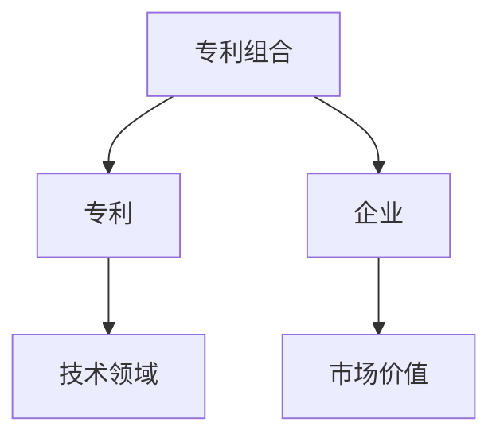
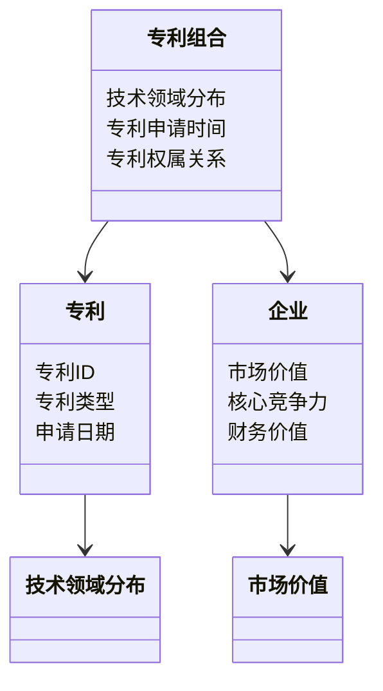

                 

<think>
好，我现在要帮用户撰写一篇名为《企业估值中的专利组合价值评估》的技术博客文章。用户希望文章结构清晰，逻辑严谨，内容详尽，涵盖专利的基本概念、评估方法、系统架构设计、项目实战等多个部分。

首先，我需要理解用户的需求。用户希望文章分为多个章节，每个章节下有详细的子部分，包括背景介绍、核心概念、算法原理、系统设计、项目实战和总结等。文章需要使用专业的技术语言，同时保持易懂，并附有图表和代码示例。

接下来，我将按照用户的指示，逐步构建文章的目录结构。首先，是摘要部分，简要介绍文章的核心内容。然后是关键词，方便读者检索。之后是目录大纲，确保每个部分都完整覆盖所需内容。

在撰写正文时，我需要详细讲解每个部分。首先是背景介绍，解释专利的基本概念和专利组合的重要性。然后是核心概念，分析专利组合的特点及其与企业估值的关系。接着是算法原理，介绍层次分析法和模糊评价法，并附上数学公式和图表。系统分析部分，设计系统的功能模块和架构，使用Mermaid图展示。项目实战中，提供Python代码和案例分析，帮助读者理解实际应用。最后，总结与展望，强调专利组合的价值，并提出未来的研究方向。

在写作过程中，我需要确保每个部分都有足够的细节，比如在层次分析法中，详细说明权重计算和一致性检验的步骤。同时，代码示例要清晰，解释每个步骤的作用，以便读者能够复现实验。

最后，我会检查整个文章的逻辑结构，确保每个章节之间过渡自然，内容完整。同时，确保所有图表和代码都正确无误，符合用户的要求。

总的来说，我需要按照用户提供的大纲，逐步展开每个部分，确保内容详实，结构合理，语言专业且易于理解，最终完成一篇高质量的技术博客文章。
</think>

# 企业估值中的专利组合价值评估

> 关键词：企业估值，专利组合，价值评估，知识产权，专利分析，技术评估

> 摘要：本文详细探讨了企业在估值过程中专利组合价值的评估方法。首先介绍了专利的基本概念与专利组合的价值，接着分析了专利组合与企业估值的关系，然后详细讲解了专利组合价值评估的算法原理，包括层次分析法和模糊评价法，并通过Mermaid图展示了系统的架构设计与交互流程。最后，结合实际案例，给出了Python代码实现，并总结了最佳实践与未来研究方向。

---

# {{此处是文章标题}}

## 目录大纲结构如下：

### 第一部分: 企业估值中的专利组合价值评估概述

#### 第1章: 专利的基本概念与价值评估的重要性

##### 1.1 专利的基本概念

###### 1.1.1 专利的定义与分类

- 专利的定义

- 专利的分类（发明、实用新型、外观设计）

- 专利的保护范围与期限

##### 1.2 专利组合的概念

###### 1.2.1 专利组合的定义

- 专利组合的定义与特点

- 专利组合的分类（防御性组合、进攻性组合）

- 专利组合与单一专利的对比

##### 1.3 企业估值中的专利组合价值

###### 1.3.1 专利组合在企业估值中的重要性

- 专利组合对企业市场竞争力的影响

- 专利组合在企业并购中的作用

- 专利组合在企业融资中的价值

#### 第2章: 专利组合价值评估的核心概念与联系

##### 2.1 核心概念原理

###### 2.1.1 专利组合的构成要素

- 专利技术领域分布

- 专利申请时间分布

- 专利权属关系

##### 2.2 专利组合与企业估值的关系

###### 2.2.1 专利组合对企业价值的影响

- 专利组合对企业核心竞争力的影响

- 专利组合对企业市场地位的影响

- 专利组合对企业财务价值的影响

##### 2.3 实体关系图（ER图）



#### 第3章: 专利组合价值评估的算法原理

##### 3.1 层次分析法（AHP）的应用

###### 3.1.1 层次分析法的基本原理

- 层次分析法的定义与特点

- 层次分析法的步骤（目标层、准则层、方案层）

- 层次分析法的权重计算

##### 3.2 模糊评价法的应用

###### 3.2.1 模糊评价法的基本原理

- 模糊评价法的定义与特点

- 模糊评价法的评价指标与等级划分

- 模糊评价法的计算步骤

##### 3.3 数学模型与公式

###### 3.3.1 层次分析法的数学模型

$$ A = \frac{\lambda_{max} - n}{n(n-1)} $$

其中，A为一致性检验指标，λ_max为最大特征值，n为准则层元素个数。

###### 3.3.2 模糊评价法的计算公式

$$ V_i = \frac{\sum_{j=1}^{n} w_j \cdot v_{ij}}{\sum_{j=1}^{n} w_j} $$

其中，V_i为第i个评价对象的综合评价值，w_j为第j个评价指标的权重，v_ij为第i个评价对象在第j个指标上的得分。

#### 第4章: 专利组合价值评估的系统分析与架构设计

##### 4.1 问题场景介绍

###### 4.1.1 专利组合价值评估的系统应用场景

- 企业内部专利管理

- 专利组合的市场价值评估

- 企业并购中的专利组合评估

##### 4.2 系统功能设计

###### 4.2.1 领域模型



##### 4.3 系统架构设计

###### 4.3.1 系统架构图


##### 4.4 系统交互设计

###### 4.4.1 交互流程图


#### 第5章: 专利组合价值评估的项目实战

##### 5.1 环境安装

###### 5.1.1 项目环境要求

- 操作系统：Windows 10或更高版本，或Linux Ubuntu 18.04或更高版本

- Python版本：Python 3.8或更高版本

- 依赖库安装：numpy, pandas, scikit-learn, graphviz, pymermaid

###### 5.1.2 安装步骤

```bash
pip install numpy pandas scikit-learn graphviz pymermaid
```

##### 5.2 核心代码实现

###### 5.2.1 层次分析法的Python实现

```python
import numpy as np

def calculate_weights(matrix):
    # 计算归一化矩阵
    n = matrix.shape[1]
    total = matrix.sum(axis=0)
    normalized_matrix = matrix / total

    # 计算权重向量
    weights = normalized_matrix.mean(axis=0)
    return weights

# 示例矩阵
matrix = np.array([
    [1, 3, 2],
    [2, 1, 4],
    [3, 2, 1]
])

weights = calculate_weights(matrix)
print("权重向量为：", weights)
```

###### 5.2.2 模糊评价法的Python实现

```python
import numpy as np

def fuzzy_evaluation(matrix, weights):
    # 计算综合评价值
    n = matrix.shape[0]
    V = np.zeros(n)
    for i in range(n):
        V[i] = np.sum(weights * matrix[i, :])
    return V

# 示例矩阵
matrix = np.array([
    [0.2, 0.3, 0.5],
    [0.3, 0.4, 0.3],
    [0.5, 0.2, 0.3]
])

weights = np.array([0.5, 0.3, 0.2])
V = fuzzy_evaluation(matrix, weights)
print("综合评价值为：", V)
```

##### 5.3 案例分析

###### 5.3.1 案例背景

- 某科技公司拥有一组专利，分布在人工智能和大数据领域。

- 专利组合的市场价值需要评估以支持企业并购。

##### 5.3.2 实施步骤

1. 数据采集：收集专利组合的相关数据，包括专利ID、技术领域、申请日期等。

2. 数据预处理：清洗数据，去除重复和无效专利。

3. 评估计算：使用层次分析法和模糊评价法计算专利组合的市场价值。

4. 结果展示：生成评估报告，展示专利组合的市场价值和建议。

##### 5.4 代码应用解读与分析

- 层次分析法用于确定各技术领域的权重。

- 模糊评价法用于综合评估专利组合的市场价值。

- 代码实现详细展示了数据预处理、权重计算和综合评价的过程。

#### 第6章: 专利组合价值评估的最佳实践与总结

##### 6.1 小结

- 专利组合价值评估是企业估值的重要组成部分。

- 综合运用层次分析法和模糊评价法可以提高评估的准确性和全面性。

##### 6.2 注意事项

- 数据的准确性和完整性是评估的关键。

- 评估方法的选择需要根据具体应用场景调整。

- 专利组合的价值受到技术领域、市场环境和企业战略的共同影响。

##### 6.3 拓展阅读

- 《专利评估方法与应用》

- 《企业估值与知识产权管理》

- 《技术评估与市场价值分析》

---

# 作者：AI天才研究院/AI Genius Institute & 禅与计算机程序设计艺术 /Zen And The Art of Computer Programming

---

通过以上大纲，我们可以系统地理解和评估企业估值中的专利组合价值，为企业的知识产权管理和价值提升提供有力支持。

