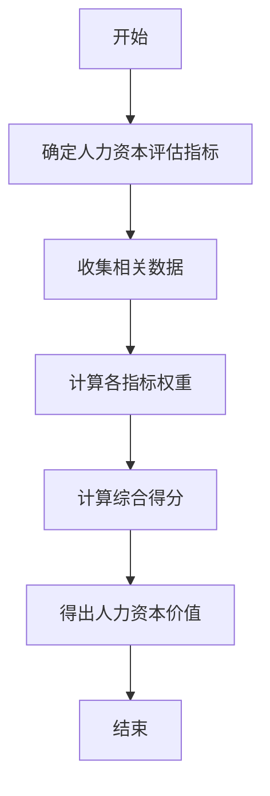
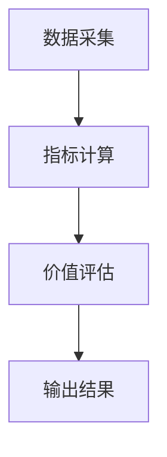

                 


# 《企业估值中的人力资本价值法》

---

## 关键词

- 企业估值
- 人力资本
- 价值评估
- 人力资源管理
- 经济模型

---

## 摘要

在企业估值的传统方法中，财务指标和资产价值往往被过度关注，而忽略了人力资本在企业价值创造中的核心作用。本文通过系统地分析人力资本价值法的理论基础、方法论及其在实际企业估值中的应用，揭示了人力资本在企业价值评估中的独特地位和作用。文章从人力资本的定义、特征、与传统资本的关系入手，构建了基于人力资本价值评估的数学模型，并通过实际案例展示了该方法的应用过程和效果。最后，本文总结了人力资本价值法的优势及未来的发展方向，为企业估值提供了新的视角和方法。

---

## 目录大纲

---

## 第一部分：企业估值与人力资本价值法概述

### 第1章：人力资本与企业估值的背景介绍

#### 1.1 人力资本的定义与特征

- 1.1.1 人力资本的核心概念

  - 人力资本的定义：人力资本是指员工的知识、技能、经验和创新能力的总和，是企业创造价值的重要源泉。

  - 人力资本的特征：可流动性、可提升性、主观性、长期性。

- 1.1.2 人力资本与传统资本的对比

  - 传统资本：如固定资产、流动资产等，具有客观性和可量化性。

  - 人力资本：具有主观性和不可完全量化的特征，但对企业的长期价值创造起决定性作用。

- 1.1.3 人力资本在企业价值中的作用

  - 通过员工的创新能力、协作效率和问题解决能力，直接影响企业的市场竞争力和盈利能力。

  - 人力资本的投入与企业绩效的正相关关系。

#### 1.2 企业估值的传统方法与局限性

- 1.2.1 传统企业估值方法概述

  - 基于财务指标的方法：如市盈率、市净率、股息率等。

  - 基于资产价值的方法：如重置成本法、市场价值法。

- 1.2.2 传统方法的局限性

  - 忽视了人力资本在企业价值中的核心作用。

  - 无法全面反映企业未来的盈利能力和发展潜力。

- 1.2.3 引入人力资本价值法的必要性

  - 提供更全面的企业价值评估方法。

  - 帮助企业在人才管理和战略规划中做出更科学的决策。

#### 1.3 人力资本价值法的理论基础

- 1.3.1 经济学视角下的人力资本

  - 人力资本投资理论：舒尔茨的《教育的经济论》。

- 1.3.2 管理学视角下的人力资本

  - 人力资源管理中的价值评估。

- 1.3.3 人力资源管理中的价值评估

  - 员工价值主张（ EVP ）。

---

### 第2章：人力资本价值法的核心概念与联系

#### 2.1 人力资本价值法的原理

- 2.1.1 人力资本价值的构成要素

  - 员工的知识储备。

  - 员工的技能水平。

  - 员工的创新能力。

  - 员工的团队协作能力。

- 2.1.2 人力资本价值的评估维度

  - 个体贡献度。

  - 团队贡献度。

  - 组织文化影响。

- 2.1.3 人力资本价值与企业绩效的关系

  - 通过回归分析，建立人力资本与企业绩效的数学模型。

#### 2.2 核心概念的ER实体关系图

```mermaid
er
    entity: 人力资本
    entity: 企业
    entity: 员工
    entity: 企业价值
    entity: 评估指标
    entity: 评估结果
    entity: 价值提升策略
    relation: 企业 - 实现 人力资本
    relation: 人力资本 - 影响 企业价值
    relation: 评估指标 - 决定 评估结果
    relation: 评估结果 - 提出 价值提升策略
```

---

### 第3章：人力资本价值法的算法原理

#### 3.1 人力资本价值评估的数学模型

- 3.1.1 基于回归分析的模型

$$ y = \beta_0 + \beta_1x_1 + \beta_2x_2 + \beta_3x_3 + \ldots + \beta_nx_n + \epsilon $$

  - 其中，$y$ 是企业价值，$x_i$ 是各个人力资本评估指标，$\beta_i$ 是回归系数，$\epsilon$ 是误差项。

- 3.1.2 基于层次分析法的模型

  - 层次分析法（AHP）是一种定性和定量相结合的决策分析方法。

  - 应用AHP确定各人力资本评估指标的权重，并计算综合得分。

#### 3.2 算法流程图



---

## 第二部分：系统分析与架构设计

### 第4章：系统功能设计

#### 4.1 系统功能模块

- 4.1.1 数据采集模块

  - 收集员工的学历、工作经验、技能认证等数据。

- 4.1.2 指标计算模块

  - 计算个体贡献度、团队贡献度和组织文化影响。

- 4.1.3 价值评估模块

  - 应用回归分析或层次分析法计算综合得分。

#### 4.2 系统功能流程图



---

### 第5章：系统架构设计

#### 5.1 系统架构图


---

### 第6章：系统接口设计

#### 6.1 输入接口

- 员工信息输入接口。

- 评估指标输入接口。

#### 6.2 输出接口

- 综合得分输出接口。

- 价值提升策略输出接口。

---

## 第三部分：项目实战

### 第7章：项目实战

#### 7.1 环境配置

- 安装Python和相关库（如pandas、numpy、scikit-learn）。

#### 7.2 核心代码实现

```python
import pandas as pd
from sklearn.linear_model import LinearRegression
from sklearn.metrics import r2_score

# 数据加载
data = pd.read_csv('human_capital.csv')

# 模型训练
model = LinearRegression()
model.fit(data[['experience', 'education', 'skills']], data['value'])

# 模型预测
predictions = model.predict(data[['experience', 'education', 'skills']])
print("R² Score:", r2_score(data['value'], predictions))
```

#### 7.3 案例分析

- 通过具体案例分析，展示人力资本价值法的实际应用效果。

#### 7.4 结果解读

- 解读模型的输出结果，分析人力资本对企业发展的影响。

---

## 第四部分：总结与展望

### 第8章：总结与展望

#### 8.1 全文总结

- 回顾全文，总结人力资本价值法的核心内容和实际应用价值。

#### 8.2 未来展望

- 探讨人力资本价值法的未来发展，包括与其他估值方法的结合和优化。

#### 8.3 最佳实践 tips

- 提供实际操作中需要注意的事项和建议。

---

## 作者：AI天才研究院/AI Genius Institute & 禅与计算机程序设计艺术 /Zen And The Art of Computer Programming

---

通过以上目录结构，文章将从理论到实践，系统地探讨企业估值中的人力资本价值法，为读者提供全面而深入的指导。

