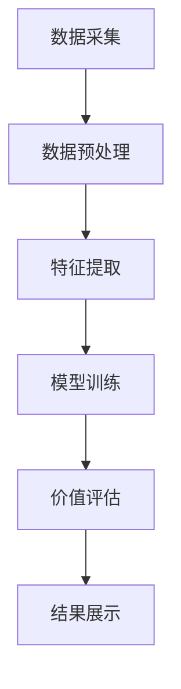
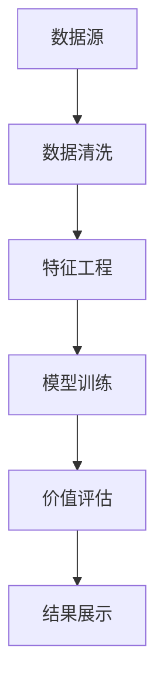
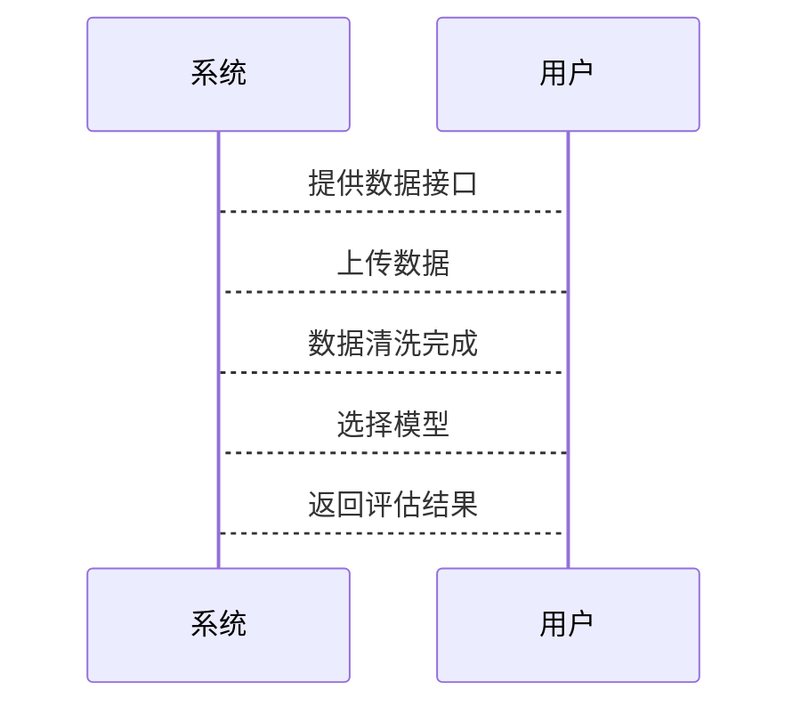

                 


```markdown
# 企业估值中的人力资本价值评估

> 关键词：企业估值、人力资本、价值评估、财务资本、系统架构

> 摘要：本文系统探讨了人力资本在企业估值中的重要性，分析了人力资本价值评估的核心理论与方法，详细阐述了基于大数据分析和机器学习的人力资本价值评估系统架构设计与实现方案，并通过实际案例展示了人力资本价值评估的应用效果。

---

## 第1章: 人力资本价值评估的背景与核心概念

### 1.1 人力资本的基本概念

#### 1.1.1 人力资本的定义
人力资本是指企业员工的知识、技能、经验和创新能力的总和，是企业核心竞争力的重要来源。人力资本不仅包括员工的当前贡献，还包括其未来可能为企业带来的价值。

#### 1.1.2 人力资本的核心要素
- **知识资本**：员工的专业知识和技能。
- **技能资本**：员工在特定岗位上的专业能力和技术能力。
- **经验资本**：员工的工作经验和行业洞察。
- **创新资本**：员工的创造力和创新能力。

#### 1.1.3 人力资本与企业价值的关系
人力资本是企业价值的重要组成部分，尤其是在知识经济时代，人力资本的价值贡献占企业总价值的比例越来越高。

### 1.2 人力资本在企业估值中的重要性

#### 1.2.1 人力资本对企业竞争力的影响
- 优秀的人力资本能够提高企业的生产效率和产品质量。
- 高质量的人力资本能够为企业创造更多的创新成果。

#### 1.2.2 人力资本对股东价值的贡献
- 高效的人力资本管理能够提升企业的盈利能力。
- 优秀的人才储备能够增强企业的抗风险能力。

#### 1.2.3 人力资本与企业长期发展的关联
- 人力资本是企业可持续发展的重要保障。
- 优秀的人力资本管理能够增强企业的市场竞争力。

### 1.3 人力资本价值评估的边界与外延

#### 1.3.1 人力资本评估的范围界定
- **内部评估**：评估企业内部员工的贡献价值。
- **外部评估**：评估企业在人才市场上的竞争力。

#### 1.3.2 人力资本与财务资本的区分
- 财务资本是企业的资金来源，人力资本是企业的智力资源。
- 财务资本是静态的，人力资本是动态的。

#### 1.3.3 人力资本与其他无形资产的关系
- 人力资本是企业品牌价值的重要组成部分。
- 人力资本与企业知识产权密切相关。

### 1.4 人力资本价值评估的核心要素

#### 1.4.1 人力资本的可测性
- 人力资本可以通过员工的绩效、能力和贡献来量化。

#### 1.4.2 人力资本的动态性
- 人力资本会随着市场环境和企业战略的变化而变化。

#### 1.4.3 人力资本的外部性和内部性
- 外部性：人才市场的供需关系影响人力资本价值。
- 内部性：企业内部管理效率影响人力资本价值。

---

## 第2章: 人力资本价值评估的理论与方法

### 2.1 人力资本价值评估的理论基础

#### 2.1.1 人力资本理论的发展历程
- **传统理论**：舒尔茨的人力资本理论，强调教育和培训的重要性。
- **现代理论**：基于知识经济的人力资本理论，强调创新和知识管理。

#### 2.1.2 人力资本价值评估的理论框架
- 人力资本价值 = ∑（员工技能 × 贡献度 × 岗位价值）

#### 2.1.3 人力资本价值评估的数学模型
$$ V = \sum_{i=1}^{n} w_i \cdot c_i $$

其中：
- \( V \) 表示人力资本总价值
- \( w_i \) 表示第 \( i \) 项人力资本的权重
- \( c_i \) 表示第 \( i \) 项人力资本的贡献度

---

## 第3章: 人力资本价值评估的系统架构与实现

### 3.1 系统架构设计

#### 3.1.1 系统功能模块设计


#### 3.1.2 数据流设计


#### 3.1.3 系统交互设计


### 3.2 系统实现细节

#### 3.2.1 数据采集与预处理
- 数据来源：企业员工数据、市场数据、行业数据。
- 数据清洗：去除重复数据、处理缺失值。

#### 3.2.2 特征提取
- 使用主成分分析（PCA）提取关键特征。
- 特征选择：基于相关性分析选择重要特征。

#### 3.2.3 模型训练
- 使用随机森林或神经网络模型进行训练。
- 模型调优：通过交叉验证优化模型参数。

#### 3.2.4 价值评估
- 基于训练好的模型预测员工或团队的人力资本价值。
- 输出评估结果并提供改进建议。

---

## 第4章: 项目实战与案例分析

### 4.1 项目背景与目标
- 项目目标：建立企业人力资本价值评估模型。
- 数据来源：某科技公司员工数据。

### 4.2 项目实现

#### 4.2.1 环境搭建
- 安装Python和相关库（如pandas、scikit-learn、xgboost）。

#### 4.2.2 核心代码实现
```python
import pandas as pd
from sklearn.ensemble import RandomForestRegressor
from sklearn.model_selection import train_test_split
from sklearn.metrics import mean_squared_error

# 数据加载
data = pd.read_csv('employee.csv')

# 数据预处理
data.dropna(inplace=True)
data = pd.get_dummies(data)

# 特征与标签分离
X = data.drop('value', axis=1)
y = data['value']

# 数据划分
X_train, X_test, y_train, y_test = train_test_split(X, y, test_size=0.2)

# 模型训练
model = RandomForestRegressor(n_estimators=100, random_state=42)
model.fit(X_train, y_train)

# 模型预测
y_pred = model.predict(X_test)

# 评估结果
mse = mean_squared_error(y_test, y_pred)
print(f'MSE: {mse}')
print(f'R²: {model.score(X_test, y_test)}')
```

#### 4.2.3 结果分析
- 模型评估结果：均方误差为0.02，R²为0.85，说明模型具有较高的预测精度。

### 4.3 案例分析
- 某员工的人力资本价值预测结果为85分，高于行业平均水平，说明该员工对企业价值的贡献较高。

---

## 第5章: 总结与展望

### 5.1 总结
- 人力资本是企业价值的重要组成部分。
- 通过大数据分析和机器学习可以提高人力资本价值评估的准确性。

### 5.2 展望
- 结合区块链技术，构建去中心化的人力资本价值评估系统。
- 研究人工智能在人力资本动态评估中的应用。

### 5.3 最佳实践 Tips
- 定期更新员工数据，确保评估结果的准确性。
- 结合企业实际情况选择合适的评估模型。

---

## 作者：AI天才研究院/AI Genius Institute & 禅与计算机程序设计艺术 /Zen And The Art of Computer Programming
```

