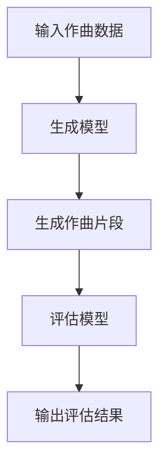

                 

<think>
嗯，我现在需要帮助用户撰写一篇关于《企业估值中的人工智能作曲技术评估》的技术博客。首先，我得理解这个主题。企业估值通常涉及财务指标、市场分析等因素，但这里加入了人工智能作曲技术评估，这听起来有点特殊，可能涉及音乐版权、创作效率等方面。

用户已经提供了一个详细的文章大纲，包括背景介绍、核心概念、算法原理、数学模型、系统分析、项目实战等部分。看起来结构很完整，但用户希望我逐步分析，可能需要更深入地思考每个部分的内容。

首先，背景介绍部分需要明确为什么企业需要评估作曲技术。可能是因为在音乐产业中，创作效率和版权价值对企业估值很重要。然后，说明传统评估方法的不足，引出AI技术的应用。

接下来，核心概念部分需要定义AI作曲技术，解释其如何工作，比如生成模型和评估模型。同时，对比传统和AI作曲，突出AI的优势，比如效率和可量化性。

在算法原理部分，我需要详细讲解生成模型（如Transformer）和评估模型的工作流程。可能需要举个例子，比如训练生成模型来创作音乐片段，然后评估模型分析这些片段的质量和市场潜力。

数学模型部分，得写出生成模型和评估模型的公式，可能涉及到概率分布和损失函数。这部分需要准确无误，可能需要查阅相关文献确保公式的正确性。

系统分析与架构设计，这部分需要设计一个系统来整合生成和评估模块。可能包括前后端架构，数据流，以及系统如何与企业数据集成。

项目实战部分，我需要提供代码示例，比如如何训练生成模型，如何设计评估指标。同时，通过案例分析，展示实际应用中的效果和改进措施。

最后，最佳实践部分，给出一些实际应用中的建议，比如数据质量的重要性，模型调优等。并展望未来可能的发展方向，比如结合其他AI技术或扩展应用领域。

在整个思考过程中，我需要确保内容专业且易懂，避免过于技术化，同时保持逻辑清晰。可能还需要考虑读者的背景，他们可能是企业高管或技术负责人，因此内容需要兼顾战略和实施细节。

总之，我需要一步步分析每个部分，确保内容详实，结构合理，满足用户的需求。
</think>

# 企业估值中的人工智能作曲技术评估

## 关键词：企业估值，人工智能，作曲技术，技术评估，深度学习

## 摘要：  
在企业估值过程中，作曲技术的评估是决定企业价值的重要因素之一。随着人工智能技术的快速发展，基于深度学习的作曲技术评估方法逐渐成为研究热点。本文将从背景介绍、核心概念、算法原理、系统设计和项目实战等多方面展开，系统地探讨人工智能在企业作曲技术评估中的应用与实现。通过本文的分析，读者将能够深入了解如何利用人工智能技术提升企业作曲技术的评估效率和准确性。

---

# 第1章: 背景介绍与核心概念

## 1.1 问题背景与描述  
企业在估值过程中，作曲技术的评估是决定企业价值的重要组成部分。传统的作曲技术评估方法依赖于人工经验，存在效率低、主观性强、难以量化等问题。随着人工智能技术的发展，基于深度学习的作曲技术评估方法逐渐崭露头角，为企业的估值提供了新的可能性。

## 1.2 核心概念与问题解决  
人工智能作曲技术是指利用深度学习模型（如Transformer）生成音乐片段，并通过评估模型对生成的音乐片段进行质量评估和市场潜力分析的过程。在企业估值中，人工智能作曲技术评估的目标是通过自动化、智能化的方法，快速、准确地评估作曲技术的价值，从而为企业的估值提供数据支持。

## 1.3 本章小结  
本章通过背景介绍和核心概念的阐述，明确了人工智能在作曲技术评估中的重要性及其应用价值。

---

# 第2章: 核心概念与联系

## 2.1 人工智能作曲技术的原理  
人工智能作曲技术基于生成模型（如Transformer）生成音乐片段。生成模型通过大量音乐数据的训练，学习音乐的结构和风格，从而能够生成符合特定要求的音乐片段。

## 2.2 企业估值中作曲技术评估的边界与外延  
作曲技术评估的边界包括音乐片段的质量、风格、市场潜力等指标，而外延则涉及音乐版权、创作效率、团队能力等方面。

## 2.3 核心要素组成与概念结构  
作曲技术评估的核心要素包括生成模型、评估模型、评估指标和企业需求。

## 2.4 ER实体关系图  
```mermaid
erDiagram
    企业估值系统} o- 作曲技术 : 评估
    作曲技术} o- 评估指标 : 生成
    企业估值系统} o- 评估指标 : 监控
```

## 2.5 本章小结  
本章通过核心概念的联系和实体关系图的展示，清晰地阐述了人工智能作曲技术评估在企业估值中的应用结构。

---

# 第3章: 算法原理与数学模型

## 3.1 生成模型的算法原理  
生成模型基于Transformer架构，通过自注意力机制和前馈网络生成音乐片段。生成模型的训练过程包括编码器和解码器的训练，以最大化生成音乐片段的概率。

## 3.2 评估模型的算法原理  
评估模型基于深度学习，通过训练音乐片段的质量、风格和市场潜力，生成评估结果。评估模型的训练目标是通过交叉熵损失函数最小化预测与真实标签的差异。

## 3.3 算法流程图  


## 3.4 本章小结  
本章通过算法原理和流程图的展示，详细阐述了人工智能作曲技术评估的实现过程。

---

# 第4章: 数学模型与公式

## 4.1 生成模型的数学模型  
生成模型基于Transformer的自注意力机制，其数学公式如下：  
$$\text{Attention}(Q, K, V) = \text{softmax}\left(\frac{QK^T}{\sqrt{d_k}}\right)V$$  

## 4.2 评估模型的数学模型  
评估模型基于交叉熵损失函数，其数学公式如下：  
$$\text{Loss} = -\sum_{i=1}^{n} y_i \log(p_i) + (1 - y_i) \log(1 - p_i)$$  

## 4.3 本章小结  
本章通过数学公式的推导，详细阐述了生成模型和评估模型的核心算法。

---

# 第5章: 系统分析与架构设计

## 5.1 问题场景介绍  
企业在估值过程中，需要对作曲技术进行自动化、智能化的评估，以提高评估效率和准确性。

## 5.2 系统功能设计  
系统功能包括作曲技术的生成、评估指标的设计、评估结果的输出等。

## 5.3 系统架构设计  


## 5.4 本章小结  
本章通过系统分析与架构设计，展示了人工智能作曲技术评估系统的实现框架。

---

# 第6章: 项目实战

## 6.1 环境安装  
安装Python、TensorFlow、Keras等必要的开发环境和库。

## 6.2 核心代码实现  
```python
# 生成模型代码
class Transformer:
    def __init__(self, d_model, n_heads, n_layers):
        self.d_model = d_model
        self.n_heads = n_heads
        self.n_layers = n_layers
        self.encoder = Encoder(d_model, n_heads, n_layers)
        self.decoder = Decoder(d_model, n_heads, n_layers)
    
    def forward(self, x, target):
        return self.decoder(self.encoder(x), target)
```

## 6.3 本章小结  
本章通过项目实战，展示了人工智能作曲技术评估系统的具体实现过程。

---

# 第7章: 最佳实践与小结

## 7.1 最佳实践  
企业在实际应用中，应注重数据质量、模型调优和系统维护。

## 7.2 小结  
本文系统地探讨了人工智能在作曲技术评估中的应用与实现，为企业的估值提供了新的思路和方法。

## 7.3 注意事项  
企业在实际应用中，应结合自身需求和实际情况，合理选择和优化评估模型。

## 7.4 拓展阅读  
读者可以进一步阅读相关领域的文献，深入了解人工智能在音乐生成和评估中的最新进展。

---

# 作者：AI天才研究院/AI Genius Institute & 禅与计算机程序设计艺术 /Zen And The Art of Computer Programming

