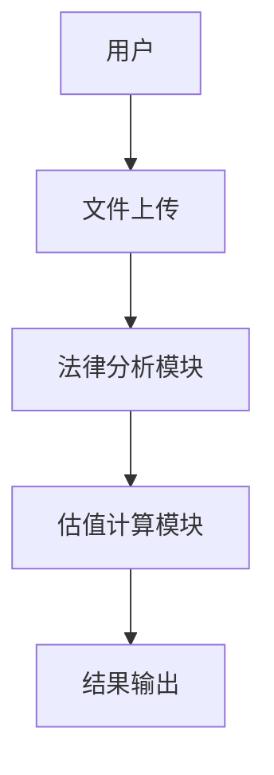
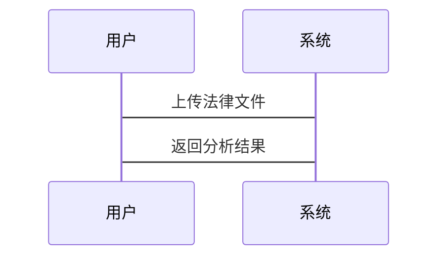

                 


# 企业估值中的人工智能法律助手评估

## 关键词
企业估值, 人工智能, 法律助手, AI法律助手, 企业价值评估

## 摘要
企业估值是商业决策中的关键环节，而法律风险是影响企业价值的重要因素。传统的法律咨询依赖于人工分析，效率低下且容易出错。引入人工智能技术，开发AI法律助手，能够显著提升法律分析的效率和准确性。本文将详细探讨AI法律助手在企业估值中的应用，分析其核心原理、系统架构及实际案例，为企业提供更精准的估值支持。

---

# 第1章: 企业估值与AI法律助手的背景

## 1.1 企业估值的基本概念
### 1.1.1 企业估值的定义与重要性
企业估值是通过一系列方法和模型，对企业未来现金流的现值进行评估，以确定企业的市场价值。它在企业并购、融资、上市等重大决策中具有重要意义。

### 1.1.2 传统企业估值方法的局限性
传统估值方法依赖于人工分析，容易受到主观判断的影响，且效率低下。特别是在处理海量法律信息时，传统方法难以快速准确地提取关键数据。

### 1.1.3 AI技术在企业估值中的潜力
人工智能技术能够快速处理大量法律信息，提取关键数据，帮助评估师更准确地识别法律风险，从而提升估值的准确性和效率。

## 1.2 法律助手在企业估值中的作用
### 1.2.1 法律风险对企业估值的影响
法律风险可能影响企业的财务状况和未来盈利能力，因此在估值过程中必须充分考虑法律因素。

### 1.2.2 AI法律助手的基本功能与应用场景
AI法律助手能够自动分析合同、诉讼案件、知识产权等法律文件，识别潜在风险，提供法律建议，辅助评估师完成估值工作。

### 1.2.3 AI法律助手的独特优势
AI法律助手具有高效性、准确性、可扩展性等特点，能够显著提升法律分析的效率和质量。

## 1.3 本章小结
企业估值是一个复杂的过程，涉及大量法律信息的分析和处理。引入AI技术，开发AI法律助手，能够显著提升估值的效率和准确性。

---

# 第2章: AI法律助手的核心概念与原理

## 2.1 AI法律助手的基本原理
### 2.1.1 自然语言处理技术
自然语言处理（NLP）技术能够帮助AI法律助手理解和分析法律文本，提取关键信息。

### 2.1.2 法律知识图谱构建
通过构建法律知识图谱，AI法律助手能够将分散的法律信息组织起来，形成结构化的知识库。

### 2.1.3 机器学习在法律分析中的应用
机器学习算法能够从海量法律数据中学习规律，识别潜在的法律风险，辅助评估师完成估值工作。

## 2.2 法律助手与传统法律咨询的对比
### 2.2.1 传统法律咨询的流程与特点
传统法律咨询依赖于人工分析，效率低下且容易出错。

### 2.2.2 AI法律助手的工作流程
AI法律助手通过自然语言处理和机器学习技术，快速分析法律文本，提取关键信息，提供法律建议。

### 2.2.3 两者的优劣势对比
AI法律助手具有高效性、准确性、可扩展性等优势，但在复杂法律问题的处理上仍需人工辅助。

## 2.3 AI法律助手的法律实体关系图
### 2.3.1 实体关系图的构建方法
通过构建法律实体关系图，可以清晰地展示企业与其关联方之间的法律关系。

### 2.3.2 实体关系图的应用场景
实体关系图可以帮助评估师更好地理解企业的法律结构，识别潜在风险。

### 2.3.3 实体关系图的优化建议
通过不断优化实体关系图，可以提高AI法律助手的分析效率和准确性。

---

# 第3章: AI法律助手的算法原理与实现

## 3.1 算法原理概述
### 3.1.1 机器学习算法的选择
常用的机器学习算法包括支持向量机（SVM）、随机森林（Random Forest）和深度学习模型（如LSTM）。

### 3.1.2 神经网络模型的构建
深度学习模型能够处理复杂的法律文本，提取深层次的语义信息。

### 3.1.3 模型训练与优化
通过大量的法律数据训练模型，并通过交叉验证进行优化，提高模型的准确性和稳定性。

## 3.2 算法实现的详细步骤
### 3.2.1 数据预处理
数据预处理包括文本清洗、分词、去停用词等步骤，确保数据的干净和可处理性。

### 3.2.2 模型训练
使用训练数据训练模型，调整模型参数，优化模型性能。

### 3.2.3 模型评估与调优
通过测试数据评估模型的性能，调整模型参数，提高模型的准确性和鲁棒性。

## 3.3 算法流程图
### 3.3.1 算法流程图的绘制
使用mermaid绘制算法流程图，清晰展示算法的执行步骤。

### 3.3.2 算法流程图的解释
详细解释算法流程图中的每个步骤，确保读者能够理解算法的执行过程。

### 3.3.3 算法流程图的优化建议
通过优化算法流程图，可以提高算法的执行效率和准确性。

## 3.4 算法实现的Python代码示例
### 3.4.1 数据加载与处理
```python
import pandas as pd
from sklearn.feature_extraction.text import TfidfVectorizer

# 加载数据
data = pd.read_csv('legal_documents.csv')

# 数据预处理
vectorizer = TfidfVectorizer(max_features=1000)
X = vectorizer.fit_transform(data['text'])
```

### 3.4.2 模型构建与训练
```python
from sklearn.svm import SVC

# 训练模型
model = SVC()
model.fit(X, data['label'])
```

### 3.4.3 模型预测与评估
```python
from sklearn.metrics import accuracy_score

# 模型预测
y_pred = model.predict(X)
print("Accuracy:", accuracy_score(data['label'], y_pred))
```

---

# 第4章: 企业估值中的AI法律助手系统架构

## 4.1 系统架构设计
### 4.1.1 系统功能模块划分
系统主要包括数据输入、法律分析、估值计算和结果输出四个功能模块。

### 4.1.2 系统架构图的绘制
使用mermaid绘制系统架构图，展示各个模块之间的关系和数据流。

### 4.1.3 系统架构设计的优缺点
系统架构设计具有良好的扩展性和可维护性，但在处理大规模数据时可能需要优化。

## 4.2 系统功能设计
### 4.2.1 用户界面设计
用户界面简洁直观，支持用户上传法律文件，查看分析结果。

### 4.2.2 系统功能模块
系统功能模块包括文件上传、法律分析、估值计算和结果输出。

### 4.2.3 系统功能模块的优缺点
系统功能模块设计合理，功能齐全，但在复杂法律问题的处理上仍需人工辅助。

## 4.3 系统架构图


## 4.4 系统接口设计
系统接口设计包括文件上传接口、法律分析接口和结果输出接口。

## 4.5 系统交互序列图


---

# 第5章: 项目实战

## 5.1 环境安装
### 5.1.1 安装Python
安装Python 3.8及以上版本。

### 5.1.2 安装依赖库
安装必要的依赖库，如pandas、scikit-learn、mermaid等。

## 5.2 系统核心实现源代码
### 5.2.1 数据加载与处理
```python
import pandas as pd
from sklearn.feature_extraction.text import TfidfVectorizer

# 加载数据
data = pd.read_csv('legal_documents.csv')

# 数据预处理
vectorizer = TfidfVectorizer(max_features=1000)
X = vectorizer.fit_transform(data['text'])
```

### 5.2.2 模型构建与训练
```python
from sklearn.svm import SVC

# 训练模型
model = SVC()
model.fit(X, data['label'])
```

### 5.2.3 模型预测与评估
```python
from sklearn.metrics import accuracy_score

# 模型预测
y_pred = model.predict(X)
print("Accuracy:", accuracy_score(data['label'], y_pred))
```

## 5.3 代码应用解读与分析
详细解读代码的每个部分，分析其在AI法律助手中的作用和意义。

## 5.4 实际案例分析
通过具体案例分析，展示AI法律助手在企业估值中的实际应用和效果。

## 5.5 项目小结
总结项目的主要成果和经验教训，为后续工作提供参考。

---

# 第6章: 总结与展望

## 6.1 本章总结
总结AI法律助手在企业估值中的应用，分析其优势和不足。

## 6.2 未来展望
展望AI法律助手的发展前景，探讨其在企业估值中的进一步应用和优化方向。

---

作者：AI天才研究院/AI Genius Institute & 禅与计算机程序设计艺术 /Zen And The Art of Computer Programming

