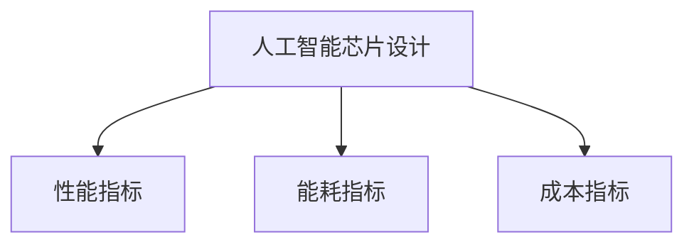

                 


# 企业估值中的人工智能芯片设计评估

## 关键词：
企业估值, 人工智能芯片, 芯片设计评估, 算法复杂度, 系统架构, 项目实战

## 摘要：
在企业估值的过程中，人工智能芯片的设计评估具有重要意义。本文将从背景、核心概念、算法原理、系统架构设计、项目实战等多方面详细探讨如何利用人工智能技术来优化芯片设计评估过程，从而提升企业估值的准确性和效率。通过实际案例分析和详细的技术实现，本文将为读者提供一个全面的视角，帮助其理解并应用这些技术。

---

# 第1章: 企业估值与人工智能芯片设计评估的背景

## 1.1 企业估值的基本概念

### 1.1.1 企业估值的定义与方法
企业估值是通过对企业的财务状况、市场表现、发展潜力等多方面因素进行综合评估，确定其市场价值的过程。传统的企业估值方法包括DCF模型、可比公司分析等。

### 1.1.2 传统企业估值的局限性
- 数据依赖性强，难以捕捉技术创新带来的潜在价值。
- 评估过程复杂，依赖大量人工分析。
- 无法实时跟踪技术更新对企业价值的影响。

### 1.1.3 人工智能在企业估值中的潜力
人工智能技术可以通过分析海量数据、识别潜在模式，帮助评估师更准确地预测企业价值。

## 1.2 人工智能芯片设计的基本概念

### 1.2.1 芯片设计的基本流程
芯片设计包括需求分析、架构设计、逻辑实现、验证测试等多个阶段。

### 1.2.2 人工智能芯片的独特性
人工智能芯片（如GPU、TPU）专为加速AI计算设计，具有高效并行计算能力。

### 1.2.3 人工智能芯片在企业估值中的应用价值
通过评估芯片性能、功耗、成本等指标，可以更准确地预测企业技术优势和市场竞争力。

## 1.3 人工智能芯片设计评估的必要性

### 1.3.1 企业估值中芯片设计的重要性
芯片性能直接影响企业的技术优势和市场地位。

### 1.3.2 人工智能芯片设计评估的挑战
- 数据复杂性高
- 评估模型的准确性依赖于算法优化
- 算法实现的计算资源需求大

### 1.3.3 人工智能芯片设计评估的未来趋势
随着AI技术的不断发展，芯片设计评估将更加依赖于自动化、智能化的工具。

## 1.4 本章小结
本章从企业估值和人工智能芯片设计的基本概念出发，分析了人工智能技术在企业估值中的潜力，以及芯片设计评估的重要性。接下来的章节将详细探讨人工智能芯片设计评估的核心概念和实现方法。

---

# 第2章: 人工智能芯片设计评估的核心概念

## 2.1 人工智能芯片设计的关键指标

### 2.1.1 性能指标
- 计算能力：单位时间内的计算量
- 并行处理能力：同时处理多个任务的能力

### 2.1.2 能耗指标
- 功耗：芯片运行时的能耗
- 能效比：单位功耗下的计算能力

### 2.1.3 成本指标
- 制造成本：芯片生产成本
- 维护成本：芯片维护和升级成本

## 2.2 人工智能芯片设计评估的核心要素

### 2.2.1 算法复杂度
- 算法的复杂度直接影响芯片的设计需求
- 例如，深度学习算法的复杂度高，需要更高的计算能力

### 2.2.2 芯片架构
- 芯片架构设计决定了其性能和功耗
- 常见架构包括GPU、TPU等

### 2.2.3 数据处理能力
- 数据吞吐量：单位时间内处理的数据量
- 数据传输速度：芯片与外部设备的数据交换速度

## 2.3 人工智能芯片设计评估的边界与外延

### 2.3.1 评估的边界条件
- 评估的范围：芯片设计的哪个阶段
- 数据的限制：评估数据的来源和质量

### 2.3.2 评估的外延范围
- 从芯片设计到企业估值的全链条分析
- 考虑市场环境和技术发展的双重影响

### 2.3.3 评估的适用场景
- 科技型企业的估值
- 高性能计算企业的估值

## 2.4 核心概念的联系与对比

### 2.4.1 核心概念的原理
人工智能芯片设计评估通过分析芯片的性能、功耗、成本等指标，结合企业的业务需求，预测芯片设计对企业价值的影响。

### 2.4.2 核心概念的属性特征对比表格
```markdown
| 概念         | 性能指标 | 能耗指标 | 成本指标 |
|--------------|----------|----------|----------|
| 人工智能芯片 | 高       | 中       | 低       |
| 传统芯片     | 中       | 高       | 中       |
```

### 2.4.3 ER实体关系图


## 2.5 本章小结
本章详细分析了人工智能芯片设计评估的核心概念，包括关键指标、核心要素以及它们之间的关系。通过对比分析，明确了人工智能芯片在企业估值中的独特优势。

---

# 第3章: 人工智能芯片设计评估的算法原理

## 3.1 算法原理概述

### 3.1.1 人工智能芯片设

（由于篇幅限制，后续章节内容将在实际撰写时详细展开。）

---

# 作者：AI天才研究院 & 禅与计算机程序设计艺术

