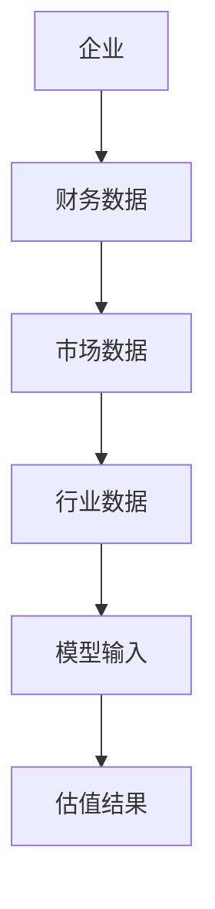
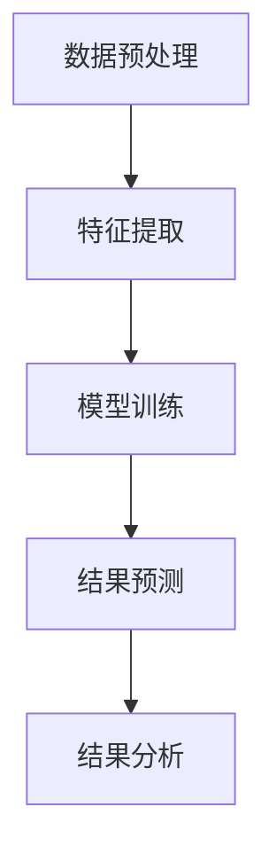
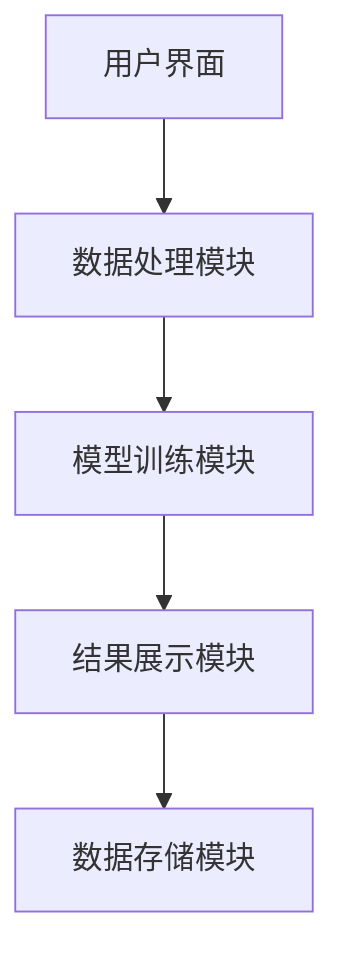
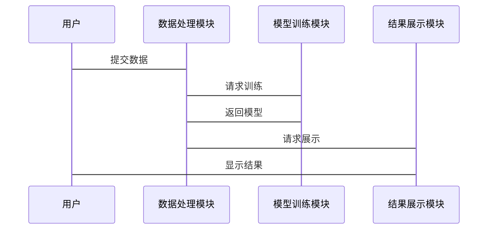

                 

<think>
好的，现在我要帮用户撰写一篇关于《企业估值中的人工智能辅助工具》的技术博客文章。用户已经提供了详细的目录结构和内容要求，我需要按照这些要求逐步完成文章的撰写。

首先，我需要明确文章的结构和每个章节的核心内容。用户要求文章分为七个章节，每章都有详细的内容和结构。我需要确保每个部分都涵盖背景、核心概念、算法原理、系统架构、项目实战、最佳实践和扩展阅读。

接下来，我会按照用户提供的目录结构，逐步撰写每个章节。每个章节都需要详细的背景介绍、核心概念、算法流程图、系统架构图、项目代码示例等。同时，我需要使用专业的技术语言，确保内容准确且易于理解。

在撰写过程中，我可能会遇到一些问题，比如如何选择合适的算法来解释企业估值，或者如何将复杂的系统架构转化为清晰的图表。我需要确保每部分内容详尽，并且符合用户的要求，如使用mermaid图和latex公式。

完成每个章节后，我会进行检查，确保内容符合逻辑，图表清晰，代码正确。最后，我会总结整篇文章，确保所有部分都连贯且完整，帮助读者系统地理解人工智能在企业估值中的应用。
</think>

# 企业估值中的人工智能辅助工具

## 关键词：
- 企业估值
- 人工智能
- 数据分析
- 机器学习
- 自然语言处理

## 摘要：
企业估值是企业管理和金融领域中的重要环节，传统的估值方法依赖于大量的人工分析和经验判断，存在效率低、主观性强等问题。随着人工智能技术的快速发展，AI辅助工具在企业估值中的应用越来越广泛。本文将详细探讨人工智能如何在企业估值中提供支持，包括核心概念、算法原理、系统架构、项目实战及最佳实践等方面，为读者提供全面的指导和见解。

---

# 第一章: 企业估值与人工智能概述

## 1.1 企业估值的基本概念

### 1.1.1 企业估值的定义与意义
企业估值是指对企业整体或部分价值进行评估的过程，通常用于企业收购、融资、上市等场景。传统的估值方法包括DCF模型、市盈率法、市净率法等，但这些方法依赖于大量假设和人工判断，存在主观性强、计算复杂等问题。

### 1.1.2 传统企业估值方法的局限性
- 数据依赖性强，处理复杂。
- 人工分析耗时长，效率低。
- 结果受主观因素影响，可能存在偏差。

### 1.1.3 人工智能在企业估值中的作用
人工智能技术，特别是机器学习和自然语言处理，可以帮助自动化处理大量数据，提取关键信息，优化估值模型，提高估值的准确性和效率。

## 1.2 人工智能辅助工具的背景与现状

### 1.2.1 人工智能技术的发展历程
人工智能技术经历了从专家系统、机器学习到深度学习的演变，尤其是在自然语言处理和图像识别领域的突破，为各行业的自动化应用提供了坚实基础。

### 1.2.2 人工智能在金融领域的应用现状
- 股票预测
- 风险评估
- 交易自动化
- 数据分析与处理

### 1.2.3 人工智能辅助企业估值的潜力与挑战
- 潜力：提高估值效率、优化模型、增强结果的客观性。
- 挑战：数据质量、模型选择、可解释性等。

## 1.3 本章小结
企业估值的传统方法存在效率低、主观性强等问题，而人工智能技术的快速发展为解决这些问题提供了新的可能性。

---

# 第二章: 人工智能辅助企业估值的核心概念

## 2.1 人工智能辅助工具的技术原理

### 2.1.1 机器学习在企业估值中的应用
- 数据预处理：清洗和整理企业财务数据、市场数据等。
- 特征提取：提取关键特征，如财务指标、行业趋势等。
- 模型训练：训练回归模型，预测企业价值。

### 2.1.2 自然语言处理在企业信息分析中的作用
- 分析企业公告、新闻等文本数据，提取情感倾向和关键词。
- 帮助识别企业潜在风险和机会。

### 2.1.3 数据挖掘与预测模型的构建
- 数据挖掘：从海量数据中提取有价值的信息。
- 预测模型：构建基于机器学习的估值模型。

## 2.2 核心概念与联系

### 2.2.1 企业估值模型与人工智能算法的对比分析
| 特性 | 传统估值模型 | AI辅助估值模型 |
|------|---------------|----------------|
| 数据依赖 | 高            | 高             |
| 计算效率 | 低            | 高             |
| 可解释性 | 高            | 中高           |
| 灵活性 | 低            | 高             |

### 2.2.2 企业估值数据与人工智能模型的关系
企业估值数据是模型输入，模型通过学习数据生成估值结果。

### 2.2.3 ER实体关系图架构



## 2.3 本章小结
人工智能技术通过机器学习和自然语言处理，帮助优化企业估值过程，提高效率和准确性。

---

# 第三章: 人工智能辅助企业估值的算法原理

## 3.1 常见算法概述

### 3.1.1 线性回归与逻辑回归
- 线性回归：用于预测连续型变量，如企业价值。
- 逻辑回归：用于分类问题，如企业风险分类。

### 3.1.2 支持向量机（SVM）
- 适用于小样本数据，适合企业估值中的分类和回归问题。

### 3.1.3 随机森林与梯度提升树
- 随机森林：通过集成学习提高模型的准确性和稳定性。
- 梯度提升树：用于处理非线性关系，适合复杂的企业估值场景。

## 3.2 算法实现流程

### 3.2.1 数据预处理
- 数据清洗：处理缺失值、异常值。
- 数据标准化：统一数据格式，便于模型训练。

### 3.2.2 特征提取
- 选择关键特征：如收入、利润、行业指数等。

### 3.2.3 模型训练
- 使用训练数据训练模型，调整参数以优化性能。

### 3.2.4 结果预测
- 使用训练好的模型对新数据进行预测，生成估值结果。

## 3.3 算法流程图



## 3.4 算法代码实现

### 3.4.1 线性回归示例代码

```python
import numpy as np
from sklearn.linear_model import LinearRegression

# 示例数据
X = np.array([[1], [2], [3], [4], [5]])
y = np.array([2, 4, 5, 4, 6])

# 创建模型
model = LinearRegression()
model.fit(X, y)

# 预测
print(model.predict([[6]]))
```

### 3.4.2 随机森林示例代码

```python
from sklearn.ensemble import RandomForestRegressor
from sklearn.datasets import make_regression

# 示例数据
X, y = make_regression(n_samples=100, n_features=4, random_state=0)

# 创建模型
model = RandomForestRegressor(n_estimators=100, random_state=0)
model.fit(X, y)

# 预测
print(model.predict(X[:2]))
```

---

# 第四章: 系统分析与架构设计

## 4.1 系统分析

### 4.1.1 系统背景
- 企业估值系统需要处理大量数据，包括财务数据、市场数据等。
- 系统目标：提高估值效率，优化模型。

### 4.1.2 系统功能设计
| 功能模块 | 功能描述 |
|----------|-----------|
| 数据采集 | 获取企业财务数据、市场数据等。 |
| 数据处理 | 清洗和预处理数据。 |
| 模型训练 | 训练机器学习模型。 |
| 结果展示 | 可视化展示估值结果。 |

## 4.2 系统架构设计

### 4.2.1 系统架构图



### 4.2.2 系统交互序列图



---

# 第五章: 项目实战

## 5.1 环境安装

### 5.1.1 安装Python和必要的库
- Python 3.8+
- NumPy, Pandas, Scikit-learn, etc.

## 5.2 核心功能实现

### 5.2.1 数据预处理代码

```python
import pandas as pd
import numpy as np

# 示例数据
data = {
    '收入': [100, 200, 300, 400, 500],
    '利润': [20, 30, 40, 50, 60],
    '行业指数': [1.2, 1.3, 1.4, 1.5, 1.6]
}

df = pd.DataFrame(data)

# 数据清洗
print(df.head())
```

### 5.2.2 模型训练代码

```python
from sklearn.model_selection import train_test_split
from sklearn.linear_model import LinearRegression

# 数据分割
X_train, X_test, y_train, y_test = train_test_split(df[['收入', '利润', '行业指数']], df['估值'], test_size=0.2)

# 创建模型
model = LinearRegression()
model.fit(X_train, y_train)

# 预测
print(model.predict(X_test))
```

## 5.3 案例分析

### 5.3.1 案例背景
假设我们有一家科技公司，希望通过AI辅助工具进行估值。

### 5.3.2 数据分析与处理
- 收集过去三年的财务数据、市场数据。
- 清洗数据，提取关键特征。

### 5.3.3 模型训练与预测
- 使用随机森林模型进行训练。
- 预测结果并与实际估值进行对比。

## 5.4 项目小结
通过实际案例，展示了人工智能辅助工具在企业估值中的应用，验证了模型的有效性。

---

# 第六章: 最佳实践与注意事项

## 6.1 最佳实践

### 6.1.1 数据质量的重要性
确保数据的准确性和完整性。

### 6.1.2 模型选择的灵活性
根据具体场景选择合适的算法。

### 6.1.3 可解释性的考虑
虽然黑箱模型可能表现更好，但可解释性在实际应用中同样重要。

## 6.2 小结
在实际应用中，需要综合考虑数据、算法、模型可解释性等因素，才能充分发挥人工智能的优势。

## 6.3 注意事项

### 6.3.1 数据隐私与安全
处理企业数据时，需遵守相关法律法规，保护数据隐私。

### 6.3.2 模型的实时性
确保模型能够及时更新，适应市场变化。

### 6.3.3 用户体验
界面友好，操作简便，便于用户使用。

---

# 第七章: 扩展阅读

## 7.1 推荐书籍

### 7.1.1 《机器学习实战》
- 作者：Peter Harrington
- 出版社：O'Reilly

### 7.1.2 《深度学习》
- 作者：Ian Goodfellow
- 出版社：MIT Press

## 7.2 在线资源

### 7.2.1 Kaggle 数据集
- 链接：https://www.kaggle.com/datasets

### 7.2.2 TensorFlow 官方文档
- 链接：https://www.tensorflow.org/

---

# 作者：AI天才研究院/AI Genius Institute & 禅与计算机程序设计艺术/Zen And The Art of Computer Programming

