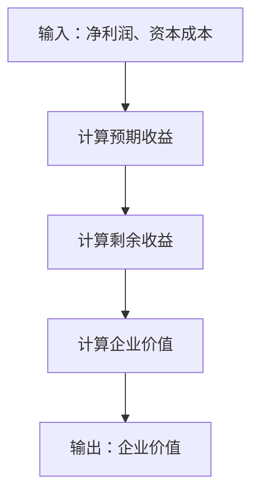

                 


# 企业估值中的剩余收益法

> **关键词**：企业估值，剩余收益法，资本资产定价模型（CAPM），加权平均资本成本（WACC），股权资本成本

> **摘要**：  
> 本文深入探讨了企业估值中的剩余收益法，从理论基础到实际应用进行全面解析。文章首先介绍了企业估值的基本概念和剩余收益法的定义、特点及其与其他估值方法的对比。接着，详细推导了剩余收益法的核心公式，包括企业价值、剩余收益和预期收益的计算公式，并通过对比表和流程图清晰展示了其算法原理。随后，通过Python代码示例和实际案例分析，深入讲解了剩余收益法在企业估值中的应用场景和具体操作步骤。最后，总结了剩余收益法的优势与局限性，并提出了实际操作中的注意事项和未来研究方向。

---

# 第一部分: 企业估值与剩余收益法概述

## 第1章: 企业估值的基本概念

### 1.1 问题背景
企业估值是企业价值评估的核心问题之一，其目的是为企业提供合理的价值参考，帮助投资者、管理层和相关利益方做出决策。常见的企业估值方法包括市盈率法、市净率法、现金流折现法和剩余收益法等。

### 1.2 问题描述
剩余收益法是一种基于会计收益和资本成本的估值方法。与传统的市盈率法和现金流折现法相比，剩余收益法更加关注企业的超额收益部分，能够更准确地反映企业的内在价值。

### 1.3 问题解决
通过计算企业的剩余收益，并将其折现为当前价值，剩余收益法能够为企业的整体价值提供一个合理的估计。这种方法特别适用于那些具有稳定现金流和可预测未来收益的企业。

### 1.4 边界与外延
- **边界**：剩余收益法适用于具有稳定财务数据和可预测未来收益的企业。
- **外延**：本文将重点探讨剩余收益法的理论基础、公式推导、算法实现及其在企业估值中的应用。

### 1.5 核心要素
- **净利润**：企业的净利润是剩余收益法的核心输入。
- **预期收益**：基于资本成本计算的预期收益是剩余收益法的关键组成部分。
- **资本成本**：股权资本成本和债务资本成本是剩余收益法的重要输入参数。

---

## 第2章: 剩余收益法的理论基础

### 2.1 资本资产定价模型（CAPM）
CAPM 是计算股权资本成本的重要工具，其公式为：
$$
r_e = r_f + \beta \times (r_m - r_f)
$$
其中：
- $r_e$：股权资本成本
- $r_f$：无风险利率
- $\beta$：贝塔系数
- $r_m$：市场平均收益率

### 2.2 加权平均资本成本（WACC）
WACC 是企业加权平均资本成本的计算公式：
$$
WACC = \frac{D}{V} \times r_d \times (1 - t) + \frac{E}{V} \times r_e
$$
其中：
- $D$：债务价值
- $V$：企业总价值
- $r_d$：债务资本成本
- $t$：企业所得税率
- $E$：权益价值
- $r_e$：股权资本成本

### 2.3 股权资本成本的计算
股权资本成本是剩余收益法的核心参数，其计算依赖于 CAPM 模型。

### 2.4 剩余收益法的公式推导
剩余收益法的核心公式为：
$$
企业价值 = 剩余收益 \times 倍数
$$
其中，剩余收益的计算公式为：
$$
剩余收益 = 净利润 - 预期收益
$$
预期收益的计算公式为：
$$
预期收益 = 股权资本成本 \times 权益价值
$$

---

## 第3章: 剩余收益法的核心公式与应用场景

### 3.1 剩余收益法的核心公式
1. 企业价值公式：
$$
企业价值 = 净利润 \times (1 + 剩余收益倍数)
$$
2. 剩余收益计算公式：
$$
剩余收益 = 净利润 - (股权资本成本 \times 权益价值)
$$
3. 预期收益计算公式：
$$
预期收益 = 股权资本成本 \times 权益价值
$$

### 3.2 剩余收益法的应用场景
1. **适用企业类型**：
   - 稳定盈利的企业
   - 股权结构清晰的企业
2. **适用行业特点**：
   - 制造业、金融服务业等现金流稳定的行业
3. **剩余收益法的局限性**：
   - 依赖于准确的财务数据和合理的资本成本假设
   - 适用于短期估值，长期预测可能不够准确

### 3.3 剩余收益法与其他估值方法的对比
| 方法         | 优点                     | 缺点                     |
|--------------|--------------------------|--------------------------|
| 剩余收益法   | 突出超额收益，计算简单   | 依赖于资本成本假设       |
| 市盈率法     | 易于理解和计算           | 未考虑资本成本           |
| 现金流折现法 | 考虑了时间价值和风险       | 计算复杂，需要详细预测    |

---

## 第4章: 剩余收益法的算法原理与实现

### 4.1 剩余收益法的算法流程


### 4.2 剩余收益法的数学模型
企业价值的计算公式可以表示为：
$$
V = \text{净利润} \times (1 + \frac{r_e}{r_e - g})
$$
其中：
- $V$：企业价值
- 净利润：企业的净利润
- $r_e$：股权资本成本
- $g$：净利润增长率

### 4.3 剩余收益法的Python代码实现
```python
def calculate_surplus收益法(net_profit, cost_of_equity, growth_rate):
    expected_surplus = net_profit * (1 + cost_of_equity / (cost_of_equity - growth_rate))
    return expected_surplus

net_profit = 1000000  # 假设净利润为100万元
cost_of_equity = 0.10  # 假设股权资本成本为10%
growth_rate = 0.05     # 假设净利润增长率为5%

surplus_surplus = calculate_surplus收益法(net_profit, cost_of_equity, growth_rate)
print("剩余收益 =", surplus_surplus)
```

---

## 第5章: 剩余收益法的实际应用与案例分析

### 5.1 项目实战
**案例分析**：假设某企业2023年的净利润为100万元，股权资本成本为10%，净利润增长率为5%。计算该企业的剩余收益和企业价值。

**步骤**：
1. 计算预期收益：
$$
\text{预期收益} = 100 \times (1 + 0.10) = 110 \text{万元}
$$
2. 计算剩余收益：
$$
\text{剩余收益} = 100 - 110 = -10 \text{万元}
$$
3. 计算企业价值：
$$
\text{企业价值} = 100 \times (1 + \frac{0.10}{0.10 - 0.05}) = 100 \times 22 = 2200 \text{万元}
$$

### 5.2 案例分析与解读
通过上述案例，我们可以看到剩余收益法的应用过程。虽然案例中的剩余收益为负，但企业价值的计算结果表明该企业具有较高的估值潜力。

---

## 第6章: 剩余收益法的总结与展望

### 6.1 本章小结
- 剩余收益法是一种基于超额收益的企业估值方法。
- 其核心在于计算企业的剩余收益，并将其折现为企业价值。
- 该方法适用于稳定盈利的企业，但在实际应用中需要考虑资本成本的合理性。

### 6.2 注意事项
- 数据的准确性和合理性是关键。
- 考虑企业的未来增长率和资本成本的变化。

### 6.3 未来展望
- 结合人工智能技术，优化资本成本的估算。
- 开发更精确的企业估值模型，结合多种估值方法。

---

**作者：AI天才研究院/AI Genius Institute & 禅与计算机程序设计艺术 /Zen And The Art of Computer Programming**

