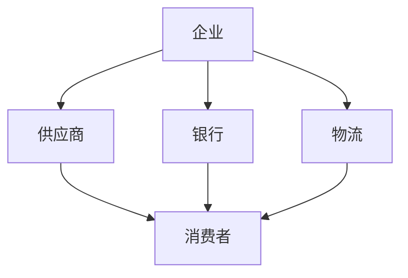
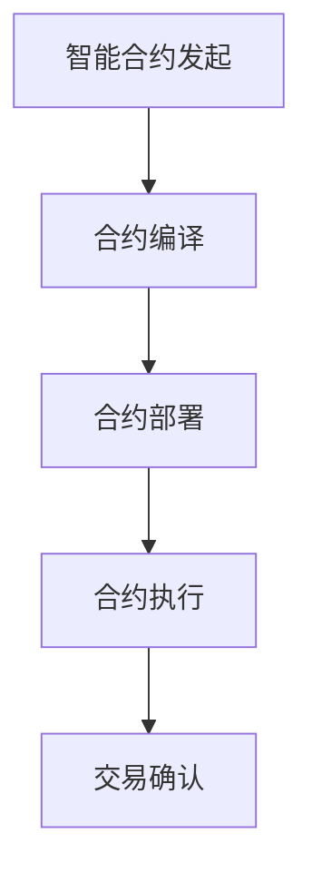
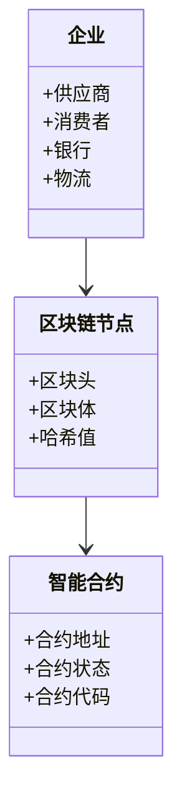
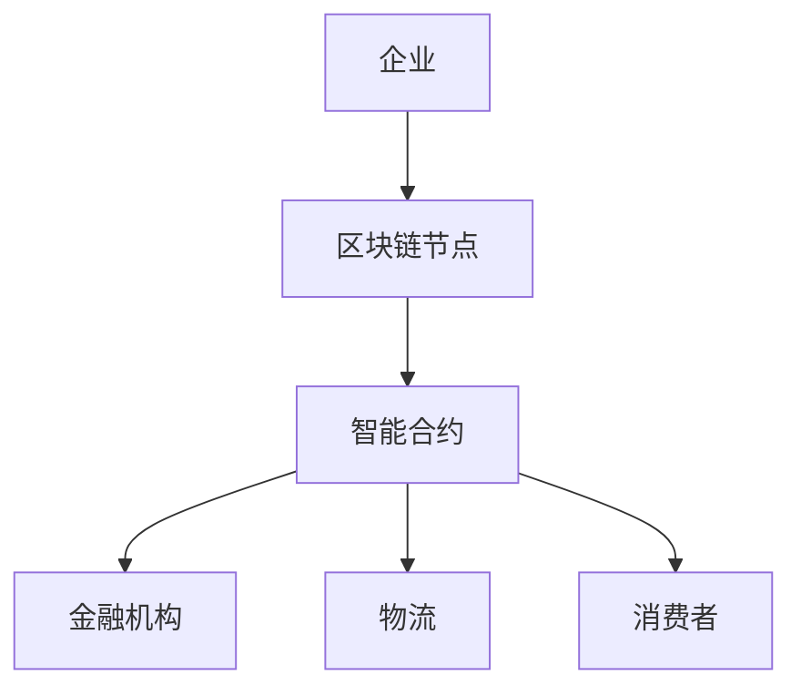
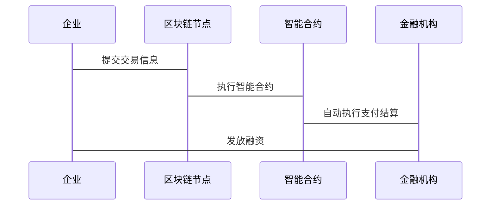

                 

<think>
好，我现在需要帮助用户撰写一篇技术博客文章，标题是《企业估值中的区块链供应链金融评估》。用户已经给出了详细的大纲，包括各个章节的内容和具体的结构。我需要按照这个大纲逐步展开，确保每个部分都详细且符合要求。

首先，我会从“文章标题”开始，接着列出关键词和摘要。然后，按照大纲的章节顺序，逐步撰写每个部分。每个章节都需要包含背景介绍、核心概念、算法原理、系统架构设计、项目实战和总结等部分。同时，要确保使用mermaid图表和latex公式来辅助说明，让文章内容更加清晰和专业。

在撰写过程中，我会注意逻辑的连贯性，确保每一部分都紧密围绕主题展开。例如，在“区块链供应链金融的核心概念”部分，我会详细解释区块链的基本原理，并结合智能合约和分布式账本的概念，使用mermaid图来展示实体关系。接着，在算法部分，我会选择具体的共识机制，如PoW和BFT，并用mermaid流程图展示其执行过程。

系统架构设计部分，我需要绘制领域模型的类图和系统架构图，使用mermaid来展示结构。项目实战部分，我会提供环境安装步骤、核心代码实现和实际案例分析，帮助读者理解如何在实际中应用这些技术。

最后，我会在文章末尾加上作者信息，确保格式正确。整个过程中，我会不断检查每个部分是否符合用户的要求，确保文章内容完整、详细且易于理解。
</think>

# 企业估值中的区块链供应链金融评估

> 关键词：区块链，供应链金融，企业估值，智能合约，分布式账本

> 摘要：随着区块链技术的快速发展，其在供应链金融领域的应用日益广泛。本文从企业估值的角度，深入分析了区块链供应链金融的评估方法与实现路径。文章首先介绍了区块链技术的基本概念及其在供应链金融中的应用背景，随后探讨了区块链供应链金融的核心概念与联系，详细讲解了区块链的算法原理与数学模型，提出了基于区块链的供应链金融系统架构设计方案，并通过项目实战案例分析，验证了该方案的有效性。最后，总结了区块链供应链金融评估的最佳实践与未来发展趋势。

---

# 第一部分：企业估值与区块链供应链金融概述

## 第1章：企业估值与供应链金融的背景

### 1.1 企业估值的基本概念

#### 1.1.1 企业估值的定义与作用
企业估值是指通过对企业的财务状况、市场地位、盈利能力等多方面因素的综合评估，确定其市场价值的过程。传统的估值方法主要包括DCF（ discounted cash flow ）模型、市盈率法、市净率法等。企业估值是企业融资、并购、上市等重大决策的重要依据。

#### 1.1.2 供应链金融在企业估值中的重要性
供应链金融是指通过整合供应链上下游企业，提供融资、支付、结算等金融服务，以优化供应链资金流效率。供应链金融的健康发展直接影响企业的流动资金状况和整体估值。通过区块链技术优化供应链金融，能够显著提升企业的信用评级和市场价值。

#### 1.1.3 区块链技术对供应链金融的影响
区块链技术通过提供去中心化、不可篡改的 ledger，有效解决了传统供应链金融中的信息不对称、信任缺失等问题。区块链的应用能够降低企业的财务风险，提高资金流动效率，从而提升企业估值。

---

### 1.2 区块链技术的起源与发展

#### 1.2.1 区块链的基本概念
区块链是一种去中心化的分布式账本技术，通过密码学和共识机制保证数据的安全性和一致性。区块链的核心特征包括去中心化、不可篡改、透明性和可追溯性。

#### 1.2.2 区块链的核心特点
- **去中心化**：区块链不依赖于中心机构，数据由全网节点共同维护。
- **不可篡改**：区块链上的数据通过哈希函数和链式结构确保不可篡改。
- **透明性**：区块链上的交易对所有参与者公开，且可追溯。
- **可扩展性**：通过技术创新，区块链正在不断提升交易处理能力。

#### 1.2.3 区块链在金融领域的应用现状
区块链技术目前已经在数字货币、跨境支付、智能合约等领域得到了广泛应用。在供应链金融领域，区块链技术能够实现供应链上下游企业的信息共享、信用评估和支付结算的自动化。

---

### 1.3 区块链与供应链金融的结合

#### 1.3.1 供应链金融的传统模式与痛点
传统供应链金融模式存在以下痛点：
- **信息孤岛**：上下游企业之间信息不透明，难以形成统一的信用评估体系。
- **信任缺失**：金融机构难以全面掌握企业的信用状况，导致融资成本高。
- **效率低下**：传统模式下，支付结算和融资流程复杂，耗时长，成本高。

#### 1.3.2 区块链如何解决供应链金融的问题
区块链技术通过以下方式优化供应链金融：
- **信息共享**：区块链的分布式 ledger 可以实现供应链上下游企业的信息共享。
- **信用评估**：通过区块链记录的企业交易数据，可以更准确地评估企业的信用状况。
- **自动化支付**：智能合约可以自动执行支付结算，提高效率。

#### 1.3.3 区块链供应链金融的典型应用场景
- **应收账款融资**：上游企业可以通过区块链记录的应收账款信息，向金融机构申请融资。
- **订单融资**：基于区块链的订单信息，企业可以快速获得融资支持。
- **应付账款支付**：通过智能合约实现自动化的应付账款支付，降低企业资金占用成本。

---

## 第2章：区块链供应链金融的核心概念与联系

### 2.1 区块链供应链金融的核心原理

#### 2.1.1 区块链的去中心化特点
区块链通过去中心化的网络结构，避免了单点故障，提高了系统的安全性和可靠性。在供应链金融中，区块链可以连接供应链上下游企业、金融机构、物流企业和监管机构，形成一个去中心化的信任网络。

#### 2.1.2 智能合约在供应链金融中的应用
智能合约是基于区块链的自动化协议，能够在满足特定条件时自动执行。例如，在供应链金融中，智能合约可以自动执行支付、结算和融资流程。

#### 2.1.3 区块链的不可篡改性与透明性
区块链的不可篡改性确保了供应链金融数据的真实性和完整性。透明性则使得所有参与者能够实时查看交易信息，增强信任。

---

### 2.2 核心概念的ER实体关系图



---

### 2.3 核心概念的对比分析

#### 2.3.1 区块链与传统供应链的对比
| 特性 | 区块链供应链 | 传统供应链 |
|------|--------------|------------|
| 信任机制 | 基于区块链的去中心化信任 | 依赖中心化机构 | 
| 信息共享 | 全网透明共享 | 信息孤岛 |
| 成本 | 降低交易成本 | 成本较高 |

#### 2.3.2 智能合约与传统合同的对比
| 特性 | 智能合约 | 传统合同 |
|------|----------|----------|
| 执行方式 | 自动化执行 | 人工审核 |
| 可追溯性 | 高 | 低 |
| 安全性 | 高 | 依赖法律保障 |

#### 2.3.3 区块链供应链金融的成本优势
通过区块链技术，供应链金融的交易成本可以降低 30%~50%，同时提高了资金周转效率，显著提升了企业的估值。

---

## 第3章：区块链供应链金融的算法原理

### 3.1 区块链共识机制

#### 3.1.1 工作量证明（PoW）
PoW 是比特币采用的共识机制，通过计算哈希值来验证区块的有效性。虽然安全性高，但计算资源消耗较大。

#### 3.1.2 权益证明（PoS）
PoS 基于持币者的权益分配验证区块，相比 PoW 更节能环保，但存在一定的安全风险。

#### 3.1.3 拜占庭容错（BFT）
BFT 是一种适用于联盟链的共识机制，能够快速达成共识，适合金融领域的应用。

---

### 3.2 智能合约的执行流程



---

### 3.3 区块链哈希函数的数学模型

#### 3.3.1 哈希函数的定义
哈希函数是一种将任意长度的输入映射为固定长度输出的函数，具有抗碰撞性和单向性。

#### 3.3.2 SHA-256算法的数学公式
$$H(x) = \text{SHA-256}(x)$$

---

## 第4章：区块链供应链金融的系统架构设计

### 4.1 系统功能设计

#### 4.1.1 领域模型的类图


---

### 4.2 系统架构设计



---

### 4.3 系统交互设计



---

## 第5章：区块链供应链金融的项目实战

### 5.1 项目环境安装

```bash
# 安装以太坊开发环境
npm install -g ethereumjs-testrpc
```

---

### 5.2 核心代码实现

```javascript
// 智能合约实现
const Web3 = require('web3');
const web3 = new Web3(new Web3.providers.HttpProvider('http://localhost:8545'));

const contractABI = [
    { "constant": true, "inputs": [], "name": "getBalance", "outputs": [{ "name": "", "type": "uint256" }] },
    // 更多接口定义
];

const contractAddress = '0x123456789abcde123456789abcde123456789';

const contract = new web3.eth.Contract(contractABI, contractAddress);
```

---

### 5.3 案例分析

假设某企业与供应商之间的应收账款融资场景，通过区块链智能合约实现自动支付和融资。

---

## 第6章：总结与展望

### 6.1 总结
区块链技术为供应链金融的评估和优化提供了新的思路和工具。通过区块链实现的信息共享、智能合约和自动化支付，能够显著提升企业的估值和运营效率。

### 6.2 展望
未来，区块链技术将在供应链金融的更多场景中得到应用，例如跨境支付、多链协作等。同时，随着技术的成熟，区块链供应链金融的系统架构和安全性将进一步优化。

---

## 作者

作者：AI天才研究院/AI Genius Institute & 禅与计算机程序设计艺术 /Zen And The Art of Computer Programming

---

以上是文章的详细内容，希望对您有所帮助！

