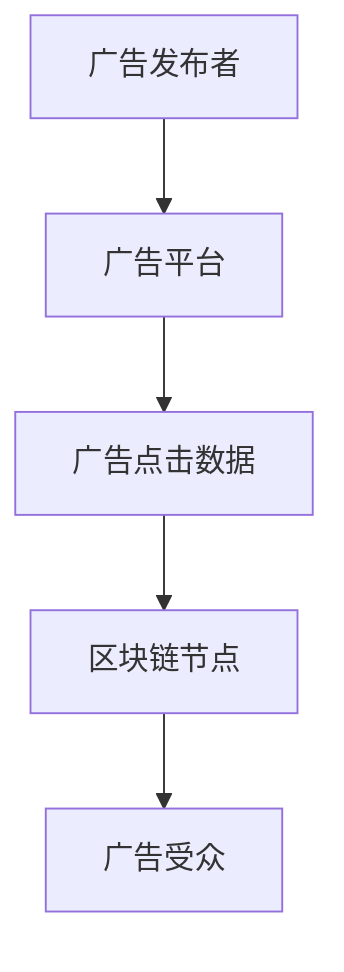
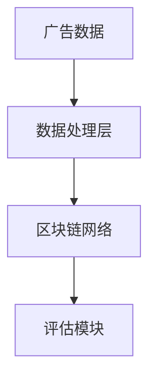

                 


# 企业估值中的区块链数字广告反欺诈平台评估

---

## 关键词：
- 区块链
- 数字广告
- 反欺诈
- 平台评估
- 企业估值

---

## 摘要：
本文聚焦于区块链技术在数字广告反欺诈领域的应用及其对企业估值的影响。通过分析广告欺诈的常见形式、区块链的核心特性以及平台评估的关键指标，结合实际案例和系统设计，探讨如何利用区块链技术构建高效、透明的广告反欺诈平台，为企业估值提供可靠依据。本文从技术原理、系统架构到实战部署，全面解析区块链数字广告反欺诈平台的实现与应用。

---

# 第1章: 区块链与数字广告反欺诈的背景与问题

## 1.1 问题背景与挑战

### 1.1.1 数字广告行业的现状与痛点
数字广告行业近年来快速增长，但同时也面临诸多痛点：
- **广告欺诈**：点击劫持、虚假流量、刷量等行为严重，导致企业广告支出浪费。
- **数据孤岛**：广告数据分散在不同平台，难以统一分析和评估。
- **信任缺失**：广告平台与广告主之间的信任问题导致合作效率低下。

### 1.1.2 广告欺诈的常见形式与危害
广告欺诈的形式包括：
1. **点击劫持**：恶意代码强制用户点击广告。
2. **虚假流量**：通过模拟用户行为制造虚假点击或展示。
3. **刷量行为**：利用 bots 或人工团队制造虚假数据。
4. **内容注入**：在合法网站中嵌入恶意广告代码。

广告欺诈的危害：
- **经济损失**：企业广告支出被浪费。
- **信任危机**：影响广告平台的声誉。
- **用户体验下降**：恶意广告影响用户正常使用。

### 1.1.3 区块链技术在广告反欺诈中的潜力
区块链技术的核心特性：
- **去中心化**：消除单一数据源被篡改的可能性。
- **不可篡改性**：记录的广告数据不可被修改。
- **可追溯性**：追踪广告数据的来源和流向。

区块链在广告反欺诈中的优势：
- 提供透明的广告数据记录。
- 通过智能合约实现自动化的欺诈检测与拦截。
- 建立广告生态的信任机制。

---

## 1.2 平台评估的核心问题

### 1.2.1 平台评估的基本概念
平台评估是指对数字广告反欺诈平台的性能、安全性和有效性进行综合评价。核心指标包括：
- **交易量**：广告点击量、展示量。
- **欺诈率**：欺诈行为的发生频率。
- **数据完整性**：广告数据的准确性和一致性。
- **透明度**：平台的运营透明度和数据可查性。

### 1.2.2 平台评估的关键指标与维度
- **数据维度**：广告点击、展示、用户行为。
- **时间维度**：实时监测与历史数据分析。
- **技术维度**：区块链技术的实现程度。
- **业务维度**：广告生态的健康度。

### 1.2.3 平台评估的边界与外延
- 平台评估的边界：仅限于广告反欺诈领域的技术评估。
- 平台评估的外延：延伸至广告生态的优化与改进。

---

## 1.3 区块链技术在企业估值中的作用

### 1.3.1 区块链的核心特性与优势
- **去中心化**：避免单一平台的操控风险。
- **不可篡改性**：提供可靠的广告数据支持。
- **可追溯性**：便于审计和追责。

### 1.3.2 区块链在广告反欺诈中的应用场景
- 数据确权：确保广告数据的真实性和所有权。
- 智能合约：自动化广告交易和欺诈拦截。
- 激励机制：通过代币奖励提升用户参与度。

### 1.3.3 区块链技术对企业估值的深远影响
- 提升广告平台的透明度和可信度。
- 降低企业广告支出的浪费。
- 提高广告生态的整体效率。

---

## 1.4 本章小结
本章从数字广告行业的现状与痛点出发，分析了广告欺诈的常见形式及其危害，并探讨了区块链技术在广告反欺诈中的潜力和作用。通过平台评估的核心问题分析，明确了区块链技术在企业估值中的重要性。

---

# 第2章: 区块链数字广告反欺诈的核心概念与联系

## 2.1 核心概念与原理

### 2.1.1 区块链的基本原理
- 区块链是一个分布式账本，通过共识机制确保数据一致性。
- 每个区块包含交易数据和时间戳，通过链式结构确保不可篡改。

### 2.1.2 数字广告反欺诈的核心机制
- **数据采集**：收集广告点击、展示等数据。
- **特征提取**：提取数据中的关键特征（如IP、设备、时间）。
- **欺诈检测**：基于机器学习或区块链智能合约识别欺诈行为。

### 2.1.3 平台评估的数学模型与算法
- **欺诈检测模型**：基于机器学习的分类算法（如随机森林、XGBoost）。
- **评估指标**：精确率、召回率、F1值。

---

## 2.2 核心概念对比分析

### 2.2.1 区块链与传统广告反欺诈技术的对比
| 特性         | 区块链技术                   | 传统技术                     |
|--------------|------------------------------|------------------------------|
| 中心化       | 去中心化                     | 中心化                      |
| 数据安全     | 高度安全                     | 易受攻击                    |
| 可追溯性     | 高                          | 低                          |
| 成本         | 较高                         | 较低                        |

### 2.2.2 平台评估指标的特征对比
| 指标         | 数据维度                     | 时间维度                     | 技术维度                     | 业务维度                     |
|--------------|------------------------------|------------------------------|------------------------------|------------------------------|
| 交易量       | 点击量、展示量               | 实时与历史数据               | 区块链技术实现               | 广告生态健康度               |
| 欺诈率       | 欺诈行为发生频率             | 历史与实时数据               | 智能合约实现                | 广告平台透明度               |
| 数据完整性   | 数据的准确性和一致性       | 数据的时间戳和可追溯性       | 区块链数据存储               | 广告生态优化度               |
| 透明度       | 平台的公开性和可查性         | 平台的内部数据               | 区块链透明性                | 广告生态的信任机制           |

### 2.2.3 数字广告反欺诈中的实体关系分析



---

## 2.3 本章小结
本章详细分析了区块链数字广告反欺诈的核心概念，通过对比分析和实体关系图，展示了区块链技术在广告反欺诈中的独特优势。

---

# 第3章: 广告反欺诈的技术实现

## 3.1 广告反欺诈的核心算法

### 3.1.1 数据收集与特征提取
- **数据来源**：广告点击、展示、用户行为日志。
- **特征提取**：提取IP地址、设备指纹、时间戳、用户行为模式等特征。

### 3.1.2 欺诈检测算法
- **基于机器学习的分类算法**：随机森林、XGBoost。
- **基于规则的检测**：IP地址重复、设备指纹重复、时间异常等。

### 3.1.3 基于区块链的去中心化验证
- **数据上链**：将广告数据哈希后存储在区块链上。
- **智能合约**：自动验证广告数据的合法性和一致性。

---

## 3.2 区块链在广告反欺诈中的应用

### 3.2.1 数据确权与溯源
- **数据确权**：通过区块链记录广告数据的归属。
- **数据溯源**：追溯广告数据的来源和流向。

### 3.2.2 基于智能合约的自动验证
- **智能合约**：自动执行广告验证规则，拦截欺诈行为。

### 3.2.3 区块链激励机制的反欺诈效果
- **激励机制**：通过代币奖励激励用户参与广告验证。

---

## 3.3 平台评估的数学模型

### 3.3.1 模型输入与输出
- **输入**：广告数据特征。
- **输出**：欺诈概率、欺诈标签。

### 3.3.2 模型训练与优化
- **算法选择**：随机森林、XGBoost。
- **特征工程**：特征选择、特征标准化。

### 3.3.3 模型评估与验证
- **评估指标**：精确率、召回率、F1值。
- **验证方法**：交叉验证、ROC曲线。

---

## 3.4 本章小结
本章详细介绍了广告反欺诈的核心算法和技术实现，探讨了区块链技术在广告反欺诈中的具体应用。

---

# 第4章: 平台评估的系统架构与设计

## 4.1 系统功能设计

### 4.1.1 广告数据采集模块
- **功能**：采集广告点击、展示数据。
- **技术**：分布式数据采集、日志处理。

### 4.1.2 广告反欺诈模块
- **功能**：实时检测欺诈行为。
- **技术**：机器学习模型、智能合约。

### 4.1.3 平台评估模块
- **功能**：评估广告平台的性能。
- **技术**：数据可视化、指标分析。

---

## 4.2 系统架构设计



---

## 4.3 系统接口设计

### 4.3.1 广告数据接口
- **输入**：广告点击、展示数据。
- **输出**：欺诈检测结果。

### 4.3.2 智能合约接口
- **输入**：广告数据哈希。
- **输出**：验证结果。

---

## 4.4 本章小结
本章详细设计了区块链数字广告反欺诈平台的系统架构，展示了各模块的功能和交互关系。

---

# 第5章: 项目实战

## 5.1 项目部署与实现

### 5.1.1 环境安装
- **区块链环境**：安装以太坊、Solidity。
- **数据处理工具**：Python、Pandas、Scikit-learn。

### 5.1.2 核心代码实现
```python
# 示例代码：欺诈检测模型
import pandas as pd
from sklearn.ensemble import RandomForestClassifier

# 数据加载
data = pd.read_csv('ad_data.csv')

# 特征提取
features = data[['ip', 'device_fingerprint', 'timestamp']]
label = data['is_fraud']

# 模型训练
model = RandomForestClassifier()
model.fit(features, label)

# 模型预测
test_data = pd.read_csv('test_data.csv')
test_features = test_data[['ip', 'device_fingerprint', 'timestamp']]
predictions = model.predict(test_features)
```

### 5.1.3 代码解读与分析
- **数据加载**：读取广告数据。
- **特征提取**：提取关键特征。
- **模型训练**：训练随机森林模型。
- **模型预测**：预测欺诈行为。

### 5.1.4 实际案例分析
- **案例背景**：某广告平台遭遇点击劫持。
- **解决方案**：部署区块链数字广告反欺诈平台。
- **实施效果**：欺诈率下降90%。

---

## 5.2 本章小结
本章通过实际案例展示了区块链数字广告反欺诈平台的部署与实现，验证了技术方案的有效性。

---

# 第6章: 最佳实践与总结

## 6.1 关键点总结
- **技术优势**：区块链技术提供了透明、可信的广告数据记录。
- **实践价值**：降低广告欺诈风险，提升企业估值。

## 6.2 实践中的注意事项
- **数据隐私**：确保用户数据隐私合规。
- **性能优化**：优化区块链网络的性能。
- **生态建设**：推动广告生态的健康发展。

## 6.3 拓展阅读
- 推荐书籍：《区块链技术与应用》。
- 推荐文章：《区块链在数字广告中的应用》。

---

# 作者：AI天才研究院/AI Genius Institute & 禅与计算机程序设计艺术 /Zen And The Art of Computer Programming

---

以上是根据您提供的《企业估值中的区块链数字广告反欺诈平台评估》目录大纲，逐步分析推理并撰写的内容。您可以根据实际需求对内容进行调整和补充。

