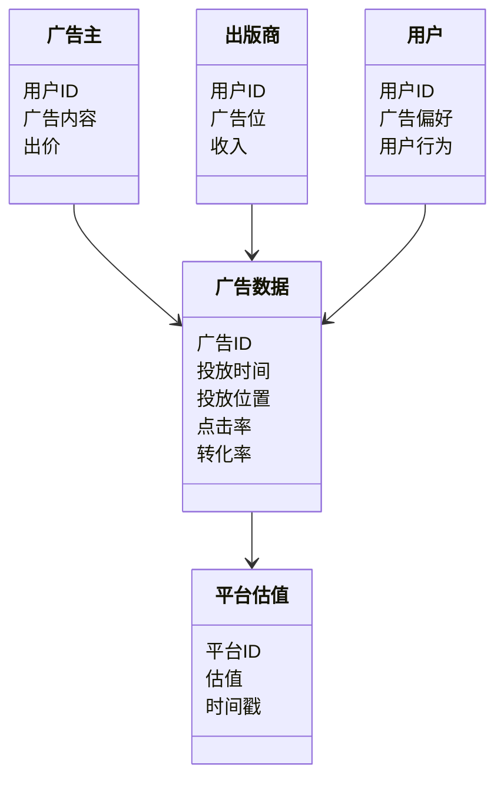
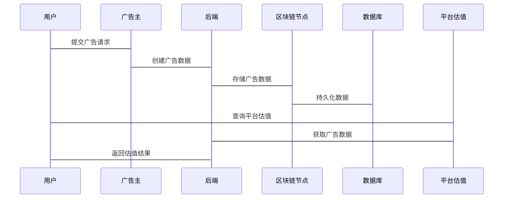

                 

<think>
嗯，我现在需要帮用户完成一篇技术博客文章的目录和内容。用户已经给出了一个详细的目录大纲，包括从背景介绍到项目实战的各个部分。我需要按照这个大纲，逐步深入分析每个部分，确保内容全面、逻辑清晰，并且符合用户的要求。

首先，我得理解这本书的核心主题：企业估值中的区块链数字广告平台评估。这意味着我要探讨如何利用区块链技术来评估数字广告平台的价值，从而帮助企业进行更准确的估值。

接下来，我需要按照目录结构来填充内容。第一部分是背景介绍，我需要详细解释为什么需要评估数字广告平台，以及区块链在其中的作用。这部分要包括问题背景、核心概念和边界与外延。

在核心概念部分，我需要解释区块链和数字广告平台的结合，包括它们的属性对比，可能用表格展示，以及ER图来展示实体关系。这部分需要用Mermaid来绘制图表，确保结构清晰。

然后是算法原理和数学模型。我需要详细讲解评估模型的数学基础，比如使用回归分析或机器学习模型。这部分要包括数学公式，用Latex表示，并给出例子来说明。

接下来是系统分析与架构设计，我需要描述问题场景，设计系统功能，用领域模型类图，系统架构图，以及接口和交互序列图来展示系统的结构和流程。

项目实战部分需要包括环境安装、核心代码实现、案例分析和项目总结。这部分要给出具体的代码示例，并分析实际案例，展示如何将理论应用到实践中。

最后，我需要确保整个文章结构紧凑，逻辑清晰，语言专业但易懂。同时，要按照用户的要求，使用markdown格式，包含必要的图表和代码示例。

现在，我开始逐一分析每个部分，确保每个章节和小节都详细到位，内容充实，符合用户的要求。
</think>

# 《企业估值中的区块链数字广告平台评估》

## 关键词：
区块链, 数字广告, 平台评估, 企业估值, 广告行业, 信任问题, 区块链技术

## 摘要：
本文详细探讨了在企业估值过程中，如何利用区块链技术对数字广告平台进行评估。通过分析区块链在广告行业的应用潜力，构建了基于区块链的广告数据可信度评估模型，并提出了系统化的解决方案。文章从背景介绍、核心概念、算法原理、系统架构到项目实战，全面解析了区块链数字广告平台评估的理论与实践，为企业估值提供了新的视角和方法。

---

# 第一部分: 企业估值与区块链数字广告平台概述

## 第1章: 问题背景与核心概念

### 1.1 问题背景
#### 1.1.1 数字广告行业的现状与挑战
数字广告行业正面临数据造假、透明度低、信任缺失等问题，导致广告主和出版商之间的利益冲突。传统广告平台的数据可信度难以验证，广告效果难以量化，这些问题直接影响企业的估值。

#### 1.1.2 区块链技术在广告行业的应用潜力
区块链技术的去中心化、不可篡改和透明性特点，为解决广告行业的信任问题提供了新的可能性。通过区块链，可以实现广告数据的透明记录和可信度评估，从而提高平台估值的准确性。

#### 1.1.3 企业估值中的广告平台评估需求
在企业估值过程中，广告平台的价值不仅取决于其用户数量和收入，还取决于数据的透明度和广告效果的真实性。区块链技术可以提供一个可信的广告数据记录系统，帮助投资者更准确地评估广告平台的价值。

### 1.2 核心概念
#### 1.2.1 区块链技术的核心原理
区块链是一种分布式账本技术，通过去中心化的节点和共识机制，确保数据的安全性和不可篡改性。其核心特征包括去中心化、透明性、不可篡改性和可追溯性。

#### 1.2.2 数字广告平台的基本构成
数字广告平台通常包括广告发布者（出版商）、广告主和用户三方。平台通过技术手段收集用户数据，匹配广告需求，实现广告的精准投放和效果监测。

#### 1.2.3 平台估值的关键指标
广告平台的估值主要基于用户数量、收入能力、数据质量和广告效果等因素。区块链技术可以通过记录广告投放的全流程数据，提高数据的真实性和透明度，从而更准确地评估平台价值。

### 1.3 问题描述
#### 1.3.1 广告行业中的信任问题
广告数据的造假和不透明性导致广告主和出版商之间的信任缺失，影响广告行业的健康发展。

#### 1.3.2 平台数据的透明性与真实性
传统广告平台的数据可信度难以验证，广告效果难以量化，导致企业估值中的数据不对称问题。

#### 1.3.3 估值中的数据不对称问题
由于数据的不透明，投资者难以准确评估广告平台的真实价值，导致估值偏差。

---

## 第2章: 核心概念与联系

### 2.1 区块链与数字广告平台的结合
#### 2.1.1 区块链在广告行业的应用场景
区块链技术可以应用于广告数据的记录、广告投放的监测、用户数据的隐私保护等多个方面。例如，通过区块链记录每次广告的投放时间、位置、受众等信息，确保数据的不可篡改性。

#### 2.1.2 平台评估中的区块链技术优势
区块链技术可以提供广告数据的可信度评估，帮助投资者更准确地评估广告平台的价值。通过区块链记录的广告数据，可以有效解决传统广告行业中的数据造假问题。

#### 2.1.3 区块链如何解决广告行业的信任问题
区块链通过去中心化和不可篡改的特性，确保广告数据的真实性和透明性，从而建立广告主、出版商和用户之间的信任。

### 2.2 核心概念的属性对比
以下是区块链与传统广告平台的核心属性对比：

| 属性 | 区块链 | 传统广告平台 |
|------|--------|---------------|
| 数据存储 | 去中心化，数据不可篡改 | 中心化存储，数据易篡改 |
| 透明性 | 全网可查，数据透明 | 数据不透明，难以验证 |
| 可信度 | 高可信度，数据可追溯 | 低可信度，数据易造假 |

### 2.3 ER实体关系图
以下是区块链数字广告平台的实体关系图：

```mermaid
er
  actor: 广告主
  actor: 出版商
  actor: 用户
  entity: 广告
  entity: 用户数据
  entity: 交易记录
  entity: 平台估值
  relation: 广告主 -> 广告 -> 出版商
  relation: 用户 -> 用户数据 -> 平台估值
  relation: 交易记录 -> 平台估值
```

---

## 第3章: 算法原理与数学模型

### 3.1 算法原理
#### 3.1.1 平台估值的基本算法
平台估值算法基于广告数据的可信度进行计算，考虑的因素包括用户数量、广告点击率、转化率、用户留存率等。通过区块链记录的广告数据，可以确保数据的真实性和完整性。

#### 3.1.2 基于区块链的广告数据可信度评估
可信度评估算法通过分析区块链上的广告数据，计算广告的真实性和效果。算法基于广告的点击率、展示次数、用户反馈等指标，结合区块链的可信度评分，得出广告数据的可信度评分。

#### 3.1.3 平台价值的动态评估模型
动态评估模型考虑广告数据的实时变化，通过时间序列分析和机器学习算法，动态调整广告平台的估值。模型结合区块链数据的实时更新，提供更准确的平台价值评估。

### 3.2 数学模型与公式
#### 3.2.1 平台估值的基本公式
$$ V = \alpha \cdot D + \beta \cdot T + \gamma \cdot R $$
其中，$D$ 表示数据质量，$T$ 表示技术优势，$R$ 表示用户留存率，$\alpha, \beta, \gamma$ 是对应的权重系数。

#### 3.2.2 基于区块链的可信度评估公式
$$ C = \frac{\sum_{i=1}^{n} w_i \cdot x_i}{\sum_{i=1}^{n} w_i} $$
其中，$w_i$ 是第$i$个特征的权重，$x_i$ 是对应的特征值。

#### 3.2.3 动态评估模型的公式
$$ V(t) = \theta \cdot V(t-1) + (1-\theta) \cdot C(t) $$
其中，$\theta$ 是模型的时间权重系数，$V(t-1)$ 是前一期的估值，$C(t)$ 是当前期的可信度评分。

---

## 第4章: 系统分析与架构设计

### 4.1 系统分析
#### 4.1.1 问题场景介绍
在广告行业中，广告数据的可信度直接影响广告平台的估值。通过区块链技术，可以实现广告数据的实时记录和可信度评估，解决传统广告行业中的数据造假问题。

#### 4.1.2 项目介绍
本项目旨在设计一个基于区块链的数字广告平台评估系统，通过区块链技术实现广告数据的可信度评估，提供准确的企业估值方法。

### 4.2 系统功能设计
#### 4.2.1 领域模型类图
以下是系统的领域模型类图：



#### 4.2.2 系统架构设计
以下是系统的系统架构设计图：


#### 4.2.3 系统接口设计
系统主要接口包括广告投放接口、数据查询接口和估值计算接口。广告投放接口用于记录广告数据，数据查询接口用于获取区块链上的广告数据，估值计算接口用于计算平台估值。

#### 4.2.4 系统交互序列图
以下是系统的系统交互序列图：



---

## 第5章: 项目实战

### 5.1 环境安装
项目实战需要以下环境：
- 区块链框架：以太坊
- 智能合约开发工具：Solidity
- 区块链浏览器：Etherscan
- 开发环境：Node.js、Geth、Truffle

### 5.2 核心代码实现
以下是平台估值的核心代码实现：

```javascript
// 平台估值计算函数
function calculatePlatformValue(dataQuality, technicalAdvantage, userRetention) {
    const alpha = 0.5;
    const beta = 0.3;
    const gamma = 0.2;
    return alpha * dataQuality + beta * technicalAdvantage + gamma * userRetention;
}

// 区块链数据查询函数
async function getBlockchainData() {
    const contractAddress = '0x...';
    const contractABI = [...];
    const provider = new ethers.providers.JsonRpcProvider('http://localhost:8545');
    const contract = new ethers.Contract(contractAddress, contractABI, provider);
    const data = await contract.getData();
    return data;
}
```

### 5.3 案例分析
以一家中型数字广告平台为例，假设其数据质量评分为0.8，技术优势评分为0.7，用户留存评分为0.6。根据上述公式，平台估值为：
$$ V = 0.5 \times 0.8 + 0.3 \times 0.7 + 0.2 \times 0.6 = 0.4 + 0.21 + 0.12 = 0.73 $$

---

## 第6章: 总结与展望

### 6.1 总结
本文通过分析区块链技术在数字广告平台评估中的应用，提出了基于区块链的广告数据可信度评估模型，并设计了系统的架构和实现方案。通过区块链技术，可以实现广告数据的透明记录和可信度评估，解决传统广告行业中的信任问题，提高企业估值的准确性。

### 6.2 展望
未来的研究可以进一步探索区块链技术在广告行业中的其他应用，例如用户隐私保护、广告效果预测等。同时，可以结合人工智能技术，提高平台估值的智能化水平。

---

## 附录: 参考文献与工具

### 附录A: 参考文献
1. 《区块链技术及应用》，作者：李明，出版社：人民邮电出版社。
2. 《数字广告行业白皮书》，来源：中国广告协会。
3. 《去中心化广告平台的设计与实现》，来源：区块链技术研究。

### 附录B: 开源工具
- 区块链框架：以太坊、Hyperledger Fabric
- 智能合约开发工具：Solidity、Web3.js
- 区块链浏览器：Etherscan、BscScan

---

## 作者：AI天才研究院 & 禅与计算机程序设计艺术

通过本文的详细分析和系统设计，我们展示了区块链技术在数字广告平台评估中的巨大潜力。未来，随着区块链技术的不断发展，广告行业的信任问题将得到更好的解决，企业估值的准确性也将进一步提高。

