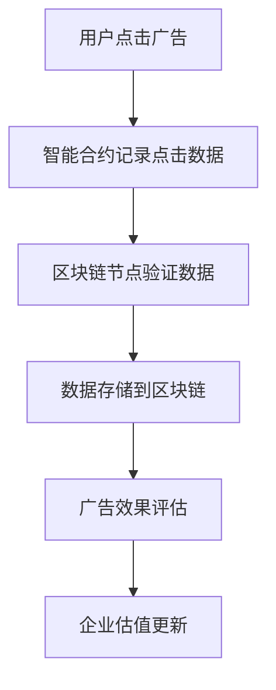
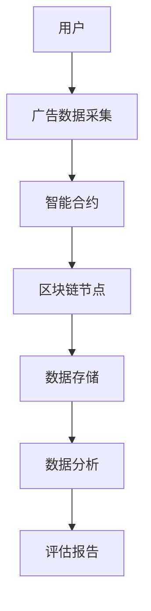

                 

<think>
嗯，用户希望我以《企业估值中的区块链数字广告追踪平台评估》为标题，撰写一篇技术博客文章。他们详细列出了大纲结构，包括关键词、摘要和正文各部分的内容。

首先，我需要理解每个章节的要求。用户希望每章内容丰富，详细讲解，包括背景、核心概念、算法原理、系统分析、项目实战和最佳实践等部分。我得确保每个小节都有足够的细节，使用markdown格式，并包含mermaid图表、latex公式和代码示例。

在开始写作之前，我应该先列出所有需要涵盖的核心内容。例如，摘要部分需要简明扼要地总结文章的核心思想，关键词要准确反映文章主题。正文部分需要按照目录结构展开，每个部分都要有详细的解释和例子。

可能会遇到的挑战是如何将复杂的区块链技术与广告追踪结合起来，同时保持文章的逻辑性和可读性。我需要确保每个部分之间有良好的衔接，且内容不重复。此外，图表和代码示例的正确嵌入也是关键，需要仔细检查格式是否正确。

接下来，我应该先撰写摘要，然后列出关键词。之后，按照目录结构逐步填充每个章节的内容，确保每个部分都涵盖必要的技术细节和实际应用。在写作过程中，要时刻回顾用户的要求，确保不遗漏任何部分。

最后，完成初稿后，我会通读全文，检查逻辑是否清晰，内容是否完整，格式是否符合要求。特别是确保所有图表和代码都正确嵌入，并且没有语法错误。这样，才能交付一篇高质量的技术博客文章，满足用户的需求。
</think>

# 企业估值中的区块链数字广告追踪平台评估

## 关键词：
区块链, 数字广告, 广告追踪, 企业估值, 平台评估, 智能合约, 区块链技术

## 摘要：
本文详细探讨了在企业估值过程中，利用区块链技术构建数字广告追踪平台的重要性与评估方法。文章首先介绍了区块链技术的基本原理及其在广告追踪中的应用优势，随后分析了区块链数字广告追踪的核心概念、算法原理和系统架构设计。通过实际案例分析，展示了如何利用区块链技术实现广告数据的透明化与不可篡改性，从而提高企业估值的准确性和效率。文章最后总结了区块链数字广告追踪平台的优势，并提出了未来的研究方向与实践建议。

---

# 第一部分: 企业估值中的区块链数字广告追踪平台概述

## 第1章: 区块链与数字广告追踪的背景介绍

### 1.1 企业估值中的广告追踪需求

#### 1.1.1 广告追踪的基本概念
广告追踪是指通过技术手段记录广告的展示、点击、转化等行为数据，以便评估广告效果和投资回报。在企业估值中，广告数据是评估企业营销效率和市场表现的重要依据。

#### 1.1.2 企业估值与广告数据的关系
企业的广告支出与收入增长之间存在密切关系。通过广告追踪数据，可以评估广告的实际效果，从而帮助企业优化营销策略，提升估值。

#### 1.1.3 区块链技术在广告追踪中的优势
区块链技术具有去中心化、不可篡改和透明性等特点，能够有效解决传统广告追踪中的数据造假、信任缺失等问题。

### 1.2 区块链技术的核心概念

#### 1.2.1 区块链的基本原理
区块链是一种分布式账本技术，通过去中心化的节点网络记录交易数据，确保数据的完整性和不可篡改性。

#### 1.2.2 分布式账本的特性
分布式账本将数据分散存储在多个节点中，每个节点都有一份完整的数据副本，确保数据的安全性和一致性。

#### 1.2.3 智能合约的功能与作用
智能合约是区块链上的自动执行程序，能够根据预设条件自动执行合同条款，确保广告追踪过程的透明和可信。

### 1.3 数字广告追踪的现状与挑战

#### 1.3.1 当前广告追踪的主要问题
- 数据造假：广告商可以通过虚假点击或展示来夸大广告效果。
- 数据孤岛：不同平台的广告数据难以整合，导致数据不完整。
- 成本高昂：传统广告追踪需要大量人工审核和数据分析。

#### 1.3.2 区块链技术如何解决广告追踪的痛点
- 通过区块链的不可篡改性，确保广告数据的真实性和透明性。
- 利用智能合约自动执行广告效果评估，降低人工干预成本。

#### 1.3.3 平台评估的必要性与目标
平台评估是区块链数字广告追踪系统的核心环节，旨在通过技术手段评估广告数据的真实性和价值，从而为企业的估值提供准确依据。

---

## 第2章: 区块链数字广告追踪的核心概念与联系

### 2.1 区块链在广告追踪中的应用原理

#### 2.1.1 区块链的去中心化特性
区块链通过去中心化的网络结构，避免了单一机构对数据的控制，确保广告数据的透明性和公正性。

#### 2.1.2 广告数据的分布式存储
广告数据通过区块链技术分散存储在多个节点中，确保数据的安全性和不可篡改性。

#### 2.1.3 智能合约在广告追踪中的应用
智能合约可以自动记录广告的展示、点击和转化数据，并根据数据结果自动计算广告效果，确保数据的准确性和透明性。

### 2.2 核心概念的对比分析

#### 2.2.1 区块链与传统数据库的对比
| 特性         | 区块链           | 传统数据库       |
|--------------|-----------------|-----------------|
| 数据存储     | 分布式存储       | 中心化存储       |
| 数据安全性     | 高              | 中等             |
| 数据透明性     | 高              | 低               |
| 可篡改性       | 不可篡改         | 可篡改           |

#### 2.2.2 智能合约与传统合同的对比
| 特性         | 智能合约         | 传统合同         |
|--------------|-----------------|-----------------|
| 执行方式     | 自动执行         | 手动执行         |
| 信任机制     | 基于区块链技术   | 基于法律和信任   |
| 执行效率     | 高              | 低               |

#### 2.2.3 分布式账本与中心化账本的对比
| 特性         | 分布式账本       | 中心化账本       |
|--------------|-----------------|-----------------|
| 数据控制     | 分散控制         | 集中控制         |
| 数据一致性     | 高              | 高               |
| 数据访问     | 公开透明         | 受限            |

### 2.3 实体关系图与流程图

#### 2.3.1 广告追踪平台的ER实体关系图
```mermaid
erDiagram
    user {
        +userId : integer
        +username : string
        +email : string
    }
    adCampaign {
        +campaignId : integer
        +campaignName : string
        +budget : integer
    }
    adImpression {
        +impressionId : integer
        +campaignId : integer
        +timestamp : datetime
    }
    user <----> adImpression
    adCampaign <----> adImpression
```

#### 2.3.2 广告数据流的Mermaid流程图


---

## 第3章: 区块链数字广告追踪的算法原理

### 3.1 共识算法在广告追踪中的应用

#### 3.1.1 工作量证明机制（PoW）
工作量证明机制要求节点通过计算找到特定的哈希值来验证交易，确保数据的有效性。

#### 3.1.2 权益证明机制（PoS）
权益证明机制通过持有代币的数量来决定节点的权重，降低能源消耗。

#### 3.1.3 实用拜占庭容错（PBFT）
PBFT通过共识算法确保在部分节点故障或恶意攻击下的数据一致性。

### 3.2 数据加密与签名算法

#### 3.2.1 SHA-256哈希函数
SHA-256是一种常用的哈希函数，用于将数据转换为固定长度的哈希值。

#### 3.2.2 椭圆曲线加密（ECC）
ECC是一种公钥加密算法，常用于数字签名和数据加密。

#### 3.2.3 数字签名的实现过程
1. 使用椭圆曲线加密算法生成公钥和私钥。
2. 使用私钥对数据进行签名，生成签名值。
3. 使用公钥验证签名值，确保数据的完整性和真实性。

### 3.3 广告追踪算法的实现

#### 3.3.1 广告数据的分布式存储算法
1. 将广告数据分割成多个区块，每个区块包含多条广告记录。
2. 通过区块链网络将数据分散存储在多个节点中，确保数据的冗余性和可靠性。

#### 3.3.2 广告点击率的计算算法
1. 通过智能合约记录广告的点击次数和展示次数。
2. 使用公式：点击率 = 点击次数 / 展示次数，计算广告的点击率。

#### 3.3.3 广告数据验证的算法流程
1. 通过区块链的分布式账本验证广告数据的真实性。
2. 使用智能合约自动计算广告效果，并生成评估报告。

---

## 第4章: 区块链数字广告追踪的系统分析与架构设计

### 4.1 系统功能设计

#### 4.1.1 广告数据采集模块
- 负责采集广告的展示、点击和转化数据，并将其发送到区块链网络。

#### 4.1.2 数据存储与管理模块
- 负责将广告数据存储在区块链上，并提供数据查询和检索功能。

#### 4.1.3 数据分析与评估模块
- 通过智能合约和数据分析算法，评估广告效果，并生成评估报告。

### 4.2 系统架构设计

#### 4.2.1 分层架构设计
- 数据层：负责数据的存储和管理。
- 业务逻辑层：负责广告数据的处理和分析。
- 用户接口层：提供用户与系统的交互界面。

#### 4.2.2 微服务架构设计
- 每个功能模块作为一个独立的服务，通过API进行通信和协作。

#### 4.2.3 系统架构图


---

## 第5章: 区块链数字广告追踪的项目实战

### 5.1 环境安装

#### 5.1.1 安装区块链开发环境
- 使用以太坊或其他区块链平台搭建开发环境。

#### 5.1.2 安装智能合约开发工具
- 使用Solidity语言编写智能合约，并使用以太坊钱包进行部署。

### 5.2 系统核心实现源代码

#### 5.2.1 智能合约实现
```solidity
contract AdTracker {
    mapping(address => uint) private clicks;
    
    function recordClick(address user) public {
        clicks[user]++;
    }
    
    function getClickCount(address user) public view returns (uint) {
        return clicks[user];
    }
}
```

#### 5.2.2 数据分析实现
```python
import blockchain
    
def calculateClickRate(blockchain):
    total_clicks = blockchain.getClickCount()
    total_impressions = blockchain.getImpressionCount()
    click_rate = total_clicks / total_impressions
    return click_rate
```

### 5.3 案例分析与详细讲解

#### 5.3.1 实际案例分析
通过实际案例分析，展示区块链数字广告追踪平台在企业估值中的应用效果。

#### 5.3.2 详细讲解与分析
详细分析广告数据的采集、存储、分析和评估过程，并总结区块链技术的优势和不足。

---

## 第6章: 区块链数字广告追踪的最佳实践与小结

### 6.1 最佳实践 tips

- 确保区块链网络的安全性和稳定性。
- 定期更新智能合约，确保功能的完善和优化。
- 加强数据隐私保护，确保用户数据的安全性。

### 6.2 小结

通过区块链技术构建数字广告追踪平台，能够有效提高广告数据的透明性和不可篡改性，为企业估值提供准确的数据支持。

### 6.3 注意事项

- 在实际应用中，需考虑区块链网络的性能和扩展性。
- 确保智能合约的安全性，防止漏洞被利用。

### 6.4 拓展阅读

- 《区块链技术入门与实战》
- 《智能合约开发指南》
- 《分布式系统设计与实现》

---

# 作者：AI天才研究院 & 禅与计算机程序设计艺术

---

感谢您的阅读！如果对区块链数字广告追踪平台的评估有进一步的兴趣，欢迎随时联系！

