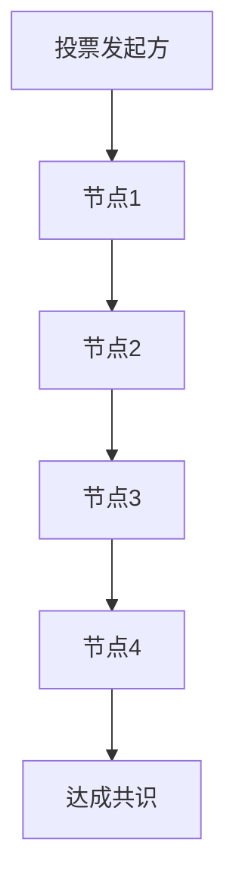
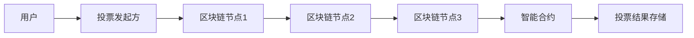
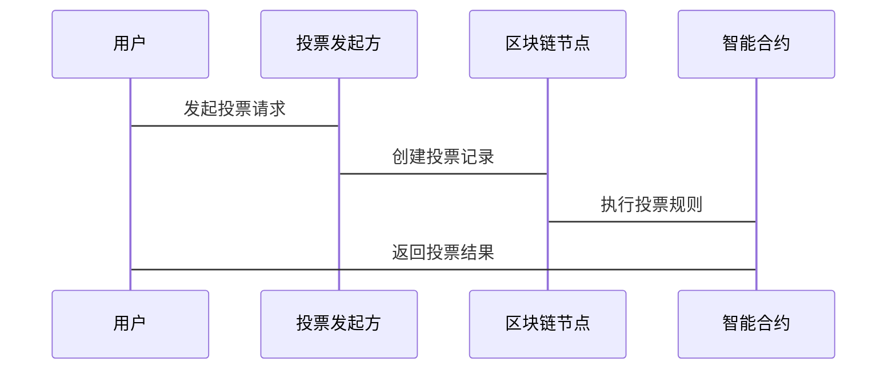

                 


# 企业估值中的区块链数字投票系统评估

> 关键词：区块链，数字投票系统，企业估值，共识机制，智能合约，去中心化，分布式账本

> 摘要：本文深入探讨了区块链技术在企业估值中的应用，特别是区块链数字投票系统的评估方法。通过分析区块链的核心原理、数字投票系统的组成，结合实际案例，详细阐述了如何利用区块链技术提升企业估值的透明度和安全性，确保投票结果的真实性和不可篡改性。

---

## 第一部分：背景介绍

### 第1章：企业估值与区块链技术概述

#### 1.1 企业估值的基本概念
- **1.1.1 企业估值的定义与作用**
  - 企业估值是指对企业整体价值的评估，通常用于并购、融资等场景。
  - 传统估值方法依赖大量数据和人为判断，存在主观性和信息不对称问题。

- **1.1.2 传统企业估值方法的局限性**
  - 数据来源的可靠性问题。
  - 人为判断可能导致偏差。
  - 透明度不足，容易引发质疑。

- **1.1.3 区块链技术在企业估值中的应用潜力**
  - 提供透明的估值数据，增强信任。
  - 通过智能合约自动执行估值逻辑，减少人为干预。

#### 1.2 区块链技术的基本原理
- **1.2.1 区块链的定义与核心特征**
  - 区块链是一种去中心化的分布式账本技术。
  - 核心特征包括去中心化、不可篡改、可追溯。

- **1.2.2 区块链的共识机制**
  - 共识机制是区块链的核心，确保所有节点达成一致。
  - 常见的共识机制包括PoW（工作量证明）和PoS（权益证明）。

- **1.2.3 区块链的去中心化特性**
  - 去中心化确保了数据的安全性和抗篡改性。
  - 每个节点都有完整的数据副本，确保数据一致性。

#### 1.3 数字投票系统的基本概念
- **1.3.1 数字投票系统的定义与特点**
  - 数字投票系统是通过电子手段进行投票的系统。
  - 特点包括高效、便捷、透明。

- **1.3.2 数字投票系统的应用场景**
  - 企业股东大会、董事会决策、项目投票等。

- **1.3.3 区块链与数字投票系统的结合**
  - 区块链技术可以解决传统数字投票系统的透明度和安全性问题。
  - 提供不可篡改的投票记录，确保投票结果的真实性和公正性。

---

## 第二部分：核心概念与联系

### 第2章：区块链数字投票系统的核心概念

#### 2.1 区块链数字投票系统的组成
- **2.1.1 投票发起方**
  - 负责发起投票请求，定义投票规则。
  - 例如，企业董事会发起股权分配投票。

- **2.1.2 投票参与方**
  - 包括股东、利益相关者等，参与投票。
  - 每个参与方需要身份验证，确保投票合法性。

- **2.1.3 投票结果计算与存储**
  - 系统自动计算投票结果，并将其存储在区块链中。
  - 结果存储后，任何人可以查询，确保透明和可追溯。

#### 2.2 区块链数字投票系统的属性特征对比
- **2.2.1 透明性对比**
  - 传统投票系统：可能存在信息不透明，容易引发质疑。
  - 区块链投票系统：所有投票记录公开可查，确保透明。

- **2.2.2 不可篡改性对比**
  - 传统投票系统：容易被篡改，难以追踪。
  - 区块链投票系统：投票记录一旦写入区块链，无法篡改。

- **2.2.3 可追溯性对比**
  - 传统投票系统：缺乏有效的追溯机制。
  - 区块链投票系统：每一步操作都有记录，可追溯至具体节点。

#### 2.3 区块链数字投票系统的ER实体关系图

```mermaid
er
    actor 投票发起方 {
        关系：发起投票
    }
    actor 投票参与方 {
        关系：参与投票
    }
    actor 投票结果计算方 {
        关系：计算并验证结果
    }
    entity 投票记录 {
        key：投票ID
        属性：投票发起方ID, 投票参与方ID, 投票时间, 投票内容, 投票结果
        关系：属于 投票发起方, 属于 投票参与方, 计算结果属于 投票结果计算方
    }
    entity 投票结果 {
        key：结果ID
        属性：结果内容, 结果计算时间, 结果验证状态
        关系：属于 投票记录
    }
```

---

## 第三部分：算法原理

### 第3章：区块链数字投票系统的算法原理

#### 3.1 共识机制的工作流程
- **3.1.1 PoW（工作量证明）机制**
  - 工作原理：通过解决数学难题来验证区块的有效性。
  - 优缺点：安全性高，但能耗较大。



- **3.1.2 PoS（权益证明）机制**
  - 工作原理：基于持有币的数量来决定记账权。
  - 优缺点：能耗低，但存在“富者愈富”的风险。

#### 3.2 投票系统的设计与实现

```python
class Block:
    def __init__(self, index, timestamp, votes, prev_hash):
        self.index = index
        self.timestamp = timestamp
        self.votes = votes
        self.prev_hash = prev_hash
        self.hash = self.compute_hash()

    def compute_hash(self):
        import hashlib
        hash_str = str(self.index) + str(self.timestamp) + str(self.votes) + str(self.prev_hash)
        return hashlib.sha256(hash_str.encode()).hexdigest()

class Blockchain:
    def __init__(self):
        self.chain = []
        self.create_genesis_block()

    def create_genesis_block(self):
        genesis_block = Block(0, "2023-01-01", [], "")
        self.chain.append(genesis_block)

    def add_block(self, new_block):
        if not self.is_valid_block(new_block):
            return False
        self.chain.append(new_block)
        return True

    def is_valid_block(self, block):
        prev_block = self.chain[-1]
        if prev_block.index + 1 != block.index:
            return False
        if prev_block.hash != block.prev_hash:
            return False
        return True
```

#### 3.3 系统安全性与抗攻击能力
- **3.3.1 加密算法的应用**
  - 使用RSA或椭圆曲线加密技术，确保投票数据的安全传输。

- **3.3.2 智能合约的验证机制**
  - 智能合约自动执行投票规则，确保投票流程的公正性。

- **3.3.3 考虑51%攻击等潜在威胁**
  - 通过多节点验证和阈签名机制，提高系统的抗攻击能力。

---

## 第四部分：系统分析与架构设计

### 第4章：区块链数字投票系统的架构设计

#### 4.1 系统功能设计
- **4.1.1 投票发起**
  - 发起方创建投票请求，定义投票内容和规则。

- **4.1.2 投票参与**
  - 参与方通过身份验证后进行投票。

- **4.1.3 投票结果计算**
  - 系统自动计算结果，并存储在区块链中。

#### 4.2 系统架构设计



- **4.2.1 分布式架构的优势**
  - 节点之间相互独立，避免单点故障。

- **4.2.2 智能合约的作用**
  - 自动执行投票规则，确保流程的公正性。

#### 4.3 系统接口设计
- **4.3.1 投票发起接口**
  - 输入：投票内容、规则。
  - 输出：投票请求被加入区块链。

- **4.3.2 投票参与接口**
  - 输入：投票人身份信息、投票选择。
  - 输出：投票记录被记录在区块链中。

#### 4.4 系统交互流程



---

## 第五部分：项目实战

### 第5章：区块链数字投票系统的实现与案例分析

#### 5.1 环境安装
- **5.1.1 安装区块链开发环境**
  - 安装以太坊、Solidity、Node.js等工具。

- **5.1.2 安装投票系统依赖**
  - 安装必要的库和框架，如Web3.js、ethers.js等。

#### 5.2 系统核心实现

```javascript
const Web3 = require('web3');
const web3 = new Web3(new Web3.providers.HttpProvider('http://localhost:8545'));

async function submitVote(voterAddress, voteOption) {
    const contract = new web3.eth.Contract(abi, contractAddress);
    const tx = contract.methods.submitVote(voteOption).send({from: voterAddress});
    return tx;
}

async function getVoteResult() {
    const contract = new web3.eth.Contract(abi, contractAddress);
    const result = await contract.methods.getVoteResult().call();
    return result;
}
```

#### 5.3 实际案例分析
- **5.3.1 案例背景**
  - 某公司进行股权分配投票，使用区块链数字投票系统进行。

- **5.3.2 案例分析**
  - 投票发起方：公司董事会。
  - 投票参与方：所有股东。
  - 投票结果：股权分配方案通过。

#### 5.4 项目小结
- 成功实现了区块链数字投票系统。
- 系统在透明度和安全性方面表现优异。

---

## 第六部分：最佳实践与总结

### 第6章：最佳实践与总结

#### 6.1 最佳实践
- **6.1.1 系统安全性**
  - 定期进行安全审计，确保智能合约无漏洞。
  - 使用多重签名钱包，提高资金的安全性。

- **6.1.2 系统可扩展性**
  - 设计模块化的架构，方便后续功能扩展。
  - 使用轻量级协议，降低网络负担。

- **6.1.3 系统合规性**
  - 确保系统符合相关法律法规。
  - 遵守数据隐私保护要求。

#### 6.2 小结
- 区块链数字投票系统在企业估值中的应用前景广阔。
- 系统的透明性和安全性显著提升企业估值的准确性。

#### 6.3 注意事项
- 需要注意隐私保护，防止个人信息泄露。
- 系统设计时要充分考虑可扩展性和可维护性。

#### 6.4 拓展阅读
- 推荐阅读《区块链技术及应用》、《智能合约开发指南》等书籍。

---

## 作者：AI天才研究院 & 禅与计算机程序设计艺术

---

通过本文的系统介绍，您可以深入了解区块链数字投票系统在企业估值中的应用，掌握其核心原理和实现方法。希望本文能为您提供有价值的参考和启示，帮助您在实际应用中更好地利用区块链技术提升企业估值的透明度和安全性。

