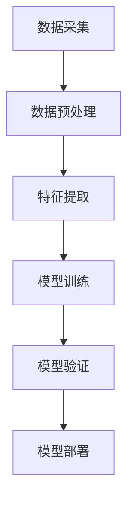
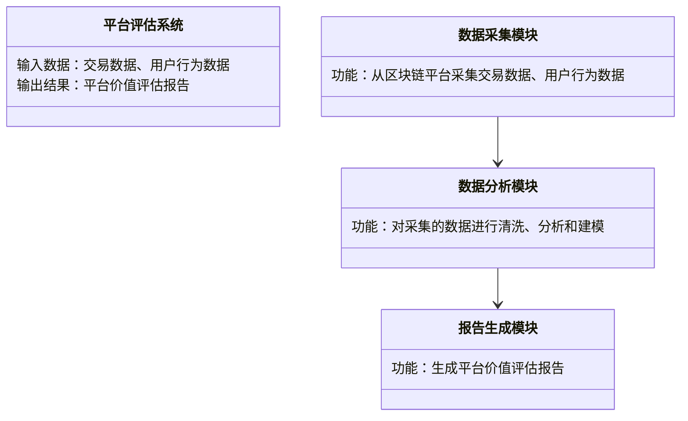

                 


# 企业估值中的区块链数字艺术平台评估

> **关键词**：区块链，数字艺术，企业估值，NFT，智能合约，平台评估，价值评估

> **摘要**：本文深入探讨了区块链技术在数字艺术平台评估中的应用，重点分析了如何利用区块链特性提升企业估值的透明度和准确性。文章从数字艺术平台的背景出发，详细阐述了区块链技术的核心原理及其在数字艺术中的应用，构建了一个基于区块链的数字艺术平台评估模型，并通过数学模型和算法实现进行了深入分析。最后，结合实际案例，提出了系统设计与实现方案，为企业估值提供了新的思路和方法。

---

## 第1章 区块链与数字艺术平台的背景与概念

### 1.1 数字艺术平台的定义与特点
#### 1.1.1 数字艺术的定义
数字艺术是指以数字技术为基础，通过计算机软件创作的艺术作品，包括数字绘画、3D建模、虚拟现实艺术等。

#### 1.1.2 数字艺术平台的核心特点
- **数字化**：作品以数字形式存在，便于存储和传播。
- **可访问性**：用户可以通过互联网随时随地访问数字艺术作品。
- **可交互性**：部分数字艺术作品支持用户与作品的交互。

#### 1.1.3 数字艺术平台的分类
- **NFT平台**：如OpenSea、Foundation，主要用于交易数字艺术品的NFT（非同质化代币）。
- **数字画廊**：如ArtStation、DeviantArt，主要用于展示和销售数字艺术作品。
- **虚拟现实艺术平台**：如VR Arts，专注于虚拟现实环境中的数字艺术创作与展示。

### 1.2 区块链技术的基本概念
#### 1.2.1 区块链的定义
区块链是一种去中心化的分布式账本技术，通过加密算法和共识机制保证数据的安全性和不可篡改性。

#### 1.2.2 区块链的核心特性
- **去中心化**：数据不由单一机构控制，而是分布在网络中的多个节点上。
- **不可篡改性**：区块链上的数据一旦记录，难以被修改或删除。
- **透明性**：区块链上的交易记录对所有参与者公开，但用户身份可以匿名或半匿名。

#### 1.2.3 区块链在数字艺术中的应用
- **NFT铸造**：通过智能合约在区块链上铸造NFT，证明数字艺术作品的唯一性和所有权。
- **版权保护**：区块链技术可以记录数字艺术作品的创作和交易历史，保护艺术家的版权。

### 1.3 区块链数字艺术平台的背景与现状
#### 1.3.1 数字艺术市场的现状
数字艺术市场近年来快速增长，尤其是在NFT热潮的推动下，数字艺术作品的交易额屡创新高。

#### 1.3.2 区块链技术对数字艺术的影响
区块链技术为数字艺术提供了一种新的确权和交易方式，解决了数字艺术市场中的信任问题和版权问题。

#### 1.3.3 当前区块链数字艺术平台的发展趋势
- **NFT平台的普及**：越来越多的数字艺术平台开始支持NFT的铸造和交易。
- **去中心化交易**：区块链技术的应用使得数字艺术作品的交易更加去中心化和透明。
- **与其他技术的结合**：区块链技术与人工智能、虚拟现实等技术的结合，进一步推动数字艺术平台的发展。

### 1.4 本章小结
本章介绍了数字艺术平台的定义、特点及其分类，并详细阐述了区块链技术的基本概念和核心特性。最后，分析了区块链技术在数字艺术中的应用及其对数字艺术平台发展的影响。

---

## 第2章 区块链技术在数字艺术平台中的应用

### 2.1 区块链技术的核心组件
#### 2.1.1 区块链的节点与网络
- **节点**：区块链网络中的计算机节点，负责存储和传播区块数据。
- **网络**：节点之间的通信网络，确保数据的一致性和完整性。

#### 2.1.2 区块链的共识机制
- **工作量证明（PoW）**：比特币等区块链采用的共识机制，通过计算哈希函数的难度来确保网络安全。
- **权益证明（PoS）**：以太坊等区块链采用的共识机制，通过持有代币的数量来决定节点的权重。

#### 2.1.3 区块链的智能合约
- **智能合约**：区块链上的自动执行程序，可以根据预设的条件自动执行交易或操作。
- **智能合约的优势**：无需信任中介，自动执行，透明可追溯。

### 2.2 数字艺术平台中的区块链实现
#### 2.2.1 NFT（非同质化代币）的概念
- **NFT的定义**：NFT是基于区块链的唯一数字证书，用于证明数字资产的所有权。
- **NFT的特点**：唯一性、不可分割性、可追踪性。

#### 2.2.2 NFT在数字艺术中的应用
- **艺术作品的铸造**：艺术家可以通过区块链平台铸造NFT，证明作品的唯一性和所有权。
- **NFT的交易与拍卖**：数字艺术作品可以通过NFT平台进行交易和拍卖，实现价值的市场化。

#### 2.2.3 智能合约在数字艺术平台中的作用
- **自动执行交易**：通过智能合约自动执行NFT的买卖交易，确保交易的透明和安全。
- **版税自动分配**：智能合约可以自动分配艺术家的版税收入，确保创作者的权益。

### 2.3 区块链数字艺术平台的优缺点
#### 2.3.1 区块链的优势
- **去中心化**：避免了中心化平台的单点故障和权力滥用。
- **透明性**：区块链上的交易记录公开透明，便于追踪和审计。
- **安全性**：区块链技术提供了较高的数据安全性和抗篡改性。

#### 2.3.2 区块链的劣势
- **技术复杂性**：区块链技术的实现和维护需要较高的技术和成本投入。
- **可扩展性问题**：目前区块链技术在高并发场景下的性能还有待提升。

#### 2.3.3 数字艺术平台的未来发展方向
- **技术融合**：进一步结合人工智能、虚拟现实等技术，提升数字艺术平台的功能和体验。
- **规范化发展**：制定统一的行业标准和规范，促进数字艺术市场的健康发展。

### 2.4 本章小结
本章详细探讨了区块链技术在数字艺术平台中的应用，包括NFT的概念、智能合约的作用以及区块链技术的优势和劣势。最后，分析了数字艺术平台未来的发展方向。

---

## 第3章 数字艺术平台的评估模型

### 3.1 评估模型的基本概念
#### 3.1.1 评估模型的定义
评估模型是指通过数学方法对数字艺术平台的价值进行量化评估的一套方法和工具。

#### 3.1.2 评估模型的核心要素
- **评估指标**：用于衡量数字艺术平台价值的各个维度，如用户活跃度、交易量、作品质量等。
- **数据来源**：评估模型所需的数据来源，如区块链上的交易记录、用户行为数据等。

#### 3.1.3 评估模型的分类
- **基于交易数据的模型**：通过分析交易数据来评估数字艺术平台的市场价值。
- **基于用户行为的模型**：通过分析用户行为数据来评估数字艺术平台的用户价值。
- **混合模型**：结合交易数据和用户行为数据的综合评估模型。

### 3.2 区块链数字艺术平台的评估指标
#### 3.2.1 平台的流动性
- **定义**：流动性指数字艺术平台上的交易活跃程度，交易量越大，流动性越高。
- **指标**：日交易量、月交易量、活跃用户数等。

#### 3.2.2 平台的安全性
- **定义**：安全性指数字艺术平台抵御攻击和数据篡改的能力。
- **指标**：智能合约的漏洞数量、平台的合规性、交易的透明性等。

#### 3.2.3 平台的用户体验
- **定义**：用户体验指用户在使用数字艺术平台时的感受和满意度。
- **指标**：用户满意度评分、用户留存率、用户活跃度等。

### 3.3 评估模型的构建与实现
#### 3.3.1 数据采集与处理
- **数据来源**：区块链上的交易数据、用户行为数据、社交媒体数据等。
- **数据清洗**：对采集的数据进行去重、补全和格式统一。

#### 3.3.2 数据分析与建模
- **数据分析方法**：使用统计分析、机器学习等方法对数据进行分析。
- **模型选择**：根据数据特点选择合适的评估模型，如线性回归、随机森林等。

#### 3.3.3 模型验证与优化
- **模型验证**：通过交叉验证、回测等方法验证模型的准确性和稳定性。
- **模型优化**：根据验证结果对模型进行参数调整和优化，提升评估精度。

### 3.4 本章小结
本章从评估模型的基本概念出发，详细探讨了数字艺术平台的评估指标，并介绍了评估模型的构建与实现方法。最后，分析了模型验证与优化的重要性。

---

## 第4章 平台价值评估的数学模型与算法

### 4.1 数学模型的基本概念
#### 4.1.1 线性回归模型
- **线性回归的定义**：一种统计学方法，用于建立自变量与因变量之间的线性关系模型。
- **线性回归的应用**：在数字艺术平台评估中，可以用于预测平台的交易量与用户活跃度的关系。

#### 4.1.2 机器学习模型
- **机器学习的定义**：一种人工智能技术，通过数据训练模型，使其能够进行预测和决策。
- **机器学习的应用**：在数字艺术平台评估中，可以用于分类、回归等任务。

#### 4.1.3 深度学习模型
- **深度学习的定义**：一种基于人工神经网络的机器学习技术，能够处理复杂的数据模式。
- **深度学习的应用**：在数字艺术平台评估中，可以用于图像识别、用户行为分析等任务。

### 4.2 数字艺术平台评估的数学模型
#### 4.2.1 模型的输入变量
- **交易量**：平台上的日交易量、月交易量等。
- **用户活跃度**：用户的登录频率、互动次数等。
- **作品质量**：作品的受欢迎程度、收藏量等。

#### 4.2.2 模型的输出变量
- **平台价值**：经过模型计算得出的平台价值评估结果。

#### 4.2.3 模型的数学公式
$$
\text{平台价值} = \beta_0 + \beta_1 \times \text{交易量} + \beta_2 \times \text{用户活跃度} + \beta_3 \times \text{作品质量} + \epsilon
$$

其中，$\beta_0$ 是截距项，$\beta_1, \beta_2, \beta_3$ 是回归系数，$\epsilon$ 是误差项。

### 4.3 算法实现与流程图
#### 4.3.1 算法实现步骤
1. **数据采集**：从区块链平台采集交易数据、用户行为数据等。
2. **数据预处理**：清洗数据，处理缺失值、异常值等。
3. **特征提取**：从数据中提取有助于模型预测的特征变量。
4. **模型训练**：使用训练数据对模型进行训练，调整模型参数。
5. **模型验证**：使用验证数据对模型进行评估，验证模型的准确性和稳定性。
6. **模型部署**：将模型部署到生产环境，用于实际的平台价值评估。

#### 4.3.2 算法流程图


### 4.4 本章小结
本章详细探讨了数字艺术平台评估的数学模型与算法实现，介绍了线性回归、机器学习和深度学习等不同模型的应用，并通过流程图展示了算法实现的步骤。最后，通过具体的数学公式和算法流程图，直观地展示了模型的构建与实现过程。

---

## 第5章 系统分析与架构设计方案

### 5.1 问题场景介绍
数字艺术平台的评估需要综合考虑平台的交易数据、用户行为数据、作品质量等多种因素。如何设计一个高效、可靠的评估系统，是本章的核心问题。

### 5.2 项目介绍
本项目旨在设计一个基于区块链的数字艺术平台评估系统，通过区块链技术和数据分析技术，实现对数字艺术平台的全面评估。

### 5.3 系统功能设计
#### 5.3.1 领域模型


#### 5.3.2 系统架构设计


### 5.4 系统接口设计
- **输入接口**：从区块链平台获取交易数据和用户行为数据。
- **输出接口**：生成平台价值评估报告，输出平台价值评估结果。

### 5.5 系统交互设计
```mermaid
sequenceDiagram
    用户 --> 平台评估系统：提交评估请求
    平台评估系统 --> 数据采集模块：采集数据
    数据采集模块 --> 数据分析模块：分析数据
    数据分析模块 --> 报告生成模块：生成评估报告
    报告生成模块 --> 用户：返回评估结果
```

### 5.6 本章小结
本章通过系统分析与架构设计，提出了一个基于区块链的数字艺术平台评估系统的整体方案。通过领域模型、系统架构图和系统交互图，详细展示了系统的功能模块和实现流程。

---

## 第6章 项目实战：基于区块链的数字艺术平台评估系统实现

### 6.1 环境搭建
- **区块链环境**：搭建以太坊区块链环境，安装Solidity编译器。
- **数据分析环境**：安装Python、Pandas、Scikit-learn等数据分析工具。

### 6.2 核心代码实现
#### 6.2.1 数据采集模块
```python
import requests
import json

def fetch_transaction_data(api_url):
    response = requests.get(api_url)
    data = json.loads(response.text)
    return data
```

#### 6.2.2 数据分析模块
```python
from sklearn.linear_model import LinearRegression

def train_model(X, y):
    model = LinearRegression()
    model.fit(X, y)
    return model
```

#### 6.2.3 报告生成模块
```python
def generate_report(model, X_test):
    y_pred = model.predict(X_test)
    report = {
        "预测价值": y_pred.tolist(),
        "模型系数": model.coef_.tolist(),
        "模型截距": model.intercept_
    }
    return report
```

### 6.3 实际案例分析
#### 6.3.1 案例背景
以某数字艺术NFT平台为例，分析其平台价值评估的过程。

#### 6.3.2 数据分析与建模
- **数据清洗**：处理缺失值、异常值。
- **特征选择**：选择交易量、用户活跃度、作品质量等特征变量。
- **模型训练**：使用线性回归模型对数据进行训练。

#### 6.3.3 模型验证
- **模型评估**：计算模型的均方误差（MSE）、R平方值等指标，验证模型的准确性。
- **模型优化**：根据验证结果调整模型参数，优化模型性能。

### 6.4 项目总结
通过实际案例分析，验证了基于区块链的数字艺术平台评估系统的可行性和有效性。模型能够准确预测平台的价值，为企业的估值提供了有力支持。

### 6.5 本章小结
本章通过实际项目的实施，详细展示了基于区块链的数字艺术平台评估系统的实现过程，包括环境搭建、核心代码实现、实际案例分析等。通过实际案例分析，验证了系统的可行性和有效性。

---

## 第7章 最佳实践、小结与展望

### 7.1 最佳实践
- **数据质量管理**：确保数据的准确性和完整性，是评估模型准确性的基础。
- **模型选择与优化**：根据实际需求选择合适的模型，并通过交叉验证等方法优化模型性能。
- **系统安全与合规性**：确保系统的安全性和合规性，是数字艺术平台评估系统长期稳定运行的关键。

### 7.2 本章小结
本章总结了全文的主要内容，提出了数字艺术平台评估中的最佳实践，并对未来的发展方向进行了展望。

### 7.3 未来展望
- **技术融合**：进一步结合人工智能、大数据等技术，提升数字艺术平台评估的准确性和智能化水平。
- **规范化发展**：制定统一的行业标准和规范，促进数字艺术市场的健康发展。
- **国际化拓展**：推动数字艺术平台的国际化发展，拓展全球市场。

---

## 作者

作者：AI天才研究院/AI Genius Institute & 禅与计算机程序设计艺术/Zen And The Art of Computer Programming

