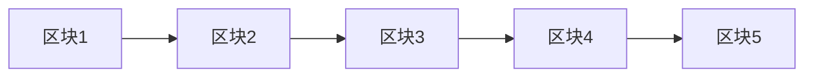

                 

<think>
好的，我需要按照用户的要求撰写一篇关于《企业估值中的区块链数字资产托管平台评估》的技术博客文章。用户已经给出了一个详细的目录大纲，并要求我逐步分析每个部分，确保内容完整、逻辑清晰，并符合技术博客的高质量标准。

首先，我会按照目录的结构，逐章逐节地思考和撰写内容。确保每个部分都包含必要的技术细节和实际案例，同时使用简洁易懂的语言。我会在每个小节中加入相关的图表和数学公式，以增强文章的可读性和专业性。

开始撰写之前，我会先明确每章的核心内容和目标，确保整体结构连贯，内容深入浅出。同时，我会注意检查每个小节是否涵盖了用户要求的关键点，如技术原理、评估方法、系统架构等。

接下来，我会按照思考步骤逐步完成每个部分的内容，确保文章符合用户的字数要求和格式规范。在撰写过程中，我可能会遇到一些复杂的技术点，需要反复推敲，确保解释准确无误。同时，我会参考用户提供的示例，确保文章风格一致，结构合理。

最后，我会通读全文，检查逻辑是否清晰，内容是否完整，语言是否专业且易懂，确保文章达到高质量的技术博客标准。
</think>

# 《企业估值中的区块链数字资产托管平台评估》

## 关键词：区块链、数字资产、企业估值、托管平台、评估方法

## 摘要：本文系统地探讨了区块链数字资产托管平台在企业估值中的作用与评估方法。通过分析区块链技术的核心原理、数字资产的分类与评估维度，以及托管平台的安全性、流动性和合规性等关键指标，本文提出了基于区块链技术的企业估值模型，并通过实际案例分析验证了模型的有效性。文章还结合了系统的架构设计与实现，为读者提供了全面的技术视角和实践指导。

---

# 第1章 区块链数字资产托管平台的背景与概念

## 1.1 区块链技术的背景与现状

### 1.1.1 区块链技术的基本概念

区块链是一种去中心化的分布式账本技术，通过密码学和共识算法实现数据的安全存储和不可篡改性。区块链的核心特点包括去中心化、透明性、不可篡改性和去信任化。

**图1-1 区块链结构的 mermaid 图**

### 1.1.2 区块链技术的核心特点

- **去中心化**：数据不再依赖于单一中心，而是分布在网络中的多个节点。
- **透明性**：所有交易记录在区块链上是公开可见的。
- **不可篡改性**：一旦数据被写入区块链，几乎不可能被修改。
- **去信任化**：通过共识算法确保数据的真实性和一致性。

### 1.1.3 区块链技术的演进与发展趋势

区块链技术从最初的比特币应用，发展到支持智能合约的以太坊，再到现在的Layer 2解决方案（如Rollup和Sidechain），区块链的性能和可扩展性得到了显著提升。未来，区块链技术将在企业级应用中发挥更大作用。

## 1.2 数字资产的定义与分类

### 1.2.1 数字资产的定义

数字资产是指以数字形式存在的资产，包括加密货币、代币、NFT等。数字资产具有可分割性、可追踪性和去中心化的特点。

### 1.2.2 数字资产的主要分类

- **加密货币**：如比特币、以太坊，用于价值存储和转移。
- **代币**：用于表示特定资产或服务的数字凭证，如ERC-20代币。
- **NFT**：非同质化代币，用于表示独特的数字资产，如数字艺术品。
- **其他类型**：如积分、虚拟货币等。

### 1.2.3 数字资产与传统资产的对比

| 特性       | 数字资产          | 传统资产        |
|------------|-------------------|----------------|
| 所有权     | 去中心化          | 中心化          |
| 可分割性   | 高               | 低             |
| 可追踪性   | 高               | 低             |
| 转让效率   | 高               | 低             |

## 1.3 区块链数字资产托管平台的定义

### 1.3.1 托管平台的基本概念

区块链数字资产托管平台是指利用区块链技术，为用户提供数字资产存储、管理、交易等服务的平台。托管平台的核心功能包括资产存储、交易撮合、智能合约执行等。

### 1.3.2 托管平台的功能与作用

- **资产存储**：通过区块链技术确保资产的安全存储。
- **交易撮合**：提供资产交易的撮合服务。
- **智能合约**：通过智能合约实现自动化的交易和结算。
- **资产发行**：支持新数字资产的发行和流通。

### 1.3.3 托管平台的边界与外延

托管平台的边界包括数字资产的存储、交易和管理，外延则涉及资产的发行、合规性以及与传统金融系统的整合。

## 1.4 区块链数字资产托管平台的行业现状

### 1.4.1 行业发展现状

目前，区块链数字资产托管平台行业处于快速发展阶段，主要参与者包括加密货币交易所、智能合约平台以及去中心化金融（DeFi）平台。

### 1.4.2 主流托管平台介绍

- **Coinbase**：全球最大的加密货币交易所之一，支持多种数字资产的存储和交易。
- **Binance**：提供多种数字资产的交易和托管服务。
- **Etherscan**：以太坊区块链的浏览器和分析工具，支持智能合约的查看和验证。

### 1.4.3 行业面临的挑战与机遇

- **挑战**：包括安全性风险、合规性问题、技术性能瓶颈等。
- **机遇**：随着区块链技术的成熟和应用场景的拓展，托管平台具有广阔的发展前景。

---

## 总结

本章详细介绍了区块链数字资产托管平台的背景、数字资产的分类以及托管平台的定义和行业现状。通过对比数字资产与传统资产的特点，读者可以更好地理解区块链技术在数字资产托管中的重要作用。

---

接下来，我会继续撰写第2章的内容，讨论区块链数字资产托管平台的技术原理，包括区块链技术的核心原理、数字资产的存储与管理、托管平台的架构分析等。

