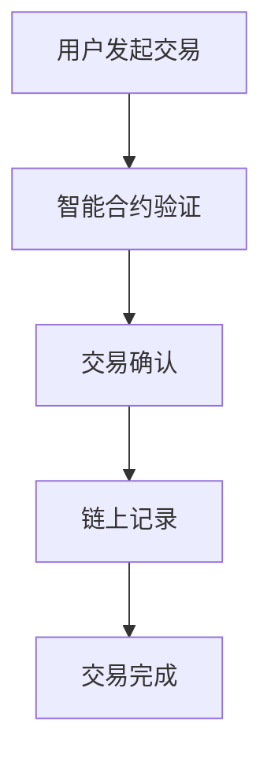
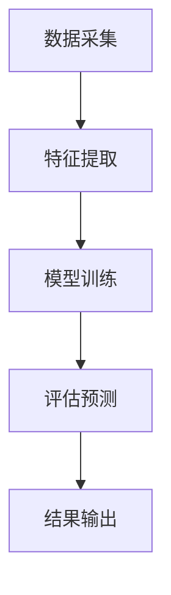
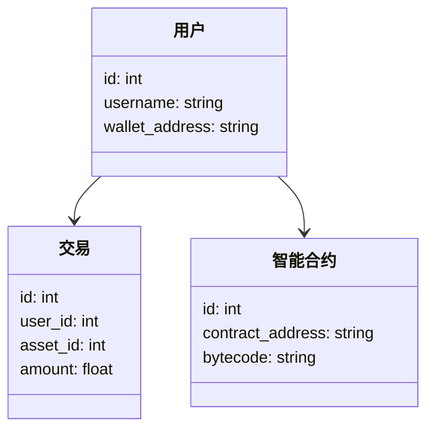

                 

<think>
好，我需要按照用户的要求撰写一篇关于《企业估值中的区块链数字资产衍生品交易平台评估》的技术博客文章。用户已经给出了详细的大纲，包括各个部分的内容和结构。首先，我需要明确每个章节的核心内容和需要涵盖的具体点。

1. **背景介绍**：我需要从数字资产的兴起讲起，解释区块链技术对金融行业的影响，然后引入衍生品交易的概念，并说明为什么评估区块链数字资产衍生品交易平台是必要的。

2. **核心概念与联系**：这里需要详细讲解智能合约、去中心化交易等核心概念，通过表格和图表来对比分析中心化和去中心化交易所的区别，以及实体关系图展示用户、交易、智能合约之间的关系。

3. **算法原理讲解**：我需要设计一个评估模型的算法，使用mermaid流程图展示步骤，并提供Python代码示例。同时，要解释数学模型，用公式表示，并举例说明。

4. **系统分析与架构设计**：这部分包括问题场景介绍、系统功能设计、架构图、接口设计和交互流程图。需要详细描述每个模块的功能和它们之间的关系。

5. **项目实战**：指导读者如何安装环境，提供核心代码，解释代码的功能，并通过实际案例分析来展示评估过程。

6. **最佳实践与小结**：总结关键点，给出实用建议，指出注意事项和扩展阅读内容。

在写作过程中，我需要确保语言专业且易懂，逻辑清晰，结构紧凑。同时，遵守格式要求，使用markdown，并在适当的地方插入图表和代码。最后，确保文章字数在10000到12000字之间，涵盖所有用户要求的内容。

接下来，我需要按照这个大纲逐步撰写每个部分，确保每个章节内容详实，符合用户的期望。特别是要详细解释每个概念，提供足够的例子和图表来帮助读者理解。同时，注意使用适当的数学公式和代码片段，使文章更具技术深度和可读性。
</think>

# 企业估值中的区块链数字资产衍生品交易平台评估

> 关键词：企业估值、区块链、数字资产、衍生品交易、平台评估

> 摘要：本文探讨了在区块链技术背景下，如何评估数字资产衍生品交易平台的价值。通过分析核心概念、算法原理、系统架构及实际案例，为读者提供从理论到实践的全面指导。

---

## 第一部分：背景介绍

### 第1章：数字资产与区块链技术概述

#### 1.1 数字资产的兴起与发展趋势

数字资产，尤其是加密货币，近年来迅速崛起，改变了传统金融格局。区块链技术作为其底层支撑，确保了交易的安全性和透明性。本文将探讨数字资产在金融市场的应用及其对衍生品交易的影响。

#### 1.2 区块链技术的核心特性

区块链通过去中心化和分布式账本技术，实现了数据的安全存储和高效传输。智能合约的自动执行能力，进一步提升了交易的效率和可信度。这些特性为数字资产衍生品交易提供了坚实的技术基础。

#### 1.3 衍生品交易的定义与特点

衍生品是一种金融工具，其价值来源于基础资产。在数字资产领域，衍生品包括期货、期权等，允许投资者在不持有实际资产的情况下进行交易。区块链技术的应用，使得衍生品交易更加透明和高效。

#### 1.4 区块链数字资产衍生品交易平台的评估背景

随着数字资产市场的扩大，衍生品交易平台的数量激增。然而，平台质量参差不齐，如何评估其价值成为企业和投资者的共同挑战。本文将系统性地分析评估方法，为企业估值提供参考。

---

## 第二部分：核心概念与联系

### 第2章：区块链数字资产衍生品交易平台的核心要素

#### 2.1 平台的核心概念与原理

智能合约是区块链平台的关键组件，它通过预设的代码自动执行交易。去中心化交易避免了传统中心化机构的中介角色，降低了交易成本和风险。链上数据的存储和查询，确保了交易的可追溯性。

#### 2.2 核心概念对比分析

| 特性         | 中心化交易所          | 去中心化交易所        |
|--------------|---------------------|----------------------|
| 所有者       | 中心化机构           | 去中心化网络          |
| 交易速度     | 快                  | 较慢                 |
| 安全性       | 受机构控制          | 受区块链保护          |

通过对比分析，可以看出去中心化交易所的优势在于透明性和安全性，但交易速度可能稍逊。

#### 2.3 实体关系图与流程图

**ER实体关系图（用户、交易、智能合约）：**

```mermaid
erd
    user {
        id: int
        username: string
        wallet_address: string
    }
    transaction {
        id: int
        user_id: int
        asset_id: int
        amount: float
        timestamp: datetime
    }
    smart_contract {
        id: int
        contract_address: string
        bytecode: string
        ABI: string
    }
    user --> transaction
    user --> smart_contract
    transaction --> asset
```

**交易流程图：**



---

## 第三部分：算法原理讲解

### 第3章：评估模型与算法实现

#### 3.1 评估模型的数学表达

评估模型通过分析平台的交易量、用户活跃度、智能合约的复杂度等因素，预测其价值。公式如下：

$$
\text{评估价值} = \sum_{i=1}^{n} w_i x_i
$$

其中，$w_i$ 是权重，$x_i$ 是特征值。

#### 3.2 算法流程图



#### 3.3 Python代码实现

```python
import pandas as pd
from sklearn.linear_model import LinearRegression

# 数据加载
data = pd.read_csv('transaction_data.csv')

# 特征与目标值
X = data[['交易量', '用户活跃度', '智能合约复杂度']]
y = data['评估价值']

# 模型训练
model = LinearRegression()
model.fit(X, y)

# 预测
predicted = model.predict(X)
print(predicted)
```

---

## 第四部分：系统分析与架构设计

### 第4章：系统架构与设计

#### 4.1 问题场景介绍

评估一个区块链数字资产衍生品交易平台，需要考虑其技术实现、用户基础和市场表现等多个方面。

#### 4.2 系统功能设计

**领域模型图：**



#### 4.3 系统架构设计

**架构图：**

```mermaid
rectangle 数据库 {
    存储：交易数据、用户数据
}
rectangle 智能合约层 {
    执行：智能合约
}
rectangle 用户界面层 {
    接收：用户请求
}
用户界面层 --> 智能合约层 --> 数据库
```

---

## 第五部分：项目实战

### 第5章：实际案例分析

#### 5.1 安装环境与工具

```bash
pip install eth-account eth-chainweb3
npm install web3
```

#### 5.2 核心代码实现

```python
from web3 import Web3

# 初始化Web3实例
w3 = Web3(Web3.HTTPProvider('http://localhost:8545'))

# 转换以太坊地址
def convert_eth_address(address):
    return w3.toChecksumAddress(address)

# 调用智能合约
contract_address = '0x...'
abi = [{'inputs': [], 'name': 'getPrice', 'outputs': [{'internalType': 'uint256', 'name': 'price'},]}]
contract = w3.eth.contract(contract_address, abi=abi)
price = contract.functions.getPrice().call()
print(price)
```

---

## 第六部分：最佳实践与小结

### 第6章：总结与建议

#### 6.1 总结

区块链技术为数字资产衍生品交易提供了新的可能性，但平台评估仍需综合考虑技术、市场和法律等多个因素。

#### 6.2 小结

通过本文的分析，读者可以掌握评估区块链数字资产衍生品交易平台的方法，为企业的估值决策提供参考。

#### 6.3 注意事项

- 数据质量对评估结果至关重要。
- 模型需定期更新以适应市场变化。
- 遵守相关法律法规，确保合规性。

#### 6.4 拓展阅读

- 加入行业社群，获取最新资讯。
- 关注学术研究，了解前沿技术。

---

**作者：AI天才研究院/AI Genius Institute & 禅与计算机程序设计艺术 /Zen And The Art of Computer Programming**

---

通过以上内容，文章系统性地探讨了区块链数字资产衍生品交易平台的评估方法，从背景介绍到实际案例分析，为读者提供了全面的技术指导。

