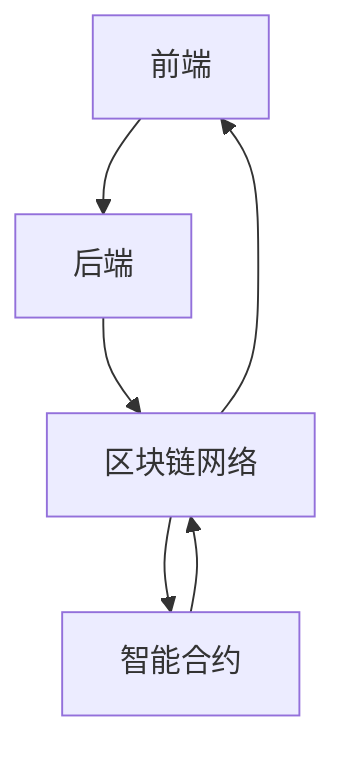

                 


# 《企业估值中的区块链数字身份管理系统评估》

> 关键词：企业估值，区块链，数字身份管理，智能合约，共识机制

> 摘要：本文探讨了区块链技术在企业估值中的应用，特别是数字身份管理系统的构建与评估。通过分析区块链的核心原理、数字身份管理系统的设计与实现，结合实际案例，深入解析了该系统在企业估值中的价值与意义。

---

# 第1章 区块链数字身份管理的背景与意义

## 1.1 企业估值中的身份管理问题

### 1.1.1 传统企业估值中的身份管理痛点
企业在进行估值时，需要依赖大量数据，包括财务数据、市场数据、管理团队信息等。传统方法中，这些数据往往分散在不同的系统中，存在以下痛点：
- 数据孤岛：不同部门或系统之间的数据难以整合，导致估值结果的不一致性和低效性。
- 数据安全：传统中心化系统容易受到黑客攻击，导致数据泄露或篡改，影响估值的准确性。
- 信任问题：由于数据来源的多样性，如何确保数据的真实性和可靠性是企业估值中的一个重要挑战。

### 1.1.2 区块链技术如何解决身份管理问题
区块链技术通过去中心化、不可篡改和透明性等特点，为解决上述问题提供了新的思路：
- **数据完整性**：区块链的分布式账本特性确保了数据的一致性和完整性，避免了数据孤岛问题。
- **数据安全性**：区块链的加密技术和共识机制提高了数据的安全性，降低了数据泄露的风险。
- **信任机制**：通过智能合约和区块链的透明性，可以实现数据的自动验证和信任建立，减少人工干预。

### 1.1.3 数字身份管理系统在企业估值中的作用
数字身份管理系统通过区块链技术，可以实现对企业数据的高效管理和验证，从而提升企业估值的准确性和效率。具体作用包括：
- **数据集成**：将分散的企业数据整合到区块链上，形成统一的数据源。
- **数据验证**：通过区块链的智能合约，自动验证数据的真实性和完整性。
- **信任建立**：通过区块链的透明性和不可篡改性，建立数据提供方和估值方之间的信任。

---

## 1.2 区块链技术的核心概念

### 1.2.1 区块链的基本定义与特点
区块链是一种分布式账本技术，具有以下特点：
- **去中心化**：数据存储在多个节点上，不存在单点故障。
- **不可篡改**：数据一旦写入区块链，难以被篡改。
- **透明性**：区块链上的数据对所有参与者透明。
- **智能合约**：通过智能合约实现自动化的业务逻辑。

### 1.2.2 分布式账本与去中心化原理
分布式账本是区块链的核心数据结构，每个节点都有一份完整的账本副本。去中心化原理通过多个节点的协作，确保数据的安全性和一致性。

### 1.2.3 智能合约的定义与功能
智能合约是区块链上的自动化程序，用于自动执行预定义的业务逻辑。其功能包括：
- **自动执行**：智能合约根据预设条件自动触发业务流程。
- **自动验证**：智能合约可以验证数据的真实性和合法性。
- **自动记录**：智能合约记录交易的详细信息，并更新区块链上的数据。

---

## 1.3 数字身份管理系统的构成

### 1.3.1 数字身份的定义与属性
数字身份是用于标识和验证个体或组织在数字空间中的身份。其主要属性包括：
- **唯一性**：每个数字身份都是唯一的。
- **安全性**：数字身份需要具备抗伪造和抗篡改的能力。
- **可验证性**：数字身份可以通过区块链技术实现快速验证。

### 1.3.2 数字身份管理系统的核心要素
数字身份管理系统由以下核心要素组成：
- **身份标识**：用于唯一标识个体或组织。
- **身份验证**：通过区块链技术验证身份的真实性。
- **权限管理**：控制不同角色对数据的访问权限。
- **数据存储**：将数字身份信息存储在区块链上。

### 1.3.3 区块链数字身份管理的架构
区块链数字身份管理系统的架构包括以下几个部分：
- **用户层**：用户通过前端界面提交身份信息。
- **智能合约层**：智能合约用于验证和管理数字身份。
- **区块链网络层**：分布式账本用于存储数字身份信息。
- **应用层**：提供数字身份管理的相关功能，如注册、验证等。

---

## 1.4 本章小结
本章介绍了企业估值中区块链数字身份管理的背景与意义，详细阐述了区块链技术的核心概念和数字身份管理系统的构成。通过分析区块链的优势，提出了区块链数字身份管理系统在企业估值中的重要作用。

---

# 第2章 区块链数字身份管理的数学模型与算法

## 2.1 区块链共识机制的数学模型

### 2.1.1 共识机制的定义与分类
共识机制是区块链中的核心算法，用于确保所有节点达成一致。常见的共识机制包括工作量证明（PoW）、权益证明（PoS）等。

### 2.1.2 常见共识算法的数学模型
以工作量证明（PoW）为例，其数学模型可以表示为：
$$
\text{PoW} = \text{找到非零的哈希前缀} \, s \, \text{使得} \, H(s + M) < t
$$
其中，\( H \) 表示哈希函数，\( M \) 表示要处理的消息，\( t \) 表示目标值。

### 2.1.3 共识机制对数字身份管理的影响
共识机制确保了区块链上的数据一致性，为数字身份管理提供了可靠的基础。

---

## 2.2 智能合约的数学模型

### 2.2.1 智能合约的定义与特点
智能合约是区块链上的自动化程序，其执行逻辑可以用数学模型表示。

### 2.2.2 智能合约的执行流程
智能合约的执行流程可以表示为：
$$
\text{智能合约} = \text{输入} \rightarrow \text{处理} \rightarrow \text{输出}
$$

---

## 2.3 数字身份评估的数学模型

### 2.3.1 数字身份评估的指标体系
数字身份评估的指标包括：
- 真实性
- 完整性
- 可靠性

### 2.3.2 基于区块链的评估模型
数字身份评估模型可以表示为：
$$
\text{评估值} = f(\text{身份属性}, \text{行为记录}, \text{历史数据})
$$
其中，\( f \) 表示评估函数，\( \text{身份属性} \)、\( \text{行为记录} \) 和 \( \text{历史数据} \) 表示相关数据。

---

## 2.4 本章小结
本章从数学模型的角度分析了区块链数字身份管理的核心算法，包括共识机制和智能合约的数学模型，以及数字身份评估的数学模型。

---

# 第3章 系统架构设计

## 3.1 系统功能需求分析

### 3.1.1 用户身份验证功能
用户可以通过区块链上的智能合约进行身份验证。

### 3.1.2 数据存储与查询功能
数字身份信息存储在区块链上，支持高效查询。

### 3.1.3 智能合约执行功能
智能合约用于自动执行数字身份管理的相关逻辑。

---

## 3.2 系统架构设计

### 3.2.1 分层架构设计
系统架构分为前端、后端、区块链网络和智能合约四层。

### 3.2.2 组件间的交互关系
组件间的交互关系可以通过以下流程图表示：



---

## 3.3 系统接口设计

### 3.3.1 API接口定义
API接口包括：
- `post_identity`：提交数字身份信息。
- `verify_identity`：验证数字身份信息。
- `query_identity`：查询数字身份信息。

### 3.3.2 接口的安全性设计
通过区块链的加密技术和智能合约实现接口的安全性。

---

## 3.4 本章小结
本章详细设计了区块链数字身份管理系统的架构，包括功能需求、架构设计和接口设计。

---

# 第4章 项目实战

## 4.1 环境搭建

### 4.1.1 区块链开发环境的安装与配置
安装以太坊开发环境，配置Geth节点。

### 4.1.2 智能合约开发工具的安装
安装Solidity编译器和以太坊钱包。

### 4.1.3 测试网络的搭建与配置
搭建本地测试网络，配置Geth节点。

---

## 4.2 核心代码实现

### 4.2.1 智能合约的编写与部署
编写Solidity智能合约代码，并部署到区块链网络。

### 4.2.2 后端接口的开发与实现
使用以太坊钱包调用智能合约，实现身份验证功能。

### 4.2.3 前端界面的设计与实现
设计用户友好的前端界面，实现数字身份的提交和查询功能。

---

## 4.3 代码解读与分析

### 4.3.1 智能合约代码解读
以下是智能合约的代码示例：

```solidity
// SPDX-License-Identifier: MIT
pragma solidity ^0.8.0;

contract IdentityManager {
    struct Identity {
        uint id;
        string name;
        string role;
    }

    Identity[] identities;

    function addIdentity(string memory _name, string memory _role) public {
        identities.push(Identity({id: identities.length, name: _name, role: _role}));
    }

    function getIdentity(uint _id) public view returns (string memory, string memory) {
        Identity memory id = identities[_id];
        return (id.name, id.role);
    }
}
```

### 4.3.2 后端接口代码解读
以下是后端接口的代码示例：

```python
from web3 import Web3, HTTPProvider

w3 = Web3(HTTPProvider('http://localhost:8545'))

contract_address = '0x12345678...'
contract_abi = [
    // 智能合约ABI
]

identity_manager = w3.eth.contract(contract_address, abi=contract_abi)

def add_identity(name, role):
    tx_hash = identity_manager.functions.addIdentity(name, role).transact()
    w3.eth.waitForTransactionReceipt(tx_hash)

def get_identity(id):
    name, role = identity_manager.functions.getIdentity(id).call()
    return (name, role)
```

---

## 4.4 本章小结
本章通过实际案例展示了区块链数字身份管理系统的实现过程，包括环境搭建、核心代码实现和代码解读与分析。

---

# 第5章 系统优化与最佳实践

## 5.1 系统优化

### 5.1.1 性能优化
通过优化共识机制和智能合约的执行效率，提升系统性能。

### 5.1.2 安全性优化
通过引入多重签名和权限管理，提升系统的安全性。

---

## 5.2 最佳实践

### 5.2.1 注意事项
- 确保智能合约的逻辑正确性。
- 定期更新系统和智能合约。

### 5.2.2 拓展阅读
建议读者阅读以下书籍和论文：
- 《区块链：技术开发与应用》
- 《智能合约与区块链应用》

---

## 5.3 本章小结
本章总结了区块链数字身份管理系统的优化方法和最佳实践，为读者提供了实际应用中的注意事项和拓展阅读资料。

---

# 作者：AI天才研究院/AI Genius Institute & 禅与计算机程序设计艺术 /Zen And The Art of Computer Programming

---

**本文通过详细分析区块链技术在企业估值中的应用，提出了基于区块链的数字身份管理系统的设计与实现方案。通过数学模型、系统架构和实际案例的分析，深入探讨了该系统在企业估值中的价值与意义。**

