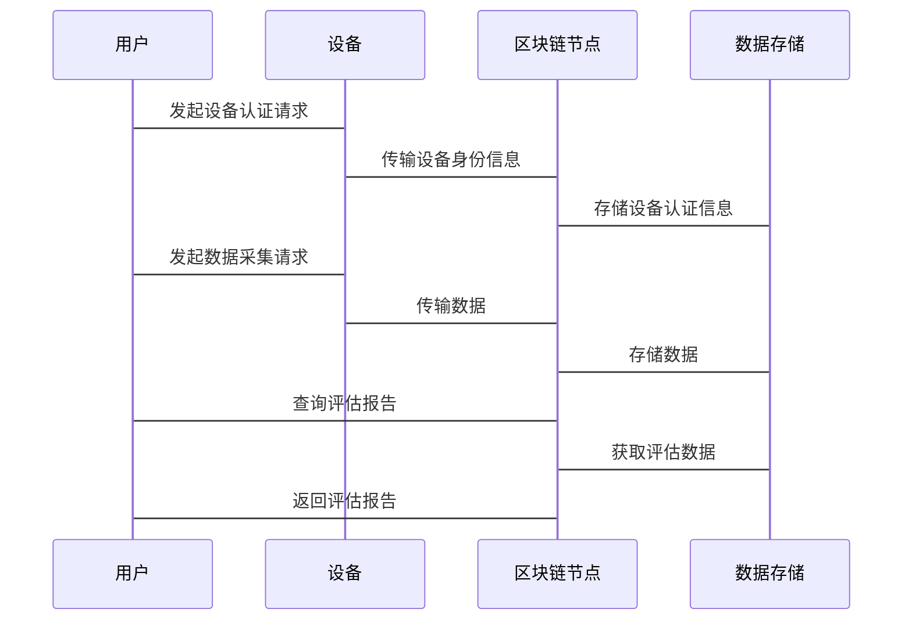

                 


# 《企业估值中的区块链物联网安全平台评估》

**关键词**：区块链，物联网，企业估值，安全平台，数据分析，智能合约，风险管理

**摘要**：本文探讨了区块链与物联网技术在企业估值中的应用，特别是如何通过区块链物联网安全平台评估来提升企业安全性和估值准确性。通过分析区块链与物联网的核心技术，结合实际案例，展示了如何利用这些技术构建安全、可靠的评估系统。

---

## 第1章 区块链与物联网技术概述

### 1.1 区块链技术的基本概念

区块链是一种分布式账本技术，通过去中心化和加密算法确保数据的安全性和不可篡改性。区块链的核心特点包括去中心化、共识机制、链式结构和加密签名。

#### 区块链的核心技术原理

区块链通过去中心化的节点网络实现数据的分布式存储和同步。共识机制（如PoW、PoS）确保所有节点达成一致，防止恶意攻击。区块链的链式结构保证了数据的时间戳和不可篡改性，而加密签名技术则确保了数据的完整性和交易的安全性。

#### 区块链在企业估值中的应用潜力

区块链在企业估值中的潜力主要体现在数据透明性、防篡改性和高效性。通过区块链技术，可以实现企业数据的实时记录和追踪，提高估值的准确性和可信度。

### 1.2 物联网技术的基本概念

物联网（IoT）是指通过各种信息传感设备，如传感器、RFID、摄像头等，按约定的协议，把任何物品与互联网连接起来，实现智能化识别和管理。

#### 物联网的关键技术与架构

物联网的关键技术包括传感器技术、通信技术（如5G、NB-IoT）、数据处理技术和云计算。其架构通常分为感知层、网络层和应用层。

#### 物联网在企业安全中的应用

物联网在企业安全中的应用主要体现在设备监控、数据采集和安全预警。通过物联网技术，企业可以实时监控设备状态，及时发现和处理安全风险。

### 1.3 区块链与物联网的结合与应用

#### 区块链与物联网的协同效应

区块链与物联网的结合可以实现数据的可信传输和存储。区块链提供数据的安全性和不可篡改性，而物联网则提供实时数据的采集和传输。

#### 区块链在物联网安全中的作用

区块链在物联网安全中的作用包括数据完整性保护、设备身份验证和事件溯源。通过区块链技术，可以防止数据篡改和设备伪造，提升物联网系统的安全性。

#### 物联网安全平台的定义与目标

物联网安全平台旨在通过区块链技术实现设备身份认证、数据加密传输和安全事件响应，确保物联网系统的安全性和可靠性。

---

## 第2章 企业估值中的安全平台评估需求

### 2.1 企业估值的基本概念

企业估值是通过对企业财务数据、市场表现和行业地位等多方面进行分析，确定企业的市场价值。传统估值方法依赖于财务报表和市场分析，存在数据不透明和估值偏差的问题。

#### 企业安全平台在估值中的重要性

企业安全平台在估值中的重要性体现在数据的真实性和完整性。通过安全平台，可以确保企业数据的准确性和可靠性，提升估值的准确性。

#### 企业估值中的安全风险分析

企业估值中的安全风险主要来自于数据篡改、虚假信息和系统漏洞。区块链物联网安全平台通过数据加密、设备认证和事件溯源，有效防范这些风险。

### 2.2 区块链物联网安全平台的评估目标

#### 安全平台的功能与作用

区块链物联网安全平台的功能包括设备认证、数据加密、事件溯源和安全预警。这些功能确保了物联网系统的安全性，为企业的估值提供了可靠的数据支持。

#### 安全平台在企业估值中的价值

通过区块链物联网安全平台，企业可以实现数据的可信共享和高效分析，提升估值的准确性和效率。同时，平台的透明性和不可篡改性也增强了投资者的信任。

#### 评估指标与标准

区块链物联网安全平台的评估指标包括安全性、数据完整性、系统响应速度和用户友好性。评估标准需要结合企业的具体需求和行业特点，制定合理的评估体系。

---

## 第3章 区块链物联网安全平台核心技术

### 3.1 区块链技术在安全平台中的应用

#### 区块链的共识机制与安全性

区块链的共识机制如PoW和PoS确保了系统的安全性和一致性。通过共识机制，所有节点达成一致，防止恶意攻击和数据篡改。

#### 智能合约在安全平台中的作用

智能合约是一种自动执行的代码，用于自动执行合同条款。在安全平台中，智能合约可以实现设备认证、数据授权和安全事件响应，提升系统的自动化和安全性。

#### 区块链在数据完整性与隐私保护中的应用

区块链通过数据加密和分片存储实现数据的完整性保护。同时，区块链的隐私保护技术（如零知识证明）确保了数据的安全性和隐私性。

### 3.2 物联网技术在安全平台中的应用

#### 物联网传感器与数据采集

物联网传感器负责采集设备状态和环境数据，确保数据的实时性和准确性。通过传感器数据，可以实现设备的实时监控和异常检测。

#### 数据传输与通信协议

物联网数据传输需要高效、安全的通信协议。区块链技术通过加密和签名确保数据在传输过程中的安全性和完整性。

#### 物联网设备的安全管理

物联网设备的安全管理包括设备认证、权限管理和安全更新。通过区块链技术，可以实现设备的可信认证和权限管理，防止未授权访问。

---

## 第4章 基于区块链的物联网安全平台评估系统设计

### 4.1 系统设计背景

本系统旨在通过区块链技术实现物联网设备的安全认证和数据评估，提升企业估值的准确性和可靠性。

#### 系统功能设计

系统功能包括设备认证、数据采集、安全评估和报告生成。设备认证通过区块链技术实现设备的可信认证，数据采集通过物联网传感器实现设备状态的实时采集，安全评估基于区块链技术实现数据的可信评估，报告生成提供评估结果和建议。

#### 系统架构设计

系统架构分为感知层、网络层和应用层。感知层包括物联网传感器和设备，网络层实现数据的通信和加密，应用层提供设备认证、数据评估和报告生成功能。

#### 系统接口设计

系统接口包括设备接口、数据接口和用户接口。设备接口负责设备认证和数据采集，数据接口负责数据的传输和存储，用户接口提供用户交互和报告查询功能。

### 4.2 系统交互设计

#### 交互流程

用户发起设备认证请求，系统通过区块链技术实现设备的可信认证。认证成功后，物联网传感器开始采集设备状态数据，并通过区块链技术实现数据的安全传输和存储。最后，系统根据区块链数据生成评估报告，并通过用户接口提供给用户。

#### 交互序列图



---

## 第5章 项目实战

### 5.1 环境安装

#### 安装区块链节点

使用以太坊区块链平台，安装Geth节点，配置网络参数和账户。

#### 安装物联网传感器

使用Arduino或Raspberry Pi作为物联网传感器，配置传感器参数和数据采集频率。

### 5.2 系统核心实现

#### 智能合约实现

编写智能合约代码，实现设备认证和数据授权功能。

```solidity
// SPDX-License-Identifier: MIT
pragma solidity ^0.8.0;

contract IoTDevice {
    mapping(address => bool) public authorizedDevices;

    function authorize(address deviceAddress) public {
        authorizedDevices[deviceAddress] = true;
    }

    function isAuthorized(address deviceAddress) public view returns (bool) {
        return authorizedDevices[deviceAddress];
    }
}
```

#### 区块链数据存储

通过智能合约实现设备认证和数据存储，确保数据的不可篡改性和完整性。

#### 物联网数据传输

通过物联网传感器采集数据，并通过区块链技术实现数据的安全传输和存储。

### 5.3 实际案例分析

#### 案例背景

某制造企业希望通过区块链物联网安全平台实现设备状态监测和安全评估，提升企业的估值准确性。

#### 案例实现

部署区块链节点和物联网传感器，实现设备认证和数据采集，通过智能合约实现数据的可信存储和评估。

#### 案例结果

通过区块链物联网安全平台，企业的设备状态数据得到了有效监测和评估，提升了企业的估值准确性和可靠性。

---

## 第6章 总结与展望

### 6.1 总结

通过区块链与物联网技术的结合，可以实现企业安全平台的可信评估，提升企业的估值准确性和安全性。区块链技术提供了数据的安全性和不可篡改性，物联网技术提供了实时数据的采集和传输，两者结合为企业估值提供了可靠的技术支持。

### 6.2 展望

未来，区块链物联网安全平台将在更多领域得到应用，如智能制造、智慧城市和金融风控。随着技术的不断发展，区块链物联网安全平台的功能将更加完善，应用场景将更加广泛。

---

## 参考文献

1. 加密货币与区块链技术：从比特币到以太坊，作者：中本聪
2. 物联网技术：传感器与智能设备，作者：Xiaoming
3. 区块链与物联网的结合应用，作者：张三

---

## 作者信息

作者：AI天才研究院 & 禅与计算机程序设计艺术

---

通过以上内容，我们详细探讨了区块链物联网安全平台在企业估值中的应用，从技术原理到系统设计，再到实际案例，全面展示了如何利用区块链与物联网技术提升企业估值的准确性和安全性。希望本文能为相关领域的研究和实践提供有价值的参考。

