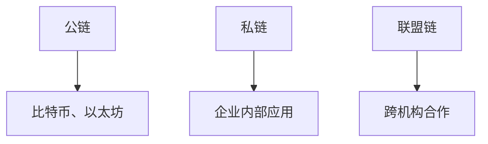
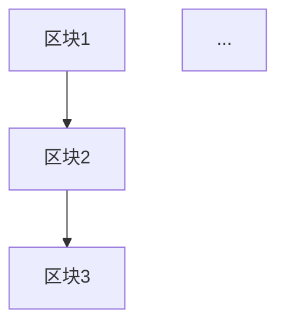
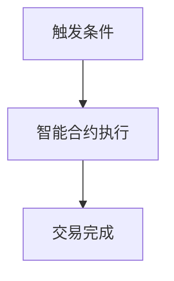
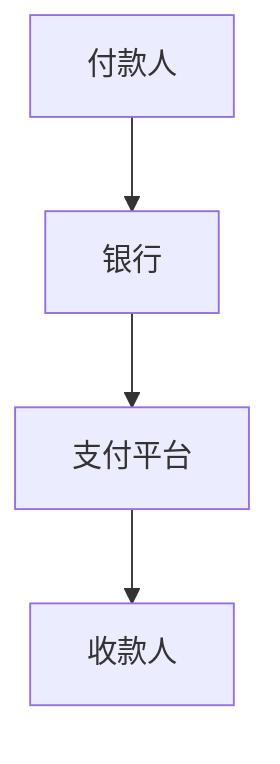
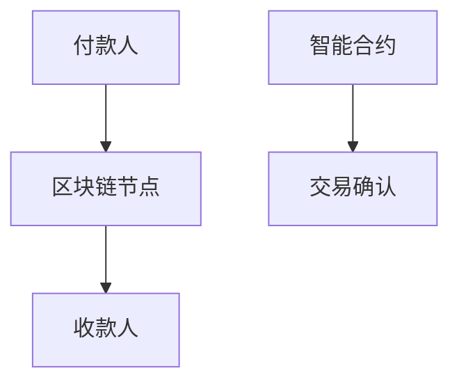
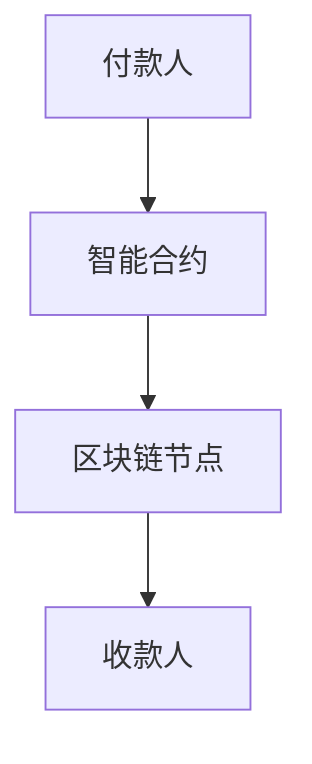
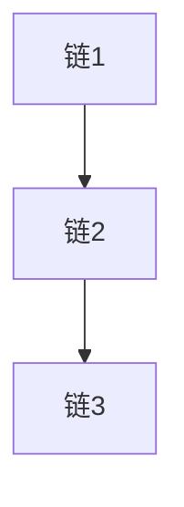
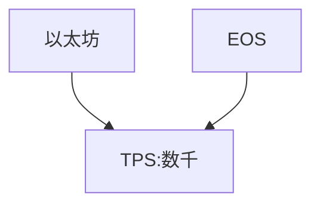
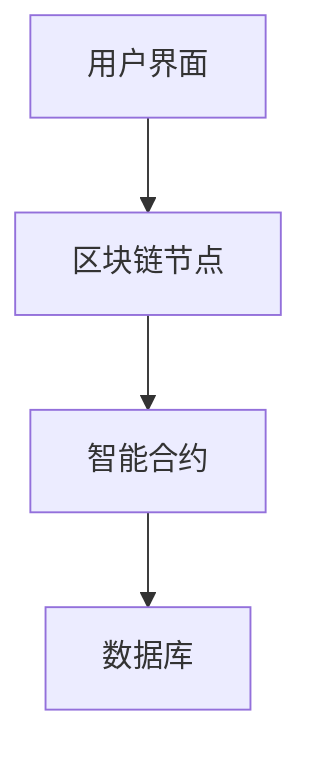

                 


# 企业估值中的区块链跨境支付系统评估

> **关键词**: 区块链, 跨境支付, 企业估值, 智能合约, 加密算法, 系统架构

> **摘要**: 区块链技术在跨境支付中的应用正逐渐改变传统的支付模式，为企业估值带来了新的挑战和机遇。本文通过详细分析区块链跨境支付系统的原理、架构和实际应用，探讨其对企业估值的影响，并提出系统的评估指标和方法。文章内容包括区块链技术核心原理、跨境支付业务流程、系统架构设计、项目实战案例以及系统评估的最佳实践。

---

## 第1章: 区块链与跨境支付概述

### 1.1 区块链技术的基本概念

#### 1.1.1 区块链的定义与核心特点
区块链是一种去中心化的分布式账本技术，具有去中心化、不可篡改、透明性等特点。它通过密码学算法确保数据的安全性，通过共识机制保证数据的一致性。

**特点对比表**：

| **特性**         | **传统中心化系统** | **区块链系统** |
|------------------|---------------------|----------------|
| 中心化           | 是                 | 否             |
| 数据控制权       | 第三方控制         | 用户自控       |
| 透明性           | 低                 | 高             |
| 安全性           | 依赖第三方          | 去信任化       |

#### 1.1.2 区块链的分类与应用场景
区块链主要分为公链、私链和联盟链。在跨境支付中，联盟链因其性能和隐私性优势，更适合企业级应用。

**区块链分类图**:



#### 1.1.3 区块链在跨境支付中的潜力
区块链技术能够降低跨境支付的成本、提高效率并增强透明度。通过智能合约自动执行支付流程，减少人工干预，提升支付速度。

---

### 1.2 跨境支付的现状与挑战

#### 1.2.1 跨境支付的传统模式与问题
传统的跨境支付模式依赖中心化机构（如银行、支付平台），存在以下问题：
- **高成本**：跨境支付涉及多个中间机构，手续费高昂。
- **低效率**：支付流程复杂，到账时间长。
- **不透明**：交易过程缺乏透明性，容易出现纠纷。

#### 1.2.2 区块链技术如何解决跨境支付的痛点
区块链技术通过去中心化和自动化特点，解决了传统跨境支付的痛点：
- **降低成本**：减少中间机构的参与，降低手续费。
- **提高效率**：自动化交易流程，缩短支付时间。
- **增强透明度**：区块链记录所有交易，可追溯性强。

#### 1.2.3 跨境支付的未来发展趋势
未来，跨境支付将更加依赖区块链技术，实现无缝连接和实时结算。随着技术的进步，跨境支付将更加便捷、高效和安全。

---

## 第2章: 区块链技术的核心原理

### 2.1 区块链的数据结构

#### 2.1.1 区块链的基本数据结构
区块链由多个区块组成，每个区块包含交易数据和一个指向前一区块的哈希指针。

**区块链结构图**:



#### 2.1.2 区块的组成与哈希计算
每个区块包含以下内容：
- 交易数据
- 时间戳
- 前一区块的哈希值
- 当前区块的哈希值

**哈希计算公式**:
$$ H = hash(message) $$

#### 2.1.3 区块链的链接方式
区块通过哈希指针链接，形成一条不可篡改的链式结构。任何对区块的修改都会破坏链的完整性。

---

### 2.2 区块链的共识机制

#### 2.2.1 共识机制的定义与分类
共识机制是区块链节点达成一致的协议，主要分为工作量证明（PoW）、权益证明（PoS）和 delegated proof of stake (Dpos)。

**共识机制对比表**:

| **机制**   | **特点**                     | **适用场景**          |
|------------|------------------------------|-----------------------|
| PoW       | 基于计算能力，安全性高       | 主链如比特币          |
| PoS       | 基于持币量，资源消耗低       | 侧链或中小型企业       |
| Dpos       | 基于投票机制，效率高         | 社区治理或联盟链       |

#### 2.2.2 常见共识机制对跨境支付的影响
- **PoW**：安全性高，但效率低，不适合高频交易。
- **PoS**：资源消耗低，适合企业级应用。
- **Dpos**：效率高，适合联盟链。

---

### 2.3 智能合约的原理与应用

#### 2.3.1 智能合约的定义与特点
智能合约是区块链上的自动执行程序，能够自动执行合同条款。

**智能合约特点**:
- **自动执行**：无需人工干预
- **不可篡改**：代码一旦部署，无法修改
- **透明性**：所有交易记录在区块链上

#### 2.3.2 智能合约的执行流程
1. **部署合约**：将智能合约部署到区块链上。
2. **触发条件**：当满足特定条件时，合约自动执行。
3. **执行交易**：合约根据预设逻辑执行交易。

**智能合约执行流程图**:



#### 2.3.3 智能合约在跨境支付中的应用
智能合约可以自动执行跨境支付流程，例如：
- **自动转账**：当满足条件时，自动将资金转入收款方账户。
- **自动结算**：根据贸易合同条款，自动结算货款。

---

## 第3章: 跨境支付的业务流程与区块链实现

### 3.1 跨境支付的传统业务流程

#### 3.1.1 跨境支付的主要参与者
- **付款人**
- **收款人**
- **银行**
- **支付平台**

#### 3.1.2 跨境支付的主要步骤
1. **发起交易**：付款人提交支付请求。
2. **中间机构处理**：银行和支付平台处理交易。
3. **到账**：资金到达收款人账户。

**传统跨境支付流程图**:



#### 3.1.3 跨境支付的成本与时间问题
- **高成本**：手续费高昂。
- **低效率**：到账时间长。

---

### 3.2 区块链跨境支付的实现流程

#### 3.2.1 跨境支付的区块链架构设计
区块链跨境支付系统通常采用联盟链架构，支持多机构参与。

**区块链架构图**:



#### 3.2.2 跨境支付的交易上链流程
1. **发起交易**：付款人提交支付请求。
2. **智能合约触发**：智能合约自动执行支付逻辑。
3. **交易确认**：区块链节点确认交易并上链。

**交易上链流程图**:



#### 3.2.3 跨境支付的跨链技术实现
跨链技术允许不同区块链之间互操作，实现跨国支付。

**跨链技术实现图**:



---

## 第4章: 区块链跨境支付系统的评估指标

### 4.1 评估指标的定义与分类

#### 4.1.1 系统性能指标
- **TPS（每秒交易数）**：系统处理能力。
- **延迟**：交易确认时间。

#### 4.1.2 系统安全性指标
- **漏洞数量**：系统中存在的安全漏洞。
- **攻击 resistance**：抵抗攻击的能力。

#### 4.1.3 系统成本指标
- **硬件成本**：服务器等硬件投入。
- **运维成本**：系统维护费用。

---

### 4.2 系统性能评估

#### 4.2.1 交易处理速度
区块链系统的TPS直接影响跨境支付的效率。以太坊的TPS约为13-30，而EOS的TPS可达数千。

**TPS对比图**:



#### 4.2.2 延迟优化
通过优化共识机制和网络性能，可以降低交易确认时间。例如，使用侧链可以提高交易速度。

---

## 第5章: 项目实战——基于区块链的跨境支付系统

### 5.1 项目介绍

#### 5.1.1 项目背景
本项目旨在开发一个基于区块链的跨境支付系统，解决传统支付的高成本和低效率问题。

#### 5.1.2 项目目标
- 实现跨境支付的自动化。
- 提高支付效率和透明度。

---

### 5.2 系统架构设计

#### 5.2.1 系统功能设计
- 用户界面：付款人和收款人操作界面。
- 区块链节点：处理交易的区块链网络。
- 智能合约：自动执行支付逻辑。

**系统架构图**:



#### 5.2.2 系统接口设计
- 接收交易接口：`receiveTransaction()`
- 确认交易接口：`confirmTransaction()`

---

### 5.3 项目实现

#### 5.3.1 环境安装
安装以太坊开发环境：
```bash
npm install -g ethereumjs-testrpc
```

#### 5.3.2 核心代码实现
智能合约代码（Solidity）：
```solidity
// SPDX-License-Identifier: MIT
pragma solidity ^0.8.0;

contract Payment {
    function pay(address payable recipient, uint amount) public {
        recipient.transfer(amount);
    }
}
```

#### 5.3.3 案例分析
假设付款人向收款人转账100美元：
- 调用智能合约 `pay(recipient, 100)`
- 合约执行转账操作
- 交易上链确认

---

## 第6章: 总结与展望

### 6.1 总结
区块链技术正在改变跨境支付的模式，通过智能合约和去中心化的特点，实现了高效、透明和低成本的支付。本文详细探讨了区块链跨境支付系统的原理、架构和评估方法。

### 6.2 展望
未来，区块链技术将在跨境支付中发挥更重要的作用，尤其是在跨境贸易和国际结算领域。随着技术的不断发展，跨境支付将更加便捷和安全。

---

**作者：AI天才研究院 & 禅与计算机程序设计艺术**

---

**Tips**:
- 本文通过详细分析区块链技术的核心原理和应用场景，为企业估值中的区块链跨境支付系统提供了系统的评估方法和实践指导。
- 在实际应用中，建议企业结合自身需求选择合适的区块链技术方案，并关注技术发展的最新动态。

