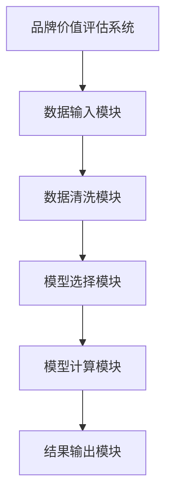
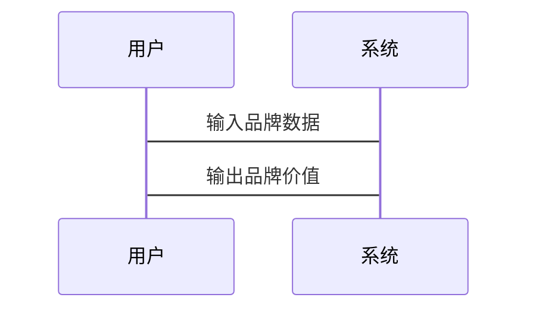

                 


# 企业估值中的品牌价值评估方法

> 关键词：企业估值、品牌价值、品牌评估、财务模型、市场分析、品牌资产

> 摘要：品牌价值是企业整体估值中的关键组成部分。本文将从品牌价值的定义、构成要素、评估方法等多个维度，详细探讨如何在企业估值中准确评估品牌价值。通过理论分析、数学模型和实际案例的结合，本文旨在为企业提供一套系统化的品牌价值评估方法论。

---

## 第一部分: 企业估值中的品牌价值评估概述

### 第1章: 品牌价值与企业估值的背景

#### 1.1 什么是品牌价值
品牌价值是企业在市场中通过品牌建设所积累的无形资产，包括品牌知名度、品牌忠诚度、品牌认知度等多方面的综合体现。品牌价值不仅是企业市场竞争力的重要指标，也是企业整体估值的重要组成部分。

| **品牌价值的构成要素** | **定义** | **影响因素** |
|--------------------------|-----------|---------------|
| 品牌知名度              | 品牌在市场中的广泛程度 | 广告投入、市场推广 |
| 品牌忠诚度              | 消费者对品牌的偏好程度 | 产品质量、售后服务 |
| 品牌认知度              | 消费者对品牌的理解和认可程度 | 品牌历史、文化内涵 |
| 品牌联想                | 消费者对品牌的附加价值联想 | 品牌故事、品牌形象 |

#### 1.2 企业估值的核心问题
企业估值不仅仅是对财务数据的简单计算，还包括对企业无形资产的评估。品牌价值作为企业的重要组成部分，直接影响企业的整体估值。以下是品牌价值在企业估值中的核心问题：

1. **品牌价值的量化方法**：如何将品牌价值转化为具体的数值。
2. **品牌价值的动态变化**：品牌价值会受到市场环境、消费者偏好等因素的影响，如何动态评估品牌价值的变化。
3. **品牌价值与企业战略的关系**：品牌价值如何影响企业的市场策略和长期发展。

#### 1.3 品牌价值评估的理论基础
品牌价值评估的理论基础主要来源于经济学、管理学和金融学三个领域：

1. **经济学视角**：品牌价值是企业市场竞争力的体现，可以通过市场占有率、价格溢价能力等经济指标来衡量。
2. **管理学视角**：品牌价值是企业长期管理的结果，包括品牌建设、品牌推广和品牌维护等多个方面。
3. **金融学视角**：品牌价值是企业资产的一部分，可以通过财务模型进行评估，并影响企业的市场价值。

---

### 第2章: 品牌价值评估的核心概念

#### 2.1 品牌价值的构成要素
品牌价值的构成要素可以分为以下几个方面：

1. **品牌知名度**：品牌在市场中的广泛程度，直接影响品牌的市场影响力。
2. **品牌忠诚度**：消费者对品牌的偏好程度，影响品牌的长期收益。
3. **品牌认知度**：消费者对品牌的理解和认可程度，影响品牌的市场定位。
4. **品牌联想**：消费者对品牌的附加价值联想，影响品牌的情感价值。

#### 2.2 品牌价值的度量维度
品牌价值的度量维度可以从以下几个方面进行分析：

1. **市场表现维度**：包括市场份额、品牌排名等。
2. **财务表现维度**：包括品牌带来的收入、利润等。
3. **顾客价值维度**：包括顾客满意度、品牌忠诚度等。
4. **竞争优势维度**：包括品牌的核心竞争力、市场壁垒等。

#### 2.3 品牌价值与企业价值的关系
品牌价值与企业价值密切相关，品牌价值的提升能够直接提升企业的市场价值。以下是品牌价值与企业价值的关系：

1. **品牌价值对企业整体价值的影响**：品牌价值是企业市场价值的重要组成部分，直接影响企业的市场估值。
2. **品牌价值与企业市场价值的互动**：品牌价值的提升能够增强企业的市场地位，从而提升企业的市场价值。

---

### 第3章: 品牌价值评估的数学模型与方法

#### 3.1 品牌价值评估的常用模型
品牌价值评估的常用模型包括：

1. **品牌强度指数模型**：通过品牌忠诚度、品牌知名度等因素计算品牌强度指数。
2. **品牌经济价值模型**：通过品牌资产、品牌影响力等因素计算品牌经济价值。
3. **品牌资产评价模型**：通过品牌资产的量化评估品牌价值。

#### 3.2 品牌价值评估的数学公式
以下是品牌价值评估的常用数学公式：

1. **品牌强度指数公式**
$$ \text{品牌强度指数} = \frac{\text{品牌忠诚度} \times \text{品牌知名度}}{\text{市场竞争度}} $$

2. **品牌经济价值公式**
$$ \text{品牌经济价值} = \text{品牌资产} + \text{品牌影响力} $$

#### 3.3 品牌价值评估的算法原理
品牌价值评估的算法原理可以通过以下步骤进行：

1. **数据收集**：收集品牌相关的数据，包括市场份额、品牌忠诚度、品牌知名度等。
2. **数据清洗**：对收集的数据进行清洗和预处理，确保数据的准确性和完整性。
3. **模型选择**：根据品牌价值评估的需要选择合适的模型。
4. **模型训练**：通过数据训练模型，计算品牌价值。
5. **结果分析**：分析模型计算结果，得出品牌价值。

---

### 第4章: 品牌价值评估的系统分析与架构设计

#### 4.1 系统功能设计
品牌价值评估系统需要具备以下功能：

1. **数据输入**：输入品牌相关的数据，包括市场份额、品牌忠诚度、品牌知名度等。
2. **模型选择**：选择合适的品牌价值评估模型。
3. **模型计算**：通过模型计算品牌价值。
4. **结果输出**：输出品牌价值评估结果。

#### 4.2 系统架构设计
以下是品牌价值评估系统的架构设计：



#### 4.3 系统接口设计
品牌价值评估系统的接口设计如下：

1. **输入接口**：接受品牌相关的数据，包括市场份额、品牌忠诚度、品牌知名度等。
2. **输出接口**：输出品牌价值评估结果。

#### 4.4 系统交互设计
以下是品牌价值评估系统的交互设计：



---

## 第五部分: 项目实战与总结

### 第5章: 项目实战

#### 5.1 环境安装
要进行品牌价值评估，需要安装以下环境：

1. **Python**：用于数据分析和模型计算。
2. **Pandas**：用于数据处理。
3. **Scikit-learn**：用于机器学习模型。

#### 5.2 系统核心实现
以下是品牌价值评估系统的核心代码实现：

```python
import pandas as pd
from sklearn.metrics import accuracy_score

# 数据输入
data = pd.read_csv('brand_data.csv')

# 数据清洗
data_cleaned = data.dropna()

# 模型选择
from sklearn.tree import DecisionTreeClassifier
model = DecisionTreeClassifier()

# 模型训练
model.fit(data_cleaned.drop('value', axis=1), data_cleaned['value'])

# 模型预测
predictions = model.predict(data_cleaned.drop('value', axis=1))

# 结果分析
print(accuracy_score(data_cleaned['value'], predictions))
```

#### 5.3 案例分析
以下是一个品牌价值评估的案例分析：

1. **案例背景**：某科技公司希望评估其品牌价值。
2. **数据收集**：收集市场份额、品牌忠诚度、品牌知名度等数据。
3. **模型计算**：通过品牌价值评估模型计算品牌价值。
4. **结果输出**：输出品牌价值评估结果。

#### 5.4 项目总结
通过项目实战，我们可以看到品牌价值评估的重要性和实际应用价值。品牌价值评估不仅可以帮助企业准确评估自身价值，还可以为企业制定市场策略提供有力支持。

---

## 第六部分: 最佳实践与注意事项

### 第6章: 最佳实践

1. **数据准确性**：确保数据的准确性和完整性。
2. **模型选择**：根据实际情况选择合适的模型。
3. **结果分析**：对评估结果进行深入分析，找出影响品牌价值的关键因素。

### 第7章: 小结

品牌价值评估是企业估值中的重要组成部分。通过本文的介绍，我们可以看到品牌价值评估的核心概念、数学模型和系统设计。希望本文能够为企业提供一套系统化的品牌价值评估方法论。

### 第8章: 注意事项

1. **数据隐私**：在品牌价值评估中，需要注意数据隐私问题。
2. **模型局限性**：品牌价值评估模型有一定的局限性，需要结合实际情况进行调整。
3. **持续监控**：品牌价值是一个动态变化的过程，需要持续监控和评估。

### 第9章: 拓展阅读

1. **品牌管理**：推荐阅读《竞争优势》（Competitive Advantage）。
2. **品牌价值评估**：推荐阅读《品牌资产》（Brand Equity）。

---

## 作者：AI天才研究院/AI Genius Institute & 禅与计算机程序设计艺术/Zen And The Art of Computer Programming

---

**感谢您的阅读！如果您对品牌价值评估有更多疑问或需要进一步探讨，请随时联系我。**

