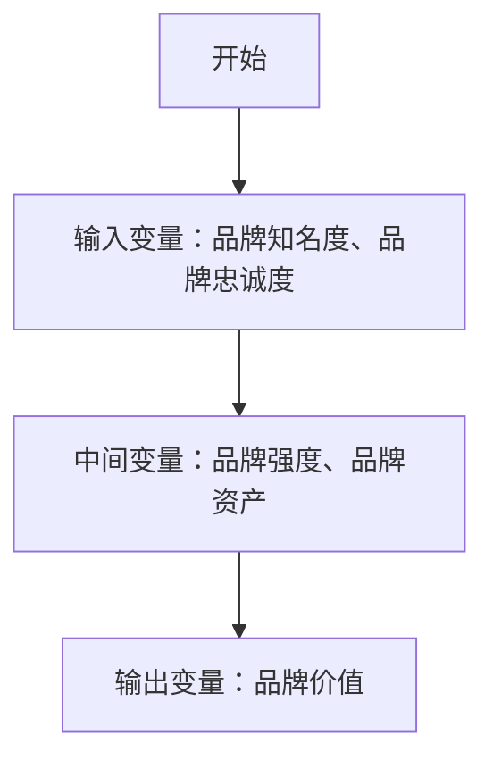
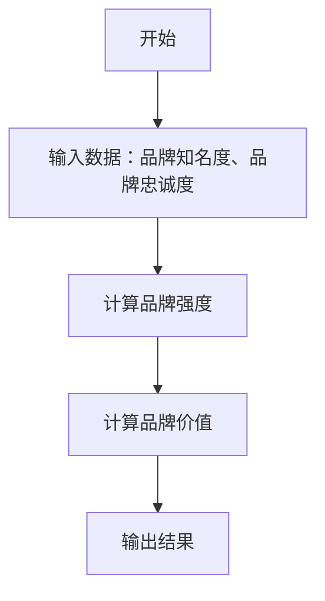
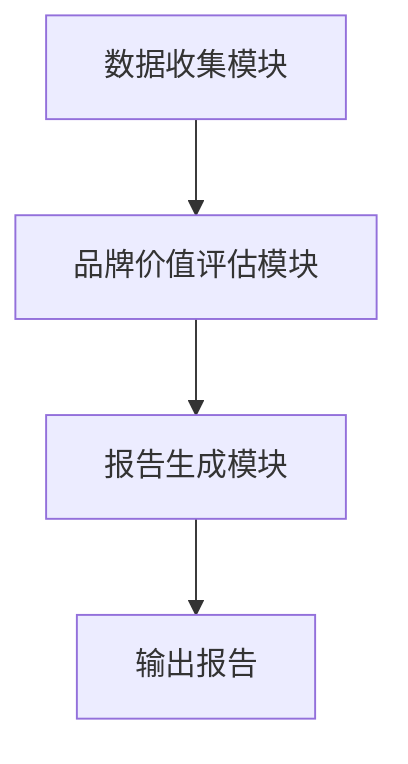

                 


# 企业估值中的品牌价值量化方法

> 关键词：品牌价值量化、企业估值、品牌资产、市场法、收益法、成本法

> 摘要：本文详细探讨了企业估值中品牌价值的量化方法，涵盖了品牌价值的核心概念、量化模型、算法原理、系统架构设计以及项目实战等多方面的内容。通过对比分析不同量化方法的优缺点，结合实际案例，为读者提供了一套完整的品牌价值量化解决方案。

---

## 第一部分: 企业估值中的品牌价值量化方法背景介绍

### 第1章: 品牌价值量化的核心概念

#### 1.1 什么是品牌价值

品牌价值是企业在市场中通过品牌建设所积累的无形资产，反映了消费者对品牌的认知、信任和忠诚度。品牌价值不仅是企业资产的重要组成部分，也是影响企业整体估值的关键因素。

#### 1.2 品牌价值的重要性

品牌价值直接影响企业的市场地位、盈利能力以及抗风险能力。在企业并购、融资等活动中，品牌价值是评估企业价值的重要指标。

#### 1.3 品牌价值与企业估值的关系

品牌价值是企业整体价值的重要组成部分。在企业估值中，品牌价值的量化能够帮助投资者、并购方和管理层更好地评估企业的市场潜力和长期盈利能力。

---

### 第2章: 品牌价值量化的基本理论

#### 2.1 品牌资产的构成要素

品牌资产包括品牌知名度、品牌忠诚度、品牌认知度和品牌联想等核心要素。这些要素共同构成了品牌价值的基础。

#### 2.2 品牌强度模型

品牌强度模型通过量化品牌在市场中的竞争力和影响力，帮助企业评估品牌价值。品牌强度模型通常包括品牌市场份额、品牌忠诚度、品牌认知度等指标。

---

## 第二部分: 品牌价值量化的核心概念与联系

### 第3章: 品牌价值量化的主要方法

#### 3.1 市场法

市场法通过对比可比公司的市场表现，评估品牌价值。具体方法包括市场比较法、可比公司分析和市场倍数法。

#### 3.2 收益法

收益法基于品牌带来的未来收益，通过现金流量折现法、内部收益率法和净现值法等方法评估品牌价值。

#### 3.3 成本法

成本法通过估算品牌建设的投入成本，评估品牌价值。主要包括历史成本法、重置成本法和清算价值法。

---

## 第三部分: 品牌价值量化的核心模型

### 第4章: 品牌价值量化模型的对比分析

#### 4.1 不同模型的优缺点对比

| 模型名称 | 优点 | 缺点 |
|---------|------|------|
| 市场法 | 数据来源广泛 | 受市场波动影响较大 |
| 收益法 | 结果更直观 | 需要预测未来收益 |
| 成本法 | 计算简单 | 无法反映品牌溢价能力 |

#### 4.2 品牌价值量化模型的流程图



---

## 第四部分: 算法原理讲解

### 第5章: 算法原理与实现

#### 5.1 品牌价值量化算法的数学模型

$$ 品牌价值 = \alpha \times 品牌知名度 + \beta \times 品牌忠诚度 $$

其中，$\alpha$ 和 $\beta$ 是权重系数，表示品牌知名度和品牌忠诚度对品牌价值的影响程度。

#### 5.2 品牌价值量化算法的流程图



#### 5.3 算法实现的Python代码

```python
def calculate_brand_value(fame, loyalty):
    alpha = 0.7
    beta = 0.3
    brand_value = alpha * fame + beta * loyalty
    return brand_value

fame_score = 0.8
loyalty_score = 0.6
brand_value = calculate_brand_value(fame_score, loyalty_score)
print("品牌价值 =", brand_value)
```

---

## 第五部分: 系统架构设计

### 第6章: 系统设计与实现

#### 6.1 系统功能设计

系统功能包括数据收集模块、品牌价值评估模块和报告生成模块。

#### 6.2 系统架构设计



#### 6.3 系统接口设计

系统接口包括数据输入接口、评估算法接口和报告生成接口。

---

## 第六部分: 项目实战

### 第7章: 项目实现与分析

#### 7.1 环境安装

安装必要的Python库，如NumPy和Pandas。

#### 7.2 核心算法实现

实现品牌价值评估的核心算法，并通过实际案例进行验证。

#### 7.3 案例分析

通过具体案例分析，展示品牌价值量化方法的应用和结果。

---

## 第七部分: 总结与展望

### 8.1 总结

品牌价值量化是企业估值中的重要组成部分。通过对比不同方法，结合实际案例，本文提供了一套完整的品牌价值量化解决方案。

### 8.2 展望

未来的研究可以进一步探索品牌价值的动态变化，以及如何在不同行业和市场环境下应用这些方法。

---

## 最佳实践 Tips

- 在进行品牌价值量化时，需结合企业的实际情况和市场环境。
- 建议定期更新品牌价值评估模型，以反映市场变化。
- 可参考行业基准数据，提高评估结果的准确性。

---

作者：AI天才研究院/AI Genius Institute & 禅与计算机程序设计艺术/Zen And The Art of Computer Programming

