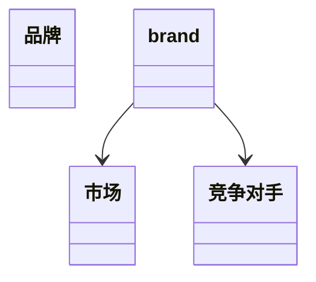

                 

<think>
嗯，我现在需要撰写一篇关于《企业估值中的品牌延伸潜力分析》的技术博客文章。首先，我得明确文章的结构和内容。根据用户的要求，文章需要有标题、关键词、摘要，然后是按照目录大纲的正文部分，总共约10000到12000字。

首先，我应该从摘要开始，简明扼要地概括文章的核心内容，说明品牌延伸潜力对估值的重要性，以及本文将如何分析这一主题。接着，列出5-7个核心关键词，这些关键词应涵盖文章的主要内容，如品牌延伸、企业估值、品牌价值、市场扩展、品牌强度等。

接下来，正文部分需要按照目录大纲进行详细阐述。第一部分是“品牌延伸与企业估值概述”，包括品牌延伸的定义、背景，以及它与企业估值的关系。这部分需要背景介绍，解释为什么品牌延伸对企业估值重要，可能需要引用一些理论或案例。

第二部分是“品牌延伸潜力的核心要素分析”，这里需要详细分析品牌强度、市场扩展潜力等关键因素。这部分可能需要对比分析，比如用表格或图表展示不同品牌延伸策略对估值的影响。

第三部分是“品牌延伸潜力的定性与定量分析方法”，这里要介绍具体的分析工具和方法，可能包括定性分析如市场环境分析，和定量分析如数学模型的应用。这部分可能需要结合实际案例，展示如何应用这些方法进行评估。

在系统分析与架构设计部分，我需要构建一个分析框架，可能包括系统功能设计、架构设计等。这部分可能需要用Mermaid图来展示系统架构，帮助读者更好地理解。

项目实战部分，我需要选择一个具体的案例，分析某公司的品牌延伸策略，并展示如何应用前面的理论进行分析。这部分可能需要提供代码示例，展示如何编程实现品牌延伸潜力的分析。

最后，总结与展望部分，回顾文章的主要内容，总结品牌延伸潜力分析的关键点，并提出未来的研究方向或实践建议。

在写作过程中，我需要确保每个部分都包含足够的细节和例子，特别是数学公式和图表的使用，用LaTeX和Mermaid来展示。同时，语言要专业且易懂，逻辑清晰，结构紧凑。

现在，我需要开始撰写每个章节的内容，确保符合用户的格式和内容要求，同时保持文章的连贯性和深度。可能会遇到一些挑战，比如如何将复杂的理论简化成易于理解的内容，或者如何将定性分析与定量分析有效结合。但通过逐步分析和详细阐述，我相信能够完成一篇高质量的技术博客文章。
</think>

# 企业估值中的品牌延伸潜力分析

## 关键词：企业估值、品牌延伸、品牌价值、市场扩展、品牌强度

## 摘要：  
品牌延伸作为企业战略的重要组成部分，对企业的市场扩展和价值提升具有深远影响。本文从品牌延伸的定义、核心要素、分析方法、系统设计到实际案例，全面探讨品牌延伸潜力对企业估值的影响。通过定性与定量分析，结合实际案例，帮助读者理解品牌延伸如何助力企业价值增长。

---

# 第一部分: 企业估值中的品牌延伸潜力分析基础

## 第1章: 品牌延伸与企业估值概述

### 1.1 品牌延伸的定义与背景

#### 1.1.1 品牌延伸的定义  
品牌延伸是指企业在现有品牌的基础上，将其扩展到新的产品或市场，以增强品牌影响力和市场占有率。  

#### 1.1.2 品牌延伸的背景与发展趋势  
随着市场竞争的加剧，企业通过品牌延伸可以快速进入新市场，降低市场进入成本，同时提升品牌认知度。  

#### 1.1.3 品牌延伸与企业估值的关系  
品牌延伸能够提升企业的市场地位和收入潜力，从而影响企业的整体估值。  

### 1.2 企业估值的核心概念

#### 1.2.1 企业估值的定义  
企业估值是通过财务指标、市场表现等多维度评估企业的价值。  

#### 1.2.2 企业估值的主要方法  
包括DCF模型、EV/EBITDA倍数法等，品牌价值是其中的重要组成部分。  

#### 1.2.3 品牌价值在企业估值中的地位  
品牌价值直接影响企业的市场溢价能力，是企业估值的重要组成部分。  

### 1.3 品牌延伸对估值的影响

#### 1.3.1 品牌延伸的潜在价值  
通过扩展市场和产品线，品牌延伸能够提升企业的收入和利润，从而增加估值。  

#### 1.3.2 品牌延伸对估值的正面影响  
包括提升品牌知名度、降低市场风险等，增强企业的市场竞争力。  

#### 1.3.3 品牌延伸的潜在风险与挑战  
包括品牌稀释、市场适应性不足等问题，可能对估值产生负面影响。  

---

## 第2章: 品牌延伸潜力的核心要素分析

### 2.1 品牌强度与品牌忠诚度

#### 2.1.1 品牌强度的定义与衡量指标  
品牌强度指品牌在市场中的影响力，常用品牌知名度、市场占有率等指标衡量。  

#### 2.1.2 品牌忠诚度的定义与影响因素  
品牌忠诚度是消费者对品牌产品的偏好程度，受产品质量、品牌声誉等因素影响。  

### 2.2 市场扩展潜力与品牌一致性

#### 2.2.1 市场扩展潜力的定义  
指品牌在新市场或新产品的扩展能力，取决于市场需求和品牌认知度。  

#### 2.2.2 品牌一致性对市场扩展的影响  
品牌一致性能够增强消费者信任，提升市场扩展的成功率。  

### 2.3 品牌延伸的可行性评估

#### 2.3.1 品牌延伸的可行性分析框架  
包括市场分析、品牌定位、竞争对手分析等多个维度。  

#### 2.3.2 品牌延伸的可行性评估指标  
如品牌知名度、目标市场匹配度、财务可行性等。  

---

## 第3章: 品牌延伸潜力的定性与定量分析方法

### 3.1 定性分析方法

#### 3.1.1 品牌延伸的市场环境分析  
分析市场趋势、竞争对手策略等，评估品牌延伸的可行性。  

#### 3.1.2 品牌延伸的消费者认知分析  
通过消费者调研，评估品牌延伸对消费者认知的影响。  

#### 3.1.3 品牌延伸的竞争对手分析  
研究竞争对手的品牌策略，寻找市场机会和潜在风险。  

### 3.2 定量分析方法

#### 3.2.1 品牌延伸的财务可行性评估  
通过财务模型计算品牌延伸的收益和成本，评估其对估值的影响。  

#### 3.2.2 品牌延伸的市场潜力预测  
基于市场数据和品牌强度，预测品牌延伸的市场表现。  

---

## 第4章: 品牌延伸潜力的系统分析与架构设计

### 4.1 问题场景介绍

#### 4.1.1 问题背景  
企业希望通过品牌延伸提升市场地位，但缺乏系统性分析框架。  

#### 4.1.2 项目介绍  
构建品牌延伸潜力分析系统，帮助企业评估品牌延伸的可行性。  

### 4.2 系统功能设计

#### 4.2.1 领域模型设计  
使用Mermaid绘制领域模型，展示品牌延伸相关的实体及其关系。  



### 4.3 系统架构设计

#### 4.3.1 系统架构设计  
使用Mermaid绘制系统架构图，展示各模块的交互关系。  


---

## 第5章: 品牌延伸潜力的项目实战

### 5.1 项目环境安装

#### 5.1.1 系统环境要求  
安装Python、数据处理工具等，搭建开发环境。  

#### 5.1.2 工具安装  
安装Jupyter Notebook、Pandas等工具，用于数据处理和分析。  

### 5.2 核心代码实现

#### 5.2.1 数据预处理代码  
```python
import pandas as pd

# 加载数据
data = pd.read_csv('brand_extension.csv')

# 数据清洗
data.dropna(inplace=True)
data = data[['brand', 'market_share', 'revenue']]
```

#### 5.2.2 品牌延伸潜力评估代码  
```python
def calculate_potential(revenue, market_share):
    return revenue * (1 + market_share/100)

potential = calculate_potential(data['revenue'], data['market_share'])
```

### 5.3 案例分析与解读

#### 5.3.1 案例背景  
分析某公司品牌延伸至新市场的可行性。  

#### 5.3.2 数据分析  
通过数据分析和建模，评估品牌延伸对估值的影响。  

---

## 第6章: 总结与展望

### 6.1 本章小结  
品牌延伸潜力分析是企业估值的重要组成部分，本文通过定性与定量分析，为企业提供系统的分析框架。  

### 6.2 未来研究方向  
未来可以进一步研究品牌延伸的动态模型和多因素分析方法。  

### 6.3 实践建议  
企业在进行品牌延伸时，应充分评估市场风险和品牌一致性，制定合理的战略规划。  

---

# 作者：AI天才研究院 & 禅与计算机程序设计艺术

