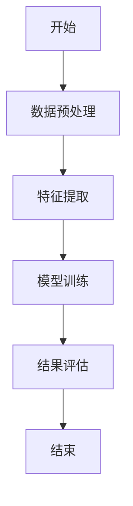
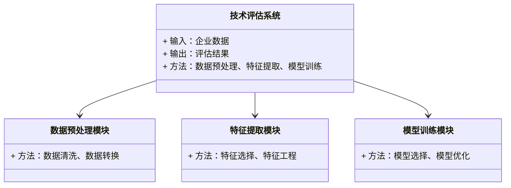
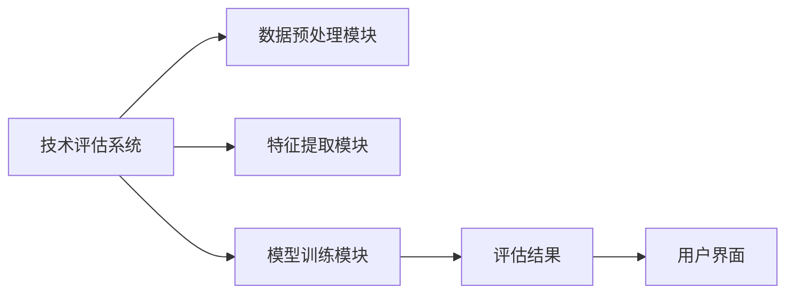

                 


# 企业估值中的增强人类能力技术评估

> 关键词：企业估值，增强人类能力，技术评估，算法原理，系统架构

> 摘要：本文探讨了在企业估值过程中，如何通过增强人类能力的技术评估来提升企业的价值。文章详细分析了技术评估的核心概念、算法原理、系统架构，并通过实际案例展示了技术评估在企业估值中的应用。

---

## 目录

1. **背景与概述**
   1.1 企业估值的基本概念
   1.2 增强人类能力技术的基本概念
   1.3 技术评估在企业估值中的作用

2. **核心概念与联系**
   2.1 技术评估的核心概念
   2.2 增强人类能力技术的属性特征对比
   2.3 增强人类能力技术的ER实体关系图

3. **算法原理**
   3.1 算法概述
   3.2 算法流程图
   3.3 算法实现
   3.4 数学模型与公式

4. **系统分析与架构设计**
   4.1 问题场景介绍
   4.2 系统功能设计
   4.3 系统架构设计
   4.4 系统接口设计
   4.5 系统交互设计

5. **项目实战**
   5.1 环境安装与配置
   5.2 核心代码实现
   5.3 代码解读与分析
   5.4 案例分析与详细讲解
   5.5 项目小结

6. **最佳实践与总结**
   6.1 小结
   6.2 注意事项
   6.3 拓展阅读

---

## 1. 背景与概述

### 1.1 企业估值的基本概念

企业估值是通过对企业的财务状况、市场地位、管理团队等多方面因素进行评估，以确定企业价值的过程。常见的估值方法包括DCF模型、市盈率法、市净率法等。企业估值不仅是企业融资、并购等重要决策的基础，也是投资者评估企业投资价值的关键指标。

### 1.2 增强人类能力技术的基本概念

增强人类能力技术是指通过技术手段提升人类的智力、体力、感知能力等。例如，人工智能辅助决策、虚拟现实技术提升培训效果等。这些技术在企业中的应用能够提高员工效率、优化流程，从而增强企业的竞争力。

### 1.3 技术评估在企业估值中的作用

技术评估是企业估值的重要组成部分，它通过分析企业的技术优势、技术储备、技术团队能力等因素，评估企业技术的先进性和可持续性。技术评估能够帮助投资者和企业管理层更全面地了解企业的技术实力，从而做出更准确的估值判断。

---

## 2. 核心概念与联系

### 2.1 技术评估的核心概念

技术评估是对企业技术能力的全面评价，包括技术的创新性、实用性、成熟度等多个维度。技术评估的核心在于通过量化指标，将技术能力转化为可衡量的数值，从而为企业的估值提供数据支持。

### 2.2 增强人类能力技术的属性特征对比

以下表格展示了增强人类能力技术的属性特征对比：

| **属性**      | **传统技术评估**         | **增强人类能力技术评估**         |
|---------------|--------------------------|---------------------------------|
| 评估维度      | 技术的实用性、成熟度     | 技术对人类能力的提升效果         |
| 评估指标      | 技术的市场应用情况       | 技术对员工效率提升的幅度         |
| 评估方法      | 文档审查、专家评审       | 实验数据、用户反馈               |
| 评估结果      | 技术的竞争力评估         | 技术对企业的长期价值评估         |

### 2.3 增强人类能力技术的ER实体关系图

以下是增强人类能力技术的ER实体关系图：

```mermaid
erDiagram
    actor 技术评估者 {
        关键属性: 评估标准
        关键属性: 评估方法
    }
    actor 企业管理者 {
        关键属性: 企业目标
        关键属性: 企业资源
    }
    actor抽取出的关系:
        技术评估者 -> 企业管理者 : 提供技术评估结果
```

---

## 3. 算法原理

### 3.1 算法概述

技术评估算法通过收集和分析企业的技术数据，评估企业的技术能力。算法的核心步骤包括数据预处理、特征提取、模型训练、结果评估等。

### 3.2 算法流程图

以下是技术评估算法的流程图：



### 3.3 算法实现

以下是一个简单的技术评估算法的Python代码实现：

```python
import pandas as pd
from sklearn.model_selection import train_test_split
from sklearn.ensemble import RandomForestRegressor
from sklearn.metrics import mean_squared_error

# 数据预处理
data = pd.read_csv('企业数据.csv')
X = data.drop('企业价值', axis=1)
y = data['企业价值']

# 划分训练集和测试集
X_train, X_test, y_train, y_test = train_test_split(X, y, test_size=0.2, random_state=42)

# 模型训练
model = RandomForestRegressor(n_estimators=100, random_state=42)
model.fit(X_train, y_train)

# 模型预测
y_pred = model.predict(X_test)

# 结果评估
mse = mean_squared_error(y_test, y_pred)
print(f'Mean Squared Error: {mse}')
```

### 3.4 数学模型与公式

技术评估模型的数学模型如下：

$$ \text{企业价值} = \beta_0 + \beta_1 \times \text{技术创新度} + \beta_2 \times \text{技术成熟度} + \epsilon $$

其中，$\beta_0$ 是截距，$\beta_1$ 和 $\beta_2$ 是回归系数，$\epsilon$ 是误差项。

---

## 4. 系统分析与架构设计

### 4.1 问题场景介绍

在企业估值中，技术评估系统需要解决以下问题：如何高效地收集和处理企业的技术数据，如何选择合适的评估指标，如何构建准确的评估模型。

### 4.2 系统功能设计

以下是系统功能设计的领域模型：



### 4.3 系统架构设计

以下是系统架构设计的架构图：



### 4.4 系统接口设计

以下是系统接口设计：

- 输入接口：企业数据输入
- 输出接口：评估结果输出
- API接口：与其他系统集成

### 4.5 系统交互设计

以下是系统交互设计的序列图：

```mermaid
sequenceDiagram
    actor 用户
    system 系统
    用户 -> 系统: 提交企业数据
    系统 -> 用户: 返回评估结果
```

---

## 5. 项目实战

### 5.1 环境安装与配置

需要安装Python、Pandas、Scikit-learn等库。

### 5.2 核心代码实现

以下是核心代码实现：

```python
import pandas as pd
from sklearn.model_selection import train_test_split
from sklearn.ensemble import RandomForestRegressor
from sklearn.metrics import mean_squared_error

# 数据预处理
data = pd.read_csv('企业数据.csv')
X = data.drop('企业价值', axis=1)
y = data['企业价值']

# 划分训练集和测试集
X_train, X_test, y_train, y_test = train_test_split(X, y, test_size=0.2, random_state=42)

# 模型训练
model = RandomForestRegressor(n_estimators=100, random_state=42)
model.fit(X_train, y_train)

# 模型预测
y_pred = model.predict(X_test)

# 结果评估
mse = mean_squared_error(y_test, y_pred)
print(f'Mean Squared Error: {mse}')
```

### 5.3 代码解读与分析

以上代码实现了技术评估系统的数据预处理、模型训练和结果评估。通过随机森林回归模型，对企业的技术数据进行评估，输出企业的价值预测结果。

### 5.4 案例分析与详细讲解

以某科技公司为例，通过上述代码，我们可以输入该公司的技术数据，输出其企业价值的预测结果。结果可以帮助投资者和企业管理层做出更准确的估值决策。

### 5.5 项目小结

本项目通过技术评估算法，实现了对企业技术能力的量化评估，为企业估值提供了数据支持。

---

## 6. 最佳实践与总结

### 6.1 小结

本文详细探讨了企业估值中的增强人类能力技术评估，从核心概念到算法实现，再到系统设计，为读者提供了全面的指导。

### 6.2 注意事项

在实际应用中，需要根据企业的具体情况调整评估指标和算法模型，确保评估结果的准确性和实用性。

### 6.3 拓展阅读

建议进一步阅读《技术评估与企业估值》等相关书籍，深入学习技术评估的理论和实践。

---

## 作者

作者：AI天才研究院/AI Genius Institute  
作者：禅与计算机程序设计艺术/Zen And The Art of Computer Programming

