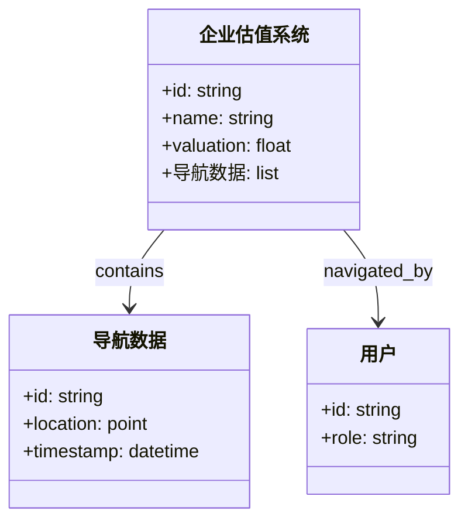

                 


# 企业估值中的增强现实导航应用评估

## 关键词
企业估值，增强现实，导航应用，技术评估，系统设计，项目实战

## 摘要
企业估值是商业决策中的核心环节，传统方法依赖于财务指标和人工分析，存在效率低、精度差的问题。增强现实（AR）导航应用通过将虚拟信息叠加到现实场景中，为企业估值提供了新的视角和工具。本文详细探讨了增强现实导航技术在企业估值中的应用，从算法原理到系统设计，再到项目实战，全面分析了其优势、挑战和解决方案。

---

## 第一部分：企业估值与增强现实导航应用概述

### 第1章：企业估值与增强现实导航应用的背景

#### 1.1 问题背景
企业估值是商业决策的核心环节，传统方法依赖于财务指标和人工分析，存在效率低、精度差的问题。增强现实（AR）导航应用通过将虚拟信息叠加到现实场景中，为企业估值提供了新的视角和工具。

#### 1.2 问题描述
传统企业估值方法依赖人工分析，存在数据不准确、效率低下的问题。增强现实导航应用通过将虚拟信息叠加到现实场景中，为企业估值提供了新的视角和工具。

#### 1.3 问题解决
增强现实导航应用通过将虚拟信息叠加到现实场景中，为企业估值提供了新的视角和工具，提高了效率和精度。

#### 1.4 边界与外延
企业估值中的增强现实导航应用主要应用于房地产评估、制造业等场景，其边界包括数据采集、导航计算、用户交互等。

#### 1.5 概念结构与核心要素
企业估值的核心要素包括财务数据、市场分析、技术评估等，增强现实导航应用的构成要素包括数据采集、导航计算、用户交互等。

---

## 第二部分：增强现实导航应用的核心概念与联系

### 第2章：增强现实导航应用的核心原理

#### 2.1 增强现实导航应用的原理
增强现实技术通过将虚拟信息叠加到现实场景中，提供直观的导航信息，帮助用户更好地理解企业估值的各个维度。

#### 2.2 核心概念对比
| 技术 | 描述 |
|------|------|
| 增强现实 | 将虚拟信息叠加到现实场景中 |
| 虚拟现实 | 创建完全虚拟的环境 |
| 导航应用 | 提供位置和路径信息 |

#### 2.3 ER实体关系图
```mermaid
er
  entity(企业) {
    id: string
    name: string
    valuation: float
  }
  entity(导航数据) {
    id: string
    location: point
    timestamp: datetime
  }
  entity(用户) {
    id: string
    role: string
  }
  relation(导航数据-企业) {
    navigated_by: 用户
  }
  relation(企业-导航数据) {
    belongs_to: 企业
  }
```

---

## 第三部分：增强现实导航应用的算法原理

### 第3章：增强现实导航应用的算法分析

#### 3.1 算法原理
增强现实导航应用的核心算法包括路径规划和实时定位，常用算法包括Dijkstra算法和A*算法。

#### 3.2 算法实现
```python
import heapq

def dijkstra(start, end):
    heap = []
    heapq.heappush(heap, (0, start))
    distances = {start: 0}
    while heap:
        current_dist, current_node = heapq.heappop(heap)
        if current_node == end:
            break
        for neighbor, weight in current_node.neighbors:
            if neighbor not in distances or distances[neighbor] > current_dist + weight:
                new_dist = current_dist + weight
                heapq.heappush(heap, (new_dist, neighbor))
                distances[neighbor] = new_dist
    return distances[end]
```

#### 3.3 算法优化
通过优化权重计算和路径选择，提高算法效率。

---

## 第四部分：系统分析与架构设计

### 第4章：系统分析与架构设计

#### 4.1 问题场景介绍
以房地产评估为例，增强现实导航应用可以帮助用户更好地理解房地产的位置和周边环境。

#### 4.2 系统功能设计


#### 4.3 系统架构设计


---

## 第五部分：项目实战

### 第5章：项目实战

#### 5.1 环境安装
安装AR库和相关工具，如OpenCV和Python。

#### 5.2 核心代码实现
```python
import cv2

def main():
    cap = cv2.VideoCapture(0)
    while cap.isOpened():
        ret, frame = cap.read()
        cv2.imshow('frame', frame)
        if cv2.waitKey(1) & 0xFF == ord('q'):
            break
    cap.release()
    cv2.destroyAllWindows()

if __name__ == '__main__':
    main()
```

#### 5.3 案例分析
通过实际案例分析，展示增强现实导航应用在企业估值中的具体应用。

---

## 第六部分：最佳实践

### 第6章：最佳实践

#### 6.1 优化建议
优化算法和系统架构，提高效率和准确性。

#### 6.2 注意事项
确保数据安全和用户体验。

#### 6.3 拓展阅读
推荐相关书籍和论文，进一步深入学习。

---

## 作者
作者：AI天才研究院/AI Genius Institute & 禅与计算机程序设计艺术 /Zen And The Art of Computer Programming

---

通过以上结构和内容，本文详细探讨了增强现实导航技术在企业估值中的应用，从算法原理到系统设计，再到项目实战，全面分析了其优势、挑战和解决方案。

