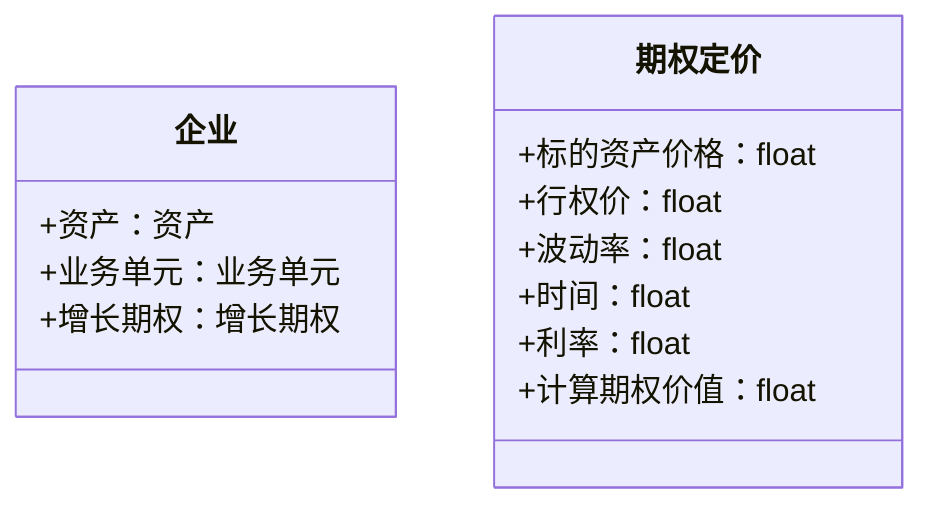
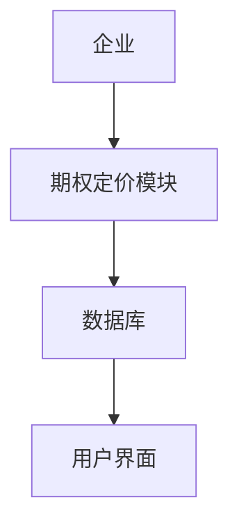
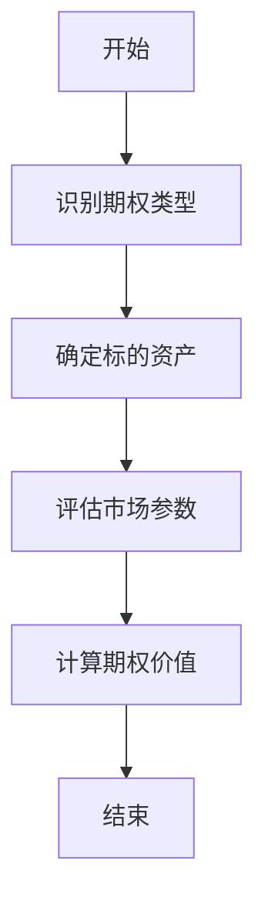

                 


# 企业估值中的实物期权法

> 关键词：企业估值，实物期权，期权定价，金融建模，企业战略

> 摘要：本文深入探讨了实物期权法在企业估值中的应用，从基本原理到算法实现，再到实际案例分析，全面解析了如何将期权理论应用于企业价值评估。通过系统化的分析和丰富的案例，展示了实物期权法在企业战略决策中的独特优势和实际应用价值。

---

## 第一部分：实物期权法的背景与概述

### 第1章：实物期权法的背景与发展

#### 1.1 期权的基本概念与发展历程
期权是一种金融衍生品，赋予持有者在特定时间内以预定价格购买或出售标的资产的权利。实物期权法则是将企业资产或业务单元类比为期权，通过期权定价模型评估其价值。

#### 1.2 实物期权法的提出与演变
实物期权法的起源可以追溯到20世纪80年代，随着期权定价理论的发展，逐渐应用于企业估值领域。与传统估值方法相比，实物期权法更能捕捉企业成长性和灵活性的价值。

#### 1.3 实物期权法在企业战略中的作用
在企业并购、投资决策和资本预算中，实物期权法提供了新的视角，帮助管理层更准确地评估不确定性环境下的资产价值。

### 第2章：企业估值的传统方法与局限性

#### 2.1 现金流量折现法（DCF）的基本原理
DCF方法通过预测未来现金流并折现至现值，评估企业价值。然而，其假设条件（如稳定增长率）在现实中难以满足，尤其是在高波动性环境中。

#### 2.2 传统估值方法的局限性
传统方法难以量化企业未来的增长期权价值，尤其是在不确定性较高的创新型企业中，低估了潜在价值。

#### 2.3 实物期权法的优势
实物期权法通过期权定价模型，将企业成长性、灵活性等隐性价值量化，弥补了传统方法的不足。

---

## 第二部分：实物期权法的核心概念与联系

### 第3章：期权的基本原理

#### 3.1 期权的定价原理
期权价值由标的资产价格、行权价、波动率、时间和利率等因素决定。黑-斯科尔斯模型是经典的期权定价工具。

#### 3.2 黑-斯科尔斯模型
$$ C = S_0 \cdot N(d_1) - K \cdot e^{-rT} \cdot N(d_2) $$
其中，$d_1 = \frac{\ln(S_0/K) + (r + \sigma^2/2)T}{\sigma \sqrt{T}}$，$d_2 = d_1 - \sigma \sqrt{T}$。

#### 3.3 实物期权与金融期权的对比
| 特性 | 金融期权 | 实物期权 |
|------|----------|----------|
| 标的资产 | 金融资产 | 企业资产或业务单元 |
| 期限 | 固定 | 可变 |

### 第4章：实物期权法的系统分析

#### 4.1 问题场景介绍
企业并购中的目标企业估值问题。传统的DCF方法难以捕捉目标企业的增长期权价值。

#### 4.2 系统功能设计
- **领域模型类图**


#### 4.3 系统架构设计


#### 4.4 接口设计
- **输入接口**：企业资产、业务单元数据。
- **输出接口**：期权价值评估报告。

#### 4.5 交互流程
```mermaid
sequenceDiagram
    User -> 企业：提交资产数据
    企业 -> 期权定价模块：开始定价
    期权定价模块 -> 数据库：获取市场参数
    期权定价模块 -> 计算结果：返回期权价值
    期权定价模块 -> 用户界面：显示报告
    User <- 用户界面：接收报告
```

---

## 第三部分：实物期权法的算法实现

### 第5章：实物期权法的算法流程

#### 5.1 算法流程图


#### 5.2 核心代码实现
```python
import numpy as np
from scipy.stats import norm

def black_scholes(S, K, r, T, sigma):
    d1 = (np.log(S/K) + (r + sigma**2/2)*T) / (sigma * np.sqrt(T))
    d2 = d1 - sigma * np.sqrt(T)
    C = S * norm.cdf(d1) - K * np.exp(-r*T) * norm.cdf(d2)
    return C

# 示例：评估企业增长期权
S = 100  # 标的资产价格
K = 110  # 行权价
r = 0.05  # 无风险利率
T = 1  # 期限（年）
sigma = 0.3  # 波动率
print(black_scholes(S, K, r, T, sigma))
```

### 第6章：项目实战

#### 6.1 实验环境配置
- **工具**：Python 3.8+，NumPy，SciPy，Mermaid。
- **数据来源**：企业公开财务数据、市场波动率数据。

#### 6.2 核心代码实现
```python
import numpy as np
from scipy.stats import norm

def calculate_option_value(S, K, r, T, sigma):
    d1 = (np.log(S/K) + (r + sigma**2/2)*T) / (sigma * np.sqrt(T))
    d2 = d1 - sigma * np.sqrt(T)
    option_value = S * norm.cdf(d1) - K * np.exp(-r*T) * norm.cdf(d2)
    return option_value

# 示例数据
S = 50  # 当前股价
K = 55  # 行权价
r = 0.02  # 无风险利率
T = 2  # 期限（年）
sigma = 0.25  # 波动率

value = calculate_option_value(S, K, r, T, sigma)
print(f"期权价值为：{value}")
```

#### 6.3 案例分析与结果解读
以某科技公司为例，通过代码计算其增长期权价值，解读结果并评估其对企业估值的影响。

---

## 第四部分：实物期权法的最佳实践

### 第7章：小结与注意事项

#### 7.1 小结
实物期权法通过量化企业资产的增长期权，提供了更全面的企业估值方法，尤其适用于创新型企业。

#### 7.2 注意事项
- 波动率估计的敏感性。
- 数据质量和完整性。
- 模型假设的合理性。

### 第8章：拓展阅读与资源

#### 8.1 推荐书籍
- 《期权、期货和其他衍生产品》。
- 《企业估值与金融建模》。

#### 8.2 在线资源
- [QuantInst Inc.](https://www.quantinst.com)
- [Coursera: 金融建模与估值](https://www.coursera.org)

---

## 作者简介

作者：AI天才研究院（AI Genius Institute） & 禅与计算机程序设计艺术（Zen And The Art of Computer Programming）

---

以上就是《企业估值中的实物期权法》的详细目录和内容框架，涵盖了从理论到实践的各个方面，适合技术专家和企业估值从业者阅读。

