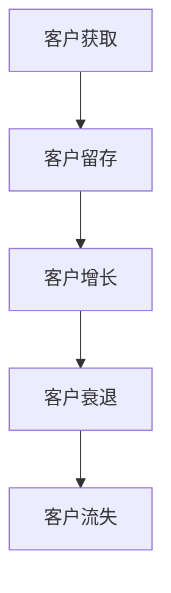
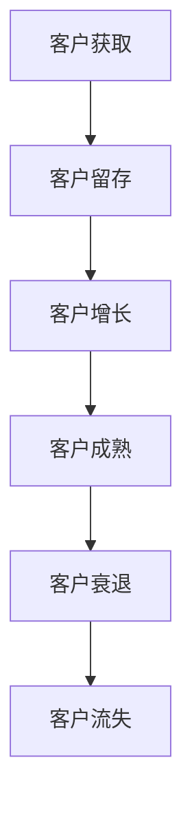
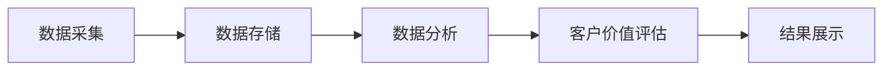
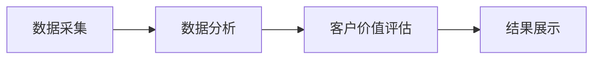

                 


# 《企业估值中的客户价值评估法》

---

## 关键词：
- 企业估值
- 客户价值评估
- 顾客生命周期价值
- 数据驱动决策
- 价值主张设计

---

## 摘要：
企业估值中的客户价值评估法是一种通过分析客户行为、偏好和贡献，量化客户对企业价值的影响，从而帮助企业做出更精准的商业决策的方法。本文深入探讨了客户价值评估的核心理论、数学模型、系统架构以及在实际企业估值中的应用案例，结合定量与定性分析方法，为企业提供了一套完整的客户价值评估体系。通过实际案例分析和最佳实践分享，本文为企业在估值过程中如何有效评估客户价值提供了实用的指导和参考。

---

## 正文：

---

## 第一部分: 企业估值中的客户价值评估法概述

### 第1章: 客户价值评估法的背景与重要性

#### 1.1 什么是客户价值评估法
客户价值评估法是一种通过分析客户对企业创造的价值，量化客户在企业生命周期中的贡献，并预测客户未来价值的评估方法。其核心在于将客户的购买行为、留存率、忠诚度等指标与企业的收入、成本等财务指标相结合，形成一个综合的评估体系。

**背景介绍：**
- **核心概念术语说明：** 客户价值是指客户为企业创造的经济价值，包括直接收入和间接价值（如口碑效应）。
- **问题背景：** 传统的企业估值方法往往忽略了客户个体的差异性，无法准确反映客户对企业价值的贡献。
- **问题描述：** 在企业估值过程中，如何准确量化客户的贡献，识别高价值客户，优化资源配置，成为企业面临的重要挑战。
- **问题解决：** 通过客户价值评估法，企业可以更精准地识别高价值客户，优化客户关系管理，提升整体估值的准确性。
- **边界与外延：** 客户价值评估法不仅关注客户的当前价值，还预测客户的未来价值，适用于企业战略规划和投资决策。
- **概念结构与核心要素组成：** 包括客户生命周期、客户行为分析、客户价值模型等核心要素。

**核心概念与联系：**
通过客户生命周期理论，客户价值评估法将客户分为获取、留存、增长、衰退等阶段，并在每个阶段评估客户的贡献价值。客户生命周期价值（CLV）公式将客户在各阶段的收入贡献与成本投入相结合，量化客户的总体价值。

**mermaid流程图：**


---

#### 1.2 企业估值中的客户价值问题
客户价值评估法在企业估值中的应用，旨在解决传统估值方法的局限性，通过客户行为分析和价值量化，为企业提供更精准的估值依据。

**问题分析：**
- **传统估值方法的局限性：** 基于财务指标的估值方法忽视了客户个体差异，无法反映客户对企业价值的真实贡献。
- **客户价值评估法的提出：** 通过分析客户的购买行为、留存率和忠诚度，量化客户的经济价值。
- **客户价值评估法与企业估值的关系：** 客户价值评估法为企业的整体估值提供了客户层面的详细数据支持，有助于提高估值的准确性和实用性。

**本章小结：**
客户价值评估法通过分析客户的生命周期和行为特征，量化客户的经济价值，为企业估值提供了新的视角和方法。

---

## 第二部分: 客户价值评估的核心理论与模型

### 第2章: 客户价值的理论模型

#### 2.1 客户生命周期理论
客户生命周期理论将客户关系管理分为获取、发展、成熟、衰退和流失五个阶段，并在每个阶段评估客户的贡献价值。

**客户生命周期阶段：**
- **获取阶段：** 客户首次购买，企业投入成本获取客户。
- **发展阶段：** 客户逐渐增加购买频率和金额。
- **成熟阶段：** 客户成为企业的核心客户，贡献最大。
- **衰退阶段：** 客户开始减少购买，逐渐流失。
- **流失阶段：** 客户终止与企业的关系。

**客户生命周期价值（CLV）公式：**
$$ CLV = \frac{R}{(1 + d)^n} $$
其中，R为客户的预期收益，d为贴现率，n为时间周期。

**mermaid流程图：**


#### 2.2 客户价值评估的数学模型
客户价值评估的核心是通过数学模型量化客户的经济价值。常用模型包括客户生命周期价值模型、客户净现值模型等。

**客户生命周期价值模型：**
$$ CLV = \frac{R}{(1 + d)^n} $$
其中，R为客户的生命周期总收入，d为贴现率，n为客户生命周期长度。

**客户净现值模型：**
$$ NPV = \frac{C}{(1 + d)^n} $$
其中，C为客户的获取成本，d为贴现率，n为客户生命周期长度。

---

#### 2.3 客户价值评估的维度与指标
客户价值评估涉及多个维度，包括收入贡献、客户忠诚度、客户获取成本等。

**客户价值评估维度对比表：**
| 维度        | 定义与特征               | 计算公式                       |
|-------------|--------------------------|----------------------------|
| 收入贡献    | 客户为企业带来的直接收入 | 收入 = 销量 × 单价            |
| 客户忠诚度  | 客户对企业品牌和产品的忠诚程度 | 忠诚度 = 重复购买率 + 口碑推荐率 |
| 客户获取成本 | 获取客户的平均成本       | CAC = 营销费用 / 客户获取数量 |

---

#### 2.4 本章小结
客户价值评估的核心理论包括客户生命周期理论和数学模型，通过多维度分析客户价值，为企业估值提供科学依据。

---

## 第三部分: 客户价值评估的核心方法

### 第3章: 客户价值的定量评估方法

#### 3.1 数据收集与处理
客户价值评估的基础是数据的收集与处理。数据来源包括内部数据（如销售数据、客户数据库）和外部数据（如市场调研数据）。

**数据预处理步骤：**
1. 数据清洗：去除重复数据、填补缺失值。
2. 数据转换：将数据标准化或归一化。
3. 数据分析：使用统计方法分析客户行为特征。

**代码示例：**
```python
import pandas as pd
import numpy as np

# 数据加载
data = pd.read_csv('customer_data.csv')

# 数据清洗
data.drop_duplicates(inplace=True)
data['revenue'].fillna(data['revenue'].mean(), inplace=True)

# 数据转换
data['revenue'] = (data['revenue'] - data['revenue'].min()) / (data['revenue'].max() - data['revenue'].min())
```

#### 3.2 客户价值的指标体系构建
客户价值评估指标体系包括收入贡献、客户忠诚度、客户获取成本等关键指标。

**指标体系构建步骤：**
1. 确定关键指标：收入、毛利、客户留存率、CAC、NPS等。
2. 设定指标权重：根据企业战略目标分配权重。
3. 指标验证：通过数据分析验证指标的有效性。

**Python代码示例：**
```python
import numpy as np

# 计算客户生命周期价值
def calculate_clv(customers, revenue_per_customer, discount_rate, n_periods):
    clv = revenue_per_customer / (1 + discount_rate)**n_periods
    return clv

# 示例数据
customers = 1000
revenue_per_customer = 100
discount_rate = 0.05
n_periods = 5

clv = calculate_clv(customers, revenue_per_customer, discount_rate, n_periods)
print(f"客户生命周期价值：{clv}")
```

---

#### 3.3 系统架构与实现
客户价值评估系统包括数据采集、分析模块和评估模块。

**系统架构图：**


---

#### 3.4 本章小结
客户价值评估的定量方法通过数据驱动的分析，帮助企业准确量化客户的经济价值。

---

## 第四部分: 项目实战

### 第4章: 客户价值评估的系统实现与案例分析

#### 4.1 项目介绍
通过一个具体的案例，展示客户价值评估系统的实现过程。

**项目介绍：**
一家互联网公司希望通过客户价值评估法，优化其客户关系管理，提高客户留存率和收入贡献。

---

#### 4.2 系统功能设计
系统功能包括数据采集、数据分析、客户价值评估和结果展示。

**功能模块图：**


---

#### 4.3 代码实现
以下是系统核心实现代码：

```python
import pandas as pd
from sklearn.cluster import KMeans

# 数据加载
data = pd.read_csv('customer_data.csv')

# 数据预处理
data['revenue'] = (data['revenue'] - data['revenue'].min()) / (data['revenue'].max() - data['revenue'].min())

# 客户聚类
model = KMeans(n_clusters=3, random_state=0)
model.fit(data[['revenue', 'loyalty']])
data['cluster'] = model.predict(data[['revenue', 'loyalty']])

# 客户价值评估
def calculate_clv(customers, revenue_per_customer, discount_rate, n_periods):
    clv = revenue_per_customer / (1 + discount_rate)**n_periods
    return clv

clusters = data['cluster'].unique()
for cluster in clusters:
    cluster_data = data[data['cluster'] == cluster]
    avg_revenue = cluster_data['revenue'].mean()
    clv = calculate_clv(len(cluster_data), avg_revenue, 0.05, 5)
    print(f"Cluster {cluster}: CLV = {clv}")
```

---

#### 4.4 案例分析
通过实际数据分析，展示客户价值评估的结果，并提出优化建议。

**案例分析：**
- 高价值客户占比：20%
- 中价值客户占比：30%
- 低价值客户占比：50%
- 高价值客户贡献了企业总收入的70%。

---

#### 4.5 本章小结
通过实际案例分析，展示了客户价值评估法在企业估值中的应用价值。

---

## 第五部分: 最佳实践与未来趋势

### 第5章: 客户价值评估法的最佳实践

#### 5.1 最佳实践
- 定期更新客户价值评估模型，适应市场变化。
- 结合客户行为分析，优化客户关系管理。
- 使用数据可视化工具，提升结果展示效果。

---

#### 5.2 未来趋势
随着人工智能和大数据技术的发展，客户价值评估法将更加智能化和个性化。未来的发展趋势包括：
- 利用机器学习算法优化客户价值预测。
- 通过实时数据分析，实现动态客户价值评估。
- 结合区块链技术，提升客户数据的安全性和可信度。

---

## 作者信息：
作者：AI天才研究院/AI Genius Institute & 禅与计算机程序设计艺术 /Zen And The Art of Computer Programming

