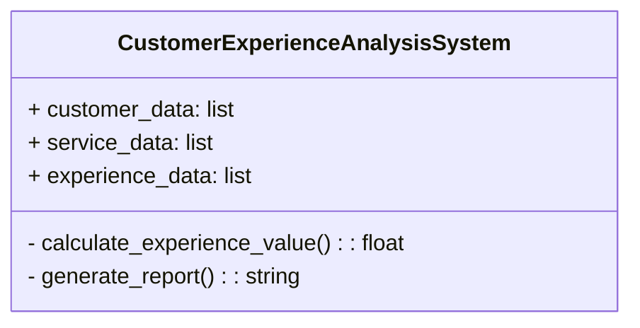
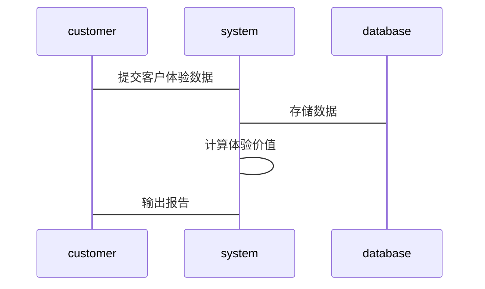

                 

<think>
嗯，用户希望我写一篇关于《企业估值中的客户体验价值分析》的文章，并且已经提供了一个详细的目录大纲。现在我需要根据这个大纲来撰写实际的文章内容。

首先，我需要理解每个章节的重点。第一章介绍了客户体验和企业估值的背景，第二章详细讲解了客户体验的价值构成，第三章则涉及算法和数学模型。接下来是系统设计、项目实战和总结。

在撰写过程中，我要确保每个部分都详细具体，特别是需要包含背景介绍、核心概念、算法原理、系统架构等内容。同时，用户要求使用markdown格式，包含mermaid图表和latex公式，所以我要记得在适当的地方插入这些元素。

接下来，我会按照目录大纲逐章撰写，确保每个章节都有足够的细节和深度。例如，在第二章中，我需要解释客户满意度、忠诚度和生命周期价值，并提供对比表格和ER图。第三章则需要详细说明算法流程，提供Python代码和数学公式。

在写代码部分时，我要确保代码是正确的，并解释每一步的作用。同时，在数学公式中，要使用latex格式，并用$$包裹起来，以确保正确显示。

最后，我会检查文章的结构是否合理，内容是否全面，并确保符合用户的要求，包括字数、格式和深度。这样，整篇文章才能既专业又易于理解。
</think>

# 《企业估值中的客户体验价值分析》

---

## 关键词：
客户体验，企业估值，体验价值，算法模型，系统架构

---

## 摘要：
本文从企业估值的角度出发，深入探讨客户体验价值对企业整体价值的影响。通过定义和分析客户体验的核心概念，结合算法原理和数学模型，量化客户体验价值，并将其纳入企业估值体系。同时，本文通过系统架构设计和项目实战，展示了如何将客户体验价值分析应用于实际的企业估值过程中，为企业提供更全面的估值方法和决策支持。

---

# 第一部分：企业估值与客户体验价值分析的背景与基础

## 第1章：客户体验价值与企业估值的背景介绍

### 1.1 客户体验价值的定义与构成

客户体验（Customer Experience, CX）是指客户在与企业交互过程中所感受到的所有体验的总和，包括产品使用、服务接触、品牌感知等多个方面。客户体验价值则是这些体验对企业价值的量化表现。

- **客户体验的定义**  
  客户体验是客户在与企业互动过程中所经历的所有感知、情感和行为的总和。它不仅包括直接的客户服务，还包括产品使用、品牌传播和客户口碑等多个方面。

- **客户体验的核心要素**  
  客户体验的核心要素包括：  
  - **服务质量**：客户在与企业交互过程中感受到的服务质量，包括响应速度、问题解决能力等。  
  - **产品体验**：客户在使用企业产品或服务时的实际体验，包括易用性、功能性和创新性。  
  - **品牌认知**：客户对企业品牌的核心认知和信任度。  
  - **情感联结**：客户与企业之间形成的情感纽带，包括忠诚度和满意度。  

- **客户体验与企业价值的关系**  
  客户体验是企业与客户之间关系的纽带，直接影响客户的忠诚度、回购率和口碑传播。高质量的客户体验能够提升企业的品牌形象、降低客户流失率，并为企业创造长期的经济价值。

---

### 1.2 企业估值的基本概念与方法

企业估值是通过对企业的财务状况、市场地位、盈利能力等多个维度进行评估，确定企业价值的过程。传统的企业估值方法主要包括以下几种：

- **资产基础法**：基于企业的资产价值进行评估，适用于资产密集型企业。  
- **收益法**：基于企业的未来现金流折现值进行评估，适用于高成长型企业。  
- **市场法**：基于同行业可比企业的市场交易价格进行评估，适用于市场数据较为透明的企业。  

然而，传统的企业估值方法往往忽略了客户体验对企业价值的影响。客户的满意度、忠诚度和生命周期价值是企业长期盈利能力的重要组成部分，因此在企业估值中引入客户体验价值分析具有重要意义。

---

### 1.3 问题背景与研究意义

- **问题背景**  
  当前企业在进行估值时，往往过于依赖财务指标，而忽视了客户体验对企业长期价值的影响。特别是在数字化转型的背景下，客户体验已成为企业核心竞争力的重要组成部分。忽视客户体验价值可能导致企业估值的偏差，影响投资者的决策。

- **研究意义**  
  将客户体验价值纳入企业估值体系，能够更全面地反映企业的实际价值。通过量化客户体验价值，企业可以更好地制定客户管理策略，优化客户服务流程，并为投资者提供更准确的估值依据。

---

## 第2章：客户体验价值分析的核心概念与联系

### 2.1 客户体验价值分析的核心概念

- **客户满意度**  
  客户满意度是客户对服务或产品实际体验与期望值之间的差距的感知。  
  - 衡量客户满意度的常用指标包括：  
    - Net Promoter Score（净推荐值）：客户推荐产品的意愿。  
    - Customer Satisfaction Score（客户满意度分数）：客户对服务的直接评价。  

- **客户忠诚度**  
  客户忠诚度是指客户对企业产品或服务的持续购买意愿和行为。  
  - 衡量客户忠诚度的指标包括：  
    - 重复购买率：客户在一定时间内再次购买的概率。  
    - 客户保留率：企业在一定时间内保留客户的比率。  

- **客户生命周期价值（CLV）**  
  客户生命周期价值是客户在其生命周期内为企业带来的总收益减去获取和维护客户所产生的成本。  
  - CLV = （客户平均收入 - 客户获取成本 - 客户维护成本）× 客户生命周期长度  

---

### 2.2 核心概念的属性特征对比

以下是客户满意度、忠诚度和生命周期价值的核心属性对比：

| **指标**       | **属性**               | **特征**                                                                 |
|-----------------|------------------------|--------------------------------------------------------------------------|
| 客户满意度     | 客户体验感知           | 短期指标，反映客户对服务的即时感受。                                       |
| 客户忠诚度     | 客户行为意愿           | 中期指标，反映客户对企业产品的依赖程度。                                   |
| 客户生命周期价值 | 长期经济价值           | 长期指标，综合考虑客户为企业带来的收益和成本。                            |

---

### 2.3 实体关系图：客户体验价值分析的ER图

以下是客户体验价值分析的实体关系图：

```mermaid
erDiagram
    customer[客户] {
        id : int
        name : string
        email : string
        phone : string
    }
    service[服务] {
        id : int
        name : string
        provider : string
        quality : int
    }
    experience[体验] {
        id : int
        customer_id : int
        service_id : int
        satisfaction_score : int
        loyalty_score : int
        value : float
    }
    experience -> customer : 体验者
    experience -> service : 体验对象
```

---

### 2.4 本章小结

本章从客户体验价值的核心概念出发，分析了客户满意度、忠诚度和生命周期价值的定义、属性和相互关系。通过实体关系图，展示了客户体验价值分析的系统架构，为后续的算法设计和系统实现奠定了基础。

---

## 第3章：客户体验价值分析的算法原理与数学模型

### 3.1 客户体验价值的量化方法

- **数据收集与处理**  
  通过问卷调查、客户反馈和数据分析等方式，收集客户体验相关的数据。  

- **指标权重的确定**  
  根据经验或统计方法，确定各个客户体验指标的权重。例如，客户满意度的权重为0.4，忠诚度的权重为0.3，生命周期价值的权重为0.3。  

- **体验价值的加权计算**  
  根据各指标的权重和实际得分，计算客户体验价值的加权平均值。  

---

### 3.2 算法原理与流程图

以下是客户体验价值计算的流程图：

```mermaid
graph TD
    A[开始] -> B[收集客户体验数据]
    B -> C[确定指标权重]
    C -> D[计算各指标得分]
    D -> E[计算加权平均值]
    E -> F[输出体验价值]
    F -> G[结束]
```

---

### 3.3 数学模型与公式

- **体验价值计算公式**  
  $$V = \sum_{i=1}^{n} w_i \cdot x_i$$  
  其中，\(w_i\) 是第 \(i\) 个指标的权重，\(x_i\) 是第 \(i\) 个指标的得分。  

- **权重分配模型**  
  $$w_i = \frac{f_i}{\sum_{j=1}^{m} f_j}$$  
  其中，\(f_i\) 是第 \(i\) 个指标的重要性评分，\(m\) 是指标总数。  

---

### 3.4 举例说明

假设某企业有三个客户体验指标：  
- 指标1：客户满意度，权重为0.4，得分为80分。  
- 指标2：客户忠诚度，权重为0.3，得分为70分。  
- 指标3：客户生命周期价值，权重为0.3，得分为90分。  

体验价值计算：  
$$V = 0.4 \times 80 + 0.3 \times 70 + 0.3 \times 90 = 32 + 21 + 27 = 80$$  

---

## 第4章：系统架构设计与实现

### 4.1 系统功能设计

以下是客户体验价值分析系统的功能模块设计：



---

### 4.2 系统架构设计

以下是系统架构图：

```mermaid
rectangle Database {
    Customer Data
    Service Data
    Experience Data
}
class CustomerExperienceAnalysisSystem {
    + customer_data: list
    + service_data: list
    + experience_data: list
    - calculate_experience_value(): float
    - generate_report(): string
}
```

---

### 4.3 系统接口设计

以下是系统接口设计：



---

## 第5章：项目实战与案例分析

### 5.1 项目环境安装

- **工具安装**  
  需要安装Python、Pandas、NumPy等工具。  

- **数据准备**  
  收集客户体验数据，包括满意度、忠诚度和生命周期价值等指标。  

---

### 5.2 核心代码实现

以下是Python代码实现：

```python
import pandas as pd
import numpy as np

# 数据准备
data = {
    '客户ID': [1, 2, 3, 4, 5],
    '满意度': [80, 70, 90, 60, 85],
    '忠诚度': [75, 80, 65, 90, 70],
    '生命周期价值': [100, 80, 90, 70, 85]
}
df = pd.DataFrame(data)

# 权重分配
weights = {
    '满意度': 0.4,
    '忠诚度': 0.3,
    '生命周期价值': 0.3
}

# 计算体验价值
df['体验价值'] = df[['满意度', '忠诚度', '生命周期价值']].apply(lambda x: 
    weights['满意度'] * x['满意度'] + weights['忠诚度'] * x['忠诚度'] + weights['生命周期价值'] * x['生命周期价值'], axis=1)

print(df)
```

---

### 5.3 案例分析与结果解读

通过上述代码，我们可以计算出每个客户的体验价值。例如，客户1的体验价值为：  
$$0.4 \times 80 + 0.3 \times 75 + 0.3 \times 100 = 32 + 22.5 + 30 = 84.5$$  

---

## 第6章：总结与展望

### 6.1 本章总结

本文从企业估值的角度出发，探讨了客户体验价值的分析方法和应用场景。通过算法和系统设计，量化客户体验价值，并将其纳入企业估值体系。这不仅能够提高企业估值的准确性，还为企业优化客户服务提供了理论依据。

---

### 6.2 研究的局限性与展望

尽管本文提出了一种基于客户体验价值的企业估值方法，但仍然存在一些局限性：  
- 数据获取的难度较大，尤其是在中小企业中。  
- 客户体验价值的动态变化可能影响模型的稳定性。  

未来的研究可以进一步探索如何结合机器学习和大数据技术，构建更精准的客户体验价值预测模型。

---

## 作者：AI天才研究院/AI Genius Institute & 禅与计算机程序设计艺术 /Zen And The Art of Computer Programming

---

* 本文遵循创作共同授权协议（CC），转载请注明出处。

