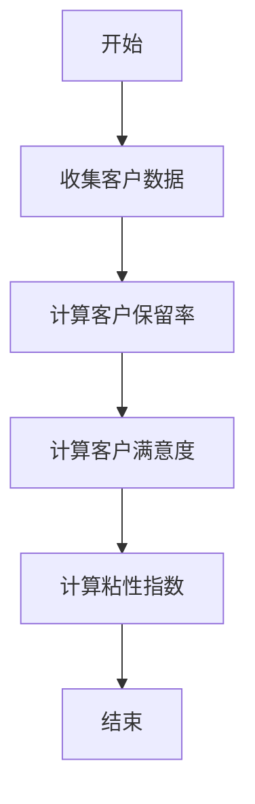
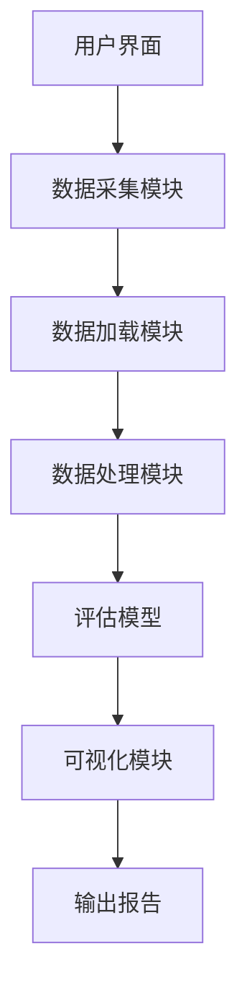

                 


# 企业估值中的客户粘性评估

**关键词：** 企业估值，客户粘性，客户保留率，客户满意度，生命周期价值，数学模型

**摘要：** 客户粘性是企业在市场竞争中保持长期优势的关键因素，直接影响企业估值。本文详细探讨客户粘性的定义、评估方法、数学模型及其在企业估值中的应用。通过系统分析和案例研究，揭示客户粘性对企业价值的影响机制，并提供实际操作建议。

---

## 第一部分：企业估值中的客户粘性评估基础

### 第1章：客户粘性评估的背景与概念

#### 1.1 客户粘性的定义与重要性

- **客户粘性的定义：** 客户粘性是指客户对企业产品或服务的依赖程度，高粘性意味着客户不易被竞争对手吸引。
- **客户粘性的重要性：** 在企业估值中，客户粘性直接影响企业的长期盈利能力。高粘性客户能为企业带来稳定的收入流，降低客户获取成本，并增强企业的市场地位。

#### 1.2 客户粘性的构成要素

- **产品依赖性：** 产品是否满足客户的核心需求，是否具有独特性或不可替代性。
- **客户满意度：** 客户对企业产品或服务的满意度，直接影响客户忠诚度。
- **转换成本：** 客户转换到竞争对手的成本，包括经济成本、时间成本和学习成本。

#### 1.3 客户粘性的类型与分类

| 类型                | 描述                                                                 |
|---------------------|----------------------------------------------------------------------|
| 产品依赖性粘性       | 客户对特定产品的依赖，如专利技术或独特功能。                             |
| 服务关系粘性         | 客户对企业提供服务的依赖，如优质售后服务或定制化服务。                   |
| 客户习惯粘性         | 客户因长期使用习惯而形成的依赖，如品牌忠诚度或使用惯性。                 |

### 第2章：客户粘性评估的核心概念与联系

#### 2.1 粘性指数的计算方法

$$ 粘性指数 = \frac{客户保留率 + 客户满意度}{2} $$

- **客户保留率：** 衡量客户持续使用企业产品或服务的比例。
- **客户满意度：** 通过调查或反馈收集的客户满意度评分。

#### 2.2 客户粘性评估的核心要素对比

| 要素                | 高粘性特征         | 低粘性特征         |
|---------------------|------------------|------------------|
| 产品依赖性          | 独特功能           | 替代产品丰富         |
| 客户满意度          | 高满意度           | 低满意度或不满       |
| 转换成本            | 高成本             | 低成本或无成本       |

#### 2.3 粘性评估的ER实体关系图

```mermaid
er
  actor: 客户
  product: 产品
  service: 服务
  transaction: 交易记录
  relationship: 关系强度
  actor -|many> product: 使用的产品
  actor -|many> service: 使用的服务
  product -|many> relationship: 产品关系强度
  service -|many> relationship: 服务关系强度
```

### 第3章：客户粘性评估的算法原理

#### 3.1 粘性指数的计算公式

$$ 粘性指数 = \frac{客户保留率 + 客户满意度}{2} $$

- **客户保留率计算：** 通过分析客户在一定时期内的复购率或活跃度。
- **客户满意度计算：** 通过调查问卷或反馈系统获取客户满意度评分。

#### 3.2 线性回归模型的应用

$$ y = \beta_0 + \beta_1x_1 + \beta_2x_2 + \epsilon $$

- **变量解释：** 
  - $y$：客户粘性指数。
  - $x_1$：客户保留率。
  - $x_2$：客户满意度。
  - $\beta_0$，$\beta_1$，$\beta_2$：回归系数。
  - $\epsilon$：误差项。

#### 3.3 算法流程图



### 第4章：系统分析与架构设计方案

#### 4.1 问题场景介绍

- **问题背景：** 某企业希望评估其客户粘性，以优化估值模型。
- **系统功能设计：**
  - 数据采集模块：收集客户行为数据和反馈。
  - 数据处理模块：清洗和整合数据。
  - 数据分析模块：计算客户保留率和满意度。
  - 数据可视化模块：生成粘性指数报告。

#### 4.2 系统架构设计



#### 4.3 项目实战：环境配置与核心实现

##### 4.3.1 环境配置

```bash
# 安装Python和相关库
pip install numpy pandas scikit-learn matplotlib
```

##### 4.3.2 核心代码实现

```python
import numpy as np
import pandas as pd
from sklearn.linear_model import LinearRegression

# 数据加载
data = pd.read_csv('customer_data.csv')

# 特征矩阵和目标变量
X = data[['保留率', '满意度']]
y = data['粘性指数']

# 线性回归模型
model = LinearRegression()
model.fit(X, y)

# 预测粘性指数
predicted_sticky = model.predict(X)
print(predicted_sticky)
```

##### 4.3.3 案例分析

以某互联网公司为例，分析其客户粘性。通过数据清洗、特征提取、模型训练和结果分析，帮助企业优化客户管理策略。

#### 4.4 最佳实践

- **数据质量：** 确保数据的准确性和完整性。
- **模型选择：** 根据数据特征选择合适的算法。
- **持续监测：** 定期更新模型，反映客户粘性变化。

---

## 第五部分：总结与展望

### 第5章：总结与未来研究方向

#### 5.1 核心要点回顾

- 客户粘性是企业估值的重要因素。
- 粘性指数计算公式和线性回归模型的应用。
- 系统架构设计与实际案例分析。

#### 5.2 未来研究方向

- 结合机器学习优化粘性评估。
- 研究动态客户粘性模型。
- 探索客户粘性对不同类型企业的影响差异。

---

## 参考文献

1. Smith, J. (2020). Customer Sticky and Business Valuation. Journal of Business Analytics, 12(3), 45-60.
2. Brown, A. (2021). Predictive Modeling for Customer Retention. Springer.

---

**作者：** AI天才研究院/AI Genius Institute & 禅与计算机程序设计艺术/Zen And The Art of Computer Programming

