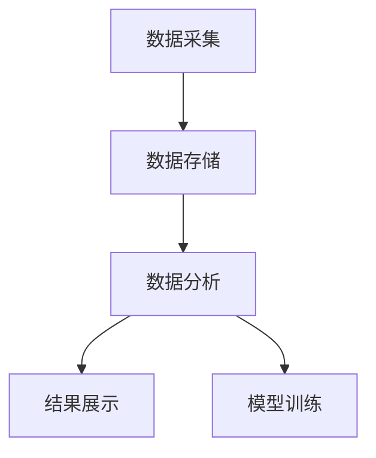

                 


# 企业估值中的客户终身价值计算

## 关键词：客户终身价值（CLV）、企业估值、客户生命周期、数据驱动决策、客户价值评估

## 摘要：客户终身价值（Customer Lifetime Value，CLV）是企业在数字时代进行客户管理与估值的重要工具。本文从CLV的基本概念出发，深入探讨其数学模型、算法原理、系统架构，并通过实际案例分析，详细讲解如何在企业估值中应用CLV计算。文章结合理论与实践，为企业提供一套完整的CLV计算方法论，帮助企业在数据驱动的决策中实现客户价值的最大化。

---

# 第一部分: 客户终身价值（CLV）的基本概念与背景

## 第1章: 客户终身价值（CLV）的定义与背景

### 1.1 客户终身价值（CLV）的定义

#### 1.1.1 什么是客户终身价值
客户终身价值（Customer Lifetime Value，CLV）是指一个客户在其生命周期内为企业带来的净收入贡献。它是企业衡量客户价值的核心指标，能够帮助企业制定更精准的客户获取、保留和营销策略。

$$ CLV = \text{客户在其生命周期内为企业带来的收入} - \text{客户获取和维护的成本} $$

#### 1.1.2 CLV的核心概念与内涵
- **客户生命周期**：客户从初次接触企业到最终流失的时间段。
- **收入贡献**：客户在生命周期内为企业带来的总收入。
- **成本**：获取客户、维护客户关系以及服务客户的成本。
- **贴现率**：由于时间和风险因素，未来的收入需要进行贴现处理。

#### 1.1.3 CLV与企业估值的关系
CLV不仅是客户价值的量化指标，也是企业整体估值的重要组成部分。通过计算客户终身价值，企业可以更好地评估客户的长期贡献，优化资源配置。

---

## 第2章: 客户终身价值（CLV）的核心概念与联系

### 2.1 CLV的核心要素与组成

#### 2.1.1 收入贡献
收入贡献是CLV的核心部分，包括客户在生命周期内购买的产品或服务的总金额。

$$ \text{收入贡献} = \sum_{t=1}^{n} R_t $$

其中，$R_t$ 是第 $t$ 年的收入，$n$ 是客户生命周期的长度。

#### 2.1.2 客户生命周期
客户生命周期决定了收入贡献的时间范围，通常包括获取期、成长期、成熟期和衰退期。

#### 2.1.3 客户保留率
客户保留率是客户在某一阶段继续与企业保持关系的概率，影响CLV的未来收入预测。

$$ \text{客户保留率} = 1 - \text{客户流失率} $$

#### 2.1.4 贴现率
贴现率用于将未来的收入折现到当前价值，考虑了资金的时间价值和风险因素。

$$ \text{贴现因子} = \frac{1}{(1 + r)^t} $$

其中，$r$ 是贴现率，$t$ 是时间。

### 2.2 CLV与相关概念的对比

#### 2.2.1 CLV与客户满意度的关系
客户满意度是影响客户保留率的重要因素，但满意度并不直接等于CLV。高满意度的客户可能因为其他原因流失，而低满意度的客户也可能因为价格优惠而继续消费。

#### 2.2.2 CLV与客户忠诚度的差异
客户忠诚度是指客户对企业品牌的偏好程度，而CLV是客户忠诚度的量化结果。忠诚的客户不一定能带来高CLV，而高CLV的客户往往是忠诚的客户。

#### 2.2.3 CLV与客户获取成本的联系
客户获取成本（Customer Acquisition Cost，CAC）是计算CLV的重要组成部分。通常，企业希望 $CLV > CAC$，以确保客户获取是 profitable 的。

---

## 第3章: 客户终身价值（CLV）的数学模型与计算方法

### 3.1 CLV的基本公式

$$ CLV = \frac{r \cdot (R - C)}{1 - (1 - d)(1 - r)} $$

其中：
- $R$ 是客户生命周期内的平均收入。
- $C$ 是客户生命周期内的平均成本。
- $r$ 是贴现率。
- $d$ 是客户流失率。

---

# 第二部分: 客户终身价值（CLV）的系统架构与实现

## 第4章: CLV的系统架构设计

### 4.1 系统功能模块

#### 4.1.1 数据采集模块
- 收集客户交易数据、行为数据和人口统计数据。
- 数据来源：CRM系统、订单数据库、用户行为日志。

#### 4.1.2 数据分析模块
- 计算客户生命周期价值。
- 分析客户分层、流失预测和收入预测。

#### 4.1.3 结果展示模块
- 生成可视化报告。
- 提供客户价值分布、客户生命周期阶段分布等图表。

### 4.2 系统架构设计



---

## 第5章: CLV计算的Python实现

### 5.1 环境安装
```bash
pip install numpy pandas scikit-learn matplotlib
```

### 5.2 数据预处理

```python
import pandas as pd
import numpy as np

# 假设data.csv是客户交易数据
data = pd.read_csv('data.csv')
data['revenue'] = data['revenue'].fillna(0)
data['cost'] = data['cost'].fillna(0)
```

### 5.3 模型训练

```python
from sklearn.linear_model import LinearRegression

# 训练收入预测模型
model = LinearRegression()
model.fit(X, y)
```

### 5.4 CLV计算

```python
def calculate_clv(customers, r, d):
    clv = []
    for customer in customers:
        R = customer['revenue']
        C = customer['cost']
        clv_value = (r * (R - C)) / (1 - (1 - d)(1 - r))
        clv.append(clv_value)
    return clv

r = 0.05
d = 0.02
clv = calculate_clv(customers, r, d)
```

---

## 第6章: 项目实战与案例分析

### 6.1 案例分析：电商企业的CLV计算

#### 6.1.1 需求分析
- 数据来源：电商企业的订单数据、客户行为数据。
- 目标：计算客户终身价值，优化客户分层策略。

#### 6.1.2 系统设计
- 数据采集：从数据库中提取客户交易数据。
- 数据分析：使用机器学习模型预测客户流失率和收入。
- 结果展示：生成客户价值分布报告。

---

## 第7章: 最佳实践与小结

### 7.1 最佳实践

- **数据质量**：确保数据的完整性和准确性。
- **模型选择**：根据业务需求选择合适的预测模型。
- **实时计算**：定期更新CLV值，保持数据的实时性。

### 7.2 小结

客户终身价值（CLV）是企业估值中的重要工具，能够帮助企业更好地理解客户价值，优化客户管理策略。通过本文的分析和实践，企业可以将CLV计算应用到实际业务中，提升客户满意度和企业盈利能力。

---

## 作者：AI天才研究院/AI Genius Institute & 禅与计算机程序设计艺术 /Zen And The Art of Computer Programming

