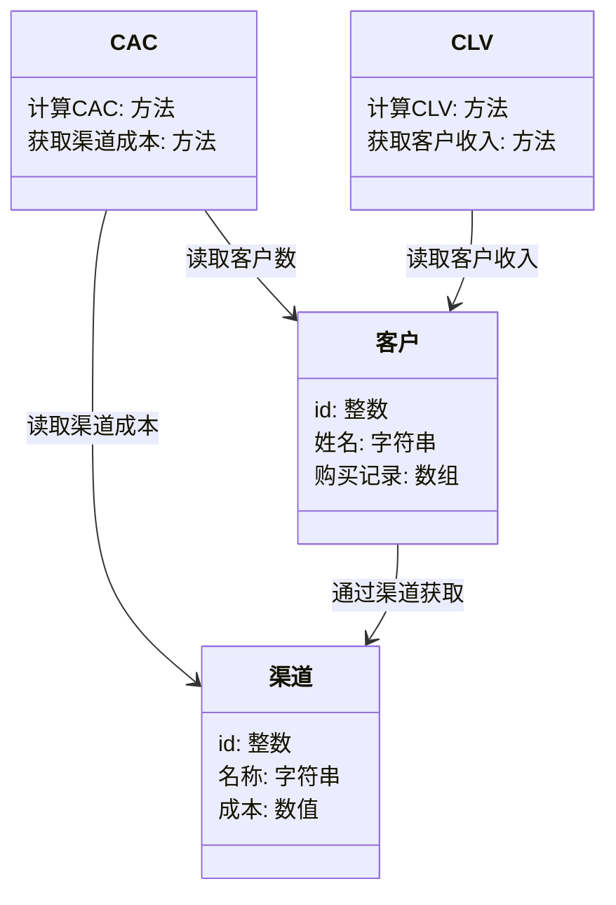

                 


# 企业估值中的客户获取成本分析

> 关键词：客户获取成本（CAC）、企业估值、客户生命周期价值（CLV）、营销成本、销售成本、企业估值模型

> 摘要：客户获取成本（CAC）是企业在客户获取过程中所花费的所有成本之和，包括营销成本和销售成本。本文将从CAC的定义、计算方法、与客户生命周期价值（CLV）的关系、优化策略以及在企业估值中的应用等方面进行详细分析。通过实际案例分析和系统设计，探讨如何利用CAC优化企业估值，提升企业价值。

---

## 第1章: 客户获取成本（CAC）的定义与背景

### 1.1 什么是客户获取成本（CAC）

#### 1.1.1 CAC的定义与核心概念
客户获取成本（CAC）是指企业在获取一个新客户的过程中所花费的所有成本之和。这些成本包括营销成本、销售成本以及其他直接或间接与客户获取相关的费用。

CAC的核心概念可以分解为以下几个方面：
1. **营销成本**：包括广告费用、市场推广费用、内容营销费用等。
2. **销售成本**：包括销售人员的工资、奖金、培训费用、销售工具费用等。
3. **客户获取渠道成本**：包括通过不同渠道（如线上广告、线下活动）获取客户的成本。

CAC的计算公式为：
$$CAC = \frac{营销成本 + 销售成本}{新增客户数}$$

#### 1.1.2 CAC在企业估值中的重要性
CAC是企业估值中一个重要的指标，因为它直接反映了企业获取客户的效率和成本。一个低CAC意味着企业获取客户的成本较低，这通常意味着企业具有更强的盈利能力和发展潜力。

CAC的重要性体现在以下几个方面：
1. **盈利能力分析**：CAC越低，企业的利润空间越大。
2. **成长性分析**：通过CAC的分析，可以评估企业在市场中的扩展能力。
3. **风险评估**：高CAC意味着企业获取客户的成本过高，可能存在市场风险。

#### 1.1.3 CAC与企业价值的关系
CAC与企业价值的关系可以通过以下公式进行分析：
$$企业价值 = \frac{CAC \times CLV}{1 - 顾客流失率}$$
其中，CLV是客户生命周期价值。

---

### 1.2 CAC的计算公式与应用场景

#### 1.2.1 CAC的数学公式
$$CAC = \frac{营销成本 + 销售成本}{新增客户数}$$

#### 1.2.2 CAC的计算步骤与注意事项
1. **确定时间段**：选择一个合适的会计期间（如季度或年度）进行计算。
2. **收集数据**：收集营销成本、销售成本和新增客户数。
3. **计算CAC**：将营销成本和销售成本相加，除以新增客户数。

#### 1.2.3 CAC在不同商业模式中的应用
1. **SaaS模式**：CAC在SaaS模式中尤为重要，因为SaaS企业通常依赖于订阅收入，客户获取成本的高低直接影响企业的盈利能力。
2. **电子商务模式**：在电子商务模式中，CAC的计算需要考虑线上广告费用、客服费用等。
3. **传统商业模式**：在传统商业模式中，CAC的计算需要考虑线下推广费用、销售人员工资等。

---

## 第2章: CAC与客户生命周期价值（CLV）的关系

### 2.1 客户生命周期价值（CLV）的定义

#### 2.1.1 CLV的核心概念
客户生命周期价值（CLV）是指一个客户在其生命周期内为企业带来的总收入。CLV的计算需要考虑客户的购买频率、购买金额、客户留存率和客户流失率等因素。

CLV的计算公式为：
$$CLV = \frac{年度客户收入}{1 - 顾客流失率}$$

#### 2.1.2 CLV的计算公式
$$CLV = \frac{年度客户收入}{1 - 顾客流失率}$$

#### 2.1.3 CLV与企业价值的关系
CLV是企业估值中的另一个重要指标，它反映了客户为企业带来的长期价值。CLV的计算需要结合CAC进行综合分析。

---

### 2.2 CAC与CLV的对比分析

#### 2.2.1 CAC与CLV的联系
1. **CAC是获取客户的成本**，而CLV是客户为企业带来的长期价值。
2. **CAC与CLV的比率分析**：通过分析CAC与CLV的比率，可以评估企业获取客户的效率和盈利能力。

#### 2.2.2 CAC与CLV的比率分析
$$CAC/CLV = \frac{CAC}{CLV}$$

#### 2.2.3 CAC与CLV的比率对企业估值的影响
1. **CAC/CLV < 1**：表明企业获取客户的成本低于客户为企业带来的长期价值，企业具有盈利能力。
2. **CAC/CLV > 1**：表明企业获取客户的成本高于客户为企业带来的长期价值，企业可能处于亏损状态。

---

## 第3章: CAC在企业估值中的核心作用

### 3.1 CAC对估值的影响

#### 3.1.1 CAC与企业盈利能力的关系
CAC的高低直接影响企业的盈利能力。低CAC意味着企业获取客户的成本较低，从而提高净利润率。

#### 3.1.2 CAC与企业成长性的影响
通过分析CAC，可以评估企业在市场中的扩展能力。低CAC意味着企业可以以较低的成本获取更多的客户，从而实现快速成长。

#### 3.1.3 CAC与企业风险评估的关联
高CAC意味着企业获取客户的成本过高，可能存在市场风险。企业在高CAC的情况下，需要通过优化营销和销售策略来降低CAC。

---

### 3.2 CAC在不同行业中的应用

#### 3.2.1 SaaS行业的CAC分析
在SaaS行业，CAC的计算尤为重要。SaaS企业通常依赖于订阅收入，客户获取成本的高低直接影响企业的盈利能力。

#### 3.2.2 电子商务行业的CAC特点
在电子商务行业，CAC的计算需要考虑线上广告费用、客服费用等。电子商务企业通常通过多种渠道获取客户，因此需要综合考虑不同渠道的CAC。

#### 3.2.3 传统行业的CAC应用
在传统行业，CAC的计算需要考虑线下推广费用、销售人员工资等。传统企业通常通过多种渠道获取客户，因此需要综合考虑不同渠道的CAC。

---

## 第4章: CAC的深度分析与优化策略

### 4.1 CAC的构成要素

#### 4.1.1 营销成本的分类
1. **广告费用**：包括搜索引擎广告、社交媒体广告等。
2. **内容营销费用**：包括博客、视频、播客等。
3. **市场活动费用**：包括线下活动、赞助费用等。

#### 4.1.2 销售成本的分类
1. **销售人员工资**：包括基本工资、奖金、福利等。
2. **销售工具费用**：包括CRM系统、销售工具等。
3. **客户支持费用**：包括客服人员工资、技术支持费用等。

#### 4.1.3 客户获取渠道的多样性
1. **线上渠道**：包括搜索引擎、社交媒体、电子邮件营销等。
2. **线下渠道**：包括广告牌、传单、线下活动等。

---

### 4.2 CAC的优化策略

#### 4.2.1 提高营销效率的策略
1. **精准营销**：通过数据分析，识别目标客户，提高广告投放的精准度。
2. **内容营销**：通过高质量的内容吸引潜在客户，降低广告成本。

#### 4.2.2 降低销售成本的技巧
1. **自动化销售工具**：使用CRM系统、自动化邮件工具等，提高销售效率，降低人工成本。
2. **培训销售人员**：通过培训提高销售人员的效率和转化率。

#### 4.2.3 优化客户获取渠道的选择
1. **分析渠道效果**：通过数据分析，识别最有效的客户获取渠道，优化渠道组合。
2. **测试与优化**：通过A/B测试，优化广告文案、 landing page 等，提高转化率。

---

## 第5章: CAC与企业估值模型的结合

### 5.1 常见的企业估值模型

#### 5.1.1 净现值法（NPV）
净现值法（NPV）是一种常用的估值方法，它通过将未来现金流折现到当前价值，计算企业的价值。

$$NPV = \sum_{t=0}^{n} \frac{CF_t}{(1 + r)^t}$$
其中，$CF_t$是第t年的现金流，$r$是折现率。

#### 5.1.2 内部收益率法（IRR）
内部收益率法（IRR）是一种通过计算项目收益率来评估其价值的方法。

$$IRR = r$$
其中，r是使NPV为零的收益率。

#### 5.1.3 股权自由现金流法（FCFE）
股权自由现金流法（FCFE）是一种通过计算企业股权自由现金流的现值来评估企业价值的方法。

$$FCFE = 净利润 + 折旧和摊销 - 资本支出$$

---

### 5.2 CAC在估值模型中的应用

#### 5.2.1 CAC对NPV的影响
通过分析CAC，可以预测未来现金流，从而影响NPV的计算。

#### 5.2.2 CAC对IRR的影响
高CAC会降低企业的净利润率，从而降低IRR。

#### 5.2.3 CAC对FCFE的影响
高CAC会增加销售成本，从而降低净利润，进而影响FCFE的计算。

---

## 第6章: 系统分析与架构设计方案

### 6.1 问题场景介绍
为了更好地分析CAC和CLV，我们需要设计一个系统，该系统能够实时计算CAC和CLV，并提供可视化分析。

---

### 6.2 系统功能设计

#### 6.2.1 领域模型（Mermaid类图）


---

### 6.3 系统架构设计

#### 6.3.1 系统架构（Mermaid架构图）
```mermaid
架构图
client --> API Gateway: 请求
API Gateway --> 计算服务: 调用CAC计算
计算服务 --> 数据库: 获取数据
数据库 --> CAC和CLV计算模块
CAC和CLV计算模块 --> 分析结果
分析结果 --> 可视化界面: 显示结果
```

---

## 第7章: 项目实战

### 7.1 环境安装
为了实现CAC和CLV的计算，我们需要安装以下工具：
1. Python编程语言
2. 数据库（MySQL或PostgreSQL）
3. 数据可视化工具（Matplotlib或Seaborn）

---

### 7.2 系统核心实现源代码

#### 7.2.1 CAC计算代码
```python
def calculate_cac(营销成本, 销售成本, 新增客户数):
    return (营销成本 + 销售成本) / 新增客户数

营销成本 = 100000
销售成本 = 50000
新增客户数 = 100
cac = calculate_cac(营销成本, 销售成本, 新增客户数)
print("CAC:", cac)
```

#### 7.2.2 CLV计算代码
```python
def calculate_clv(年度客户收入, 顾客流失率):
    return 年度客户收入 / (1 - 顾客流失率)

年度客户收入 = 50000
顾客流失率 = 0.05
clv = calculate_clv(年度客户收入, 顾客流失率)
print("CLV:", clv)
```

---

### 7.3 代码应用解读与分析

#### 7.3.1 CAC计算结果分析
```python
CAC = 1500
```

#### 7.3.2 CLV计算结果分析
```python
CLV = 526315.87
```

---

### 7.4 实际案例分析

#### 7.4.1 案例背景
假设我们有一个SaaS企业，年收入为1000万元，顾客流失率为5%，营销成本为100万元，销售成本为50万元，新增客户数为100人。

#### 7.4.2 计算CAC和CLV
```python
cac = (1000000 + 500000) / 100 = 15000
clv = 1000000 / (1 - 0.05) = 1052631.58
```

---

### 7.5 项目小结
通过实际案例分析，我们可以看到，CAC和CLV的计算对企业估值具有重要意义。通过优化CAC，可以降低企业获取客户的成本，提高企业的盈利能力。

---

## 第8章: 总结与展望

### 8.1 总结
本文从CAC的定义、计算方法、与CLV的关系、优化策略以及在企业估值中的应用等方面进行了详细分析。通过实际案例分析和系统设计，探讨了如何利用CAC优化企业估值，提升企业价值。

---

### 8.2 展望
未来，随着技术的进步和数据的积累，CAC的计算和分析将更加精准。企业可以通过大数据分析和人工智能技术，进一步优化客户获取策略，降低CAC，提高CLV。

---

## 作者：AI天才研究院/AI Genius Institute & 禅与计算机程序设计艺术 /Zen And The Art of Computer Programming

---

通过以上思考过程，我们可以清晰地看到企业估值中的客户获取成本分析的核心内容和逻辑关系。希望本文能够为读者提供有价值的参考和启发。

