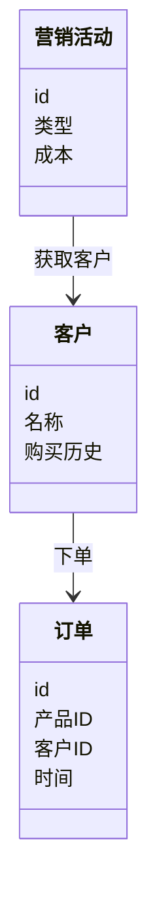

                 


# 企业估值中的客户获取成本分析

---

## 关键词：
客户获取成本（CAC）、企业估值、市场营销、财务分析、投资回报率（ROI）

---

## 摘要：
客户获取成本（CAC）是企业在获取新客户过程中所花费的所有费用的总和，是衡量企业市场活动效率和盈利能力的重要指标。本文从客户获取成本的基本概念出发，详细分析其在企业估值中的应用，包括CAC的数学模型、系统架构设计、实际案例分析等方面，为企业管理者和投资者提供科学的决策依据。

---

## 第一部分: 客户获取成本（CAC）的背景与重要性

### 第1章: CAC的定义与概念

#### 1.1 CAC的定义与基本概念
客户获取成本（CAC）是指企业为吸引一位新客户所支付的所有费用的总和，包括营销费用、广告支出、销售团队成本等。CAC的计算公式如下：

$$CAC = \frac{\text{营销成本} + \text{销售成本}}{\text{新增客户数}}$$

CAC是企业估值的重要组成部分，因为它直接影响企业的利润和可持续发展能力。

#### 1.2 CAC的影响因素
CAC的大小受多种因素影响，包括市场推广方式、目标客户群体、行业竞争状况等。例如，通过线上广告获取客户的成本通常低于通过线下活动获取客户的成本。

#### 1.3 CAC在企业估值中的作用
CAC不仅是衡量企业市场活动效率的重要指标，也是评估企业盈利能力的关键因素。通过分析CAC与客户生命周期价值（CLV）的对比，可以更好地理解企业的可持续发展能力。

---

## 第二部分: CAC的核心概念与分析框架

### 第2章: CAC的核心概念与原理

#### 2.1 CAC的基本原理
CAC的核心原理是通过量化客户获取成本，评估企业的市场活动效率和盈利能力。通过分析CAC，企业可以优化市场策略，降低客户获取成本，提高投资回报率（ROI）。

#### 2.2 CAC与企业利润的关系
CAC与企业利润密切相关。如果企业的CAC低于客户生命周期价值（CLV），说明企业的市场活动是盈利的；反之，则可能意味着企业需要优化市场策略。

#### 2.3 CAC与客户生命周期价值（CLV）的对比
客户生命周期价值（CLV）是客户在企业生命周期内为企业带来的总收入，公式如下：

$$CLV = \frac{\text{年收入} \times \text{毛利率}}{\text{客户流失率}}$$

通过对比CAC和CLV，可以评估企业的市场活动是否具有可持续性。

---

## 第三部分: CAC的数学模型与公式

### 第3章: CAC的基本数学模型

#### 3.1 CAC的计算公式
$$CAC = \frac{\text{营销成本} + \text{销售成本}}{\text{新增客户数}}$$

#### 3.2 CAC与企业估值的关系
企业价值可以通过以下公式进行估算：

$$企业价值 = \frac{\text{收入}}{\text{CAC/客户生命周期价值比}}$$

---

## 第四部分: CAC的系统分析与架构设计

### 第4章: 系统分析

#### 4.1 问题场景介绍
企业需要通过系统化的方法计算和分析CAC，以优化市场策略和提高盈利能力。

#### 4.2 系统功能需求
系统需要实现以下功能：
- 计算CAC
- 分析CAC与CLV的关系
- 提供市场策略优化建议

#### 4.3 系统功能设计（领域模型）



---

## 第五部分: CAC的项目实战

### 第5章: 项目实战

#### 5.1 环境安装
- 安装Python和必要的库（如Pandas、NumPy）

#### 5.2 核心实现源代码

```python
import pandas as pd

def calculate_cac(customers, marketing_cost, sales_cost):
    total_cost = marketing_cost + sales_cost
    return total_cost / customers

# 示例数据
customers = 100
marketing_cost = 50000
sales_cost = 30000

cac = calculate_cac(customers, marketing_cost, sales_cost)
print(f"CAC: {cac:.2f}")
```

#### 5.3 案例分析
假设某企业新增客户数为100，营销成本为50000，销售成本为30000，则：

$$CAC = \frac{50000 + 30000}{100} = 800$$

---

## 第六部分: 最佳实践与小结

### 第6章: 最佳实践

#### 6.1 关键注意事项
- 定期分析CAC，优化市场策略
- 结合CLV分析企业的可持续发展能力
- 考虑行业特点，制定合理的CAC目标

#### 6.2 小结
客户获取成本（CAC）是企业估值的重要指标，通过科学的分析和优化，企业可以提高市场活动效率，实现可持续发展。

---

## 作者：
AI天才研究院/AI Genius Institute & 禅与计算机程序设计艺术 /Zen And The Art of Computer Programming

