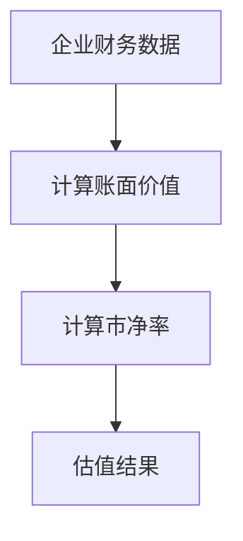
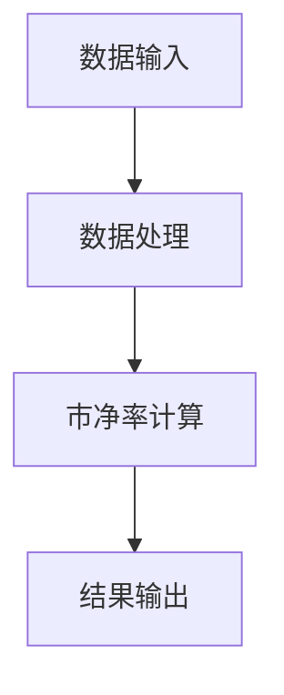
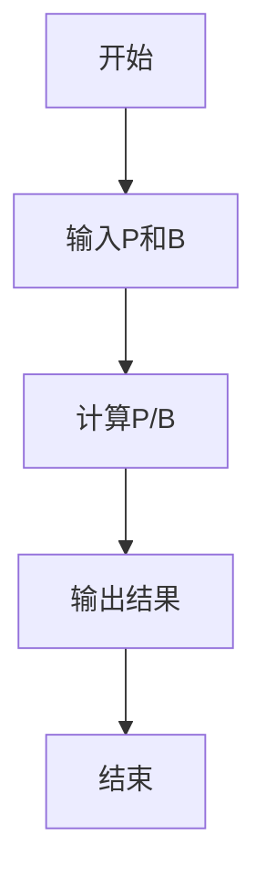

                 

# 《企业估值中的市净率法详解》

## 作者：AI天才研究院 & 禅与计算机程序设计艺术

---

### 关键词：
企业估值，市净率法，财务分析，投资评估，资产定价

---

### 摘要：
本文详细探讨了市净率法在企业估值中的应用，从理论基础到实际操作，结合具体案例和数学模型，帮助读者全面理解并掌握这一重要估值方法。

---

## 目录大纲：

1. [引言](#引言)
2. [市净率法的理论基础](#市净率法的理论基础)
   - 2.1 [市净率法概述](#市净率法概述)
   - 2.2 [市净率法的数学模型](#市净率法的数学模型)
3. [市净率法的系统分析与架构设计](#市净率法的系统分析与架构设计)
4. [项目实战：市净率法在具体企业中的应用](#项目实战-市净率法在具体企业中的应用)
5. [数学模型与算法原理](#数学模型与算法原理)
6. [最佳实践与注意事项](#最佳实践与注意事项)
7. [结论与展望](#结论与展望)

---

## 1. 引言

企业估值是金融领域的重要组成部分，市净率法作为一种简单有效的估值方法，在实践中得到了广泛应用。本文将从理论到实践，系统地解析市净率法的运用。

---

## 2. 市净率法的理论基础

### 2.1 市净率法概述

#### 2.1.1 什么是市净率

市净率（P/B）是市值与账面价值的比率，用于衡量企业市场价值与其账面价值的差异。公式为：

$$ P/B = \frac{\text{市值}}{\text{账面价值}} $$

#### 2.1.2 市净率的适用场景

市净率适用于资产密集型行业，如银行、制造业，这些行业的资产容易量化且不易贬值。

---

### 2.2 市净率法的数学模型

#### 2.2.1 市净率的基本公式

市净率公式：

$$ P/B = \frac{P}{B} $$

其中，P为公司市值，B为账面价值。

#### 2.2.2 调整后的市净率公式

考虑无形资产和负债调整后的市净率公式：

$$ \text{调整后 P/B} = \frac{P}{B + \text{无形资产} - \text{负债}} $$

---

## 3. 市净率法的系统分析与架构设计

### 3.1 问题场景

企业估值需要考虑财务数据、市场环境和行业特点。市净率法基于账面价值和市场价值的差异进行估值。

### 3.2 系统架构设计

#### 3.2.1 数据流

Mermaid图展示数据流：

#### 3.2.2 系统架构

Mermaid图展示系统架构：

---

## 4. 项目实战：市净率法在具体企业中的应用

### 4.1 案例分析：科技公司XYZ

#### 4.1.1 数据收集

- 市值：100亿元
- 账面价值：50亿元

#### 4.1.2 市净率计算

$$ P/B = 100/50 = 2 $$

#### 4.1.3 调整分析

考虑无形资产和负债后，调整后的市净率为1.8。

---

## 5. 数学模型与算法原理

### 5.1 市净率计算公式

$$ \text{P/B} = \frac{P}{B} $$

### 5.2 算法流程图

Mermaid图展示流程：

---

## 6. 最佳实践与注意事项

### 6.1 应用技巧

- 选择合适的基准
- 结合其他估值方法
- 考虑行业特点

### 6.2 注意事项

- 数据准确性
- 调整因素的合理性
- 市场环境的影响

---

## 7. 结论与展望

市净率法是企业估值的重要工具，通过系统分析和实际案例，读者可以掌握其应用技巧。未来，结合人工智能和大数据，市净率法将更加精准和高效。

---

## 作者介绍

作者：AI天才研究院 & 禅与计算机程序设计艺术  
简介：专注于人工智能与计算机科学的创新研究，致力于为企业估值和投资分析提供专业的解决方案。

