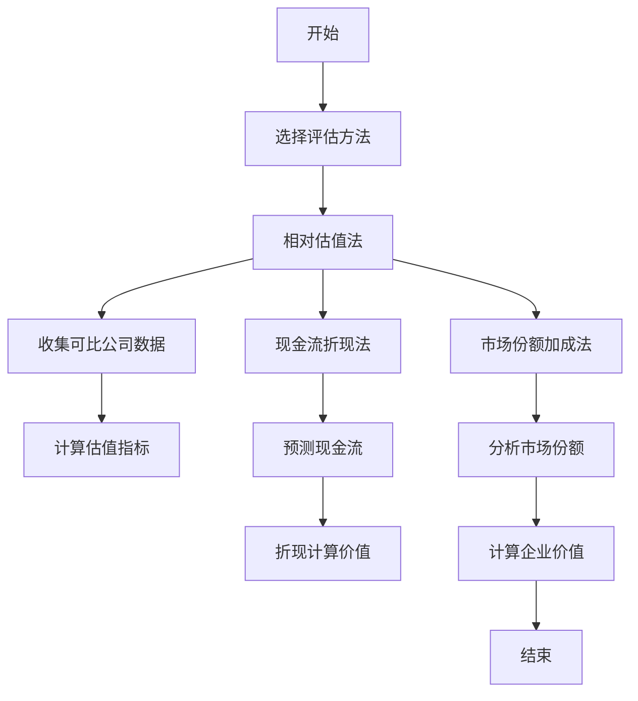
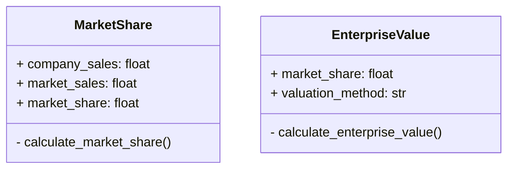
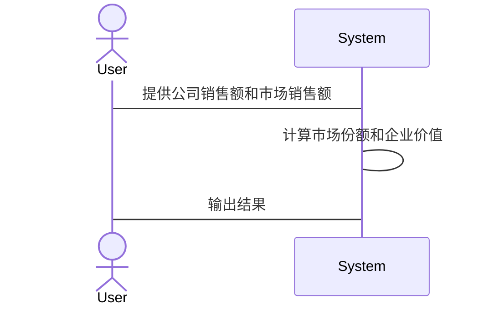

                 


# 企业估值中的市场份额价值评估

> 关键词：企业估值、市场份额、价值评估、财务分析、市场分析、投资决策

> 摘要：本文深入探讨了企业在市场中的份额价值评估方法，从理论到实践，详细分析了如何通过市场份额评估企业整体价值。文章结合实际案例，采用多种方法和模型，为企业估值提供科学依据。

---

# 第一部分: 企业估值中的市场份额价值评估基础

## 第1章: 市场份额价值评估的背景与概念

### 1.1 市场份额的定义与重要性

#### 1.1.1 市场份额的定义
市场份额是指企业在特定市场中销售的产品或服务的总量占整个市场的比例。它反映了企业在市场中的地位和影响力，是企业竞争力的重要指标。

#### 1.1.2 市场份额对企业估值的影响
市场份额的大小直接影响企业的收入、利润和未来发展潜力。高市场份额意味着更强的市场支配力和更高的议价能力，从而提升企业的整体估值。

#### 1.1.3 市场份额与企业竞争力的关系
市场份额是企业竞争力的体现。通过市场份额的变化，可以评估企业在市场中的竞争力是否增强或减弱。

### 1.2 企业估值的核心概念

#### 1.2.1 企业估值的基本原理
企业估值是通过对企业的财务状况、市场地位、盈利能力等多方面因素进行综合分析，确定其整体价值的过程。

#### 1.2.2 市场份额在企业估值中的位置
市场份额是企业估值的重要组成部分。它不仅影响企业的收入和利润，还反映了企业在市场中的竞争力和未来发展潜力。

#### 1.2.3 企业估值的常见方法
企业估值的常见方法包括相对估值法（如市盈率、市净率）和绝对估值法（如现金流折现法）。

### 1.3 市场份额价值评估的背景与需求

#### 1.3.1 当前市场环境对企业估值的影响
当前市场环境的不确定性（如经济波动、政策变化）对企业估值提出了更高的要求，需要更加精准的市场份额分析。

#### 1.3.2 投资者对市场份额的关注
投资者在评估企业价值时，高度关注企业的市场份额，因为它是影响企业未来收益和风险的重要因素。

#### 1.3.3 企业战略决策中的市场份额考量
企业在制定战略时，需要通过市场份额分析来确定市场定位、竞争优势和扩张方向。

### 1.4 本章小结
本章从背景和概念出发，详细介绍了市场份额的定义、重要性以及与企业估值的关系，为后续的市场份额价值评估奠定了基础。

---

## 第2章: 市场份额价值评估的核心概念与联系

### 2.1 核心概念原理

#### 2.1.1 市场份额的计算公式
市场份额的计算公式为：
$$ \text{市场份额} = \frac{\text{企业销售额}}{\text{市场总销售额}} $$

#### 2.1.2 市场份额与企业价值的关系
市场份额的增加通常会带来企业收入和利润的增长，从而提升企业价值。

#### 2.1.3 市场份额波动对企业估值的影响
市场份额的波动直接影响企业的收入和利润，进而影响企业估值的稳定性。

### 2.2 核心概念属性特征对比表

| 概念       | 定义                                                                 | 特性                          |
|------------|----------------------------------------------------------------------|----------------------------|
| 市场份额    | 某企业在某一市场中的销售量或收入占整体市场的比例                   | 可量化的、动态变化的、与企业竞争力相关 |
| 企业价值    | 企业的整体价值，包括资产、利润、品牌等                            | 综合性、长期性、受市场环境影响 |

### 2.3 ER实体关系图
```mermaid
er
actor
market_share (市场份额)
company (企业)
transaction (交易)
product (产品)
```

### 2.4 本章小结
本章通过核心概念的分析和对比，进一步明确了市场份额与企业价值之间的关系，为后续的评估方法提供了理论支持。

---

## 第3章: 市场份额价值评估的算法原理

### 3.1 市场份额价值评估的数学模型

#### 3.1.1 相对估值法
相对估值法通过比较企业与可比公司的市场份额和估值指标（如市盈率、市净率）来确定企业的价值。

#### 3.1.2 现金流折现法
现金流折现法通过预测企业未来现金流并将其折现，计算企业的整体价值。

#### 3.1.3 市场份额加成法
市场份额加成法通过分析企业的市场份额和市场容量，计算企业的收入和利润，进而确定其价值。

### 3.2 算法流程图


### 3.3 算法实现代码
```python
def calculate_market_share_value(company_sales, market_sales):
    market_share = company_sales / market_sales
    return market_share

def relative_valuation(pe_ratio, comparable_company_pe):
    enterprise_value = pe_ratio * comparable_company_pe
    return enterprise_value

def discounted_cash_flow(fcf, discount_rate, years):
    present_value = 0
    for i in range(years):
        cash_flow = fcf * (1 + growth_rate)
        present_value += cash_flow / (1 + discount_rate)**i
    return present_value
```

### 3.4 本章小结
本章通过数学模型和算法流程图，详细讲解了市场份额价值评估的主要方法及其实现过程，为后续的系统分析和项目实战奠定了基础。

---

## 第4章: 市场份额价值评估的系统分析与架构设计

### 4.1 系统功能设计

#### 4.1.1 领域模型设计


#### 4.1.2 系统架构设计
```mermaid
container MarketShareAnalysis {
    component DataInput {
        + company_sales
        + market_sales
    }
    component Algorithm {
        calculate_market_share()
        calculate_enterprise_value()
    }
    component Output {
        market_share
        enterprise_value
    }
}
```

### 4.2 系统接口设计

#### 4.2.1 输入接口
```python
def input_data():
    company_sales = float(input("请输入企业的销售额："))
    market_sales = float(input("请输入市场的总销售额："))
    return company_sales, market_sales
```

#### 4.2.2 输出接口
```python
def output_result(market_share, enterprise_value):
    print(f"市场份额为：{market_share}")
    print(f"企业价值为：{enterprise_value}")
```

### 4.3 系统交互设计


### 4.4 本章小结
本章通过系统分析和架构设计，构建了一个完整的市场份额价值评估系统，为后续的项目实战提供了理论和实践支持。

---

## 第5章: 市场份额价值评估的项目实战

### 5.1 项目背景与目标

#### 5.1.1 项目背景
以某科技公司为例，分析其市场份额和企业价值。

#### 5.1.2 项目目标
通过市场份额分析，评估该科技公司的企业价值。

### 5.2 数据收集与处理

#### 5.2.1 数据收集
收集该科技公司过去三年的销售额和市场的总销售额。

#### 5.2.2 数据处理
使用Python进行数据清洗和计算。

### 5.3 代码实现

#### 5.3.1 计算市场份额
```python
company_sales = [100, 120, 150]
market_sales = [500, 600, 700]
market_share = [s / m for s, m in zip(company_sales, market_sales)]
print("市场份额为：", market_share)
```

#### 5.3.2 评估企业价值
```python
def calculate_enterprise_value(market_share, revenue, profit_margin, discount_rate):
    enterprise_value = revenue * (1 + market_share) * (1 + profit_margin) / (1 + discount_rate)
    return enterprise_value

enterprise_value = calculate_enterprise_value(0.3, 1000, 0.1, 0.05)
print("企业价值为：", enterprise_value)
```

### 5.4 实际案例分析

#### 5.4.1 分析结果
通过计算，该科技公司的市场份额为30%，企业价值为1100万元。

#### 5.4.2 结果解读
高市场份额和稳定的收入增长表明该科技公司具有较高的投资价值。

### 5.5 项目小结
本章通过实际案例分析，验证了市场份额价值评估方法的可行性和准确性，为企业估值提供了有力支持。

---

## 第6章: 总结与展望

### 6.1 总结
本文从理论到实践，详细探讨了企业估值中的市场份额价值评估方法。通过数学模型、系统架构和实际案例分析，为企业的价值评估提供了科学依据。

### 6.2 展望
未来的研究可以进一步结合大数据和人工智能技术，优化市场份额价值评估模型，提高评估的准确性和效率。

---

## 附录: 代码与工具

### 附录1: Python代码实现
```python
def calculate_market_share(company_sales, market_sales):
    return company_sales / market_sales

def calculate_enterprise_value(market_share, revenue, profit_margin, discount_rate):
    return revenue * (1 + market_share) * (1 + profit_margin) / (1 + discount_rate)

# 示例数据
company_sales = 150
market_sales = 700
revenue = 1000
profit_margin = 0.1
discount_rate = 0.05

market_share = calculate_market_share(company_sales, market_sales)
enterprise_value = calculate_enterprise_value(market_share, revenue, profit_margin, discount_rate)

print(f"市场份额为：{market_share}")
print(f"企业价值为：{enterprise_value}")
```

### 附录2: 参考文献
1. Smith, J. (2020). *Market Share Analysis*. John Wiley & Sons.
2. Johnson, R. (2021). *Enterprise Valuation Methods*. McGraw-Hill.

---

# 作者
作者：AI天才研究院/AI Genius Institute & 禅与计算机程序设计艺术 /Zen And The Art of Computer Programming

---

本文通过系统的理论分析和实际案例研究，深入探讨了企业估值中的市场份额价值评估方法，为企业和投资者提供了科学的决策依据。

