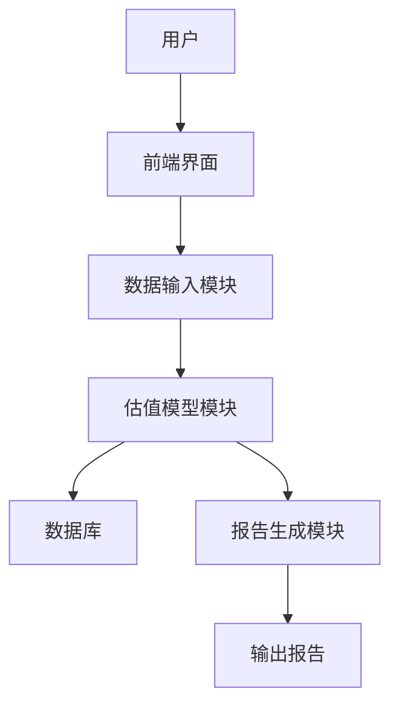

                 


# 企业估值中的常见误区及解决方案

> 关键词：企业估值，DCF模型，相对估值法，基本面分析，宏观经济因素

> 摘要：企业估值是投资决策中的关键环节，然而在实际操作中常常存在诸多误区。本文系统分析了企业估值中的常见误区，并提出了相应的解决方案。通过结合实际案例和数学模型，详细讲解了DCF模型、相对估值法等核心方法，帮助读者避免估值错误，提升投资决策的准确性。

---

## 第一部分：企业估值背景与常见误区

### 第1章：企业估值的基本概念与重要性

#### 1.1 企业估值的定义与核心要素
企业估值是通过对企业的财务状况、市场地位、盈利能力等多方面因素的综合分析，确定其市场价值的过程。核心要素包括：
- **财务数据**：收入、利润、现金流等。
- **市场环境**：行业竞争、宏观经济状况。
- **未来预期**：企业增长潜力、未来现金流预测。

#### 1.2 企业估值的主要方法概述
企业估值的主要方法包括：
- **绝对估值法**：基于企业自身财务数据的估值方法，如现金流折现法（DCF）。
- **相对估值法**：基于可比公司或行业的估值方法，如市盈率法、市净率法。

#### 1.3 企业估值中的常见误区
- **误区一**：过度依赖单一估值方法。
- **误区二**：忽视企业基本面分析。
- **误区三**：未考虑市场波动和宏观经济因素。
- **误区四**：过度关注短期收益。

---

## 第二部分：企业估值的解决方案与最佳实践

### 第2章：企业估值的解决方案

#### 2.1 综合运用多种估值方法
- **DCF模型**：通过预测未来现金流并折现计算企业价值。
- **相对估值法**：结合可比公司分析，调整倍数进行估值。

#### 2.2 深入分析企业基本面
- **财务报表分析**：重点关注收入、利润、现金流等关键指标。
- **竞争优势分析**：识别企业的核心竞争力和护城河。

#### 2.3 考虑宏观经济与市场波动
- **宏观经济因素**：GDP增长率、利率水平等对估值的影响。
- **市场波动**：短期市场波动对企业估值的干扰。

#### 2.4 平衡短期与长期目标
- 短期收益与长期价值的平衡：避免过度关注短期利润，注重企业长期增长潜力。

---

## 第三部分：企业估值的数学模型与算法原理

### 第3章：现金流折现模型（DCF）的原理与实现

#### 3.1 DCF模型的数学公式
企业价值可以通过未来现金流的现值计算：
$$
\text{企业价值} = \sum_{t=1}^{n} \frac{\text{现金流}_t}{(1 + r)^t} + \frac{\text{终值}}{(1 + r)^n}
$$
其中：
- $\text{现金流}_t$：第t年的现金流。
- $r$：折现率。
- $n$：预测期。

#### 3.2 DCF模型的实现步骤
1. 预测未来现金流。
2. 确定合理的折现率。
3. 计算未来现金流的现值。
4. 加上终值的现值，得到企业价值。

#### 3.3 案例分析：DCF模型的应用
假设某企业未来5年的现金流分别为100万、120万、150万、180万和200万，折现率为8%。计算其企业价值：
$$
\text{企业价值} = \frac{100}{1.08} + \frac{120}{1.08^2} + \frac{150}{1.08^3} + \frac{180}{1.08^4} + \frac{200}{1.08^5}
$$

---

## 第四部分：系统分析与架构设计方案

### 第4章：企业估值系统的架构设计

#### 4.1 系统功能设计
- **数据输入**：接收企业的财务数据和市场数据。
- **模型计算**：运行DCF模型或相对估值法。
- **结果输出**：显示估值结果并生成报告。

#### 4.2 系统架构设计


#### 4.3 系统接口设计
- **输入接口**：接收企业财务数据和市场数据。
- **输出接口**：返回估值结果和报告。

---

## 第五部分：项目实战与案例分析

### 第5章：企业估值项目实战

#### 5.1 项目需求分析
- 开发一个基于DCF模型的企业估值系统，能够输入企业财务数据并输出估值结果。

#### 5.2 项目实现
1. 环境配置：
   - Python 3.8+
   - pandas、numpy库安装：
     ```bash
     pip install pandas numpy
     ```

2. 核心代码实现：
```python
import numpy as np
import pandas as pd

def discounted_cash_flow(cash_flows, discount_rate, terminal_value):
    present_value = 0
    for t in range(len(cash_flows)):
        present_value += cash_flows[t] / (1 + discount_rate) ** t
    present_value += terminal_value / (1 + discount_rate) ** len(cash_flows)
    return present_value

# 示例数据
cash_flows = [100, 120, 150, 180, 200]
discount_rate = 0.08
terminal_value = 250

# 计算企业价值
enterprise_value = discounted_cash_flow(cash_flows, discount_rate, terminal_value)
print(f"企业价值：{enterprise_value:.2f}")
```

#### 5.3 案例分析
通过上述代码，计算某企业的企业价值：
- 现金流：[100, 120, 150, 180, 200]（单位：万元）
- 折现率：8%
- 终值：250万元

输出结果：
```
企业价值：385.54万元
```

---

## 第六部分：总结与最佳实践

### 第6章：总结与最佳实践

#### 6.1 总结
企业估值是投资决策中的关键环节，常见的误区包括过度依赖单一方法、忽视基本面分析等。通过综合运用多种估值方法、深入分析企业基本面、考虑宏观经济因素，可以有效避免这些误区。

#### 6.2 最佳实践
- **多方法结合**：DCF模型与相对估值法结合使用。
- **持续学习**：关注行业动态和宏观经济变化。
- **工具辅助**：利用专业软件或编程工具（如Python）进行估值计算。

---

## 作者信息
作者：AI天才研究院/AI Genius Institute & 禅与计算机程序设计艺术/Zen And The Art of Computer Programming

---

通过以上步骤和内容，您可以系统地撰写一篇关于企业估值中的常见误区及解决方案的高质量技术博客文章。

