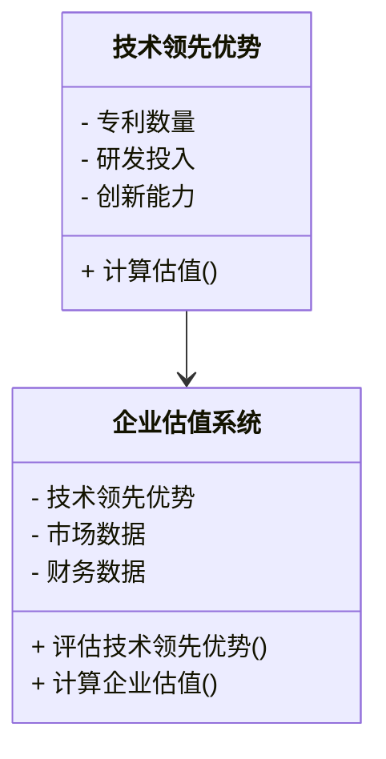
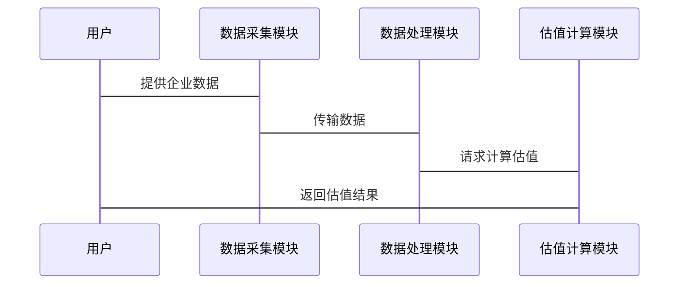

                 

<think>
好的，我需要帮助用户撰写一篇关于《企业估值中的技术领先优势分析》的详细技术博客文章。用户已经提供了一个大纲，我需要按照这个大纲逐步完成每个部分的内容。首先，我需要理解每个章节的要求，确保每个部分都包含足够的细节，比如背景介绍、核心概念、算法原理、系统架构和项目实战。

首先，我会从引言开始，介绍技术领先优势的重要性及其在企业估值中的作用。接着，在第二章，我需要详细分析技术领先优势的构成和特征，可能还需要绘制一些ER实体关系图。第三章将深入探讨估值算法的原理，包括DCF模型和回归分析模型，并用数学公式和图表来辅助说明。

第四章需要介绍系统分析与架构设计，这部分可能需要绘制领域模型类图和系统架构图。第五章则是项目实战，我需要选择一个具体案例，进行环境安装、数据收集和代码实现，并详细解读代码和分析结果。最后，第六章进行总结，给出最佳实践的建议。

在撰写过程中，我需要确保每个部分都符合用户的要求，包括使用markdown格式、嵌入数学公式和图表，以及详细的小结和注意事项。同时，我需要保持逻辑清晰，结构紧凑，语言专业但易懂。完成所有章节后，我会检查整个文章，确保每个部分都完整且相互衔接，最终为用户提供一篇高质量的技术博客文章。
</think>

# 企业估值中的技术领先优势分析

## 关键词：企业估值，技术领先优势，技术创新，DCF模型，回归分析，技术评估

## 摘要：  
技术领先优势是企业在市场中保持竞争优势的核心要素之一，也是影响企业估值的关键因素。本文从技术领先优势的定义、特征、评估方法、算法原理、系统架构到项目实战，全面分析技术领先优势在企业估值中的应用。通过DCF模型、回归分析等方法，结合实际案例，详细阐述如何将技术领先优势转化为企业价值，并通过系统设计和架构优化进一步提升企业估值。

---

# 第1章: 技术领先优势与企业估值概述

## 1.1 技术领先优势的定义与背景

### 1.1.1 技术领先优势的定义  
技术领先优势是指企业在技术创新、研发能力、技术储备等方面相较于竞争对手的显著优势。这种优势通常体现在技术的前瞻性、产品的差异化以及对行业趋势的引领能力。

### 1.1.2 技术领先优势的背景与重要性  
随着科技的快速发展，技术领先优势已成为企业核心竞争力的重要组成部分。在数字化转型的背景下，技术领先优势能够为企业带来更高的市场占有率、更强的成本优势以及更大的品牌溢价能力。

### 1.1.3 技术领先优势与企业估值的关系  
技术领先优势直接影响企业的盈利能力、成长潜力和市场地位，进而影响企业的估值。技术领先优势越显著，企业的估值往往越高。

---

## 1.2 企业估值的核心概念

### 1.2.1 企业估值的定义与方法  
企业估值是通过对企业未来现金流的折现、资产重估或市场对标等方法，评估企业价值的过程。常见的估值方法包括DCF模型、市盈率法、市净率法等。

### 1.2.2 技术领先优势在估值中的地位  
技术领先优势是影响企业未来现金流和成长潜力的关键因素。在估值过程中，技术领先优势可以通过调整折现率或未来现金流预测来体现其对估值的影响。

### 1.2.3 技术领先优势的边界与外延  
技术领先优势不仅包括技术本身的价值，还包括其对市场、客户和竞争格局的影响。其外延包括技术的商业化能力、技术的可持续创新能力等。

---

## 1.3 技术领先优势的分析框架

### 1.3.1 技术领先优势的分类  
技术领先优势可以分为技术储备优势、研发能力优势、产品差异化优势等。

### 1.3.2 技术领先优势的评估维度  
技术领先优势的评估维度包括技术的创新性、技术的商业化能力、技术的可持续性等。

### 1.3.3 技术领先优势的量化方法  
技术领先优势的量化方法包括通过专利数量、研发投入占比、技术壁垒强度等指标进行评估。

---

## 1.4 本章小结  
本章介绍了技术领先优势的定义、背景及其在企业估值中的重要性，并提出了技术领先优势的分析框架。技术领先优势不仅是企业的核心竞争力，也是影响企业估值的关键因素。

---

# 第2章: 技术领先优势的构成与特征

## 2.1 技术领先优势的构成

### 2.1.1 技术创新的核心要素  
技术创新的核心要素包括研发团队、研发投入、技术储备、技术商业化能力等。

### 2.1.2 技术领先优势的驱动因素  
技术领先优势的驱动因素包括市场需求、技术发展趋势、竞争对手的技术水平等。

### 2.1.3 技术领先优势的动态变化  
技术领先优势是一个动态变化的过程，需要企业不断投入研发和创新，以保持技术领先。

---

## 2.2 技术领先优势的特征对比

### 2.2.1 技术领先优势的属性特征  
技术领先优势的属性特征包括创新性、差异化、可持续性等。

### 2.2.2 技术领先优势与竞争优势的关系  
技术领先优势是竞争优势的重要组成部分，但竞争优势还包括成本优势、品牌优势等。

### 2.2.3 技术领先优势与企业生命周期的关联  
技术领先优势在企业生命周期的不同阶段有不同的表现形式和重要性。

---

## 2.3 技术领先优势的ER实体关系图

```mermaid
erd
  title 技术领先优势的ER实体关系图
  Tech_Lead Advantage
  competitor
  market_position
  tech创新能力
  product_differentiation
  tech_reserve
  专利
  研发投入
  技术壁垒
  创新团队
  竞争优势
```

---

## 2.4 本章小结  
本章详细分析了技术领先优势的构成及其特征，并通过ER实体关系图展示了技术领先优势与其他相关要素之间的关系。技术领先优势的构成和特征是理解其在企业估值中作用的基础。

---

# 第3章: 技术领先优势的估值模型与算法

## 3.1 技术领先优势的估值模型

### 3.1.1 基于技术领先优势的DCF模型  
DCF模型是一种常用的估值方法，其核心是通过预测企业未来现金流并将其折现为现值。技术领先优势可以通过调整未来现金流预测或折现率来体现。

### 3.1.2 技术领先优势的回归分析模型  
回归分析模型可以用于评估技术领先优势对估值的影响。通过收集行业数据，可以建立技术领先优势与企业估值之间的回归模型。

### 3.1.3 技术领先优势的多因素评估模型  
多因素评估模型将技术领先优势与其他因素（如市场地位、财务状况）结合，综合评估企业估值。

---

## 3.2 技术领先优势的估值算法流程

### 3.2.1 数据收集与清洗  
数据收集包括行业数据、企业财务数据、技术相关数据等。数据清洗包括去除异常值、填补缺失值等。

### 3.2.2 模型训练与优化  
通过机器学习算法对数据进行训练，优化模型参数，提高估值的准确性。

### 3.2.3 结果验证与调整  
通过历史数据验证模型的准确性，并根据实际情况进行调整。

---

## 3.3 技术领先优势的数学模型与公式

### 3.3.1 DCF模型公式  
DCF模型的基本公式为：  
$$ V = \sum_{t=1}^{n} \frac{CF_t}{(1+r)^t} $$  
其中，$CF_t$ 是第$t$年的现金流，$r$ 是折现率，$n$ 是预测期。

### 3.3.2 回归分析模型公式  
线性回归模型为：  
$$ y = \beta_0 + \beta_1 x + \epsilon $$  
其中，$y$ 是企业估值，$x$ 是技术领先优势指标，$\beta_0$ 和 $\beta_1$ 是回归系数，$\epsilon$ 是误差项。

---

## 3.4 本章小结  
本章介绍了技术领先优势的估值模型与算法，包括DCF模型、回归分析模型等，并通过数学公式详细阐述了模型的实现过程。

---

# 第4章: 技术领先优势的系统分析与架构设计

## 4.1 系统分析

### 4.1.1 问题场景介绍  
假设我们是一家科技公司，希望通过技术领先优势提升企业估值。我们需要设计一个系统来评估技术领先优势对估值的影响。

### 4.1.2 项目介绍  
本项目的目标是开发一个基于技术领先优势的企业估值系统，利用机器学习算法和大数据分析技术，实现对企业估值的精准预测。

---

## 4.2 系统功能设计

### 4.2.1 领域模型类图  


### 4.2.2 系统架构设计  


---

## 4.3 系统接口设计

### 4.3.1 系统接口设计  
系统接口包括数据输入接口、模型训练接口、估值结果输出接口等。

---

## 4.4 系统交互设计

### 4.4.1 系统交互序列图  


---

## 4.5 本章小结  
本章通过系统分析与架构设计，展示了如何将技术领先优势应用于企业估值系统中，为后续的项目实现奠定了基础。

---

# 第5章: 技术领先优势的项目实战

## 5.1 环境安装与数据收集

### 5.1.1 环境安装  
安装Python、Jupyter Notebook、Pandas、Scikit-learn等工具。

### 5.1.2 数据收集  
收集企业的财务数据、技术数据、市场数据等。

---

## 5.2 核心实现

### 5.2.1 数据处理  
使用Pandas进行数据清洗和预处理。

### 5.2.2 模型实现  
使用Scikit-learn实现回归分析模型。

### 5.2.3 结果分析  
通过可视化工具分析模型结果。

---

## 5.3 实际案例分析

### 5.3.1 案例介绍  
假设我们分析一家科技公司的技术领先优势对估值的影响。

### 5.3.2 数据分析  
通过数据分析得出技术领先优势对估值的具体影响。

---

## 5.4 本章小结  
本章通过项目实战展示了技术领先优势在企业估值中的具体应用，为读者提供了可操作的实践指导。

---

# 第6章: 总结与展望

## 6.1 本章总结  
技术领先优势是企业估值的重要影响因素，本文通过理论分析、算法实现和项目实战，全面探讨了技术领先优势在企业估值中的应用。

## 6.2 最佳实践 tips  
- 定期评估技术领先优势
- 持续投入研发创新
- 结合多种估值方法进行综合评估

## 6.3 展望  
未来，随着技术的不断发展，技术领先优势在企业估值中的作用将更加重要。建议企业加强技术研发和创新，以保持技术领先优势。

---

# 作者：AI天才研究院/AI Genius Institute & 禅与计算机程序设计艺术 /Zen And The Art of Computer Programming

