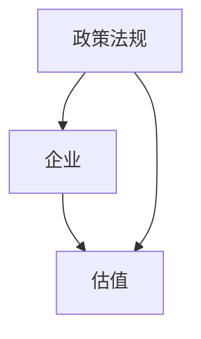
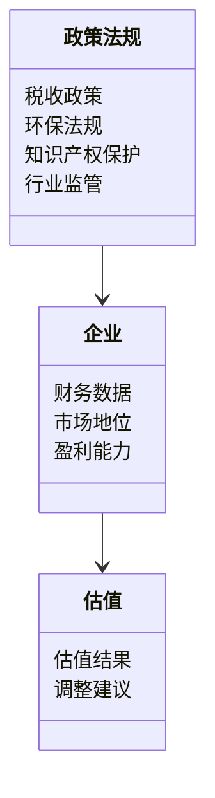
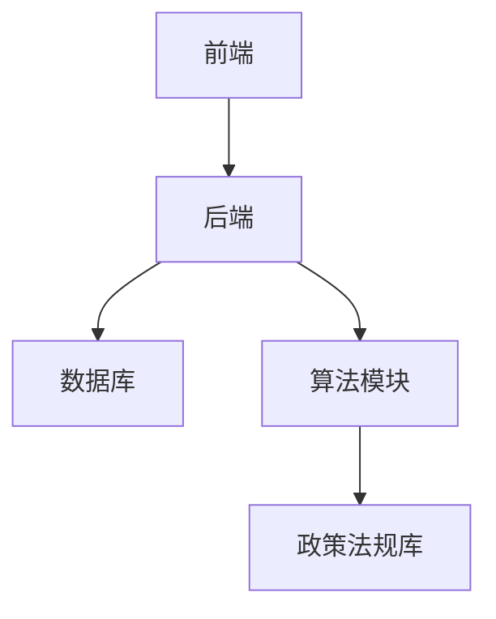
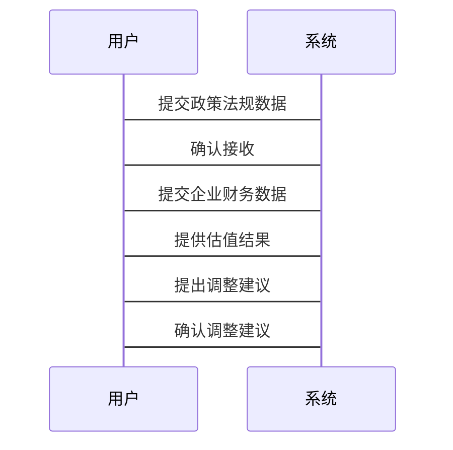

                 


# 企业估值中的政策法规影响分析

> 关键词：企业估值，政策法规，财税政策，知识产权保护，环保法规，回归分析

> 摘要：企业估值是一个复杂的过程，受到多种因素的影响，其中政策法规是不可忽视的重要因素。本文从政策法规的分类、影响机制、算法原理、系统设计、项目实战等多个方面，深入分析政策法规如何影响企业估值，为企业估值提供新的视角和方法。

---

## 第一部分: 企业估值中的政策法规影响概述

## 第1章: 政策法规对企业估值的影响

### 1.1 政策法规对企业估值的背景介绍

#### 1.1.1 企业估值的基本概念
企业估值是通过对企业的财务状况、市场地位、盈利能力等多方面因素进行分析，确定其市场价值的过程。常见的估值方法包括DCF模型、市盈率法、市净率法等。这些方法通常基于企业的财务数据和市场环境进行分析。

#### 1.1.2 政策法规对企业估值的影响
政策法规是影响企业经营和发展的外部重要因素。例如，税收政策的变化会影响企业的净利润，环保法规的加强会影响企业的生产成本，行业监管政策的收紧会影响企业的市场准入。这些因素都会直接影响企业的估值结果。

#### 1.1.3 政策法规与企业价值的关系
政策法规通过影响企业的盈利能力和风险水平，进而影响其估值。例如，税收优惠政策可以增加企业的净利润，从而提高其估值；而严格的环保法规可能会增加企业的运营成本，降低其盈利水平，从而影响估值。

### 1.2 政策法规的分类与特点

#### 1.2.1 财税政策
财税政策是影响企业估值的重要因素之一。主要包括企业所得税、增值税、关税等。税收优惠政策可以降低企业的税负，增加净利润，从而提高估值。例如，高新技术企业可以享受税收减免政策，这会直接影响其估值。

#### 1.2.2 知识产权保护
知识产权保护政策直接影响企业的创新能力。加强的知识产权保护可以激励企业加大研发投入，提高核心竞争力，从而提升企业的估值。例如，专利的数量和质量可以直接影响企业的市场地位和盈利能力。

#### 1.2.3 环保法规
环保法规对企业的影响主要体现在生产成本和合规风险上。严格的环保法规会增加企业的环保投入，可能导致生产成本上升，从而影响企业的利润水平。此外，环保违规可能带来罚款和声誉损失，进一步影响估值。

#### 1.2.4 行业监管政策
行业监管政策直接影响企业的市场准入和竞争环境。例如，金融行业的监管政策变化会影响金融机构的业务模式和盈利能力，进而影响其估值。严格的监管可能限制企业的扩张，而宽松的监管政策则可能促进企业的增长。

### 1.3 政策法规对企业估值的影响机制

#### 1.3.1 政策法规的直接影响
直接影响主要体现在对企业财务数据的直接影响上。例如，税收政策的变化直接影响企业的净利润，进而影响估值。

#### 1.3.2 政策法规的间接影响
间接影响主要体现在对企业经营环境和市场地位的影响上。例如，知识产权保护政策的加强会提高企业的创新能力，从而增强其市场竞争力，间接影响估值。

#### 1.3.3 政策法规的综合影响
综合影响是指政策法规的多种因素共同作用，对企业估值产生复杂的影响。例如，税收政策和环保法规的共同作用，可能既增加企业的净利润，又增加其环保投入，从而综合影响其估值。

---

## 第2章: 政策法规与企业估值的核心概念

### 2.1 政策法规与企业估值的核心概念对比

| **核心概念** | **政策法规** | **企业估值** |
|--------------|--------------|--------------|
| **定义**     | 国家或政府制定的规则和规定，用于规范企业和市场的行为。 | 对企业未来现金流的现值进行评估，确定其市场价值。 |
| **影响因素** | 税收、环保、知识产权等。 | 财务数据、市场环境、行业竞争等。 |
| **作用机制** | 通过影响企业的经营环境和成本结构，间接影响估值。 | 通过分析企业的财务数据和市场环境，直接计算估值。 |

### 2.2 政策法规与企业估值的ER实体关系图



---

## 第3章: 政策法规影响企业估值的算法原理

### 3.1 政策法规影响的加权评分法

#### 3.1.1 加权评分法的原理
加权评分法是一种通过给不同的政策法规因素赋予不同的权重，计算其对企业估值影响的方法。权重通常基于政策法规的重要性和影响程度确定。

#### 3.1.2 加权评分法的步骤

1. **确定政策法规因素**：根据企业的行业特点，确定影响企业估值的主要政策法规因素。
2. **赋予权重**：根据每个因素的重要性和影响程度，赋予相应的权重。
3. **计算影响值**：根据政策法规的变化对企业财务数据的影响，计算其对估值的影响值。
4. **综合评估**：将各个因素的影响值加权求和，得到最终的估值调整值。

#### 3.1.3 加权评分法的优缺点

- **优点**：简单易懂，计算方便。
- **缺点**：需要主观确定权重，可能存在主观性较强的缺点。

### 3.2 政策法规影响的回归分析

#### 3.2.1 回归分析的原理
回归分析是一种统计学方法，通过建立变量之间的关系模型，预测一个变量（因变量）受其他变量（自变量）影响的程度。在企业估值中，可以将政策法规作为自变量，企业估值作为因变量，建立回归模型，预测政策法规对企业估值的影响。

#### 3.2.2 回归分析的步骤

1. **数据收集**：收集政策法规和企业估值的相关数据。
2. **建立模型**：选择合适的回归模型，例如线性回归。
3. **参数估计**：通过数据拟合，估计回归模型的参数。
4. **模型验证**：验证模型的显著性和准确性。
5. **预测估值**：利用模型预测政策法规变化对企业估值的影响。

#### 3.2.3 回归分析的数学模型

$$ 估值 = \beta_0 + \beta_1 \times 政策法规影响 + \epsilon $$

其中：
- $\beta_0$ 是回归模型的截距。
- $\beta_1$ 是政策法规影响的回归系数。
- $\epsilon$ 是误差项。

---

## 第4章: 政策法规影响企业估值的系统分析与架构设计

### 4.1 系统功能设计

#### 4.1.1 领域模型


#### 4.1.2 系统架构设计



### 4.2 系统接口设计

#### 4.2.1 接口描述
- **输入接口**：政策法规数据、企业财务数据。
- **输出接口**：估值结果、调整建议。

#### 4.2.2 接口交互流程



---

## 第5章: 政策法规影响企业估值的项目实战

### 5.1 环境配置

```bash
pip install numpy pandas scikit-learn matplotlib
```

### 5.2 核心代码实现

```python
import pandas as pd
import numpy as np
from sklearn.linear_model import LinearRegression
from sklearn.metrics import mean_squared_error

# 数据加载
data = pd.read_csv('enterprise_valuation.csv')

# 数据预处理
X = data[['税收政策', '环保法规', '知识产权保护', '行业监管']]
y = data['估值']

# 模型训练
model = LinearRegression()
model.fit(X, y)

# 模型预测
y_pred = model.predict(X)

# 模型评估
mse = mean_squared_error(y, y_pred)
print(f'Mean Squared Error: {mse}')
```

### 5.3 案例分析

#### 5.3.1 案例背景
某制造企业受到税收优惠政策的影响，净利润增加，从而估值上升。

#### 5.3.2 数据分析
通过回归分析，税收优惠政策对估值的影响系数为0.8，说明税收政策对企业估值有显著的正向影响。

#### 5.3.3 结果解读
政策法规的变化直接影响企业的财务数据，进而影响其估值。因此，在企业估值中，必须充分考虑政策法规的影响。

---

## 第6章: 总结与展望

### 6.1 总结
政策法规是影响企业估值的重要因素。通过加权评分法和回归分析等方法，可以量化政策法规对企业估值的影响。同时，构建企业估值系统，可以更系统地分析和预测政策法规对企业估值的影响。

### 6.2 展望
未来，随着人工智能和大数据技术的发展，可以进一步完善企业估值模型，更精准地预测政策法规对企业估值的影响。同时，可以研究更多政策法规的交互作用，为企业估值提供更全面的分析。

---

## 作者：AI天才研究院/AI Genius Institute & 禅与计算机程序设计艺术 /Zen And The Art of Computer Programming

---

以上是《企业估值中的政策法规影响分析》的技术博客文章的完整内容。文章从背景介绍、核心概念、算法原理、系统设计、项目实战等多方面，详细分析了政策法规对企业估值的影响，为企业估值提供了新的视角和方法。

