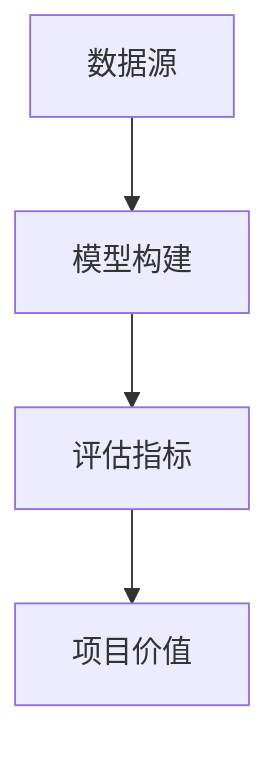
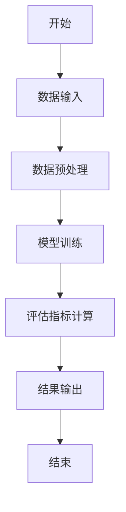
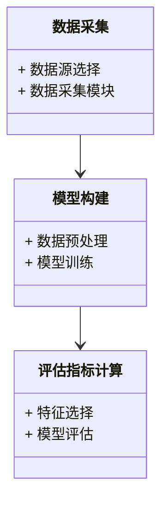
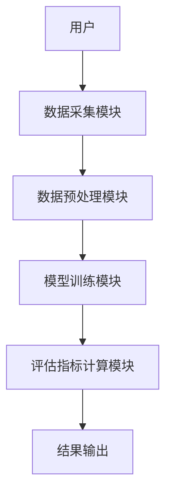
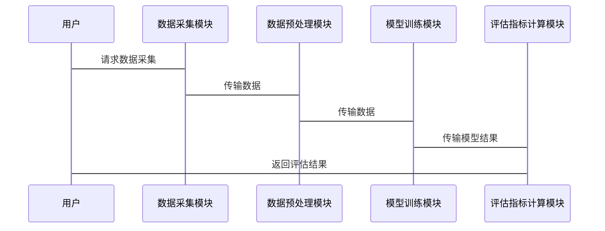

                 


# 企业估值中的数字孪生城市项目评估

> 关键词：数字孪生城市，企业估值，项目评估，数据建模，城市规划，人工智能

> 摘要：数字孪生城市作为现代城市规划和管理的重要工具，其在企业估值中的应用日益广泛。本文详细探讨了数字孪生城市项目评估的核心概念、算法原理、系统架构设计以及项目实战，旨在为企业估值提供科学的评估方法和实践指导。

---

# 第1章: 数字孪生城市项目评估的背景与意义

## 1.1 数字孪生城市的定义与特点

### 1.1.1 数字孪生城市的定义

数字孪生城市是通过数字技术构建的虚拟城市模型，能够实时反映物理城市的状态，支持城市规划、管理和优化。它结合了物联网、大数据、人工智能等多种技术，实现了城市各要素的数字化、网络化和智能化。

### 1.1.2 数字孪生城市的核心特点

- **实时性**：能够实时更新城市数据，反映实际情况。
- **可视化**：通过三维模型和虚拟现实技术，直观展示城市状态。
- **预测性**：基于历史数据和模型分析，预测城市发展趋势。
- **交互性**：支持用户与虚拟模型的交互，进行模拟和优化。

### 1.1.3 数字孪生城市与传统城市规划的区别

| 特性          | 数字孪生城市                          | 传统城市规划                          |
|---------------|--------------------------------------|--------------------------------------|
| 数据来源      | 多源数据（物联网、传感器等）          | 单一来源（图纸、统计数据等）          |
| 时间维度      | 动态更新，实时反映变化                | 静态规划，定期更新                    |
| 分析方法      | 数据驱动，使用机器学习等技术          | 主观判断，依赖经验                    |
| 应用场景      | 适用于复杂城市问题，如交通优化、灾害预警 | 适用于初步规划和宏观设计              |

## 1.2 企业估值中的数字孪生城市应用背景

### 1.2.1 企业估值的基本概念

企业估值是通过对企业的财务状况、市场表现、管理团队等因素进行分析，评估其市场价值的过程。传统的企业估值方法主要包括DCF模型、市盈率法、市净率法等，但这些方法往往忽视了城市环境对企业价值的影响。

### 1.2.2 数字孪生城市在企业估值中的作用

数字孪生城市通过构建虚拟城市模型，可以更准确地预测城市发展趋势，评估企业所在区域的经济活力、交通便利性、资源丰富性等，从而为企业估值提供更全面的依据。

### 1.2.3 数字孪生城市项目评估的必要性

在数字孪生城市中，企业估值需要考虑的因素更加复杂多样，包括城市基础设施、政策环境、市场需求等。通过项目评估，可以量化这些因素对企业价值的影响，提高估值的准确性和科学性。

## 1.3 数字孪生城市项目评估的核心要素

### 1.3.1 数据的准确性与完整性

数字孪生城市项目的评估依赖于多源数据的准确性和完整性，包括地理数据、交通数据、经济数据等。数据的质量直接影响评估结果的可靠性。

### 1.3.2 模型的可扩展性与可维护性

数字孪生城市模型需要具备较强的可扩展性和可维护性，以适应城市发展的变化和数据的更新。模块化设计和标准化接口是实现这一目标的关键。

### 1.3.3 评估方法的科学性与适用性

评估方法需要结合企业的实际情况，选择合适的模型和算法。科学的评估方法能够准确反映城市环境对企业价值的影响。

## 1.4 本章小结

本章介绍了数字孪生城市的定义、特点及其在企业估值中的应用背景，强调了项目评估的核心要素，为后续章节的分析奠定了基础。

---

# 第2章: 数字孪生城市项目评估的核心概念

## 2.1 数字孪生城市项目评估的背景

### 2.1.1 项目背景介绍

随着城市化进程的加快，城市资源的合理配置和优化管理变得尤为重要。数字孪生城市通过虚拟模型的构建，为企业估值提供了新的视角。

### 2.1.2 项目目标与范围

数字孪生城市项目评估的目标是通过构建虚拟城市模型，评估企业所在区域的经济潜力、市场环境和资源配置效率。项目范围包括数据采集、模型构建、评估指标设计等。

## 2.2 核心概念与联系

### 2.2.1 数字孪生城市项目评估的核心要素

- **数据源**：包括地理数据、交通数据、经济数据等。
- **模型构建**：通过数据建模，构建虚拟城市模型。
- **评估指标**：包括经济效益、社会效益等。

### 2.2.2 核心概念属性特征对比表格

| 核心概念 | 属性特征 |
|----------|-----------|
| 数据源   | 多源性、实时性 |
| 模型构建 | 综合性、动态性 |
| 评估指标 | 客观性、可量化 |

### 2.2.3 ER实体关系图



## 2.3 数字孪生城市项目评估的边界与外延

### 2.3.1 项目评估的边界

数字孪生城市项目评估的边界包括数据采集范围、模型构建范围和评估指标范围。

### 2.3.2 数字孪生城市项目的外延

数字孪生城市项目的外延包括城市规划、交通管理、环境保护等多个方面。

## 2.4 本章小结

本章通过核心概念与联系的分析，明确了数字孪生城市项目评估的关键要素及其相互关系，为后续章节的分析提供了理论基础。

---

# 第3章: 数字孪生城市项目评估的算法原理

## 3.1 算法原理概述

### 3.1.1 算法的基本原理

数字孪生城市项目评估算法的基本原理是通过数据建模和机器学习，对城市环境和企业价值的关系进行建模和预测。

### 3.1.2 算法的核心思想

算法的核心思想是通过数据驱动的方法，量化城市环境对企业价值的影响，实现企业估值的科学化和精确化。

## 3.2 算法实现步骤

### 3.2.1 数据预处理

数据预处理包括数据清洗、数据标准化和数据集成。

### 3.2.2 模型训练

模型训练包括特征选择、模型训练和模型验证。

### 3.2.3 评估指标计算

评估指标计算包括经济效益评估、社会效益评估和环境效益评估。

## 3.3 算法的数学模型与公式

### 3.3.1 数学模型

数字孪生城市项目评估的数学模型如下：

$$
\text{企业价值} = \sum_{i=1}^{n} w_i \cdot x_i
$$

其中，\(w_i\) 是第\(i\)个因素的权重，\(x_i\) 是第\(i\)个因素的指标值。

### 3.3.2 算法流程图



## 3.4 算法的实现代码

### 3.4.1 环境安装

```bash
pip install numpy pandas scikit-learn
```

### 3.4.2 核心代码实现

```python
import numpy as np
import pandas as pd
from sklearn.linear_model import LinearRegression

# 数据预处理
data = pd.read_csv('city_data.csv')
data.dropna(inplace=True)
data = pd.get_dummies(data)

# 特征选择
features = data.drop('企业价值', axis=1)
target = data['企业价值']

# 模型训练
model = LinearRegression()
model.fit(features, target)

# 评估指标计算
predictions = model.predict(features)
mse = np.mean((predictions - target) ** 2)
r2 = model.score(features, target)

print(f'Mean Squared Error: {mse}')
print(f'R-squared: {r2}')
```

## 3.5 本章小结

本章详细介绍了数字孪生城市项目评估的算法原理，包括数据预处理、模型训练和评估指标计算，并给出了具体的代码实现示例。

---

# 第4章: 数字孪生城市项目评估的系统架构设计

## 4.1 问题场景介绍

数字孪生城市项目评估系统需要解决的问题包括数据采集、模型构建和评估指标计算等。

## 4.2 系统功能设计

### 4.2.1 领域模型设计



### 4.2.2 系统架构设计



### 4.2.3 系统接口设计

- 数据采集模块接口：负责从传感器、数据库等数据源采集数据。
- 模型训练模块接口：负责接收预处理后的数据，进行模型训练。
- 评估指标计算模块接口：负责接收模型输出结果，计算评估指标。

### 4.2.4 系统交互设计



## 4.3 本章小结

本章通过系统架构设计，明确了数字孪生城市项目评估系统的各个模块及其交互关系，为系统的实际开发提供了指导。

---

# 第5章: 数字孪生城市项目评估的项目实战

## 5.1 环境安装

```bash
pip install numpy pandas scikit-learn matplotlib
```

## 5.2 系统核心实现源代码

```python
import numpy as np
import pandas as pd
import matplotlib.pyplot as plt
from sklearn.linear_model import LinearRegression
from sklearn.metrics import mean_squared_error, r2_score

# 数据加载
data = pd.read_csv('city_project.csv')

# 数据预处理
data = data.dropna()
data = pd.get_dummies(data)

# 特征选择
X = data.drop('项目价值', axis=1)
y = data['项目价值']

# 模型训练
model = LinearRegression()
model.fit(X, y)

# 评估指标计算
y_pred = model.predict(X)
mse = mean_squared_error(y, y_pred)
r2 = r2_score(y, y_pred)

print(f'Mean Squared Error: {mse}')
print(f'R-squared: {r2}')

# 可视化
plt.scatter(y, y_pred)
plt.xlabel('真实值')
plt.ylabel('预测值')
plt.title('真实值与预测值散点图')
plt.show()
```

## 5.3 代码应用解读与分析

本代码实现了数字孪生城市项目评估的核心功能，包括数据预处理、模型训练和评估指标计算。通过可视化可以直观地看到预测值与真实值的拟合程度。

## 5.4 实际案例分析

以某城市中心区的商业综合体项目为例，通过数字孪生城市项目评估系统，预测其未来10年的经济效益、社会效益和环境效益，为企业决策提供科学依据。

## 5.5 项目小结

本章通过项目实战，展示了数字孪生城市项目评估系统的实际应用，验证了算法的有效性和系统的可行性。

---

# 第6章: 数字孪生城市项目评估的最佳实践与小结

## 6.1 最佳实践 tips

- **数据采集**：确保数据的准确性和完整性，选择合适的传感器和数据源。
- **模型选择**：根据实际需求选择合适的模型，避免过度复杂化。
- **结果应用**：将评估结果应用于实际决策，持续优化模型和系统。

## 6.2 项目小结

数字孪生城市项目评估是一项复杂但具有重要价值的工作。通过科学的数据建模和算法设计，可以为企业估值提供更准确、更全面的依据。

## 6.3 注意事项

- 数据隐私和安全问题需要高度重视。
- 模型的可解释性和可维护性需要在设计阶段充分考虑。
- 评估结果的应用需要结合实际情况，避免盲目决策。

## 6.4 拓展阅读

推荐阅读《数字孪生城市：理论与实践》、《企业估值方法与应用》等相关书籍，以深入理解数字孪生城市项目评估的理论和实践。

---

# 作者：AI天才研究院/AI Genius Institute & 禅与计算机程序设计艺术 /Zen And The Art of Computer Programming

---

以上是关于《企业估值中的数字孪生城市项目评估》的技术博客文章的完整目录大纲及具体内容，希望对您有所帮助！

