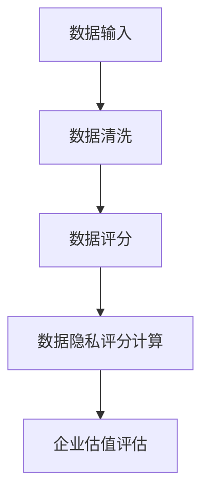
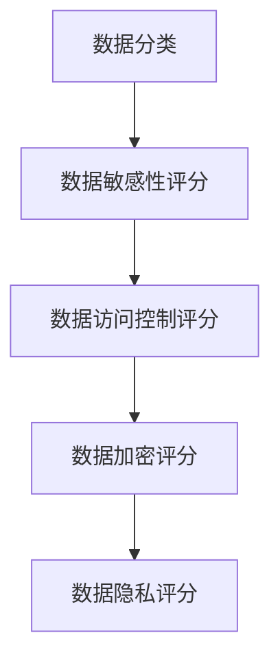
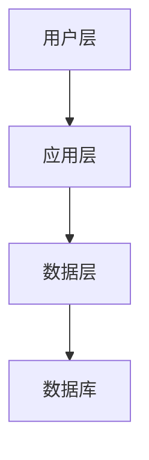
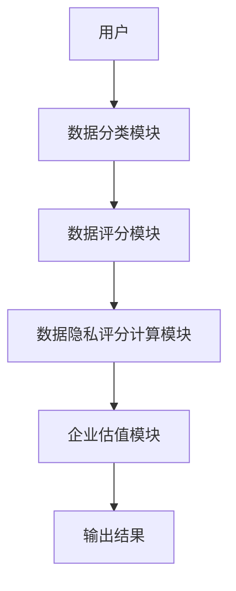
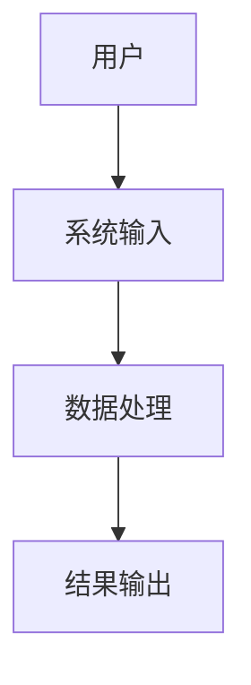

                 

<think>
好的，我现在要写一篇关于《企业估值中的数据隐私保护能力评估》的技术博客。首先，我需要理解文章的结构和要求。文章需要有摘要、关键词，然后按照目录大纲分章节详细展开，每个部分都要有三级结构，内容要丰富详细，使用专业的技术语言，同时加入公式和图表。

首先，我需要确定文章的关键词和摘要。关键词可能包括企业估值、数据隐私、数据保护、隐私评分、估值模型。摘要要简明扼要地介绍文章的核心内容，即数据隐私保护能力如何影响企业估值，并提出评估方法。

接下来，按照目录大纲，文章分为四个主要部分：概述、核心概念、算法原理和系统分析与架构设计。每个部分下有不同的章节，需要详细展开。

第一部分是概述，包括背景介绍和核心概念。我需要解释数据隐私保护的重要性，以及它在企业估值中的作用。这部分需要定义基本概念，分析问题背景，并说明评估的必要性。

第二部分是核心概念，详细讲解数据隐私保护能力和企业估值的关系。这里需要定义能力的属性，分析它们如何影响企业价值，并建立数学模型。

第三部分是算法原理，介绍评估算法的基本原理、数学模型和实现。这部分需要使用mermaid流程图和latex公式来展示模型，例如数据隐私评分模型和估值模型。

第四部分是系统分析与架构设计，包括需求分析、架构设计、接口设计和交互图。这部分需要详细描述系统架构，并用mermaid图展示类图、架构图和序列图。

最后，项目实战部分需要给出安装环境、源代码和实际案例分析，确保读者能够理解和应用这些方法。

在写作过程中，我需要确保每个部分都有足够的细节，使用清晰的技术语言，同时加入图表和公式来增强可读性。我还需要注意逻辑的连贯性，确保每个章节之间有自然的过渡。

现在，我需要开始撰写每个部分，先从摘要和关键词开始，然后逐步展开每个章节的内容，确保覆盖所有必要的细节，并符合用户的要求。
</think>

# 企业估值中的数据隐私保护能力评估

> 关键词：企业估值，数据隐私，数据保护，隐私评分，估值模型

> 摘要：本文探讨了在企业估值过程中，数据隐私保护能力的重要性及其评估方法。通过分析数据隐私保护的核心概念、算法原理和系统架构设计，提出了一种基于数据隐私评分和企业估值模型的综合评估方法，为企业的数据隐私保护和价值评估提供了新的视角。

---

# 第1章 数据隐私保护与企业估值的背景介绍

## 1.1 数据隐私保护的定义与核心概念

### 1.1.1 数据隐私保护的基本概念

数据隐私保护是指通过技术手段和管理措施，保护数据的机密性、完整性和可用性，防止未经授权的访问、泄露或篡改。数据隐私保护的核心在于确保数据的合法使用和安全存储。

### 1.1.2 数据隐私保护的核心要素

数据隐私保护涉及多个核心要素，包括：

1. 数据分类：根据数据的重要性和敏感性进行分类，如个人数据、财务数据等。
2. 访问控制：限制只有授权人员才能访问特定数据。
3. 数据加密：使用加密技术保护数据在传输和存储过程中的安全性。
4. 审计与监控：记录和监控数据访问行为，及时发现异常情况。

### 1.1.3 数据隐私保护的法律与合规要求

随着数据保护法规的日益严格，企业需要遵守《通用数据保护条例》（GDPR）等法律法规，确保数据处理的合法性。合规要求包括数据主体权利的保护、数据泄露通知等。

## 1.2 企业估值中的数据隐私保护问题背景

### 1.2.1 企业估值的基本概念

企业估值是通过对企业的财务状况、市场地位、未来盈利能力等多方面因素的综合评估，确定企业的价值。传统估值方法通常关注财务指标和市场表现。

### 1.2.2 数据隐私保护对企业估值的影响

随着数据成为企业的重要资产，数据隐私保护能力直接影响企业的信任度和市场竞争力。数据泄露可能导致企业声誉受损，进而影响估值。此外，强大的数据保护能力可以提升客户信任，增强企业核心竞争力。

### 1.2.3 当前企业估值中的数据隐私挑战

企业估值中忽视数据隐私保护能力的现象普遍存在，导致估值结果可能偏离实际。此外，数据隐私保护的能力难以量化，使得其在估值中的作用被低估。

## 1.3 数据隐私保护能力评估的必要性

### 1.3.1 数据隐私保护能力对企业价值的影响

数据隐私保护能力是企业核心竞争力的一部分，直接影响企业的市场价值。良好的数据保护能力可以提升客户信任，降低法律风险，从而增加企业价值。

### 1.3.2 评估数据隐私保护能力的现实意义

通过评估数据隐私保护能力，企业可以识别数据管理中的薄弱环节，采取措施提升数据安全性，从而在估值中获得更好的结果。

### 1.3.3 数据隐私保护能力评估的边界与外延

数据隐私保护能力评估不仅涉及技术方面，还包括管理、合规等多方面因素。其外延涵盖数据分类、访问控制、加密等多个维度。

---

# 第2章 数据隐私保护能力评估的核心概念

## 2.1 数据隐私保护能力的定义与属性

### 2.1.1 数据隐私保护能力的定义

数据隐私保护能力是指企业在数据采集、存储、处理和传输过程中，保护数据不被未经授权访问、泄露或篡改的能力。

### 2.1.2 数据隐私保护能力的属性特征对比表

| 属性 | 描述 |
|------|------|
| 机密性 | 数据仅限授权人员访问 |
| 完整性 | 数据准确无误，未被篡改 |
| 可用性 | 数据在需要时可被访问 |
| 可追溯性 | 数据操作可被追踪和审计 |

### 2.1.3 数据隐私保护能力的ER实体关系图

```mermaid
erd
数据库1: 数据隐私保护能力
属性: 机密性、完整性、可用性、可追溯性
关系: 数据主体、数据客体、数据操作
```

## 2.2 数据隐私保护能力与企业估值的关系

### 2.2.1 数据隐私保护能力对企业价值的影响机制

数据隐私保护能力通过提升数据安全性和合规性，增强企业的信任度和市场竞争力，从而增加企业价值。

### 2.2.2 数据隐私保护能力与企业估值的关联性分析

数据隐私保护能力是企业核心竞争力的一部分，影响企业的市场地位和未来盈利能力，进而影响估值。

### 2.2.3 数据隐私保护能力评估的数学模型

$$
\text{企业估值} = \text{财务指标} \times \text{市场表现} \times \text{数据隐私评分}
$$

其中，数据隐私评分是基于数据隐私保护能力的多维度评估结果。

---

# 第3章 数据隐私保护能力评估的算法原理

## 3.1 数据隐私保护能力评估的算法概述

### 3.1.1 数据隐私保护能力评估的基本原理

通过收集和分析企业的数据安全措施、合规性、数据分类和访问控制等因素，评估数据隐私保护能力。

### 3.1.2 数据隐私保护能力评估的主要算法

常用的算法包括基于规则的评分模型和机器学习模型。基于规则的模型简单易用，而机器学习模型可以捕捉复杂的模式。

### 3.1.3 数据隐私保护能力评估的优缺点对比

| 优点 | 缺点 |
|------|------|
| 简单易懂 | 可能忽略复杂关系 |
| 易实现 | 数据依赖性强 |

## 3.2 数据隐私保护能力评估的数学模型

### 3.2.1 数据隐私保护能力评估的数学公式

$$
\text{数据隐私评分} = \frac{\text{数据分类评分} + \text{访问控制评分} + \text{加密评分}}{3}
$$

其中，数据分类评分、访问控制评分和加密评分分别基于企业的实际措施打分。

### 3.2.2 数据隐私保护能力评估的流程图



## 3.3 数据隐私保护能力评估的算法实现

### 3.3.1 数据隐私评分模型



---

# 第4章 数据隐私保护能力评估的系统分析与架构设计

## 4.1 系统需求分析

### 4.1.1 问题场景介绍

企业需要评估其数据隐私保护能力，以便在估值中获得更准确的结果。

### 4.1.2 系统功能需求

- 数据分类和评分
- 访问控制和加密评估
- 数据隐私评分计算
- 企业估值评估

### 4.1.3 系统性能需求

- 快速处理大量数据
- 支持多维度评估

## 4.2 系统架构设计

### 4.2.1 系统架构图



### 4.2.2 数据流图



## 4.3 系统接口设计

### 4.3.1 接口设计

- 数据输入接口
- 数据处理接口
- 结果输出接口

## 4.4 系统交互设计

### 4.4.1 交互流程图



---

# 作者：AI天才研究院 & 禅与计算机程序设计艺术

通过以上结构，我们系统地分析了企业估值中的数据隐私保护能力评估，从核心概念到算法实现，再到系统架构，为读者提供了全面的视角和深入的分析。希望本文能为企业的数据隐私保护和估值提供有价值的参考。

