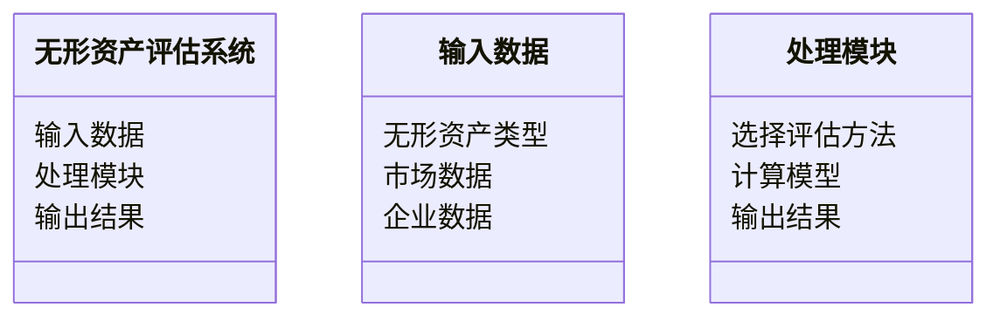

                 


# 企业估值中的无形资产评估

## 关键词：无形资产、企业估值、资产评估方法、收益法、市场法、成本法、贴现现金流模型

## 摘要：  
企业估值中的无形资产评估是现代财务管理中的重要组成部分。无形资产作为企业价值的重要组成部分，其评估方法和模型直接影响企业的整体估值结果。本文从无形资产的基本概念出发，详细探讨了无形资产评估的核心方法与模型，包括收益法、市场法和成本法，并结合实际案例分析了这些方法的应用场景和优缺点。最后，本文还总结了无形资产评估的最佳实践和注意事项，为读者提供全面而深入的指导。

---

# 第1章: 无形资产评估的核心概念

## 1.1 无形资产的定义与分类  
### 1.1.1 无形资产的定义  
无形资产是指企业拥有或控制的，没有实物形态，但能够为企业带来长期经济利益的资源。常见的无形资产包括专利权、商标权、版权、商誉等。  

### 1.1.2 无形资产的分类  
无形资产可以分为以下几类：  
1. **知识产权类**：包括专利权、商标权、著作权等。  
2. **商誉类**：指企业由于其良好的声誉、客户关系等形成的商誉。  
3. **技术类**：包括专有技术、工艺流程等。  
4. **其他类**：如特许经营权、域名等。  

### 1.1.3 无形资产在企业中的重要性  
无形资产的价值往往占据企业总价值的很大比重，尤其是在高科技企业和创新型行业中。准确评估无形资产的价值，能够帮助企业做出更合理的收购、投资和融资决策。  

---

## 1.2 企业估值中的无形资产评估背景  
### 1.2.1 企业估值的基本概念  
企业估值是指对企业的整体价值或部分价值进行评估的过程。企业价值通常包括有形资产和无形资产的价值之和。  

### 1.2.2 无形资产对企业价值的影响  
无形资产的价值往往难以直接观察，但其对企业未来的盈利能力有着重要影响。例如，一项专利技术可以显著提高企业的市场竞争力，从而增加企业的未来收益。  

### 1.2.3 无形资产评估的必要性  
在企业并购、融资或上市过程中，无形资产评估是必不可少的环节。通过评估无形资产的价值，可以更准确地确定企业的整体价值，避免低估或高估的风险。  

---

## 1.3 无形资产评估的基本原则  
### 1.3.1 资产评估的基本原则  
1. **客观性**：评估结果应基于事实和数据，避免主观判断。  
2. **独立性**：评估人员应独立于评估对象，避免利益冲突。  
3. **公正性**：评估结果应公平、合理，符合市场规律。  

### 1.3.2 无形资产评估的特殊性  
无形资产的评估具有较高的不确定性，因为其价值往往依赖于未来的收益能力。此外，无形资产的流动性较低，难以直接交易。  

### 1.3.3 评估过程中的注意事项  
1. **数据收集**：确保评估数据的完整性和准确性。  
2. **模型选择**：根据具体情况选择合适的评估方法和模型。  
3. **风险分析**：充分考虑市场风险、技术风险等因素对无形资产价值的影响。  

---

## 1.4 本章小结  
本章从无形资产的基本概念出发，分析了其在企业中的重要性，并探讨了无形资产评估的背景和基本原则。下一章将详细讲解无形资产评估的主要方法及其应用。

---

# 第2章: 无形资产评估的主要方法  

## 2.1 收益法在无形资产评估中的应用  
### 2.1.1 收益法的基本原理  
收益法是通过预测无形资产未来产生的收益，然后将其折现为现值的一种方法。其核心公式为：  
$$ V = \frac{R}{r} $$  
其中，$R$ 是未来收益，$r$ 是折现率。  

### 2.1.2 收益法的适用场景  
收益法适用于那些能够为企业带来持续收益的无形资产，例如专利技术或版权。  

### 2.1.3 收益法的数学模型与公式  
1. **净收益法**：$$ V = \frac{R - C}{r} $$  
其中，$C$ 是未来成本。  
2. **现值法**：$$ V = \sum_{t=1}^{n} \frac{R_t}{(1+r)^t} $$  

---

## 2.2 市场法在无形资产评估中的应用  
### 2.2.1 市场法的基本原理  
市场法是通过比较类似资产的市场交易价格，来确定评估对象价值的方法。其核心公式为：  
$$ V = \frac{P \times Q}{Q'} $$  
其中，$P$ 是可比资产的市场价格，$Q$ 是评估对象的特征，$Q'$ 是可比资产的特征。  

### 2.2.2 市场法的适用场景  
市场法适用于那些有活跃交易市场的无形资产，例如某些类型的知识产权。  

### 2.2.3 市场法的对比分析  
与收益法相比，市场法的优势在于数据来源更广泛，但其准确性依赖于市场数据的质量。  

---

## 2.3 成本法在无形资产评估中的应用  
### 2.3.1 成本法的基本原理  
成本法是通过估算重新获得相同无形资产的成本，来确定其价值的方法。其核心公式为：  
$$ V = C + D $$  
其中，$C$ 是重置成本，$D$ 是贬值调整。  

### 2.3.2 成本法的适用场景  
成本法适用于那些具有明确重置成本的无形资产，例如某些技术的开发成本。  

### 2.3.3 成本法的优缺点分析  
成本法的优势在于数据易于获取，但其忽略了无形资产的未来收益能力。  

---

## 2.4 不同方法的对比与选择  
### 2.4.1 收益法、市场法、成本法的对比  
| 方法 | 适用场景 | 优缺点 |  
|------|------------|--------|  
| 收益法 | 收益稳定的资产 | 数据依赖性强 |  
| 市场法 | 有活跃市场的资产 | 数据来源广泛 |  
| 成本法 | 成本明确的资产 | 忽略收益能力 |  

### 2.4.2 无形资产评估方法的选择策略  
1. **收益法**：适用于收益稳定的无形资产。  
2. **市场法**：适用于有活跃市场的无形资产。  
3. **成本法**：适用于成本明确的无形资产。  

### 2.4.3 方法选择的案例分析  
例如，在评估一项专利技术时，如果该技术的未来收益能够稳定预测，且有类似的交易案例，可以选择收益法和市场法结合的方式进行评估。  

---

## 2.5 本章小结  
本章详细讲解了收益法、市场法和成本法在无形资产评估中的应用，并分析了不同方法的优缺点及适用场景。下一章将深入探讨无形资产评估的算法原理与数学模型。

---

# 第3章: 无形资产评估的数学模型  

## 3.1 收益法的数学模型  
### 3.1.1 净收益法公式  
$$ V = \frac{R - C}{r} $$  
其中，$R$ 是未来收益，$C$ 是未来成本，$r$ 是折现率。  

### 3.1.2 现值法公式  
$$ V = \sum_{t=1}^{n} \frac{R_t}{(1+r)^t} $$  

---

## 3.2 市场法的数学模型  
### 3.2.1 可比公司法公式  
$$ V = \frac{P \times Q}{Q'} $$  
其中，$P$ 是可比资产的市场价格，$Q$ 是评估对象的特征，$Q'$ 是可比资产的特征。  

### 3.2.2 交易案例法公式  
$$ V = \frac{P \times Q}{Q'} $$  
其中，$P$ 是交易案例的交易价格，$Q$ 是评估对象的特征，$Q'$ 是交易案例的特征。  

---

## 3.3 成本法的数学模型  
### 3.3.1 重置成本法公式  
$$ V = C + D $$  
其中，$C$ 是重置成本，$D$ 是贬值调整。  

---

## 3.4 综合评估模型  
### 3.4.1 加权平均法  
$$ V = w_1 \times V_1 + w_2 \times V_2 $$  
其中，$w_1$ 和 $w_2$ 是权重，$V_1$ 和 $V_2$ 是不同方法的评估值。  

### 3.4.2 贴现现金流模型  
$$ V = \sum_{t=1}^{n} \frac{CF_t}{(1+r)^t} $$  
其中，$CF_t$ 是第 $t$ 年的现金流，$r$ 是折现率。  

---

## 3.5 算法原理的通俗解释  
以收益法为例，假设某项专利技术预计未来5年的收益分别为100万元、120万元、150万元、180万元和200万元，折现率为10%。则其现值为：  
$$ V = \frac{100}{1.1} + \frac{120}{(1.1)^2} + \frac{150}{(1.1)^3} + \frac{180}{(1.1)^4} + \frac{200}{(1.1)^5} $$  
计算结果为：$$ V \approx 451.36 \text{万元} $$  

---

# 第4章: 系统分析与架构设计  

## 4.1 系统功能设计  
### 4.1.1 领域模型  


### 4.1.2 系统架构设计  


### 4.1.3 系统接口设计  
1. 输入接口：接收无形资产类型、市场数据和企业数据。  
2. 输出接口：输出评估结果和相关报告。  

---

## 4.2 项目实战  
### 4.2.1 环境安装  
需要安装Python、Pandas、NumPy等工具。  

### 4.2.2 核心实现代码  
```python
def assess_value(method, R, r):
    if method == '收益法':
        return sum(R / (1 + r) ** t for t in range(len(R)))
    elif method == '市场法':
        # 示例：可比公司法
        return (P * Q) / Q'
    elif method == '成本法':
        return C + D
```

### 4.2.3 案例分析  
以某软件企业为例，假设其专利技术的未来收益为100万元、120万元、150万元，折现率为10%。则其价值为：  
$$ V = \frac{100}{1.1} + \frac{120}{(1.1)^2} + \frac{150}{(1.1)^3} \approx 324.81 \text{万元} $$  

---

## 4.3 本章小结  
本章通过系统分析和架构设计，详细讲解了无形资产评估系统的实现过程，并通过案例分析展示了如何将理论应用于实际。  

---

# 第5章: 最佳实践与注意事项  

## 5.1 小结  
无形资产评估是企业估值中的重要环节，选择合适的评估方法和模型能够显著提高评估结果的准确性。  

## 5.2 注意事项  
1. 数据的准确性和完整性是评估结果的关键。  
2. 评估过程中应充分考虑市场风险和技术风险。  
3. 不同方法的结合使用可以提高评估结果的可靠性。  

## 5.3 拓展阅读  
推荐阅读《企业价值评估：方法与应用》和《无形资产评估实务》等书籍。  

---

# 作者：AI天才研究院/AI Genius Institute & 禅与计算机程序设计艺术/Zen And The Art of Computer Programming

