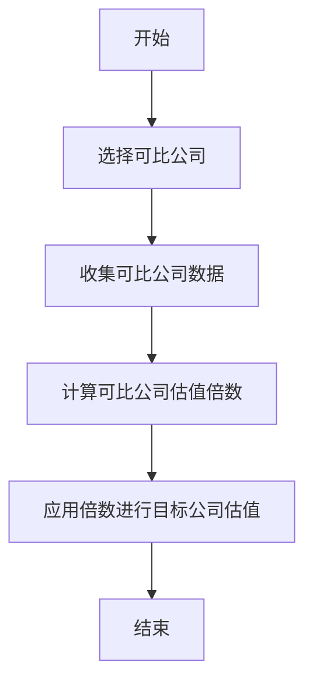
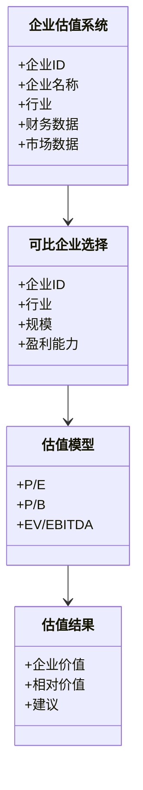
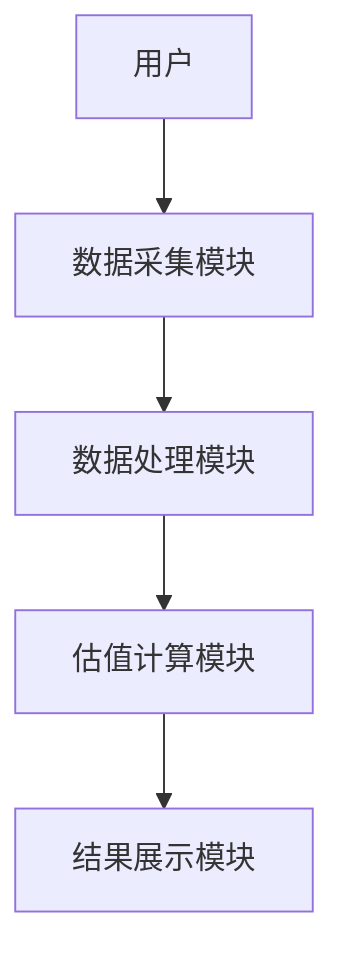

                 


# 企业估值中的比较法：优势与局限

## 关键词
企业估值, 比较法, 可比公司分析, 市盈率, 市净率, 企业价值评估, 财务指标分析

## 摘要
企业估值是投资决策中的核心问题，而比较法作为最常用的方法之一，通过与可比企业的对比分析，快速评估企业价值。本文系统阐述了比较法的背景、原理、算法、系统设计、项目实战，分析其优缺点及实际应用中的注意事项。

---

# 第一部分: 企业估值中的比较法背景与概念

## 第1章: 企业估值与比较法概述

### 1.1 企业估值的重要性
企业估值是评估企业价值的过程，用于支持并购、融资、上市等决策。准确的估值帮助投资者识别投资机会，避免风险。

#### 1.1.1 企业估值的基本概念
企业估值是对企业整体价值的评估，包括资产、负债、盈利能力等。常用方法有DCF模型、相对估值法等。

#### 1.1.2 企业估值的核心作用
企业估值用于评估企业的真实价值，帮助投资者和管理层做出决策。它影响企业并购价格、融资金额等。

#### 1.1.3 比较法在企业估值中的地位
比较法是一种相对估值法，通过比较可比企业的估值指标来确定目标企业的价值。它是企业估值中最常用的非DCF方法之一。

### 1.2 比较法的定义与特点
比较法通过分析可比企业的财务指标和市场数据，推断目标企业的价值。

#### 1.2.1 比较法的定义
比较法是基于“同类企业比较”的原则，通过分析可比企业的市场数据和财务指标，推断目标企业的估值。

#### 1.2.2 比较法的核心特点
- **相对性**：依赖于可比企业的数据，而非绝对值。
- **简便性**：操作简单，适合快速估值。
- **依赖性**：结果高度依赖可比企业的选择。

#### 1.2.3 比较法与其他估值方法的区别
比较法与DCF模型的主要区别在于，前者基于市场数据，后者基于未来现金流折现。比较法适用于缺乏现金流数据的情况。

### 1.3 比较法在企业估值中的应用领域
比较法广泛应用于企业并购、融资、上市等场景。

#### 1.3.1 比较法在企业并购中的应用
并购方通过比较法评估目标企业价值，确定合理的收购价格。

#### 1.3.2 比较法在企业融资中的应用
融资方通过比较法确定合理的融资规模和价格。

#### 1.3.3 比较法在企业上市中的应用
企业上市前，投资者通过比较法评估企业价值，确定发行价格。

---

## 第2章: 比较法的核心概念与联系

### 2.1 比较法的核心原理
比较法基于市场有效性和可比企业之间的可比性，推断目标企业的价值。

#### 2.1.1 比较法的基本原理
通过分析可比企业的财务指标和市场估值，推断目标企业的价值倍数。

#### 2.1.2 比较法的理论基础
市场有效性和可比性假设，认为市场已反映可比企业的价值。

#### 2.1.3 比较法的数学模型
$$ 企业价值 = 可比企业价值倍数 × 目标企业指标 $$

### 2.2 比较法与企业估值的关系
比较法通过可比企业的数据，推断目标企业的估值。

#### 2.2.1 比较法在企业估值中的作用
提供快速估值方法，适用于缺乏现金流数据的情况。

#### 2.2.2 比较法与企业价值的关系
比较法通过可比企业数据，推断目标企业价值。

#### 2.2.3 比较法与企业财务指标的关联
比较法依赖于市盈率（P/E）、市净率（P/B）等财务指标。

### 2.3 比较法的核心要素对比
比较法通过对比企业的财务指标和市场数据，推断目标企业的价值。

#### 2.3.1 企业规模对比
比较企业的规模，如营收、员工数量等。

#### 2.3.2 企业盈利能力对比
比较企业的盈利能力，如净利润率、ROE等。

#### 2.3.3 企业成长性对比
比较企业的成长性，如营收增长率、净利润增长率等。

---

# 第二部分: 比较法的算法原理与数学模型

## 第3章: 比较法的算法原理

### 3.1 比较法的算法流程
步骤：
1. 确定可比企业。
2. 收集可比企业的市场数据和财务数据。
3. 计算可比企业的估值倍数（如P/E、P/B）。
4. 应用于目标企业，计算目标企业价值。

#### 3.1.1 算法流程图


### 3.2 比较法的数学模型
#### 3.2.1 市盈率模型
$$ P/E = 市场价格 / 每股收益 $$

#### 3.2.2 市净率模型
$$ P/B = 市场价格 / 每股净资产 $$

#### 3.2.3 EV/EBITDA模型
$$ EV/EBITDA = 企业价值 / 息税折旧及摊销前利润 $$

---

## 第4章: 比较法的系统分析与架构设计

### 4.1 问题场景介绍
构建一个基于比较法的企业估值系统，解决用户快速估值的需求。

### 4.2 项目介绍
系统名称：企业估值比较法系统。目标：提供快速、准确的企业估值服务。

### 4.3 系统功能设计
功能模块：数据采集、处理、分析、可视化。

#### 4.3.1 领域模型


### 4.4 系统架构设计
架构图：展示系统各模块的交互。



### 4.5 系统接口设计
API接口：数据采集、处理、分析模块的交互。

### 4.6 系统交互设计
交互图：展示用户与系统的交互流程。

---

## 第5章: 比较法的项目实战

### 5.1 环境安装
安装Python、Pandas、Matplotlib等库。

### 5.2 核心代码实现
实现数据采集、处理、分析模块。

#### 5.2.1 数据采集模块
```python
import pandas as pd

def fetch_data(tickers):
    # 示例代码，实际需要调用API获取数据
    return pd.DataFrame({'Ticker': tickers, 'Revenue': [100, 200, 300], 'Net Income': [20, 30, 40]})
```

#### 5.2.2 数据处理模块
```python
def calculate_multiples(df):
    df['PE'] = df['Market Price'] / df['EPS']
    df['PB'] = df['Market Price'] / df['BPS']
    return df
```

#### 5.2.3 估值计算模块
```python
def estimate_value(target, comparable_data):
    avg_multiple = comparable_data['PE'].mean()
    target_value = target['Net Income'] * avg_multiple
    return target_value
```

### 5.3 案例分析
案例：假设目标公司为科技公司，选取3家可比公司，计算平均市盈率，应用于目标公司估值。

---

## 第6章: 总结与展望

### 6.1 总结
比较法的优势在于快速估值，但结果依赖于可比企业选择和市场有效性假设。实际应用中需结合其他方法进行验证。

### 6.2 展望
未来，随着AI技术的发展，比较法将更加智能化和自动化，但其核心原理和局限性仍需深入研究。

---

## 作者：AI天才研究院/AI Genius Institute & 禅与计算机程序设计艺术 /Zen And The Art of Computer Programming

---

以上是基于《企业估值中的比较法：优势与局限》的详细技术博客文章内容，涵盖从背景到系统设计的各个方面，旨在为读者提供全面且深入的了解。

