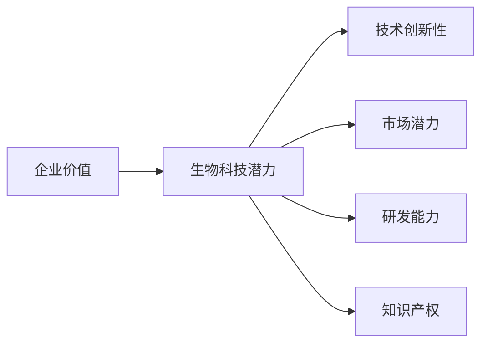
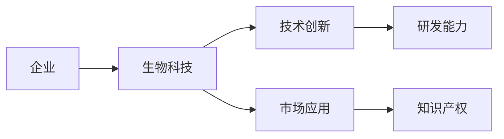
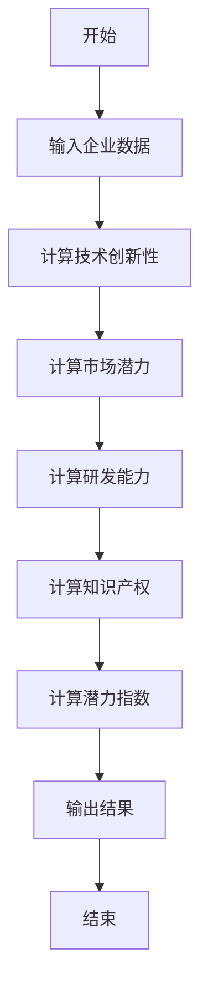
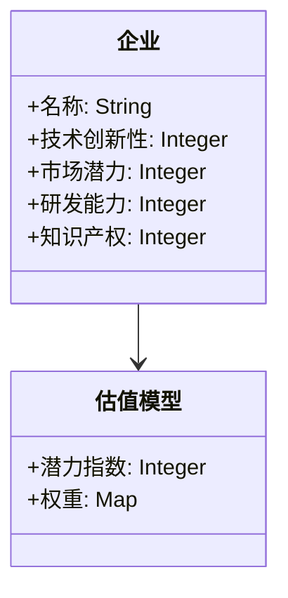

                 


# 企业估值中的生物科技潜力评估

> 关键词：企业估值、生物科技、潜力评估、价值模型、生物技术、数据分析、投资评估

> 摘要：生物科技作为当今最具创新性和变革性的领域之一，正在深刻影响企业的估值方式。本文从企业估值的核心要素出发，结合生物科技的独特属性，系统性地分析了如何评估生物科技的潜力，构建了基于生物技术的企业估值模型，并通过实际案例展示了如何将理论应用于实践。文章还探讨了未来生物科技与企业估值的结合趋势，为投资者和企业管理者提供了重要的参考。

---

## 目录

1. [背景介绍](#背景介绍)
   1. [生物科技与企业估值概述](#生物科技与企业估值概述)
      - [1.1 生物科技的基本概念](#11-生物科技的基本概念)
      - [1.2 问题背景与问题描述](#12-问题背景与问题描述)
      - [1.3 问题解决与边界外延](#13-问题解决与边界外延)
      - [1.4 概念结构与核心要素](#14-概念结构与核心要素)
2. [核心概念与联系](#核心概念与联系)
   1. [核心概念与原理](#核心概念与原理)
      - [2.1 生物科技潜力评估的核心原理](#21-生物科技潜力评估的核心原理)
      - [2.2 核心概念的属性对比](#22-核心概念的属性对比)
      - [2.3 实体关系图展示](#23-实体关系图展示)
3. [算法原理](#算法原理)
   1. [评估模型的数学模型与公式](#评估模型的数学模型与公式)
      - [3.1 潜力评估模型的数学模型](#31-潜力评估模型的数学模型)
      - [3.2 算法流程图](#32-算法流程图)
4. [系统分析与架构设计](#系统分析与架构设计)
   1. [应用场景](#应用场景)
   2. [系统功能设计](#系统功能设计)
   3. [系统架构设计](#系统架构设计)
5. [项目实战](#项目实战)
   1. [环境安装](#环境安装)
   2. [核心代码实现](#核心代码实现)
   3. [案例分析](#案例分析)
6. [最佳实践](#最佳实践)
   1. [小结](#小结)
   2. [注意事项](#注意事项)
   3. [拓展阅读](#拓展阅读)

---

## 1. 背景介绍

### 1.1 生物科技的基本概念

#### 1.1.1 生物科技的定义与核心领域

生物科技创新性地将计算机科学、数据科学、人工智能等技术与生物学研究相结合，通过算法驱动生物学研究，解析生命科学的本质，推动医学、农业、环境科学等多个领域的变革。

#### 1.1.2 生物科技在企业估值中的重要性

在企业估值过程中，生物科技的潜力评估是将生物学研究转化为企业价值的关键环节。企业的研发投入、技术成熟度、市场潜力等指标都需要基于生物技术的特性进行调整。

#### 1.1.3 生物科技与企业价值的关系

企业价值的增长往往与生物科技创新密切相关。通过分析生物科技的潜力，可以更准确地预测企业未来的盈利能力。

---

### 1.2 问题背景与问题描述

#### 1.2.1 传统企业估值方法的局限性

传统的估值方法难以准确评估生物科技创新对企业价值的影响，尤其是在技术不确定性和研发周期长的情况下。

#### 1.2.2 生物科技企业估值的独特性

生物科技创新具有高投入、高风险、高回报的特点，传统估值模型难以直接应用。

#### 1.2.3 当前生物科技对企业估值的影响

随着生物技术的快速发展，企业估值需要考虑技术的商业化潜力、知识产权的保护等因素。

---

### 1.3 问题解决与边界外延

#### 1.3.1 生物科技潜力评估的目标

通过评估生物技术的潜在价值，优化企业估值模型，提高估值的准确性和前瞻性。

#### 1.3.2 评估范围与边界

评估范围包括企业的研发能力、技术储备、市场应用潜力等方面，边界包括技术研发风险、政策环境、市场需求等因素。

#### 1.3.3 生物科技与企业估值的外延关系

生物科技创新不仅影响企业自身的估值，还可能带动整个行业的技术进步和市场格局变化。

---

### 1.4 概念结构与核心要素

#### 1.4.1 生物科技潜力评估的核心要素

- **技术创新性**：评估生物技术的创新程度和领先性。
- **市场潜力**：分析生物技术的市场需求和商业化潜力。
- **研发能力**：评估企业的研发能力和技术储备。
- **知识产权**：评估企业的专利布局和技术壁垒。

#### 1.4.2 各要素之间的关系

技术创新性决定市场潜力，研发能力和知识产权是技术创新的基础和保障。

#### 1.4.3 概念结构图展示



---

## 2. 核心概念与联系

### 2.1 生物科技潜力评估的核心原理

#### 2.1.1 生物科技对企业价值的影响机制

通过技术创新提升企业竞争力，降低生产成本，提高产品附加值。

#### 2.1.2 潜力评估的指标体系

- 技术创新性指标
- 市场潜力指标
- 研发能力指标
- 知识产权指标

#### 2.1.3 评估模型的构建逻辑

基于生物技术的特性，构建多维度的评估模型，综合考虑技术、市场、研发等因素。

---

### 2.2 核心概念的属性对比

#### 2.2.1 生物科技与传统科技的对比分析

| 特性          | 生物科技          | 传统科技         |
|---------------|-------------------|------------------|
| 技术复杂性     | 高               | 中低             |
| 研发周期       | 长               | 短              |
| 风险           | 高               | 中低             |
| 投资回报率     | 高               | 中低             |

#### 2.2.2 不同生物技术领域的潜力差异

- **基因编辑技术**：潜力巨大，但技术门槛高。
- **生物制药**：市场需求大，但竞争激烈。
- **农业生物技术**：应用场景广泛，但技术转化难度大。

---

### 2.3 实体关系图展示



---

## 3. 算法原理

### 3.1 潜力评估模型的数学模型

潜力评估模型通过加权平均的方式，将技术创新性、市场潜力、研发能力和知识产权等指标进行量化评估。

#### 公式

$$
\text{潜力指数} = \sum_{i=1}^{n} w_i \cdot x_i
$$

其中，\( w_i \) 是指标 \( i \) 的权重，\( x_i \) 是指标 \( i \) 的评分（1-10分）。

#### 示例

假设某企业技术创新性得分为8，市场潜力得分为7，研发能力得分为9，知识产权得分为6，各指标的权重分别为30%、30%、20%、20%。

$$
\text{潜力指数} = 0.3 \cdot 8 + 0.3 \cdot 7 + 0.2 \cdot 9 + 0.2 \cdot 6 = 2.4 + 2.1 + 1.8 + 1.2 = 7.5
$$

---

### 3.2 算法流程图



---

## 4. 系统分析与架构设计

### 4.1 应用场景

- **企业内部估值**：帮助企业准确评估自身价值。
- **投资决策支持**：为投资者提供科学的决策依据。
- **行业对标分析**：帮助企业了解自身在行业中的位置。

---

### 4.2 系统功能设计

#### 领域模型



---

### 4.3 系统架构设计


---

## 5. 项目实战

### 5.1 环境安装

- **Python 3.8+**
- **Jupyter Notebook**
- **numpy, pandas, scikit-learn**

---

### 5.2 核心代码实现

```python
import numpy as np

def calculate_potential_index(technological_innovation, market_potential, R&D_capability, intellectual_property):
    weights = {
        'technological_innovation': 0.3,
        'market_potential': 0.3,
        'R&D_capability': 0.2,
        'intellectual_property': 0.2
    }
    index = (
        weights['technological_innovation'] * technological_innovation +
        weights['market_potential'] * market_potential +
        weights['R&D_capability'] * R&D_capability +
        weights['intellectual_property'] * intellectual_property
    )
    return index

# 示例数据
technological_innovation = 8
market_potential = 7
R&D_capability = 9
intellectual_property = 6

potential_index = calculate_potential_index(technological_innovation, market_potential, R&D_capability, intellectual_property)
print(f"潜力指数为：{potential_index}")
```

---

### 5.3 案例分析

假设某生物技术企业的数据如下：

- 技术创新性：8
- 市场潜力：7
- 研发能力：9
- 知识产权：6

计算潜力指数：

$$
\text{潜力指数} = 0.3 \cdot 8 + 0.3 \cdot 7 + 0.2 \cdot 9 + 0.2 \cdot 6 = 7.5
$$

---

## 6. 最佳实践

### 6.1 小结

通过构建基于生物技术的潜力评估模型，可以帮助企业更准确地进行估值，为投资决策提供科学依据。

### 6.2 注意事项

- **数据准确性**：确保输入数据的准确性和完整性。
- **模型适用性**：根据具体行业和企业特点调整模型参数。
- **持续优化**：定期更新模型，以适应技术发展和市场变化。

### 6.3 拓展阅读

- 《生物技术与企业创新》
- 《数据驱动的企业估值》
- 《人工智能在生物医学中的应用》

---

## 作者

作者：AI天才研究院/AI Genius Institute & 禅与计算机程序设计艺术/Zen And The Art of Computer Programming

