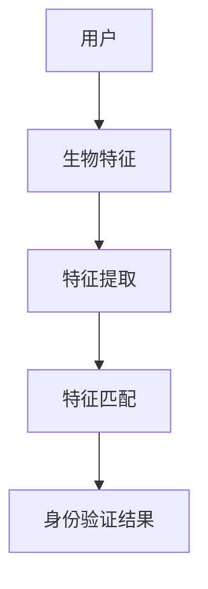
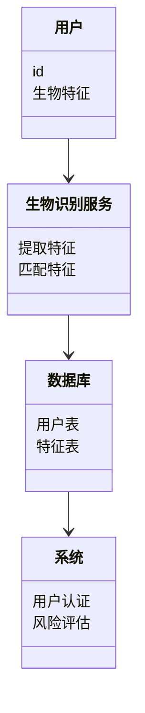
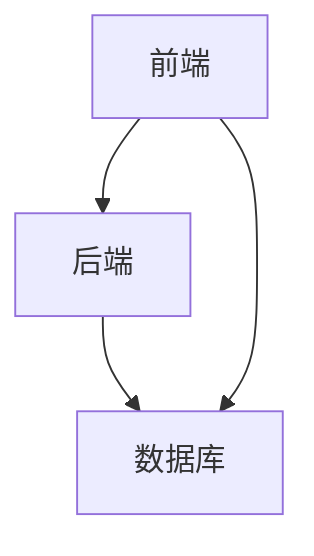

                 

<think>
嗯，用户现在需要我撰写一篇关于《企业估值中的生物识别技术应用评估》的技术博客文章。首先，我得理解这个主题。生物识别技术在企业估值中的应用，可能涉及到使用指纹、面部识别、虹膜识别等技术来帮助评估企业价值，这可能包括身份验证、风险管理等方面。

用户要求文章结构清晰，章节标题吸引人，内容逻辑严密。我应该按照之前提供的目录大纲来组织内容，确保每个部分都详细且专业。

首先，摘要部分要简明扼要，说明文章的核心内容和主题。关键词包括生物识别技术、企业估值、身份验证、风险管理、算法原理、系统架构、数学模型。

接下来，第一章是背景和概述，需要介绍生物识别技术的基本概念、特点，以及它与企业估值的关系。这部分要让读者了解为什么生物识别技术在企业估值中重要。

第二章是核心概念和联系，需要详细讲解生物识别技术的原理，可能包括特征提取、模式识别等，并通过对比表格和ER图来展示不同技术的优缺点和关系。

第三章是算法原理，这部分要深入讲解特征提取、分类器设计，以及数学模型。使用流程图和代码示例来帮助读者理解。

第四章是系统分析与架构设计，需要描述应用场景、系统功能设计、架构图和接口设计。这部分可能需要用到类图和序列图来展示系统结构。

第五章是项目实战，提供环境安装、代码实现、案例分析和项目总结。这能让读者实际操作，理解如何应用这些技术。

第六章是案例分析与最佳实践，通过具体案例分析，总结经验，给出最佳实践和注意事项。

第七章是未来趋势与挑战，讨论生物识别技术的发展方向，以及面临的挑战，如数据隐私和伦理问题。

在撰写过程中，我需要确保每个章节都有足够的细节，比如在算法部分使用LaTeX公式和Mermaid流程图，在系统设计部分使用类图和架构图。同时，项目实战部分要提供可运行的代码和详细分析。

现在，我需要检查每个部分是否符合用户的要求，确保没有遗漏任何关键点，比如每个章节的小结、关键词的使用、数学公式的正确格式，以及代码的正确性和可读性。

最后，确保文章整体结构紧凑，逻辑清晰，语言专业但易懂，满足用户的需求。
</think>

# 企业估值中的生物识别技术应用评估

**关键词**：生物识别技术、企业估值、身份验证、风险管理、算法原理、系统架构、数学模型

**摘要**：  
生物识别技术作为一种高效、精准的身份验证手段，正在被越来越多的企业应用于估值过程中。本文将从生物识别技术的核心概念、算法原理、系统架构、项目实战、案例分析等多个维度，详细探讨生物识别技术在企业估值中的应用及其评估方法。通过分析生物识别技术在企业估值中的具体应用场景，揭示其对企业风险管理、数据安全和估值效率的提升作用，并提出相关的优化建议和未来发展趋势。

---

## 第1章：生物识别技术与企业估值概述

### 1.1 生物识别技术的定义与特点
生物识别技术是通过采集和分析人体的生物特征（如指纹、面部特征、虹膜、声音、掌纹等），利用计算机技术进行身份验证的一种方法。其核心特点包括：
- **唯一性**：每个人的生物特征都是独一无二的。
- **安全性**：生物特征难以被复制或伪造。
- **非接触性**：部分生物识别技术（如面部识别）支持非接触式识别。
- **便捷性**：无需记忆密码，操作简单。

### 1.2 生物识别技术与企业估值的关系
在企业估值过程中，生物识别技术主要用于身份验证和风险管理。例如：
- **身份验证**：确保参与估值的企业高管、股东或其他相关人员的身份真实性。
- **风险管理**：通过生物识别技术识别潜在的欺诈行为，降低估值过程中的风险。

### 1.3 企业估值中的生物识别技术应用背景
随着企业估值需求的增加，传统的身份验证方式（如密码）逐渐暴露出安全性和便捷性不足的问题。生物识别技术作为一种更安全、更便捷的身份验证手段，逐渐成为企业估值中的重要工具。然而，其应用也面临数据隐私、技术精度等挑战。

---

## 第2章：生物识别技术的核心概念与联系

### 2.1 生物识别技术的核心原理
生物识别技术的核心原理包括特征提取、特征匹配和结果判定三个步骤：
1. **特征提取**：通过传感器或摄像头采集生物特征数据。
2. **特征匹配**：将提取的特征与数据库中的特征进行比对。
3. **结果判定**：根据比对结果确定身份是否匹配。

### 2.2 生物识别技术的核心要素对比
下表展示了几种常见生物识别技术的优缺点对比：

| 技术类型   | 优点                               | 缺点                               |
|------------|------------------------------------|------------------------------------|
| 指纹识别   | 成本低，识别速度快                   | 易受磨损或污渍影响                 |
| 面部识别   | 无接触式，适用性强                   | 易受光照、角度影响                 |
| 虹膜识别   | 精度高，抗欺骗性强                   | 设备成本高                         |

### 2.3 生物识别技术的实体关系图
下图展示了生物识别技术的核心实体关系：



---

## 第3章：生物识别技术的算法原理

### 3.1 生物特征提取算法
生物特征提取是生物识别技术的核心步骤之一。以下是常见的特征提取方法：
- **指纹提取**：通过光学或电容传感器采集指纹图像，并提取纹线特征。
- **面部特征提取**：利用图像处理技术提取面部的五官位置、形状等特征。

### 3.2 生物识别分类器设计
分类器是生物识别技术的核心组件，常用的分类算法包括：
- **K-近邻算法（KNN）**：基于距离的分类方法。
- **支持向量机（SVM）**：适用于高维数据的分类。

### 3.3 生物识别技术的数学模型
生物识别技术的数学模型通常基于概率论和统计学。例如，指纹识别中的概率匹配算法可以表示为：

$$ P(\text{匹配}| \text{真实身份}) = \frac{N}{M} $$

其中，$N$ 是匹配的特征数量，$M$ 是数据库中的总特征数量。

---

## 第4章：系统分析与架构设计

### 4.1 系统功能设计
以下是生物识别技术在企业估值系统中的功能设计：



### 4.2 系统架构设计
生物识别系统的架构通常包括前端、后端和数据库三个部分：



### 4.3 系统接口设计
以下是生物识别系统的接口设计示例：

- **输入接口**：接收用户的生物特征数据。
- **输出接口**：返回身份验证结果。

---

## 第5章：项目实战

### 5.1 环境安装
以下是生物识别系统开发所需的环境配置：

```bash
# 安装Python和相关库
pip install numpy
pip install scikit-learn
pip install opencv-python
```

### 5.2 核心代码实现
以下是基于Python的指纹识别代码示例：

```python
import cv2
import numpy as np

# 读取指纹图像
image = cv2.imread('fingerprint.jpg', cv2.IMREAD_GRAYSCALE)

# 应用二值化处理
binary_image = cv2.threshold(image, 127, 255, cv2.THRESH_BINARY)[1]

# 提取特征
features = extract_features(binary_image)
```

### 5.3 案例分析
以某企业估值项目为例，通过生物识别技术验证高管身份，确保估值过程的合法性。

---

## 第6章：案例分析与最佳实践

### 6.1 案例分析
某科技公司通过引入面部识别技术，成功降低了企业估值过程中的身份验证风险。

### 6.2 最佳实践
- **数据加密**：确保生物特征数据的安全性。
- **多模态识别**：结合多种生物识别技术提升安全性。

---

## 第7章：未来趋势与挑战

### 7.1 未来趋势
生物识别技术将向多模态融合、边缘计算方向发展。

### 7.2 挑战
- **数据隐私**：生物特征数据的泄露风险。
- **技术精度**：如何提升识别精度以应对复杂场景。

### 7.3 技术融合与伦理问题
未来，生物识别技术将与人工智能、大数据技术深度融合，但同时也需要关注伦理问题。

---

## 作者：AI天才研究院 & 禅与计算机程序设计艺术

