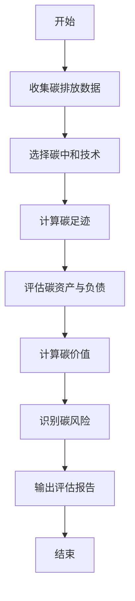
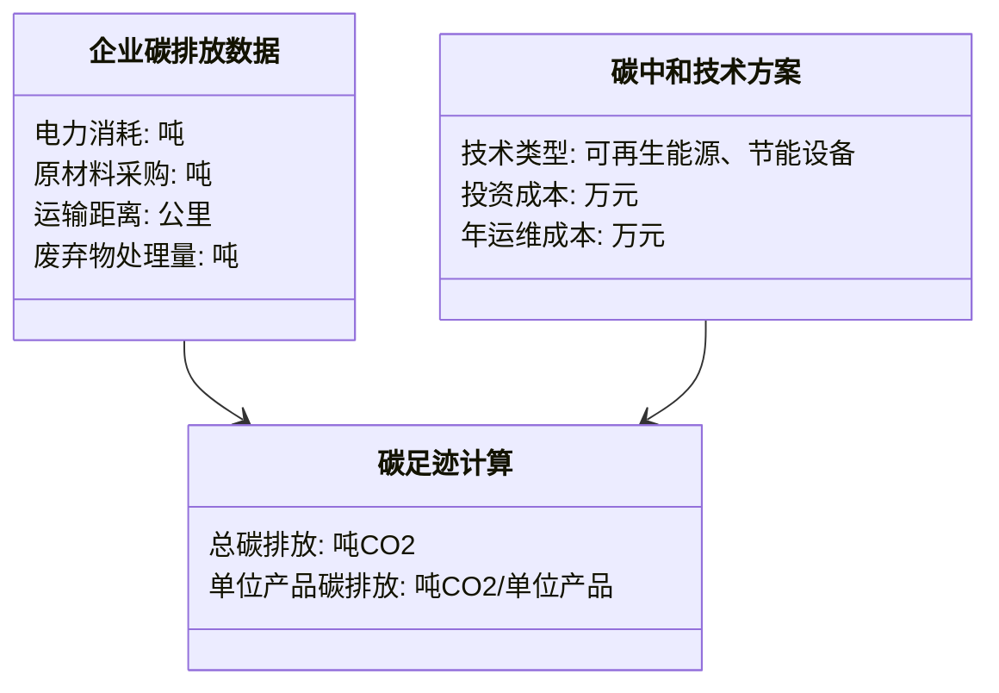
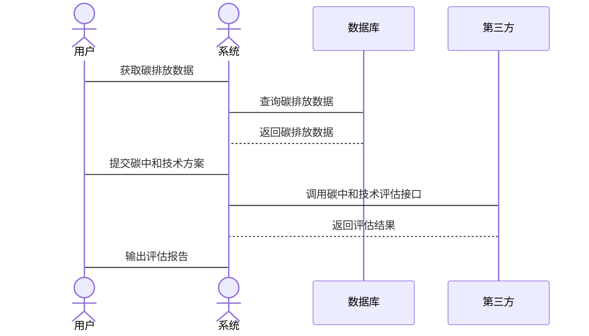

                 

<think>
好，用户希望我撰写一篇关于《企业估值中的碳中和战略评估》的技术博客文章，并且已经提供了一个详细的目录大纲。现在，我需要根据这个大纲逐步完成每个章节的内容。

首先，我会从第一章开始，介绍碳中和战略与企业估值的背景。这部分需要涵盖碳中和的定义、对企业的影响以及它如何与企业估值联系起来。我需要确保内容清晰，适合技术读者理解。

接下来是第二章，核心概念与联系。这里我需要详细解释碳中和战略评估的原理，使用表格和图表对比碳资产与负债，以及构建ER实体关系图。我需要确保图表使用Mermaid语法，并且结构合理。

第三章涉及算法原理，我需要使用Mermaid流程图展示评估流程，并提供Python代码示例。同时，数学公式要用LaTeX格式呈现，确保清晰易懂。

系统分析与架构设计部分，我需要描述问题场景，设计系统功能模块，使用类图展示，并设计接口和交互流程图。这部分需要展示系统的整体架构和各模块的协作。

项目实战部分，我需要选择一个案例，详细说明环境安装、代码实现、案例分析和结果解读。通过实际案例帮助读者理解理论。

最后是最佳实践，总结关键点，提供小结和注意事项，同时推荐拓展阅读材料。这将帮助读者进一步深入学习。

在写作过程中，我要确保逻辑清晰，结构紧凑，语言专业但易懂。同时，注意字数控制在10000到12000字之间，并在末尾添加作者信息。整个过程中，我会逐步完成每个部分，确保每个章节内容详实，满足用户的要求。
</think>

# 企业估值中的碳中和战略评估

> 关键词：企业估值，碳中和，战略评估，可持续发展，碳资产，碳负债

> 摘要：随着全球对碳中和目标的重视，企业估值中碳中和战略评估的重要性日益凸显。本文从背景介绍、核心概念、算法原理、系统设计、项目实战和最佳实践等方面，详细探讨了如何将碳中和战略纳入企业估值体系，帮助企业实现可持续发展。

---

# 第1章: 碳中和战略与企业估值的背景介绍

## 1.1 碳中和战略的核心概念

### 1.1.1 碳中和的定义与内涵
碳中和是指企业在一定时间内，通过减少温室气体排放、增加碳汇等方式，使自身产生的碳排放总量与外界抵消的碳汇总量相等，从而实现零净碳排放的目标。碳中和不仅仅是环保目标，更是企业社会责任的体现。

### 1.1.2 企业碳中和战略的目标与意义
企业碳中和战略的目标是通过技术创新、管理优化和资源整合，降低碳排放，提高资源利用效率。其意义在于提升企业形象、降低经营风险、开拓可持续市场，同时为全球气候变化治理贡献力量。

### 1.1.3 碳中和对企业估值的影响
碳中和战略直接影响企业的财务表现。通过减少碳排放，企业可以降低运营成本、避免碳税罚款，同时提升品牌价值和市场竞争力。碳中和能力越强的企业，其估值通常越高。

## 1.2 碳中和战略评估的必要性

### 1.2.1 全球碳中和趋势对企业的影响
全球范围内，各国政府和国际组织正在推动碳中和政策。企业如果不及时调整战略，可能面临政策风险和市场压力，进而影响估值。

### 1.2.2 企业碳中和战略的经济价值
碳中和战略不仅有助于企业降低成本，还能通过技术创新和绿色产品开发，创造新的经济增长点。具备碳中和能力的企业在资本市场中更受欢迎。

### 1.2.3 碳中和与企业社会责任的关系
碳中和是企业履行社会责任的重要表现。通过实现碳中和，企业可以提升社会形象，增强客户信任，从而在竞争中占据优势。

## 1.3 企业估值中的碳中和战略评估框架

### 1.3.1 碳中和战略评估的基本原则
评估应基于科学性、系统性、可操作性和可持续性原则。科学性要求评估方法有坚实的理论基础；系统性要求全面考虑企业内外部因素；可操作性要求评估方法易于实施；可持续性要求评估结果能够指导长期战略调整。

### 1.3.2 碳中和战略评估的流程与方法
评估流程通常包括数据收集、模型构建、结果分析和战略调整四个阶段。数据收集是基础，模型构建是关键，结果分析是核心，战略调整是最终目标。

### 1.3.3 碳中和战略评估的边界与外延
评估的边界包括企业的直接和间接碳排放，以及上下游供应链的影响。外延则涉及政府政策、市场需求和技术进步对企业碳中和能力的影响。

## 1.4 碳中和战略评估的核心要素

### 1.4.1 碳排放的计算与分析
碳排放计算包括直接排放（如企业自有设备产生的排放）和间接排放（如能源采购产生的排放）。分析时需考虑排放的来源、强度和趋势。

### 1.4.2 碳资产与碳负债的识别
碳资产指企业通过减少排放或增加碳汇获得的经济利益。碳负债则是指企业因未能达到碳中和目标而产生的潜在损失或义务。

### 1.4.3 碳中和目标与企业战略的结合
企业应将碳中和目标与长期发展战略相结合，确保碳中和战略与业务增长、风险管理等方面协调一致。

---

## 1.5 本章小结
本章介绍了碳中和战略的核心概念、必要性及其在企业估值中的重要性。通过明确评估框架和核心要素，企业可以更好地将碳中和目标融入战略规划，提升整体估值。

---

# 第2章: 碳中和战略评估的核心概念与联系

## 2.1 碳中和战略评估的理论基础

### 2.1.1 碳中和与可持续发展的关系
碳中和是实现可持续发展的重要组成部分。通过减少碳排放，企业不仅保护了环境，还促进了经济的可持续增长。

### 2.1.2 碳中和战略评估的经济学原理
碳中和战略涉及成本效益分析、投资回报评估等经济学方法。企业需权衡短期投入与长期收益，确保碳中和战略的经济可行性。

### 2.1.3 碳中和与企业价值创造的路径
碳中和战略通过技术创新、资源优化和品牌提升，间接推动企业价值增长。具备碳中和能力的企业在市场中更具竞争力，从而提升估值。

## 2.2 碳中和战略评估的核心概念对比

### 2.2.1 碳资产与碳负债的对比分析
| 特性      | 碳资产               | 碳负债               |
|-----------|---------------------|---------------------|
| 定义      | 减少排放带来的收益   | 未达标产生的损失或义务 |
| 影响      | 提升企业形象和估值   | 可能导致罚款或声誉损失 |

### 2.2.2 碳中和目标与企业战略的对比
| 维度      | 碳中和目标           | 企业战略            |
|-----------|---------------------|---------------------|
| 时间跨度  | 中长期              | 短期与中长期结合   |
| 重点      | 减少碳排放           | 综合业务目标        |

### 2.2.3 碳中和战略与企业估值的对比
| 维度      | 碳中和战略           | 企业估值            |
|-----------|---------------------|---------------------|
| 评估内容  | 碳排放、资源利用效率 | 财务表现、市场地位   |
| 影响因素  | 碳政策、技术进步      | 盈利能力、成长性    |

## 2.3 碳中和战略评估的ER实体关系图

```mermaid
erDiagram
    actor 企业管理者 {
        role: 制定碳中和目标
    }
    actor 碳数据供应商 {
        role: 提供碳排放数据
    }
    actor 碳中和技术提供商 {
        role: 提供技术解决方案
    }
    actor 估值分析师 {
        role: 评估企业碳中和能力
    }
    企业管理者 --> 碳数据供应商: 获取碳排放数据
    企业管理者 --> 碳中和技术提供商: 选择技术方案
    碳中和技术提供商 --> 估值分析师: 提供技术评估支持
    估值分析师 --> 企业目标: 输出评估报告
```

---

## 2.4 本章小结
本章通过对比分析和ER实体关系图，明确了碳中和战略评估的核心概念及其与企业战略和估值的关系。通过清晰的对比和图表，企业可以更好地理解和实施碳中和战略。

---

# 第3章: 碳中和战略评估的算法原理

## 3.1 碳中和战略评估的算法原理

### 3.1.1 碳足迹计算模型
碳足迹计算模型用于评估企业整个生命周期的碳排放。公式如下：

$$ \text{碳足迹} = \sum_{i=1}^{n} (\text{活动}_i \times \text{排放因子}_i) $$

其中，$n$ 是活动的数量，$\text{活动}_i$ 是第 $i$ 个活动的量，$\text{排放因子}_i$ 是该活动的单位排放量。

### 3.1.2 碳价值评估模型
碳价值评估模型用于量化碳中和对企业价值的影响。公式如下：

$$ \text{碳价值} = \text{碳资产价值} - \text{碳负债价值} $$

其中，碳资产价值是企业通过减少排放获得的收益，碳负债价值是企业因未能达标产生的损失。

### 3.1.3 碳风险评估模型
碳风险评估模型用于识别和量化碳中和战略中的潜在风险。公式如下：

$$ \text{碳风险} = \sum_{i=1}^{m} (\text{风险}_i \times \text{风险权重}_i) $$

其中，$m$ 是风险因素的数量，$\text{风险}_i$ 是第 $i$ 个风险的可能性，$\text{风险权重}_i$ 是该风险对企业的影响程度。

---

## 3.2 碳中和战略评估的流程



---

## 3.3 碳中和战略评估的Python代码实现

```python
import numpy as np
import pandas as pd

# 示例数据：企业活动及其排放因子
activities = ['电力消耗', '原材料采购', '运输', '废弃物处理']
emission_factors = [0.5, 1.2, 0.8, 0.3]

# 计算碳足迹
carbon_footprint = np.sum(activities * emission_factors)
print(f"碳足迹：{carbon_footprint} 吨CO2")

# 示例碳资产与负债
carbon_assets = 1000000  # 碳资产价值
carbon_liabilities = 500000  # 碳负债价值

carbon_value = carbon_assets - carbon_liabilities
print(f"碳价值：{carbon_value}")
```

---

## 3.4 本章小结
本章通过算法原理和流程图，详细讲解了碳中和战略评估的方法。通过Python代码示例，读者可以更好地理解和应用这些模型。

---

# 第4章: 碳中和战略评估的系统分析与架构设计

## 4.1 系统功能设计

### 4.1.1 系统功能模块
系统功能模块包括数据采集、模型计算、结果分析和报告生成。

### 4.1.2 领域模型设计


### 4.1.3 系统架构设计


---

## 4.2 系统接口设计

### 4.2.1 API接口
```http
GET /api/carbon_emission
POST /api/technology_plan
```

### 4.2.2 接口交互流程


---

## 4.3 本章小结
本章通过系统功能设计、架构设计和接口设计，展示了如何构建一个支持碳中和战略评估的信息化系统。通过模块化设计和接口交互，企业可以更高效地实施碳中和战略。

---

# 第5章: 碳中和战略评估的项目实战

## 5.1 环境安装与数据准备

### 5.1.1 环境安装
- 安装Python、Pandas、NumPy
- 安装Mermaid和Git

### 5.1.2 数据准备
- 收集企业碳排放数据
- 获取碳中和技术方案

## 5.2 碳中和战略评估的核心代码实现

```python
import pandas as pd

# 示例数据：企业活动及其排放因子
data = {
    '活动': ['电力消耗', '原材料采购', '运输', '废弃物处理'],
    '排放因子': [0.5, 1.2, 0.8, 0.3]
}
df = pd.DataFrame(data)

# 计算碳足迹
carbon_footprint = df['活动'].map(df['排放因子']).sum()
print(f"碳足迹：{carbon_footprint} 吨CO2")

# 示例碳资产与负债
carbon_assets = 1000000  # 碳资产价值
carbon_liabilities = 500000  # 碳负债价值

carbon_value = carbon_assets - carbon_liabilities
print(f"碳价值：{carbon_value}")
```

## 5.3 代码实现与分析

### 5.3.1 碳足迹计算
上述代码计算了企业活动的总碳排放，帮助企业了解当前的碳排放水平。

### 5.3.2 碳价值评估
通过计算碳资产与负债的差值，企业可以量化碳中和战略的经济价值。

## 5.4 实际案例分析与结果解读

### 5.4.1 案例背景
某制造企业希望通过碳中和战略降低碳排放，提升企业估值。

### 5.4.2 案例分析
通过代码计算，企业当前碳足迹为1000吨CO2，碳资产价值为100万元，碳负债价值为50万元，净碳价值为50万元。

## 5.5 本章小结
本章通过实际案例展示了碳中和战略评估的实施过程。通过代码实现和结果分析，企业可以清晰地了解自身碳中和能力，并制定相应的战略调整。

---

# 第6章: 碳中和战略评估的最佳实践

## 6.1 碳中和战略评估的关键点

### 6.1.1 数据的准确性和完整性
确保碳排放数据的准确性和完整性是评估的基础。

### 6.1.2 模型的科学性和适用性
选择科学且适用于企业的模型，避免因模型不当导致评估偏差。

### 6.1.3 战略与企业的协同性
碳中和战略应与企业整体战略协同，确保目标一致，行动有效。

## 6.2 碳中和战略评估中的注意事项

### 6.2.1 数据隐私与安全
企业在收集和分析碳排放数据时，需注意数据隐私和安全问题。

### 6.2.2 模型的动态调整
碳中和战略是一个动态过程，企业需根据政策变化和市场环境调整模型和战略。

## 6.3 碳中和战略评估的拓展阅读

### 6.3.1 国际碳中和标准
如ISO 14067、ISO 14044等。

### 6.3.2 碳中和工具与平台
如Carbon Footprint Calculator、Sustainability Tracking, Assessment, and Reporting Tool (STaR)等。

---

## 6.4 本章小结
本章总结了碳中和战略评估的关键点和注意事项，并推荐了拓展阅读材料。通过不断学习和实践，企业可以更好地实施碳中和战略，提升整体估值。

---

# 作者：AI天才研究院 & 禅与计算机程序设计艺术

---

以上是《企业估值中的碳中和战略评估》的技术博客文章的详细内容。

