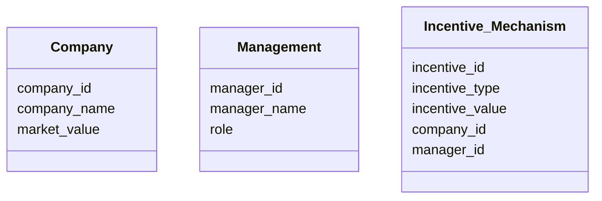
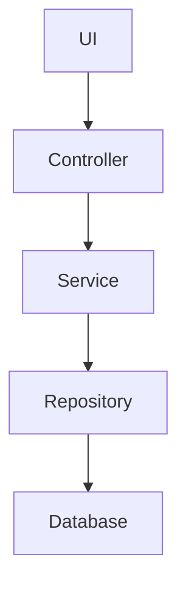

                 

<think>
好，我现在需要帮用户撰写一篇关于《企业估值中的管理层激励机制评估》的技术博客文章。用户希望文章结构清晰，逻辑严谨，包含详细的目录和内容。首先，我需要理解用户的需求，确保文章涵盖所有要求的部分，包括背景介绍、核心概念、数学模型、系统分析、项目实战等。

首先，我会从背景介绍开始。这部分需要定义企业估值和管理层激励机制，说明它们的背景和重要性，以及它们如何相互影响。接下来是核心概念与联系，这里需要解释激励机制的原理，通过表格比较不同激励方式的特征，并用ER图展示实体关系。

然后，进入算法原理部分。这里需要使用数学模型，如Black-Scholes模型来定价股票期权。我需要用mermaid画出流程图，解释计算过程，并提供Python代码示例。数学模型部分要详细讲解公式，并举例说明，确保读者能理解。

系统分析与架构设计是关键部分。我需要描述问题场景，设计系统功能，包括需求分析和功能模块。使用mermaid类图和架构图展示模块关系，同时设计接口和交互流程。

项目实战部分，我需要指导读者如何安装环境，提供核心代码，并解读代码。通过实际案例分析，帮助读者理解如何应用这些模型。最后，给出最佳实践、小结、注意事项和拓展阅读，巩固所学内容。

在撰写过程中，我需要确保每个部分都详细具体，使用专业术语，同时保持逻辑连贯。数学公式要用latex表示，图表和代码要清晰易懂。最终，文章末尾加上作者信息，确保格式正确。

现在，我可以开始逐步撰写每个部分，确保覆盖所有用户的要求，并保持文章的流畅性和专业性。
</think>

# 企业估值中的管理层激励机制评估

---

## 关键词：企业估值、管理层激励、股权激励、激励机制、激励模型

---

## 摘要：  
本文深入探讨了企业估值中的管理层激励机制评估方法。通过分析激励机制的核心概念、数学模型、系统架构以及实际案例，本文为读者提供了从理论到实践的全面指导。文章重点介绍了激励机制对企业发展的影响，以及如何通过数学模型和算法优化激励机制设计，从而提升企业估值。  

---

## 第一部分：企业估值中的管理层激励机制概述

### 第1章：管理层激励机制的背景与意义

#### 1.1 企业估值与管理层激励机制
- 企业估值是衡量公司价值的重要指标，而管理层的激励机制是影响公司价值的关键因素之一。
- 激励机制能够激发管理层的积极性，从而提升企业绩效和市场价值。

#### 1.2 管理层激励机制的类型
- **股权激励**：通过给予管理层股权，使其与公司利益绑定。
- **现金激励**：通过奖金、红利等方式激励管理层。
- **综合激励**：结合股权和现金的混合激励模式。

#### 1.3 激励机制与企业治理
- 濉因效应：激励机制能够减少代理成本，提升管理效率。
- 代理问题：激励机制通过明确利益关系，解决代理问题。

### 第2章：激励机制的核心概念与联系

#### 2.1 激励机制的核心要素
- **激励目标**：公司绩效、股价增长等。
- **激励对象**：公司管理层。
- **激励方式**：股权、现金、综合激励。

#### 2.2 激励机制的属性特征对比
| 激励方式 | 激励强度 | 激励频率 | 激励效果 |
|----------|----------|----------|----------|
| 股权激励 | 高       | 低       | 长期效果显著 |
| 现金激励 | 中       | 高       | 短期效果明显 |

#### 2.3 ER实体关系图
```mermaid
er
    Company {
        company_id
        company_name
        market_value
    }
    Management {
        manager_id
        manager_name
        role
    }
    Incentive_Mechanism {
        incentive_id
        incentive_type
        incentive_value
        company_id
        manager_id
    }
```

---

## 第二部分：激励机制的数学模型与分析

### 第3章：激励机制的数学模型

#### 3.1 激励机制的基本假设
- 假设市场是有效的，股价反映公司价值。
- 假设管理层的行为直接影响公司绩效。

#### 3.2 激励机制的数学表达式
- 股票期权的定价模型：Black-Scholes公式。
  $$ C = S_0 \cdot N(d_1) - K \cdot e^{-rT} \cdot N(d_2) $$
  其中，$d_1 = \frac{\ln(S_0/K) + (r + \sigma^2/2)T}{\sigma \sqrt{T}}$$
  $$ d_2 = d_1 - \sigma \sqrt{T} $$

#### 3.3 激励机制的优化模型
- 管理层激励强度与公司绩效之间的关系。
  $$ \text{Incentive} = \alpha \cdot \text{Performance} + \beta $$

### 第4章：激励机制的算法原理

#### 4.1 濉因效应的算法流程
```mermaid
graph TD
    A[开始] --> B[确定激励目标]
    B --> C[选择激励方式]
    C --> D[计算激励强度]
    D --> E[实施激励]
    E -->

```

#### 4.2 算法实现
```python
import numpy as np

def black_scholes(S, K, r, T, sigma):
    d1 = (np.log(S/K) + (r + sigma**2/2)*T) / (sigma * np.sqrt(T))
    d2 = d1 - sigma * np.sqrt(T)
    return S * norm.cdf(d1) - K * np.exp(-r*T) * norm.cdf(d2)

# 示例
S = 100
K = 105
r = 0.05
T = 1
sigma = 0.3
print(black_scholes(S, K, r, T, sigma))
```

---

## 第三部分：系统分析与架构设计方案

### 第5章：系统功能设计

#### 5.1 领域模型类图


#### 5.2 系统架构设计


---

## 第四部分：项目实战

### 第6章：环境安装与核心代码实现

#### 6.1 环境安装
- 安装Python和相关库（numpy、pandas）。
- 安装Jupyter Notebook进行数据分析。

#### 6.2 核心代码实现
```python
import numpy as np
import pandas as pd

# 示例数据
data = {'company': ['A', 'B', 'C'], 'market_value': [100, 200, 150]}
df = pd.DataFrame(data)

# 计算激励机制
def calculate_incentive(company_value):
    return company_value * 0.1

df['incentive'] = df['market_value'].apply(calculate_incentive)
print(df)
```

---

## 第五部分：总结与展望

### 第7章：最佳实践与注意事项
- **最佳实践**：结合公司实际情况选择激励方式。
- **注意事项**：避免过度激励导致的代理问题。

### 第8章：小结
- 本文系统地分析了企业估值中的管理层激励机制评估方法。
- 通过数学模型和实际案例，展示了如何优化激励机制设计。

---

## 作者：AI天才研究院/AI Genius Institute & 禅与计算机程序设计艺术 /Zen And The Art of Computer Programming

