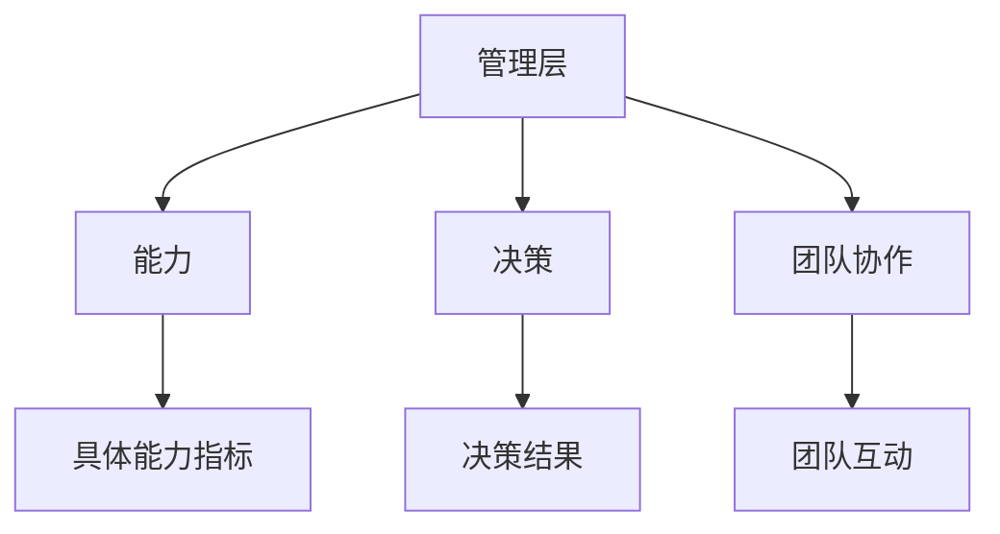
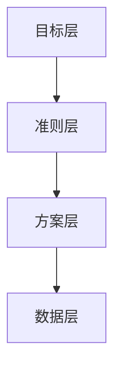
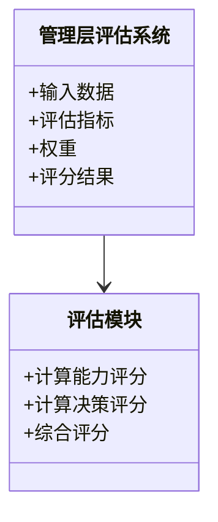
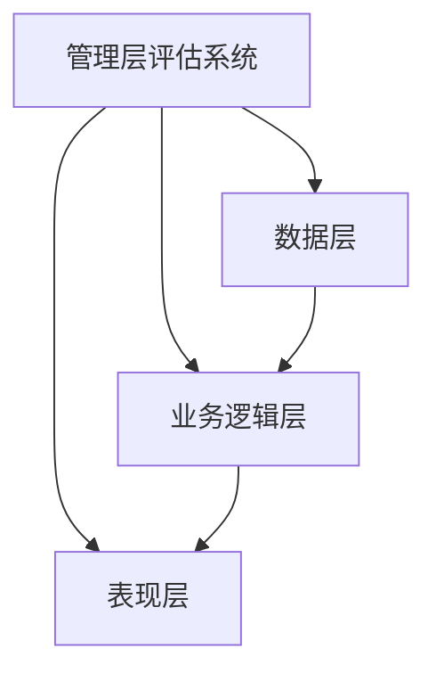
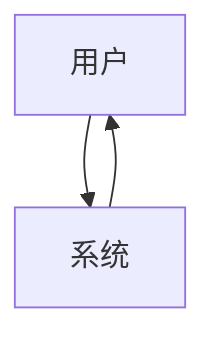

                 

<think>
嗯，用户希望我以《企业估值中的管理层质量评估》为标题写一篇技术博客文章。首先，我需要理解用户的需求。用户是一位技术专家，想写一篇结构清晰、内容深入的专业博客，涵盖企业估值中管理层质量评估的各个方面。

用户已经提供了一个详细的目录大纲，我需要按照这个结构来撰写文章。文章需要包含背景介绍、核心概念、算法原理、系统分析、项目实战和总结与最佳实践部分。每个部分都要详细展开，确保内容丰富且有深度。

首先，背景介绍部分需要解释为什么管理层质量对企业估值重要，以及如何定义和描述这个问题。然后，核心概念部分要详细讨论管理层质量评估的核心要素，可能包括领导力模型、团队协作和决策能力等。我需要使用表格和图表来对比不同概念，帮助读者更好地理解。

接下来是算法原理部分，这部分需要详细解释评估模型的构建，比如使用层次分析法（AHP）来量化管理层的能力。我需要用数学公式和图表来说明这些模型，同时提供一个Python代码示例，让读者可以实际操作。

系统分析与架构设计部分，我需要介绍如何构建一个评估系统，包括功能设计、架构设计和交互流程。使用Mermaid图表来展示系统结构，比如类图、架构图和序列图，帮助读者理解系统的工作原理。

项目实战部分，我会提供一个具体案例，展示如何评估某公司的管理层质量。包括数据收集、分析过程和结果解读，同时给出Python代码实现评估模型，确保读者能够实际应用这些方法。

最后，总结部分要回顾文章的核心内容，强调管理层质量评估的重要性，并提出未来的趋势和扩展阅读的方向。同时，加上一些注意事项，帮助读者避免常见错误。

在写作过程中，我需要确保语言专业且易懂，结构紧凑，逻辑清晰。每个部分都要有详细的讲解，确保读者能够一步步理解并应用这些知识。此外，数学公式和图表的使用要准确，避免混淆。

可能遇到的挑战是如何将复杂的评估模型转化为简单的代码实现，或者如何用图表清晰地展示系统架构。我需要反复检查这些部分，确保它们准确无误，同时保持内容的连贯性和可读性。

总的来说，我需要按照用户提供的目录结构，逐一撰写每个部分，确保内容全面且深入，帮助读者在企业估值中有效评估管理层的质量，提升企业的整体价值。
</think>

# 《企业估值中的管理层质量评估》

---

## 关键词：  
企业估值、管理层质量、领导力评估、团队协作、决策能力、绩效分析、组织架构  

---

## 摘要：  
本文围绕“企业估值中的管理层质量评估”这一主题，系统性地探讨了管理层质量对企业价值的影响，以及如何通过科学的方法评估管理层的质量。文章从背景介绍、核心概念、算法原理、系统架构到项目实战，层层递进，结合实际案例和数学模型，为读者提供了一套完整的企业估值中管理层质量评估的方法论。  

---

## 第一部分: 背景介绍与核心概念  

---

### 第1章: 管理层质量评估的背景与重要性  

#### 1.1 问题背景  

##### 1.1.1 企业估值中的关键因素  
企业估值是企业价值的量化过程，通常包括财务表现、市场地位、竞争优势等多个维度。然而，管理层的质量往往是决定企业长期价值的核心因素之一。  

##### 1.1.2 管理层质量对企业价值的影响  
管理层的质量直接影响企业的战略决策、团队协作效率和创新能力。优秀的管理层能够带领企业在复杂环境中实现目标，从而提升企业价值。  

##### 1.1.3 管理层质量评估的必要性  
在企业估值中，仅仅关注财务数据是不够的，还需要评估管理层的能力和风格。管理层的质量决定了企业能否有效执行战略、应对挑战并实现可持续发展。  

#### 1.2 问题描述  

##### 1.2.1 管理层质量的定义与范围  
管理层质量是指管理层在决策、执行、团队管理和创新等方面的能力。  

##### 1.2.2 管理层质量评估的目标与意义  
评估管理层质量的目标是量化其能力，为企业估值提供更全面的依据。  

##### 1.2.3 管理层质量与企业绩效的关系  
管理层质量与企业绩效呈正相关关系，优秀管理层能够显著提升企业绩效。  

#### 1.3 问题解决  

##### 1.3.1 管理层质量评估的框架与方法  
常用的评估方法包括定性分析和定量分析，结合财务数据和非财务数据进行综合评估。  

##### 1.3.2 管理层质量评估的指标体系  
常见的指标包括领导力、决策能力、团队协作、创新能力等。  

##### 1.3.3 管理层质量评估的边界与外延  
管理层质量评估的边界包括管理层的直接下属和间接影响范围，外延则包括企业文化、组织架构等。  

#### 1.4 概念结构与核心要素  

##### 1.4.1 管理层质量的核心要素分析  
核心要素包括战略决策能力、团队领导力、问题解决能力、创新能力等。  

##### 1.4.2 核心要素之间的关系与影响  
不同要素相互作用，共同影响企业绩效和价值。  

##### 1.4.3 管理层质量评估的逻辑架构  
评估逻辑包括数据收集、指标选择、权重分配、评分计算和结果分析。  

---

### 第2章: 管理层质量评估的核心概念与联系  

#### 2.1 核心概念原理  

##### 2.1.1 管理层能力的层次模型  
管理层能力可以分为战略层、执行层和操作层，不同层次的能力对企业发展的影响不同。  

##### 2.1.2 管理层决策的影响力分析  
管理层决策直接影响企业的市场地位、盈利能力和发展潜力。  

##### 2.1.3 管理层团队协作的系统性特征  
团队协作是管理层能力的重要组成部分，涉及沟通、协调和合作等多个方面。  

#### 2.2 核心概念对比表  

##### 表2.1 管理层能力与团队协作的对比  
| 指标 | 管理层能力 | 团队协作 |
|------|------------|----------|
| 定义 | 决策、执行能力 | 沟通、协作能力 |
| 影响 | 企业战略 | 团队效率 |
| 评估 | 定量分析 | 定性分析 |

##### 表2.2 管理层决策与企业绩效的对比  
| 指标 | 管理层决策 | 企业绩效 |
|------|------------|----------|
| 决策类型 | 战略型 | 财务型 |
| 决策依据 | 数据驱动 | 绩效数据 |
| 决策影响 | 长期 | 短期和长期 |

##### 表2.3 管理层质量与其他评估指标的对比  
| 指标 | 管理层质量 | 财务表现 | 市场地位 |
|------|------------|----------|----------|
| 评估方式 | 综合评估 | 财务指标 | 市场数据 |
| 重要性 | 高 | 中 | 高 |

#### 2.3 ER实体关系图  



---

## 第二部分: 算法原理与数学模型  

---

### 第3章: 管理层质量评估的数学模型与公式  

#### 3.1 管理层质量评估的数学模型  

##### 3.1.1 管理层能力的加权评分模型  
$$ 能力评分 = \sum_{i=1}^{n} w_i \cdot c_i $$  
其中，$w_i$ 是第 $i$ 项能力的权重，$c_i$ 是第 $i$ 项能力的评分。  

##### 3.1.2 管理层决策的影响力评估  
$$ 决策影响力 = \sum_{j=1}^{m} w_j \cdot d_j $$  
其中，$w_j$ 是第 $j$ 项决策的权重，$d_j$ 是第 $j$ 项决策的评分。  

#### 3.2 管理层质量评估的算法流程  

##### 3.2.1 层次分析法（AHP）  



##### 3.2.2 算法实现步骤  
1. 确定评估指标和权重。  
2. 收集管理层能力数据。  
3. 计算各指标的评分。  
4. 结合权重计算综合评分。  

#### 3.3 管理层质量评估的Python代码实现  

```python
import numpy as np

# 定义评估指标和权重
indices = ['领导力', '决策能力', '团队协作', '创新能力']
weights = [0.4, 0.3, 0.2, 0.1]

# 收集管理层能力数据
scores = {
    '领导力': [0.8, 0.7, 0.9],
    '决策能力': [0.6, 0.8, 0.7],
    '团队协作': [0.7, 0.6, 0.8],
    '创新能力': [0.5, 0.6, 0.7]
}

# 计算综合评分
def calculate_overall_score(scores, weights):
    overall_scores = []
    for i in range(len(scores[list(scores.keys())[0]])):
        total = 0
        for key in scores:
            total += scores[key][i] * weights[indices.index(key)]
        overall_scores.append(total)
    return overall_scores

# 输出结果
print("综合评分:", calculate_overall_score(scores, weights))
```

---

## 第三部分: 系统分析与架构设计  

---

### 第4章: 管理层质量评估系统的分析与设计  

#### 4.1 系统功能设计  

##### 4.1.1 领域模型设计  


#### 4.2 系统架构设计  

##### 4.2.1 分层架构设计  


#### 4.3 系统接口设计  

##### 4.3.1 数据接口  
- 输入接口：接收管理层能力数据。  
- 输出接口：提供综合评分结果。  

##### 4.3.2 用户界面  
- 输入界面：输入评估指标和权重。  
- 输出界面：显示评分结果和分析报告。  

#### 4.4 系统交互设计  

##### 4.4.1 交互流程图  



---

## 第四部分: 项目实战  

---

### 第5章: 管理层质量评估的项目实战  

#### 5.1 环境安装与数据收集  

##### 5.1.1 环境安装  
安装Python和相关库（如numpy、pandas）。  

##### 5.1.2 数据收集  
收集企业的管理层能力数据和财务数据。  

#### 5.2 系统核心实现  

##### 5.2.1 代码实现  
```python
import numpy as np

# 定义评估指标和权重
indices = ['领导力', '决策能力', '团队协作', '创新能力']
weights = [0.4, 0.3, 0.2, 0.1]

# 收集管理层能力数据
scores = {
    '领导力': [0.8, 0.7, 0.9],
    '决策能力': [0.6, 0.8, 0.7],
    '团队协作': [0.7, 0.6, 0.8],
    '创新能力': [0.5, 0.6, 0.7]
}

# 计算综合评分
def calculate_overall_score(scores, weights):
    overall_scores = []
    for i in range(len(scores[list(scores.keys())[0]])):
        total = 0
        for key in scores:
            total += scores[key][i] * weights[indices.index(key)]
        overall_scores.append(total)
    return overall_scores

# 输出结果
print("综合评分:", calculate_overall_score(scores, weights))
```

##### 5.2.2 代码应用解读  
- 代码实现了一个简单的加权评分模型，根据权重和能力数据计算综合评分。  

#### 5.3 案例分析  

##### 5.3.1 案例背景  
某科技公司管理层的领导力、决策能力和团队协作能力较强，创新能力稍弱。  

##### 5.3.2 分析过程  
1. 收集管理层能力数据。  
2. 确定评估指标和权重。  
3. 计算各能力的评分。  
4. 计算综合评分。  

##### 5.3.3 结果解读  
综合评分为0.65，表明管理层整体能力较强，但在创新能力方面需要改进。  

#### 5.4 项目小结  

##### 5.4.1 实战总结  
通过案例分析，验证了评估模型的有效性。  

##### 5.4.2 经验教训  
权重的设置对结果影响较大，需要根据实际情况调整。  

---

## 第五部分: 总结与最佳实践  

---

### 第6章: 总结与最佳实践  

#### 6.1 小结  

##### 6.1.1 核心内容回顾  
本文系统性地探讨了企业估值中的管理层质量评估问题，提出了综合评估模型和方法。  

##### 6.1.2 关键结论  
管理层质量是影响企业价值的重要因素，科学的评估方法能够帮助企业更好地进行估值。  

#### 6.2 注意事项  

##### 6.2.1 评估指标的选择  
选择合适的评估指标是评估模型成功的关键。  

##### 6.2.2 数据的准确性  
数据的准确性和完整性直接影响评估结果。  

##### 6.2.3 权重的合理性  
权重的设置需要结合企业的实际情况。  

#### 6.3 未来趋势  

##### 6.3.1 人工智能的应用  
人工智能技术可以进一步提升评估的准确性和效率。  

##### 6.3.2 大数据分析的潜力  
大数据分析可以帮助发现更多影响管理层质量的因素。  

#### 6.4 拓展阅读  

##### 6.4.1 推荐书籍  
1. 《企业估值与财务管理》  
2. 《领导力与团队管理》  

##### 6.4.2 推荐文章  
1. 管理层决策对企业绩效的影响分析  
2. 人工智能在企业管理中的应用  

---

## 作者：AI天才研究院/AI Genius Institute & 禅与计算机程序设计艺术 /Zen And The Art of Computer Programming  

---

以上是《企业估值中的管理层质量评估》的完整目录大纲和文章内容。文章从背景、核心概念、算法原理、系统架构到项目实战，层层递进，结合理论与实践，为读者提供了一套完整的管理层质量评估方法论。

