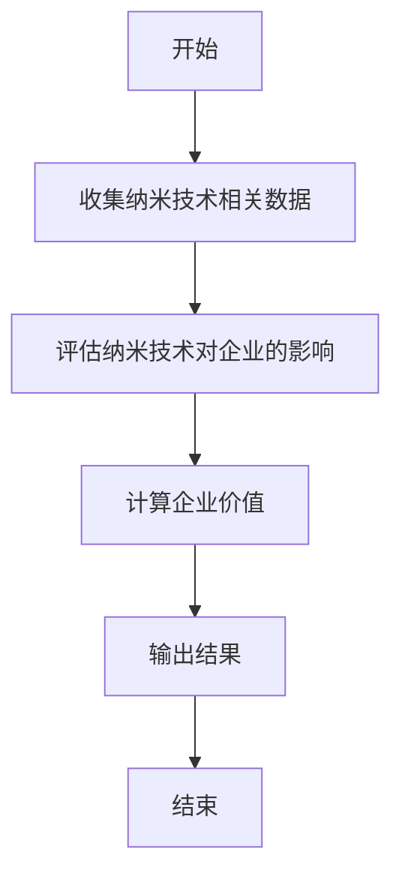

                 


# 企业估值中的纳米技术应用评估

## 关键词：
- 纳米技术
- 企业估值
- 应用评估
- 价值影响
- 技术创新

## 摘要：
本文详细探讨了纳米技术在企业估值中的应用，从纳米技术的基本概念到其对企业价值的具体影响，结合实际案例和数学模型，分析了纳米技术如何通过提升企业竞争力和市场地位，影响企业的估值。文章结构清晰，内容丰富，旨在为投资者、企业管理者和技术人员提供有价值的参考。

---

### 第一部分: 纳米技术与企业估值基础

#### 第1章: 纳米技术与企业估值概述

##### 1.1 纳米技术的基本概念

###### 1.1.1 纳米技术的定义与特点
纳米技术是指在纳米尺度（1-100纳米）上研究和 manipulate 物质的科学技术。其特点包括高比表面积、优异的物理和化学性质、以及在材料科学、医学、能源等领域的重要应用。

###### 1.1.2 纳米技术在企业中的应用领域
- 纳米材料在制造业中的应用，如增强材料的强度和导电性。
- 纳米技术在医疗行业的应用，如纳米药物递送系统。
- 纳米技术在能源行业的应用，如纳米催化剂在燃料电池中的应用。

###### 1.1.3 纳米技术对企业估值的影响
纳米技术的应用可以显著提升企业的技术水平和产品竞争力，进而影响企业的市场价值和估值。

##### 1.2 企业估值的基本方法

###### 1.2.1 企业估值的定义与核心要素
企业估值是对企业整体价值的评估，核心要素包括企业的盈利能力、成长潜力、资产状况和市场地位。

###### 1.2.2 常用企业估值方法概述
- 市盈率法（P/E）
- 市净率法（P/B）
- 现金流折现法（DCF）
- 企业价值倍数（EV/Sales, EV/EBITDA）

###### 1.2.3 纳米技术在企业估值中的应用背景
随着纳米技术的广泛应用，其对企业价值的影响日益显著，尤其是在高科技行业和制造业。

---

#### 第2章: 纳米技术应用的背景与现状

##### 2.1 纳米技术的发展历程

###### 2.1.1 纳米技术的历史演变
从20世纪80年代纳米技术的概念提出，到21世纪初的快速发展，纳米技术已经成为多个行业的重要驱动力。

##### 2.2 纳米技术在企业中的应用现状

###### 2.2.1 纳米材料在制造业中的应用
- 纳米材料的应用可以显著提高产品的性能，如增强材料的强度和导电性。
- 例如，纳米涂层可以提高产品的耐腐蚀性和耐磨性。

###### 2.2.2 纳米技术在医疗行业的应用
- 纳米药物递送系统可以提高药物的靶向性和疗效。
- 纳米传感器在医疗监测中的应用。

###### 2.2.3 纳米技术在能源行业的应用
- 纳米催化剂在燃料电池中的应用，可以提高能量转换效率。
- 纳米材料在太阳能电池中的应用，可以提高光电转换效率。

##### 2.3 纳米技术对企业估值的影响

###### 2.3.1 纳米技术对企业竞争力的影响
- 提高产品的性能和质量，增强市场竞争力。
- 降低生产成本，提高利润率。

###### 2.3.2 纳米技术对市场价值的影响
- 提高企业的市场地位，增强品牌价值。
- 通过技术创新，提高企业的长期盈利能力。

###### 2.3.3 纳米技术对投资决策的影响
- 投资者更倾向于投资拥有纳米技术的企业，因为其具有更高的增长潜力和市场竞争力。

---

#### 第3章: 纳米技术应用的核心概念与联系

##### 3.1 纳米材料的特性与分类

###### 3.1.1 纳米材料的物理特性
- 高比表面积：纳米材料具有较大的表面积，可以提高反应效率。
- 优异的导电性：纳米材料在电子设备中的应用可以提高导电性和热稳定性。

###### 3.1.2 纳米材料的化学特性
- 纳米材料具有独特的化学性质，可以用于制备高性能的化学传感器和催化剂。

###### 3.1.3 纳米材料的分类与应用
- 碳纳米管：用于电子设备和复合材料。
- 石墨烯：用于柔性电子设备和高性能电池。
- 纳米粒子：用于药物递送和催化。

##### 3.2 纳米技术与企业估值的关系

###### 3.2.1 纳米技术对企业价值的提升作用
- 通过技术创新提高产品的附加值。
- 降低生产成本，提高利润率。

###### 3.2.2 纳米技术对企业风险的影响
- 技术研发风险：纳米技术的研发需要大量的资金和时间，失败可能导致企业损失。
- 市场风险：纳米技术的应用可能面临市场接受度和竞争压力。

###### 3.2.3 纳米技术对企业市场地位的影响
- 通过技术创新提高企业的市场竞争力。
- 建立品牌优势，吸引更多的客户和投资者。

##### 3.3 纳米技术应用的ER实体关系图

```mermaid
erDiagram
    customer[客户] {
        <属性>
        id : 整数
        name : 字符串
        email : 字符串
    }
    order[订单] {
        <属性>
        id : 整数
        order_date : 日期
        total : 数值
    }
    product[产品] {
        <属性>
        id : 整数
        name : 字符串
        price : 数值
    }
    customer_order[客户订单] {
        <属性>
        id : 整数
    }
    product_order[产品订单] {
        <属性>
        id : 整数
    }
    customer -|> customer_order : 1..*
    customer -|> product_order : 1..*
    product -|> customer_order : 1..*
    product -|> product_order : 1..*
```

---

#### 第4章: 纳米技术应用的数学模型与算法

##### 4.1 纳米技术应用的数学模型

###### 4.1.1 企业价值计算公式
$$EV = \sum_{t=1}^{n} \frac{CF_t}{(1 + r)^t}$$
其中，EV为企业价值，CF_t为第t年的现金流，r为折现率，n为时间跨度。

##### 4.2 纳米技术应用的算法原理

###### 4.2.1 纳米技术应用的算法流程图



---

#### 第5章: 纳米技术应用的系统分析与架构设计

##### 5.1 问题场景介绍

###### 5.1.1 系统功能需求
- 数据采集：收集纳米技术相关数据。
- 模型构建：建立企业估值模型。
- 结果分析：输出企业估值结果。

##### 5.2 系统架构设计

###### 5.2.1 系统模块划分
- 数据采集模块：负责收集纳米技术相关数据。
- 模型构建模块：建立企业估值模型。
- 结果分析模块：输出企业估值结果。

###### 5.2.2 系统架构图


---

#### 第6章: 项目实战

##### 6.1 环境安装

###### 6.1.1 安装必要的工具和库
- Python编程语言
- NumPy和Pandas库
- Matplotlib库

##### 6.2 系统核心实现源代码

###### 6.2.1 纳米技术应用的代码实现

```python
import numpy as np
import pandas as pd
import matplotlib.pyplot as plt

# 数据收集
data = pd.read_csv('nanotechnology_data.csv')

# 数据处理
data_processed = data.dropna()

# 模型构建
def calculate_ev(cf, r):
    return np.npv(r, cf)

# 计算企业价值
cf = [100, 200, 300, 400]
r = 0.1
ev = calculate_ev(cf, r)

# 结果可视化
plt.plot(range(len(cf)), cf)
plt.xlabel('时间（年）')
plt.ylabel('现金流')
plt.title('企业价值计算结果')
plt.show()
```

##### 6.3 代码应用解读与分析

###### 6.3.1 代码解读
- 数据收集：从CSV文件中读取纳米技术相关数据。
- 数据处理：删除缺失值。
- 模型构建：使用NPV函数计算企业价值。
- 结果可视化：绘制现金流折线图。

##### 6.4 实际案例分析

###### 6.4.1 纳米材料企业价值评估
假设某纳米材料企业的现金流如下：第1年100万元，第2年200万元，第3年300万元，第4年400万元，折现率为10%。

计算企业价值：
$$EV = NPV = \sum_{t=1}^{4} \frac{CF_t}{(1 + 0.1)^t}$$
$$EV = \frac{100}{1.1} + \frac{200}{1.21} + \frac{300}{1.331} + \frac{400}{1.4641} \approx 372.09 \text{万元}$$

---

#### 第7章: 最佳实践与小结

##### 7.1 最佳实践 tips
- 数据来源的可靠性：确保数据的准确性和完整性。
- 模型的适用性：选择合适的模型进行企业估值。
- 风险管理：关注纳米技术应用中的潜在风险。

##### 7.2 小结
纳米技术在企业估值中的应用具有重要意义，可以显著提升企业的市场竞争力和长期价值。通过合理评估纳米技术的影响，企业可以制定更科学的投资决策。

##### 7.3 注意事项
- 纳米技术的应用可能面临技术风险和市场风险。
- 企业估值需要结合实际情况，避免过于依赖模型。

##### 7.4 拓展阅读
- 建议阅读相关领域的最新研究论文和行业报告，以获取更深入的见解。

---

**作者：AI天才研究院/AI Genius Institute & 禅与计算机程序设计艺术 /Zen And The Art of Computer Programming**

