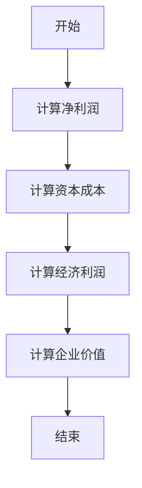
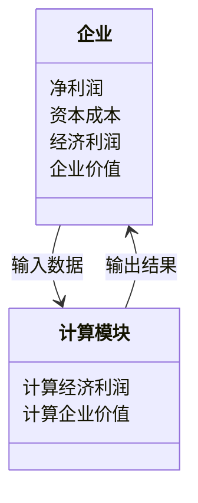
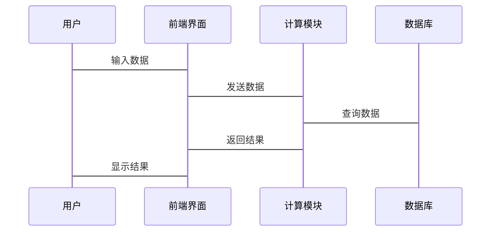

                 


# 企业估值中的经济利润法

> 关键词：企业估值、经济利润法、经济利润、企业价值、估值方法、经济增加值（EVA）

> 摘要：本文系统地探讨了经济利润法在企业估值中的应用，从基础概念到数学模型，从系统设计到项目实战，全面解析了经济利润法的原理、方法及其在实际中的应用。通过详细的数学公式、流程图、类图和序列图，深入分析了经济利润法的实现过程，并通过具体案例展示了其在实际企业估值中的应用。文章最后总结了经济利润法的应用注意事项和未来发展趋势，为读者提供了全面的指导。

---

# 第一部分: 企业估值中的经济利润法基础

## 第1章: 经济利润法的背景与概念

### 1.1 企业估值的基本问题

#### 1.1.1 企业估值的核心挑战
- 企业估值的核心目标：评估企业的内在价值。
- 传统估值方法的局限性：市盈率法、市净率法和现金流折现法的不足。
- 经济利润法的优势：考虑资本成本，更准确反映企业的真实价值。

#### 1.1.2 传统估值方法的局限性
- 市盈率法：仅考虑利润，忽视资本成本。
- 市净率法：仅考虑资产，忽视企业盈利能力。
- 现金流折现法：复杂且难以准确预测未来现金流。

#### 1.1.3 经济利润法的提出背景
- 经济利润法的提出：1986年，费雪·阿尔巴伦提出经济增加值（EVA）。
- 经济利润法的定义：企业扣除所有资本成本后的剩余收益。

### 1.2 经济利润法的定义与特点

#### 1.2.1 经济利润法的定义
- 经济利润法：通过计算企业扣除所有资本成本后的剩余收益来评估企业价值。
- 核心公式：经济利润 = 净利润 - 资本成本。

#### 1.2.2 经济利润法的核心特点
- 全面性：考虑了所有资本成本。
- 简洁性：计算公式简单，易于理解和应用。
- 实用性：适用于不同行业的企业估值。

#### 1.2.3 经济利润法与传统估值方法的区别
- 区别1：经济利润法考虑了资本成本，而传统方法通常忽视资本成本。
- 区别2：经济利润法更注重企业的实际盈利能力，而传统方法可能更注重表面的财务指标。

### 1.3 经济利润法的理论基础

#### 1.3.1 经济利润的计算公式
$$ \text{经济利润} = \text{净利润} - \text{资本成本} $$

#### 1.3.2 经济利润法的经济学依据
- 经济利润法基于资本资产定价模型（CAPM）。
- 企业价值 = ∑ (经济利润_t / (1 + r)^t)

#### 1.3.3 经济利润法的适用范围
- 适用于成熟企业。
- 适用于需要考虑资本成本的企业。

## 1.4 本章小结
- 经济利润法是一种基于资本成本的企业估值方法。
- 与传统方法相比，经济利润法更准确地反映了企业的实际价值。

---

## 第2章: 经济利润法的核心概念与联系

### 2.1 经济利润法的核心要素

#### 2.1.1 经济利润的计算公式
$$ \text{经济利润} = \text{净利润} - \text{资本成本} $$

#### 2.1.2 经济利润法的三要素
- 净利润：企业的净利润。
- 资本成本：企业的资本成本。
- 经济利润：企业的剩余收益。

#### 2.1.3 经济利润法与企业价值的关系
- 企业价值 = ∑ (经济利润_t / (1 + r)^t)

### 2.2 经济利润法与其他估值方法的对比

#### 2.2.1 市盈率法与经济利润法的对比
- 市盈率法：市盈率 = 市场价 / 每股收益。
- 经济利润法：考虑资本成本，更准确反映企业价值。

#### 2.2.2 市净率法与经济利润法的对比
- 市净率法：市净率 = 市场价 / 每股净资产。
- 经济利润法：考虑资本成本，更注重企业的实际盈利能力。

#### 2.2.3 现金流折现法与经济利润法的对比
- 现金流折现法：DCF模型。
- 经济利润法：更简单，计算过程更直观。

### 2.3 经济利润法的ER实体关系图

```mermaid
er
    entity 经济利润法 {
        id
        经济利润
        企业价值
        估值方法
    }
```

### 2.4 本章小结
- 经济利润法与其他估值方法相比，更加注重企业的实际盈利能力。
- 经济利润法通过考虑资本成本，提供了更准确的企业估值。

---

## 第3章: 经济利润法的数学模型与算法原理

### 3.1 经济利润法的数学模型

#### 3.1.1 经济利润的计算公式
$$ \text{经济利润} = \text{净利润} - \text{资本成本} $$

#### 3.1.2 经济利润法的三要素公式
$$ \text{企业价值} = \sum_{t=1}^{n} \frac{\text{经济利润}_t}{(1 + r)^t} $$

### 3.2 经济利润法的算法流程



### 3.3 经济利润法的数学推导

#### 3.3.1 经济利润的计算步骤
1. 计算企业的净利润。
2. 计算企业的资本成本。
3. 计算企业的经济利润。
4. 根据经济利润计算企业价值。

#### 3.3.2 经济利润法的数学推导
- 企业价值公式：
$$ \text{企业价值} = \sum_{t=1}^{n} \frac{\text{经济利润}_t}{(1 + r)^t} $$

#### 3.3.3 举例说明
- 例：某企业净利润为100万元，资本成本为50万元，资本成本率r=10%。
- 经济利润 = 100 - 50 = 50万元。
- 企业价值 = 50 / (1 + 0.1) = 45.45万元。

---

## 第4章: 系统分析与架构设计方案

### 4.1 问题场景介绍
- 企业估值系统的设计与实现。
- 经济利润法在系统中的应用。

### 4.2 系统功能设计

#### 4.2.1 领域模型类图



### 4.3 系统架构设计

#### 4.3.1 系统架构图


### 4.4 系统交互设计

#### 4.4.1 系统交互流程图



---

## 第5章: 项目实战

### 5.1 环境安装与配置

#### 5.1.1 安装Python环境
- 使用Anaconda安装Python 3.8及以上版本。

#### 5.1.2 安装依赖库
- 使用pip安装numpy和pandas。

### 5.2 核心代码实现

#### 5.2.1 经济利润计算模块

```python
def calculate_economic_profit(net_profit, capital_cost):
    return net_profit - capital_cost
```

#### 5.2.2 企业价值计算模块

```python
def calculate_enterprise_value(economic_profit, discount_rate):
    return economic_profit / (1 + discount_rate)
```

### 5.3 实际案例分析

#### 5.3.1 案例背景
- 某企业净利润为100万元，资本成本为50万元，资本成本率r=10%。

#### 5.3.2 计算步骤
1. 计算经济利润：100 - 50 = 50万元。
2. 计算企业价值：50 / 1.1 = 45.45万元。

### 5.4 项目小结
- 经济利润法在实际案例中的应用展示了其简单性和准确性。

---

## 第6章: 总结与最佳实践

### 6.1 本章小结
- 经济利润法是一种有效的企业估值方法，考虑了资本成本，提供了更准确的企业价值评估。

### 6.2 应用注意事项
- 确保输入数据的准确性。
- 合理选择资本成本率。
- 经济利润法适用于成熟企业。

### 6.3 未来发展趋势
- 经济利润法的应用将更加广泛。
- 结合人工智能技术，实现更精准的企业估值。

### 6.4 拓展阅读
- 建议阅读《经济利润法：企业估值的新视角》和《资本资产定价模型》。

---

## 作者：AI天才研究院/AI Genius Institute & 禅与计算机程序设计艺术/Zen And The Art of Computer Programming

