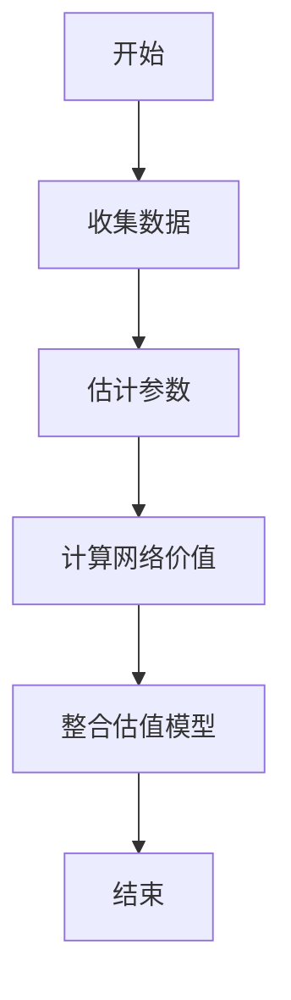
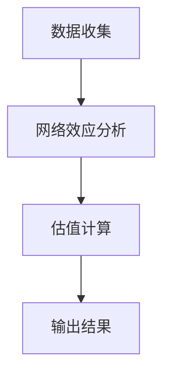
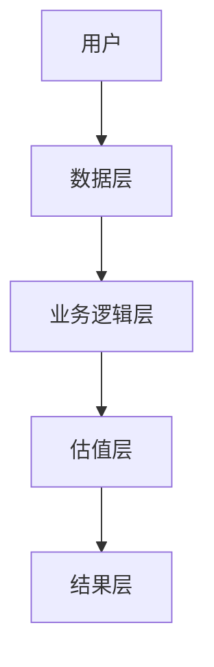

                 

<think>
好的，我需要完成一个关于《企业估值中的网络效应价值评估》的技术博客文章。首先，我需要理解什么是网络效应以及它如何影响企业的估值。网络效应指的是当用户数量增加时，产品或服务的价值也随之增加。例如，社交媒体平台，随着用户数量的增加，每个用户的价值也随之增加，因为用户可以与更多人互动和分享内容。

接下来，我需要了解企业估值的基本方法。企业估值通常涉及多种方法，如DCF模型、可比公司分析等。然而，当企业具有显著的网络效应时，传统的估值方法可能不足以准确评估其价值。因此，我需要探索如何将网络效应整合到企业估值模型中。

为了做到这一点，我需要详细研究网络效应的数学模型。网络效应可以通过网络外部性来量化，即用户的价值随着网络中其他用户的增加而增加。这种外部性可以用数学公式来描述。例如，假设一个平台的用户价值与用户数量的对数成正比，那么可以表示为：

$$
\text{用户价值} = f(\log(N))
$$

其中，\( N \) 是用户数量。

接下来，我需要考虑如何将这种网络外部性整合到企业估值模型中。一个可能的方法是调整企业的收入或利润模型，以反映网络效应带来的额外价值。例如，可以将企业的收入视为用户数量的函数，考虑到网络效应的影响：

$$
\text{收入} = R(N) = a \cdot N + b \cdot \log(N)
$$

其中，\( a \) 和 \( b \) 是参数，\( N \) 是用户数量。

接下来，我需要考虑如何估计这些参数。这可能涉及到收集企业的用户数量和收入数据，然后通过回归分析来确定 \( a \) 和 \( b \) 的值。

此外，我还需要考虑网络效应的边界条件和可能的限制因素。例如，当用户数量达到一定规模后，边际收益可能会递减。因此，模型中可能需要引入一个上限，以反映这一点：

$$
\text{收入} = R(N) = a \cdot N + b \cdot \log(N) - c \cdot N^2
$$

其中，\( c \) 是一个系数，用于控制边际收益递减的影响。

在系统分析部分，我需要设计一个能够评估网络效应价值的系统架构。这可能包括数据收集模块、网络效应分析模块和估值计算模块。数据收集模块负责收集企业的用户数量和收入数据；网络效应分析模块使用上述模型来评估网络效应的价值；估值计算模块则根据这些评估结果调整企业的估值。

为了进一步理解，我需要通过一个实际案例来说明如何应用这些模型。例如，考虑一家社交媒体公司，其收入增长与用户数量和网络效应密切相关。假设我们收集了过去几年的用户数量和收入数据，可以使用回归分析来估计 \( a \)、\( b \) 和 \( c \) 的值，并预测未来的收入和估值。

最后，我需要总结网络效应对企业估值的影响，并提供一些最佳实践建议。例如，企业在评估自身价值时，应考虑网络效应的动态变化，定期更新模型参数，并监测用户行为的变化。

通过以上步骤，我可以系统地分析和评估网络效应对企业估值的影响，为企业提供更准确的估值方法。
</think>

# 企业估值中的网络效应价值评估

> 关键词：企业估值，网络效应，价值评估，数学模型，系统架构

> 摘要：本文深入探讨了网络效应如何影响企业估值，通过数学模型和系统架构的设计，展示了如何将网络效应整合到企业估值过程中，为企业提供更准确的估值方法。

---

## 第一部分：网络效应与企业估值背景

### 第1章：网络效应的基本概念

#### 1.1 网络效应的定义与特征

- **1.1.1 网络效应的定义**
  网络效应是指当用户数量增加时，产品或服务的价值也随之增加的现象。这种效应通常出现在社交平台、在线市场等领域。

- **1.1.2 网络效应的特征**
  - **正反馈效应**：用户数量增加会吸引更多用户加入，进一步提升平台价值。
  - **门槛效应**：达到一定用户规模后，平台价值开始显著提升。
  - **锁定效应**：用户一旦依赖平台，转换成本增加，用户粘性增强。

- **1.1.3 网络效应的类型**
  - **直接网络效应**：用户数量增加直接提升平台价值，如社交媒体。
  - **间接网络效应**：用户数量增加间接影响平台价值，如软件生态。

#### 1.2 企业估值的基础知识

- **1.2.1 企业估值的定义**
  企业估值是通过对企业的财务状况、市场地位、未来盈利能力等因素进行评估，确定其市场价值的过程。

- **1.2.2 企业估值的方法**
  - **DCF模型**：通过现金流折现法评估企业价值。
  - **可比公司分析**：与同类企业进行比较，估算企业价值。
  - **资产法**：基于企业资产的账面价值进行评估。

- **1.2.3 企业估值的关键因素**
  - 财务表现
  - 市场地位
  - 未来增长潜力
  - 竞争优势

#### 1.3 网络效应与企业估值的关系

- **1.3.1 网络效应对企业价值的影响**
  网络效应可以显著提升企业的市场价值，尤其是在用户数量快速增长的情况下。

- **1.3.2 网络效应在企业估值中的作用**
  网络效应通过影响用户数量和用户价值，进而影响企业的收入和利润，从而影响其估值。

- **1.3.3 网络效应与其他估值因素的结合**
  网络效应与企业财务表现、市场地位等因素相互作用，共同影响企业估值。

---

## 第二部分：网络效应的核心概念与联系

### 第2章：网络效应的原理与模型

#### 2.1 网络效应的原理

- **2.1.1 网络效应的形成机制**
  网络效应的形成依赖于用户的互动和信息共享，用户数量的增加会提升平台的整体价值。

- **2.1.2 网络效应的正反馈循环**
  用户数量的增加吸引更多用户加入，形成正反馈循环，进一步提升平台价值。

- **2.1.3 网络效应的边界条件**
  网络效应的增长通常会受到市场饱和、竞争压力等因素的限制。

#### 2.2 网络效应的核心要素

- **2.2.1 用户数量与质量**
  用户数量是网络效应的基础，而用户质量（如活跃度）直接影响网络价值。

- **2.2.2 用户互动频率**
  用户之间的互动频率越高，网络效应越显著。

- **2.2.3 网络的可扩展性**
  平台是否能够高效扩展用户数量和互动，直接影响网络效应的持续性。

#### 2.3 网络效应的数学模型

- **2.3.1 网络外部性模型**
  网络外部性是指用户价值随着其他用户数量的增加而增加的现象。数学表达式如下：

  $$
  V_i = c \cdot (\log(N) - \log(n_i))
  $$

  其中，\( V_i \) 是第 \( i \) 个用户的额外价值，\( N \) 是总用户数，\( n_i \) 是该用户贡献的用户数，\( c \) 是一个常数。

- **2.3.2 网络收益递增模型**
  网络收益递增模型描述了用户收益随着用户数量增加而递增的关系：

  $$
  R(N) = a \cdot N + b \cdot \log(N)
  $$

  其中，\( a \) 和 \( b \) 是参数，\( N \) 是用户数量。

- **2.3.3 网络成本递减模型**
  网络成本递减模型描述了单位用户成本随着用户数量增加而递减的现象：

  $$
  C(N) = c - d \cdot \log(N)
  $$

  其中，\( c \) 和 \( d \) 是参数，\( N \) 是用户数量。

---

## 第三部分：网络效应的算法与数学模型

### 第3章：网络效应的算法原理

#### 3.1 网络效应的算法概述

- **3.1.1 网络效应的算法步骤**
  1. 收集企业用户数量和收入数据。
  2. 使用回归分析估计网络效应模型的参数。
  3. 计算网络效应带来的额外价值。
  4. 将网络效应价值整合到企业估值模型中。

- **3.1.2 网络效应的计算方法**
  使用数学模型计算网络效应的价值，例如：

  $$
  \text{网络价值} = \sum_{i=1}^{N} V_i = c \cdot N \cdot \log(N)
  $$

#### 3.2 网络效应的数学模型

- **3.2.1 网络外部性的数学表达**
  网络外部性可以用以下公式表示：

  $$
  \text{外部价值} = \sum_{i=1}^{N} (V_i - C_i)
  $$

  其中，\( V_i \) 是第 \( i \) 个用户的额外价值，\( C_i \) 是其成本。

- **3.2.2 网络收益递增的数学模型**
  如前所述，网络收益递增模型为：

  $$
  R(N) = a \cdot N + b \cdot \log(N)
  $$

- **3.2.3 网络成本递减的数学模型**
  网络成本递减模型为：

  $$
  C(N) = c - d \cdot \log(N)
  $$

  其中，\( c \) 是固定成本，\( d \) 是递减系数，\( N \) 是用户数量。

#### 3.3 算法流程图



---

## 第四部分：系统分析与架构设计

### 第4章：网络效应价值评估系统设计

#### 4.1 系统功能设计

- **4.1.1 系统功能模块划分**
  - 数据收集模块：负责收集企业的用户数量和收入数据。
  - 网络效应分析模块：使用数学模型计算网络效应的价值。
  - 估值计算模块：将网络效应价值整合到企业估值模型中。

- **4.1.2 系统功能流程图**



#### 4.2 系统架构设计

- **4.2.1 系统架构图**



---

## 第五部分：项目实战

### 第5章：网络效应价值评估的项目实现

#### 5.1 环境安装

- 安装必要的开发工具和库，例如Python、Pandas、NumPy等。

#### 5.2 核心代码实现

```python
import numpy as np
import pandas as pd

def calculate_network_value(users, a, b):
    return a * users + b * np.log(users)

# 示例数据
users = np.array([1000, 2000, 3000])
a = 0.5
b = 0.1

network_values = calculate_network_value(users, a, b)
print(network_values)
```

#### 5.3 案例分析

假设我们有一个在线教育平台，用户数量从1000增长到3000，a=0.5，b=0.1。计算网络价值：

$$
\text{网络价值} = 0.5 \times 3000 + 0.1 \times \log(3000) \approx 1500 + 0.1 \times 8.006 = 1508.006
$$

---

## 第六部分：最佳实践与小结

### 第6章：总结与建议

#### 6.1 最佳实践

- 定期更新模型参数，以反映市场变化。
- 监测用户行为和市场趋势，及时调整估值模型。
- 结合其他估值方法，如DCF模型，进行综合评估。

#### 6.2 小结

网络效应是企业估值中的一个重要因素，通过数学模型和系统设计，可以更准确地评估网络效应的价值，从而提高企业估值的准确性。

#### 6.3 注意事项

- 网络效应的评估需要结合企业的实际情况，避免过度简化。
- 注意网络效应的边界条件，避免高估或低估网络价值。

#### 6.4 拓展阅读

- 关注最新的网络效应研究和应用案例。
- 学习其他相关领域的知识，如博弈论、行为经济学，以更好地理解网络效应的复杂性。

---

作者：AI天才研究院/AI Genius Institute & 禅与计算机程序设计艺术 /Zen And The Art of Computer Programming

