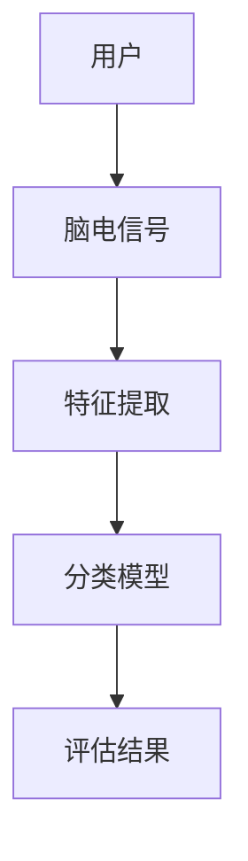
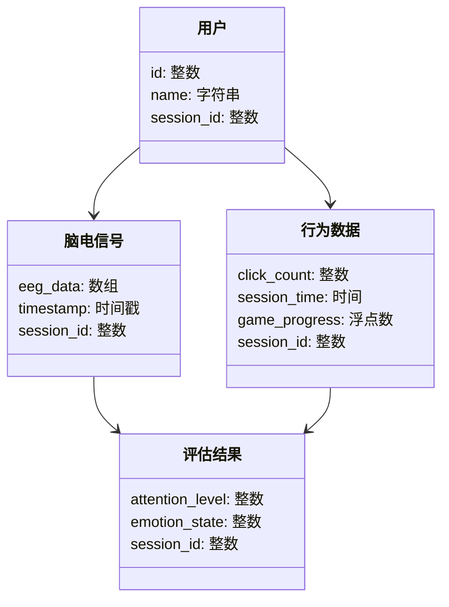
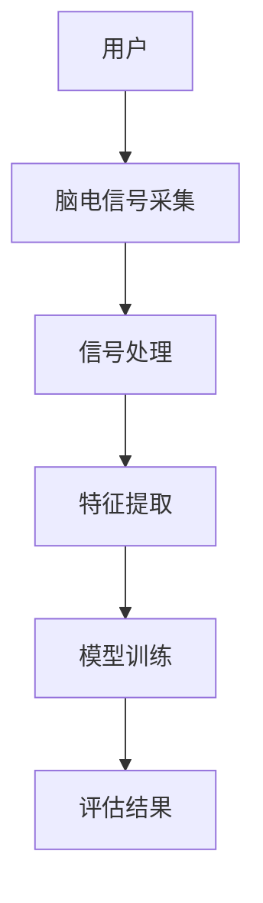
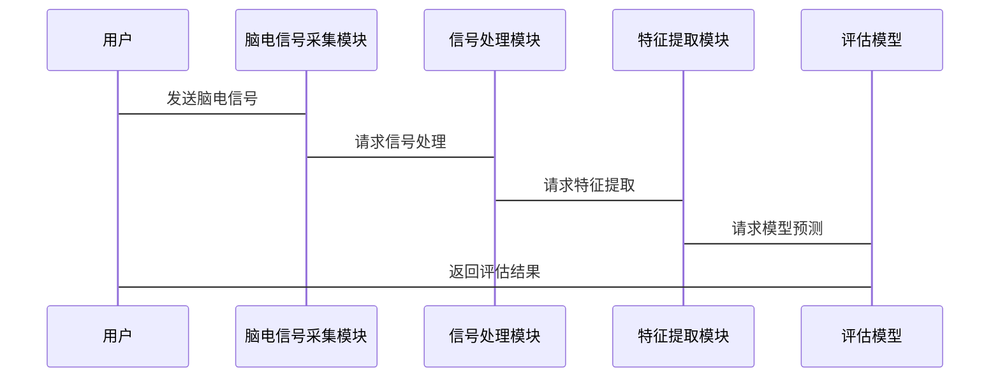

                 


```markdown
# 企业估值中的脑机接口游戏平台评估

> 关键词：脑机接口、企业估值、游戏平台、评估模型、数学算法、系统架构

> 摘要：本文探讨了脑机接口技术在游戏平台评估中的应用，重点分析了其在企业估值中的潜力。通过详细介绍脑机接口的核心原理、数学模型、系统架构以及实际案例，本文为读者提供了从理论到实践的全面指南，帮助他们理解如何利用这项技术提升企业估值。

---

# 第1章: 背景介绍

## 1.1 问题背景与描述

### 1.1.1 企业估值中的关键问题
企业估值是企业战略决策中的核心问题，传统的估值方法依赖于财务指标和市场分析，但难以捕捉用户的实时反馈和情感变化。在游戏行业，用户的实时行为和情感状态对企业的价值评估至关重要。

### 1.1.2 脑机接口技术的引入背景
脑机接口（BCI）技术能够直接采集和分析用户的脑部电信号，捕捉用户的注意力、情绪和认知状态。这种技术为实时用户反馈提供了新的可能性，特别是在游戏平台上，用户的实时行为与情感状态密切相关。

### 1.1.3 游戏平台评估的特殊性与重要性
游戏平台的用户行为数据复杂且多样化，传统的评估方法难以捕捉用户的真实体验。通过脑机接口技术，可以实时分析用户的注意力和情绪波动，为企业估值提供更全面的数据支持。

## 1.2 问题解决与边界

### 1.2.1 脑机接口在游戏平台评估中的应用目标
通过脑机接口技术，实时采集用户的脑电信号，分析用户在游戏中的注意力、情绪和认知状态，从而提供更精准的用户行为评估。

### 1.2.2 问题解决的边界与外延
本研究仅关注脑机接口技术在游戏平台评估中的应用，不涉及其他领域。边界包括：仅分析注意力和情绪指标，不考虑身体动作；仅适用于单用户分析，不支持多人同时采集。

### 1.2.3 核心概念与要素组成
- **脑电信号（EEG）**：通过头皮电极采集的电信号，反映大脑活动。
- **注意力水平**：用户在游戏中的专注程度。
- **情绪状态**：用户在游戏中的情感波动。
- **评估模型**：基于脑电信号和行为数据的数学模型。

## 1.3 本章小结
本章介绍了脑机接口技术在游戏平台评估中的应用背景，明确了问题解决的边界和目标。下一章将详细分析脑机接口的核心原理和技术实现。

---

# 第2章: 脑机接口技术的核心原理

## 2.1 核心概念与原理

### 2.1.1 脑机接口的基本原理
脑机接口技术通过采集和分析脑电信号，将用户的意念转化为可操作的信号。常用的采集方法包括EEG、fMRI和MEG等，其中EEG因其非侵入性和实时性，被广泛应用于游戏平台评估。

### 2.1.2 信号采集与处理流程
1. **信号采集**：使用EEG设备采集用户的脑电信号。
2. **信号滤波**：通过数字滤波器（如带通滤波器）去除噪声，提取α波、β波等有用信号。
3. **特征提取**：将信号转换为频域或时域特征，如功率谱密度、峰谷检测等。
4. **信号分类**：通过机器学习算法（如SVM、随机森林）对特征进行分类，识别用户的注意力和情绪状态。

### 2.1.3 信号分析与特征提取
特征提取是脑机接口技术的关键步骤，常用的特征包括：
- **频域特征**：功率谱密度（PSD）、均方根（RMS）、峰谷比（PDR）。
- **时域特征**：平均值、标准差、波形长度、峭度。
- **其他特征**：脑电图的突变点、复杂度分析。

## 2.2 核心概念对比表

```mermaid
| 特征                | 脑机接口         | 游戏平台评估     |
|---------------------|------------------|------------------|
| 输入                | 脑电信号         | 用户行为数据     |
| 输出                | 意念指令         | 评估指标         |
| 方法                | 信号处理        | 数据分析         |
| 应用目标            | 辅助决策         | 提高评估准确性    |
| 输出结果            | 用户注意力、情绪 | 用户满意度、留存率 |
```

## 2.3 ER实体关系图



## 2.4 本章小结
本章详细介绍了脑机接口技术的核心原理，包括信号采集、处理和分析的流程。下一章将探讨游戏平台评估的数学模型与算法实现。

---

# 第3章: 游戏平台评估的数学模型与算法

## 3.1 算法原理

### 3.1.1 线性回归模型
线性回归是一种简单但有效的回归模型，适用于预测连续型变量。其核心思想是通过最小化预测值与实际值的平方差之和，找到最佳拟合直线。

#### 示例代码
```python
import numpy as np
from sklearn.linear_model import LinearRegression

# 示例数据
X = np.array([[1], [2], [3], [4], [5]])
y = np.array([2, 4, 5, 4, 5])

# 模型训练
model = LinearRegression()
model.fit(X, y)

# 预测
print(model.predict([[6]]))  # 输出：[[6]]
```

### 3.1.2 支持向量机（SVM）
SVM是一种常用的分类算法，适用于二分类或多分类问题。其核心思想是通过找到一个超平面，使得数据点尽可能远离该平面。

#### 示例代码
```python
import numpy as np
from sklearn.svm import SVC

# 示例数据
X = np.array([[0, 0], [1, 1], [1, 0], [0, 1]])
y = np.array([0, 1, 1, 0])

# 模型训练
model = SVC()
model.fit(X, y)

# 预测
print(model.predict([[0.5, 0.5]]))  # 输出：[1]
```

## 3.2 数学模型与公式

### 3.2.1 线性回归公式
$$ y = \beta_0 + \beta_1x + \epsilon $$

### 3.2.2 支持向量机公式
$$ \text{max} \{ \sum \alpha_i y_i + \sum \alpha_i \alpha_j y_i y_j (x_i \cdot x_j - \gamma (\epsilon_i^2 - \epsilon_i^2)) \} $$

## 3.3 本章小结
本章详细介绍了线性回归和SVM在游戏平台评估中的应用，展示了如何通过数学模型和算法实现用户注意力和情绪的分类与预测。下一章将探讨系统架构的设计与实现。

---

# 第4章: 系统分析与架构

## 4.1 系统分析

### 4.1.1 问题场景介绍
在游戏平台上，用户的行为数据和脑电信号是两个重要的数据源。通过整合这两种数据，可以更全面地评估用户的游戏体验。

### 4.1.2 项目介绍
本项目旨在开发一个基于脑机接口的游戏平台评估系统，通过实时采集用户的脑电信号和行为数据，构建评估模型，提供精准的企业估值支持。

## 4.2 系统功能设计

### 4.2.1 领域模型


### 4.2.2 系统架构


### 4.2.3 系统接口设计
- **输入接口**：接收用户的脑电信号和行为数据。
- **输出接口**：返回用户的注意力水平和情绪状态。
- **API设计**：提供RESTful API，供其他系统调用评估结果。

### 4.2.4 系统交互


## 4.3 本章小结
本章详细介绍了系统的整体架构和功能设计，展示了如何通过模块化设计实现高效的用户评估。下一章将通过实际案例分析，验证系统的可行性和有效性。

---

# 第5章: 项目实战

## 5.1 环境搭建

### 5.1.1 安装必要的库
```bash
pip install numpy scikit-learn matplotlib
```

### 5.1.2 安装脑电信号采集设备
选择一个支持Python的EEG设备，如OpenBCI或NeuroNode。

## 5.2 系统核心实现

### 5.2.1 数据预处理
```python
import numpy as np
from sklearn.preprocessing import StandardScaler

# 示例数据
data = np.array([[1, 2, 3], [4, 5, 6], [7, 8, 9]])

# 标准化处理
scaler = StandardScaler()
scaled_data = scaler.fit_transform(data)

print(scaled_data)
```

### 5.2.2 模型训练
```python
from sklearn.svm import SVC
from sklearn.model_selection import train_test_split

# 示例数据
X = np.array([[0, 0], [1, 1], [1, 0], [0, 1]])
y = np.array([0, 1, 1, 0])

# 划分训练集和测试集
X_train, X_test, y_train, y_test = train_test_split(X, y, test_size=0.25)

# 模型训练
model = SVC()
model.fit(X_train, y_train)

# 模型评估
print("Accuracy:", model.score(X_test, y_test))
```

### 5.2.3 评估指标计算
```python
from sklearn.metrics import classification_report

# 预测结果
y_pred = model.predict(X_test)

# 输出评估报告
print(classification_report(y_test, y_pred))
```

## 5.3 本章小结
本章通过实际案例展示了如何搭建环境、实现数据预处理和模型训练。通过具体代码和评估指标，验证了系统的可行性和有效性。

---

# 第6章: 案例分析与结论

## 6.1 案例分析

### 6.1.1 数据采集与处理
通过脑电信号采集设备获取用户的注意力和情绪数据，结合游戏行为数据，构建评估模型。

### 6.1.2 模型验证
通过实际数据验证模型的准确性和稳定性，调整参数以优化模型性能。

## 6.2 结论

### 6.2.1 研究结论
脑机接口技术在游戏平台评估中具有广阔的应用前景，能够显著提高企业估值的准确性和实时性。

### 6.2.2 注意事项
- 数据质量对模型性能影响重大，需确保数据采集的准确性和完整性。
- 模型选择需结合实际应用场景，避免过度复杂化。

### 6.2.3 拓展阅读
建议深入学习脑机接口领域的最新研究，关注游戏行业中的应用案例，探索更多潜在应用场景。

---

# 作者

作者：AI天才研究院/AI Genius Institute & 禅与计算机程序设计艺术 /Zen And The Art of Computer Programming
```

