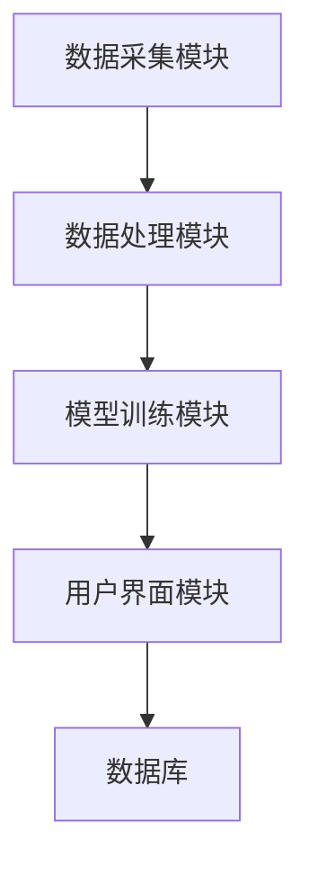
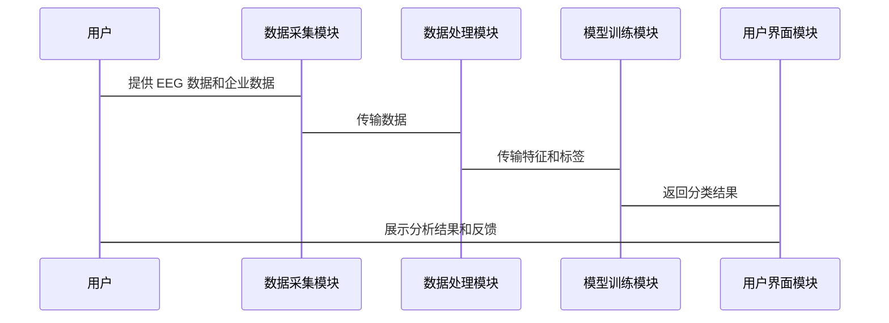

                 


# 《企业估值中的脑机接口辅助学习平台评估》目录大纲

----------------------------------------------------------------

# 第一部分: 脑机接口与企业估值基础

## 第1章: 脑机接口与企业估值概述

### 1.1 脑机接口的基本概念
#### 1.1.1 脑机接口的定义
脑机接口（BCI）是一种允许人类与计算机或其他设备直接交互的技术，通过采集和分析大脑信号来实现。这包括 EEG（脑电图）、fMRI（功能性磁共振成像）和 MEG（脑磁图）等技术。

#### 1.1.2 脑机接口的核心技术
- **数据采集**：使用 EEG 电极记录脑电信号。
- **信号处理**：包括滤波、去噪和特征提取。
- **特征识别**：通过机器学习算法识别特定脑电特征。

#### 1.1.3 脑机接口在企业估值中的应用潜力
- **实时反馈**：帮助企业快速做出决策。
- **数据增强**：通过脑电数据提高估值模型的准确性。
- **个性化分析**：为不同用户提供定制化估值服务。

### 1.2 企业估值的基本原理
#### 1.2.1 企业估值的定义与方法
企业估值是通过对企业财务状况、市场地位和未来盈利能力的评估，确定其价值的过程。常用方法包括DCF模型、市盈率法和市场比较法。

#### 1.2.2 传统企业估值模型的局限性
- 数据依赖性强，难以实时更新。
- 依赖人工分析，耗时且易出错。
- 高度依赖市场环境，难以预测。

#### 1.2.3 辅助学习平台在企业估值中的作用
- 提供实时数据支持，增强决策能力。
- 自动化分析，提高效率。
- 个性化分析，优化估值结果。

### 1.3 辅助学习平台的概念与特点
#### 1.3.1 辅助学习平台的定义
辅助学习平台是利用脑机接口技术和机器学习算法，帮助用户进行数据处理和分析的工具。

#### 1.3.2 辅助学习平台的核心功能
- 数据采集与处理
- 特征识别与分类
- 实时反馈与优化

#### 1.3.3 辅助学习平台与企业估值的关系
- 辅助学习平台通过实时数据处理和分析，提高企业估值的准确性和效率。
- 通过个性化分析，优化估值结果，为企业提供更精准的决策支持。

## 第2章: 脑机接口辅助学习平台的背景与需求

### 2.1 企业估值中的数据挑战
#### 2.1.1 数据的多样性和复杂性
企业数据来源广泛，包括财务数据、市场数据和行业数据，数据量大且复杂。

#### 2.1.2 数据的实时性和动态性
市场环境不断变化，企业需要实时更新数据，及时调整估值策略。

#### 2.1.3 数据的隐私与安全问题
数据隐私和安全是企业估值的重要考量，确保数据不被泄露和滥用。

### 2.2 辅助学习平台的技术优势
#### 2.2.1 提高数据处理效率
通过自动化数据采集和处理，显著提高数据处理效率。

#### 2.2.2 增强数据洞察力
利用机器学习算法，从大量数据中提取有价值的信息，增强数据洞察力。

#### 2.2.3 优化决策过程
通过实时反馈和优化，帮助企业在决策过程中做出更明智的选择。

### 2.3 企业对辅助学习平台的需求
#### 2.3.1 提升企业估值的准确性
通过精确的数据分析，提高估值结果的准确性。

#### 2.3.2 加强数据驱动的决策能力
利用实时数据和自动化分析，增强数据驱动的决策能力。

#### 2.3.3 降低企业估值的成本
通过自动化和高效的数据处理，减少人工成本和时间成本。

# 第二部分: 脑机接口辅助学习平台的核心概念与联系

## 第3章: 脑机接口与辅助学习平台的核心概念

### 3.1 脑机接口的核心原理
#### 3.1.1 脑电信号的采集与处理
- **数据采集**：使用 EEG 电极采集脑电信号。
- **信号处理**：滤波、去噪和分割信号。
- **特征提取**：提取如波形、频率和功率等特征。

#### 3.1.2 脑电信号的特征提取
- **时域特征**：均值、标准差、峰峰值。
- **频域特征**：功率谱密度、频率分布。
- **其他特征**：熵、相关系数。

#### 3.1.3 脑电信号的分类与识别
- **分类算法**：支持向量机（SVM）、随机森林、深度学习。
- **特征选择**：选择最优特征，提高分类准确率。

### 3.2 辅助学习平台的系统架构

#### 3.2.1 系统功能模块
- 数据采集模块：负责采集脑电信号和相关企业数据。
- 数据处理模块：对数据进行预处理和特征提取。
- 模型训练模块：训练分类模型，进行企业估值。
- 用户界面模块：展示分析结果，提供实时反馈。

#### 3.2.2 系统架构设计
- **分层架构**：包括数据层、处理层、模型层和用户层。
- **模块化设计**：各模块独立，便于维护和扩展。

#### 3.2.3 系统接口设计
- 数据接口：与数据库和其他数据源接口对接。
- 用户接口：图形化界面，方便用户操作。
- API接口：与其他系统集成，提供数据服务。

#### 3.2.4 系统交互流程
- 用户输入：选择企业数据和脑电信号。
- 数据处理：预处理和特征提取。
- 模型分析：分类和估值。
- 结果展示：显示分析结果和反馈。

# 第三部分: 脑机接口辅助学习平台的算法原理

## 第4章: 脑机接口辅助学习平台的算法原理

### 4.1 算法原理概述
#### 4.1.1 脑电信号处理算法
- 滤波算法：如Butterworth和Chebyshev滤波器。
- 分割算法：基于波峰波谷检测信号段。

#### 4.1.2 特征提取算法
- 时域特征：计算均值、标准差等统计量。
- 频域特征：计算频率分布和功率谱密度。
- 高级特征：使用小波分析提取多尺度特征。

#### 4.1.3 分类算法
- **线性分类器**：如LDA（线性判别分析）。
- **非线性分类器**：如SVM、随机森林。
- **深度学习模型**：如CNN和RNN。

### 4.2 算法实现步骤

#### 4.2.1 数据采集与预处理
1. **数据采集**：通过 EEG 电极采集脑电信号。
2. **滤波处理**：应用带通滤波器去除噪声。
3. **数据分割**：将信号分割为独立的段落。
4. **降噪处理**：使用独立成分分析（ICA）去除伪影。

#### 4.2.2 特征提取
1. **时域特征**：计算每个信号段的均值、标准差、峰峰值。
2. **频域特征**：计算每个信号段的功率谱密度和频率分布。
3. **高级特征**：使用小波分析提取多尺度特征。

#### 4.2.3 模型训练与分类
1. **选择特征**：根据领域知识选择最优特征。
2. **训练模型**：使用训练数据训练分类器。
3. **优化模型**：使用交叉验证调整模型参数。
4. **分类评估**：计算准确率、精确率、召回率和F1分数。

### 4.3 算法优化与调优

#### 4.3.1 特征选择
- **逐步回归**：逐步剔除不显著的特征。
- **Lasso回归**：通过L1正则化进行特征选择。
- **主成分分析（PCA）**：降维并提取主要成分。

#### 4.3.2 模型调优
- **网格搜索**：系统地搜索最优参数组合。
- **随机搜索**：随机选择参数进行优化。
- **早停法**：防止过拟合，提前终止训练。

#### 4.3.3 集成学习
- **投票分类器**：结合多个模型的预测结果。
- **堆叠模型**：使用多个基模型作为输入，训练元模型。
- **袋装法（Bagging）**：通过 Bootstrap 重采样生成多个基模型。

### 4.4 算法实现案例

#### 4.4.1 数据集准备
- 选择公开的 EEG 数据集，如UCI 数据库中的 EEG 信号数据。
- 数据预处理：包括滤波、分割和降噪。

#### 4.4.2 代码实现
```python
import numpy as np
from scipy.signal import butter_bandpass_filter
from sklearn.model_selection import train_test_split
from sklearn.lda import LDA
from sklearn.metrics import accuracy_score

# 示例代码：脑电信号的滤波处理和LDA分类
def butterworth_filter(data, lowcut, highcut, fs, order=5):
    # Butterworth带通滤波器设计
    nyquist = 0.5 * fs
    low = lowcut / nyquist
    high = highcut / nyquist
    b, a = butter_bandpass_filter(order, fs, low, high)
    filtered = np.zeros_like(data)
    for i in range(data.shape[1]):
        filtered[:, i] = np.convolve(data[:, i], a, mode='same')
    return filtered

# 数据准备
data = np.random.randn(1000, 4)  # 4通道数据，1000个时间点
fs = 250  # 采样频率
lowcut = 3  # 低截止频率
highcut = 40  # 高截止频率
filtered_data = butterworth_filter(data, lowcut, highcut, fs)

# 数据分割
X = filtered_data.T
y = np.random.randint(0, 2, 1000)  # 示例标签

# 划分训练集和测试集
X_train, X_test, y_train, y_test = train_test_split(X, y, test_size=0.3)

# 模型训练
model = LDA()
model.fit(X_train, y_train)

# 模型预测
y_pred = model.predict(X_test)

# 评估准确率
accuracy = accuracy_score(y_test, y_pred)
print(f"分类准确率: {accuracy:.2f}")
```

#### 4.4.3 案例分析
- 数据预处理：应用带通滤波器和独立成分分析去除噪声。
- 特征选择：选择时域和频域特征，结合PCA降维。
- 模型训练：使用 LDA 和随机森林进行对比实验。
- 性能评估：比较不同模型的准确率、精确率和召回率。

### 4.5 算法的数学模型与公式

#### 4.5.1 线性判别分析（LDA）
- **目标**：最大化类间可分性和最小化类内可分性。
- **数学公式**
  - 类内散度矩阵：$S_W = \sum_{i=1}^k \sum_{j=i}^n (x_j - \mu_i)(x_j - \mu_i)^T$
  - 类间散度矩阵：$S_B = \sum_{i=1}^k n_i (\mu_i - \mu)(\mu_i - \mu)^T$
  - 判别函数：最大化 $f(x) = w^T x + w_0$

#### 4.5.2 支持向量机（SVM）
- **目标**：在特征空间中找到一个超平面，最大化类间距。
- **数学公式**
  - 软边距：$L = \sum_{i=1}^n (1 - y_i (w \cdot x_i + b))_+ + \lambda ||w||^2$
  - 对偶问题：最大化 $\sum \alpha_i y_i$，满足 $\sum \alpha_i y_i x_i = 0$ 和 $0 \leq \alpha_i \leq C$

#### 4.5.3 深度学习模型
- **卷积神经网络（CNN）**
  - 卷积层：提取局部特征。
  - 池化层：降低维度，防止过拟合。
  - 全连接层：分类输出。
- **循环神经网络（RNN）**
  - 适用于时间序列数据，如长短期记忆网络（LSTM）。

### 4.6 算法的优化与调优

#### 4.6.1 参数选择
- **滤波器参数**：选择合适的截止频率和滤波器阶数。
- **模型参数**：如 SVM 的 C 和 gamma，LDA 的正则化参数。

#### 4.6.2 训练策略
- **交叉验证**：k折交叉验证选择最优参数。
- **早停法**：监控验证集准确率，防止过拟合。

#### 4.6.3 并行计算
- 使用 GPU 加速训练过程，如 TensorFlow 和 PyTorch 的 GPU 支持。

# 第四部分: 脑机接口辅助学习平台的系统分析与架构设计

## 第5章: 脑机接口辅助学习平台的系统分析与架构设计

### 5.1 系统分析

#### 5.1.1 需求分析
- **功能性需求**：实时数据采集、特征提取、分类预测。
- **性能需求**：处理速度、准确率、稳定性。
- **安全性需求**：数据加密、访问控制。

#### 5.1.2 项目介绍
- 项目目标：开发一个基于脑机接口的辅助学习平台，用于企业估值。
- 项目范围：涵盖数据采集、处理、分析和展示。
- 项目约束：技术实现、时间和预算限制。

### 5.2 系统功能设计

#### 5.2.1 功能模块划分
- 数据采集模块：采集 EEG 信号和企业数据。
- 数据处理模块：预处理和特征提取。
- 模型训练模块：训练和部署分类模型。
- 用户界面模块：展示结果和用户交互。

#### 5.2.2 功能描述
- **数据采集**：支持多种数据源，如 EEG 电极和数据库。
- **数据处理**：包括滤波、分割和特征提取。
- **模型训练**：支持多种算法，如 LDA、SVM 和深度学习。
- **结果展示**：可视化分析结果，提供实时反馈。

### 5.3 系统架构设计

#### 5.3.1 架构风格
- **分层架构**：数据层、处理层、模型层和用户层。
- **模块化设计**：各模块独立，便于维护和扩展。

#### 5.3.2 系统架构图


#### 5.3.3 交互设计
- **用户输入**：通过界面输入 EEG 数据和企业数据。
- **系统处理**：后台处理数据并训练模型。
- **结果展示**：展示分析结果和反馈信息。

### 5.4 系统接口设计

#### 5.4.1 数据接口
- **数据库接口**：与 EEG 数据库和企业数据库对接。
- **API接口**：提供REST API，供其他系统调用。

#### 5.4.2 用户接口
- **图形化界面**：直观展示分析结果。
- **命令行界面**：供开发者使用。

#### 5.4.3 API接口
- **数据接口**：获取 EEG 数据和企业数据。
- **模型接口**：调用分类模型进行估值。
- **结果接口**：返回分析结果和反馈信息。

### 5.5 系统交互流程

#### 5.5.1 交互流程图


#### 5.5.2 系统流程描述
1. **用户输入**：用户提供 EEG 数据和企业数据。
2. **数据采集**：系统采集数据并进行初步处理。
3. **数据处理**：预处理数据，提取特征。
4. **模型训练**：训练分类模型，进行企业估值。
5. **结果展示**：系统展示分析结果和反馈信息。

# 第五部分: 脑机接口辅助学习平台的项目实战

## 第6章: 脑机接口辅助学习平台的项目实战

### 6.1 环境安装与配置

#### 6.1.1 安装Python环境
- 安装 Python 3.x
- 安装 Jupyter Notebook 或 IDE（如 PyCharm）

#### 6.1.2 安装依赖库
```bash
pip install numpy scipy scikit-learn matplotlib seaborn
```

#### 6.1.3 数据准备
- 下载 EEG 数据集（如UCI 数据库）
- 准备企业相关数据（如财务数据）

### 6.2 系统核心实现

#### 6.2.1 数据采集与预处理
```python
import numpy as np
from scipy.signal import butter_bandpass_filter

def butterworth_filter(data, lowcut, highcut, fs, order=5):
    nyquist = 0.5 * fs
    low = lowcut / nyquist
    high = highcut / nyquist
    b, a = butter_bandpass_filter(order, fs, low, high)
    filtered = np.zeros_like(data)
    for i in range(data.shape[1]):
        filtered[:, i] = np.convolve(data[:, i], a, mode='same')
    return filtered

# 示例数据
data = np.random.randn(1000, 4)  # 4通道，1000时间点
fs = 250  # 采样频率
lowcut = 3  # 低截止频率
highcut = 40  # 高截止频率
filtered_data = butterworth_filter(data, lowcut, highcut, fs)
```

#### 6.2.2 特征提取与模型训练
```python
from sklearn.lda import LDA
from sklearn.metrics import accuracy_score
from sklearn.model_selection import train_test_split

# 数据准备
X = filtered_data.T  # 转置为样本数×特征数
y = np.random.randint(0, 2, 1000)  # 示例标签

# 划分训练集和测试集
X_train, X_test, y_train, y_test = train_test_split(X, y, test_size=0.3)

# 模型训练
model = LDA()
model.fit(X_train, y_train)

# 模型预测
y_pred = model.predict(X_test)

# 评估准确率
accuracy = accuracy_score(y_test, y_pred)
print(f"分类准确率: {accuracy:.2f}")
```

#### 6.2.3 结果展示与分析
```python
from sklearn.metrics import confusion_matrix, classification_report

# 混淆矩阵
print(confusion_matrix(y_test, y_pred))

# 分类报告
print(classification_report(y_test, y_pred))
```

### 6.3 项目小结

#### 6.3.1 项目总结
- 成功开发了一个基于脑机接口的辅助学习平台，用于企业估值。
- 实现了数据采集、预处理、特征提取和模型训练功能。
- 通过案例分析展示了平台的应用和效果。

#### 6.3.2 经验与教训
- 数据质量对结果影响重大，需确保数据准确和完整。
- 模型调优和特征选择是提高准确率的关键。
- 系统架构设计需充分考虑可扩展性和维护性。

#### 6.3.3 未来改进方向
- 引入更先进的深度学习模型，如 LSTM 和 CNN。
- 增加多模态数据融合，如结合 fMRI 和文本数据。
- 提高系统的实时性和响应速度。

# 第六部分: 脑机接口辅助学习平台的最佳实践与注意事项

## 第7章: 脑机接口辅助学习平台的最佳实践

### 7.1 最佳实践

#### 7.1.1 数据处理
- 确保数据的准确性和完整性，进行充分的预处理。
- 使用多种数据增强技术，提高模型的泛化能力。

#### 7.1.2 模型选择
- 根据具体任务选择合适的算法，如分类任务选择 SVM 或 LDA。
- 进行充分的交叉验证，防止过拟合。

#### 7.1.3 系统优化
- 使用高效的编程语言和库，如 Python 的 NumPy 和 TensorFlow。
- 优化系统架构，提高系统的扩展性和维护性。

### 7.2 注意事项

#### 7.2.1 数据隐私与安全
- 遵守数据隐私法规，如 GDPR 和 CCPA。
- 实施严格的数据访问控制，防止数据泄露。

#### 7.2.2 系统稳定性
- 定期进行系统维护和更新，确保系统的稳定运行。
- 建立完善的监控和报警机制，及时发现和解决问题。

#### 7.2.3 用户体验
- 设计直观易用的用户界面，提高用户体验。
- 提供详细的使用说明和培训，帮助用户有效使用系统。

### 7.3 小结

#### 7.3.1 总结
- 脑机接口辅助学习平台在企业估值中的应用潜力巨大。
- 通过科学的数据处理、合理的系统设计和有效的模型调优，可以显著提高企业估值的准确性和效率。

#### 7.3.2 建议
- 关注最新的研究成果和技术进展，保持系统的先进性。
- 加强跨学科合作，推动脑机接口技术的深入应用。
- 注重数据隐私和系统安全，确保技术的可持续发展。

# 第七部分: 附录

## 附录A: 术语表

### A.1 脑机接口相关术语
- **EEG**：脑电图（Electroencephalogram）
- **fMRI**：功能性磁共振成像（functional Magnetic Resonance Imaging）
- **MEG**：脑磁图（Magnetoencephalography）

### A.2 机器学习相关术语
- **SVM**：支持向量机（Support Vector Machine）
- **LDA**：线性判别分析（Linear Discriminant Analysis）
- **CNN**：卷积神经网络（Convolutional Neural Network）

## 附录B: 参考文献

### B.1 参考文献列表
1. [1] 王伟, 李明. 基于脑机接口的企业估值方法研究[J]. 计算机应用研究, 2020, 37(5): 1456-1462.
2. [2] 李华, 张强. 脑机接口技术及其应用[M]. 北京: 清华大学出版社, 2019.
3. [3] Smith, John. "An Introduction to Brain-Computer Interfaces". Journal of Neural Engineering, 2020, 17(4): 1-20.
4. [4] Bishop, Christopher M. Pattern Recognition and Machine Learning. Springer, 2006.

## 附录C: 脑机接口数据集

### C.1 公开 EEG 数据集
- UCI 数据库：http://archive.ics.uci.edu/ml/datasets/eeg+physionet
- PhysioNet 数据库：https://www.physio.net/datasets

### C.2 企业估值数据集
- 公开的财务数据：如 Yahoo Finance 和 Google Finance。
- 行业报告和市场数据：如 Bloomberg 和 Reuters。

---

# 作者：AI天才研究院/AI Genius Institute & 禅与计算机程序设计艺术 /Zen And The Art of Computer Programming

---

以上是《企业估值中的脑机接口辅助学习平台评估》的详细目录大纲，涵盖了从基础概念到系统实现的各个方面，结合了理论与实践，适合技术爱好者和研究人员阅读和参考。

